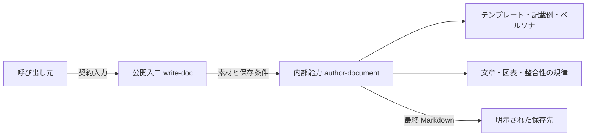

# write-doc 改革後の構成

write-doc は、公開入口一つと内部執筆能力一つで Markdown 資料を完成させる。公開入口は契約の受け渡しだけを担う。内部能力は素材の確認から保存後の検査までを一気通貫で担う。

この文書は、保守担当者が改革後の責務境界を確認するための構成資料である。根拠は[改革仕様書](../write-doc-reform-specification.md)、[write-doc 公開契約](../../plugins/playbooks/authoring/write-doc/CONTRACT.md)、[harness 原則](../../../.agents/rules/harness-principles.md)、[plugin package 契約](../../../.agents/rules/plugin-package-contract.md)である。

## 構成

図は呼び出し関係と成果の流れだけを示す。入力項目や資産数などの属性は、後続の表へ分離する。

## 責務

| 要素 | 責務 | 持たない責務 |
|---|---|---|
| `write-doc` | 公開契約の入力と出力を接続する | 執筆規律や工程状態の管理 |
| `author-document` | 読者の固定、構成、執筆、推敲、保存 | 素材収集、合意形成、公開 |
| `references/` | 文章、図表、正確性の判断規律を示す | 実行状態や設定の保持 |
| `assets/` | 型別のテンプレート、記載例、読者像を提供する | 文書型の動的解決 |

公開入口と内部能力を分ける理由は、外部契約と執筆判断の変更理由が異なるためである。内部能力は自身の参照と資産だけで仕事を完了する。この境界は、内部 Skill の自己完結を求める [plugin package 契約](../../../.agents/rules/plugin-package-contract.md)に対応する。

## 入出力

素材は、一件以上の明示的な配列として受け取る。インライン本文とファイルパスは `kind` で区別する。新規作成では保存ディレクトリと `.md` ファイル名を渡す。更新では既存 Markdown の絶対パスを渡す。

成功時は `completed` と保存した絶対パスを返す。失敗時は `failed` と理由を返す。新規作成先に同名ファイルがある場合は上書きしない。

## 資産と参照

内部能力は、テンプレート 23 本、記載例 Markdown 19 本、記載例に付属する SVG 4 本、ペルソナ 5 本、対応表 1 本を保持する。参照文書は次の三本に集約する。

- `core-principles.md`: 読後ゴール、構成、文、用語、推敲
- `visuals-and-tables.md`: 表、図、コード、強調
- `integrity-check.md`: 根拠、数値、重要条件、読後確認

資産の完全継承と参照三本への集約は、[改革仕様書のアーキテクチャ設計](../write-doc-reform-specification.md#2-アーキテクチャ設計あるべき姿)に基づく。

## 実行時に作らないもの

執筆中の状態を渡す中間 YAML は作らない。設定解決のために `prepare.sh`、`run-config.py`、`yq` を呼ばない。完成した Markdown と、その Markdown が参照する最終版の画像・図だけを保存対象にする。

この単純化は、同じ概念を複数の仕組みで表さない [harness 原則](../../../.agents/rules/harness-principles.md)に沿う。文章の意味評価はエージェントが行い、スクリプトの機械検査へ置き換えない。

## 保守時の確認点

- 公開 Playbook は `write-doc` 一つである。
- 内部 Skill は `author-document` 一つである。
- 対応表から各テンプレートと記載例へ到達できる。
- 参照文書は三本だけである。
- 最終成果物以外の工程状態ファイルを作らない。

入口数、内部 Skill 数、参照ファイル名、資産パスは、リポジトリの静的な宣言から検査できる。文書が読者の判断を支えるかは、対象文書を読んで根拠付きで評価する。

この作成テストでは、中間 YAML を生成せず、この Markdown だけを新規保存した。この観測結果は今回の実行についての証拠であり、将来の全実行を静的に保証するものではない。
