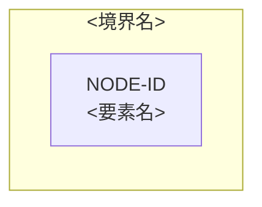

# クラウドアーキテクチャ — <対象>

<!-- 執筆指示: 要求・負荷・品質・制約を根拠に将来構成を比較・選定する。現在構成の説明はarchitecture型へ分ける。 -->

> 型: クラウドアーキテクチャ ／ 読み手: <将来構成を選び実装・運用判断へ渡す設計者> ／ 更新日: <更新日> ／ プロバイダー（機械値: `provider`）: <プロバイダー: AWS（`aws`）またはGCP（`gcp`）>

## 状態と引き継ぎ

<!-- 書く: status、open_questions、handoff.ready、blocked_by。書かない: 未決を確定した選定として扱うこと。 -->

| status | open_questions | handoff.ready | blocked_by |
|---|---|---|---|
| <ready/unresolved> | <ID/なし> | <true/false> | <ID/なし> |

## 設計入力と制約

<!-- 書く: REQ/WL/QR/制約ID、根拠状態、解決済みプロバイダーの根拠。書かない: 入力要求・論理設計の作り直し。 -->

| 入力ID | 根拠状態 | 内容 | 設計への影響 |
|---|---|---|---|
| <REQ/WL/QR/CON-ID> | <状態> | <一文> | <選定項目> |

## 代替案比較

<!-- 書く: プロバイダー、リージョン/AZ、計算処理、ネットワーク、ストレージ、データベース、メッセージング、ID管理、エッジ、可観測性、バックアップ/DR、デリバリーの候補とトレードオフ。書かない: 人気だけを理由にした選定。 -->

| 選定項目 | 採用候補 | 代替案 | 根拠ID | 利点 | 不利・リスク | 状態 |
|---|---|---|---|---|---|---|
| <項目> | <候補> | <代替> | <REQ/WL/QR/CON-ID> | <利点> | <不利> | <agreed_decision/hypothesis/open_question> |

## 採用構成

<!-- 書く: 主要サービス選定、役割、可用性単位、根拠ID。書かない: アプリケーション内部設計やTerraform。 -->

| 図ノードID | 役割 | 採用サービス | リージョン/AZ・可用性単位 | 根拠ID | 状態 |
|---|---|---|---|---|---|
| <図ノードID> | <役割> | <サービス> | <配置> | <要求・負荷・品質・ADR ID> | <状態> |

## ADR

<!-- 書く: ADR-ID、判断、候補、根拠、結果、再検討条件。書かない: 時系列の作業記録。 -->

| ADR ID | 判断 | 候補 | 根拠ID | 結果・トレードオフ | 再検討条件 | 状態 |
|---|---|---|---|---|---|---|
| <ADR ID> | <選ぶこと> | <比較候補> | <要求・負荷・品質ID> | <得ること・失うこと> | <条件> | <合意済み決定または仮説> |

## インフラ構成図

<!-- 書く: 編集可能なMermaidで判断に重要な境界、信頼領域、主要データフロー、外部依存をノードID付きで描く。
     可用性単位は配置判断に影響する場合だけ示す。書かない: 全サービス、全属性、詳細な理由、本文の完全な複製。 -->

## 障害・縮退経路

<!-- 書く: 障害および縮退経路、検知、影響、復旧、関連QR/図ノード。書かない: 詳細な運用手順。 -->

| 経路ID | 起点 | 影響 | 縮退 | 検知・復旧 | 関連ID |
|---|---|---|---|---|---|
| <障害ID> | <図ノードID> | <何が止まるか> | <残す機能> | <検知と復旧方針> | <品質要求・ADR ID> |

## 要求トレーサビリティ

<!-- 書く: REQ/WL/QRからADRと図ノードへの対応。書かない: 根拠のないサービス名。 -->

| 要求ID | 負荷ID | 品質要求ID | ADR ID | 図ノードID | 検証 |
|---|---|---|---|---|---|
| <要求ID> | <負荷ID> | <品質要求ID> | <ADR ID> | <図ノードID> | <どう確かめるか> |

## 仮説と未決

<!-- 書く: hypothesis/open_question、設計感度、検証計画、blocked_by。書かない: 採用済みへの昇格。 -->

| ID | 根拠状態 | 内容 | 設計感度 | 検証計画 | 影響先 |
|---|---|---|---|---|---|
| <識別子> | <仮説または未決> | <内容> | <変わる選定> | <確認方法> | <ADR・図ノードID> |

## この資料に書かないもの

<!-- 書く: 要求、Journey、Domain、論理データモデル、アプリケーション内部設計、Terraformの検討先。書かない: それらの内容。 -->

| 書かないこと | 検討先 |
|---|---|
| <別責務> | <対応する正本> |
