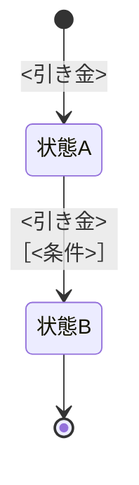

# <対象業務>の業務知識・コアドメイン

<!-- 執筆指示: 作りを全部やめても残る業務の決まりを、業務の言葉だけで残す。
     不変条件は3つ。
     1. コアドメインの業務知識に限る。判定は「作りを全部やめても残る決まりか」。残らないなら書かない。
        画面の作り・操作手順・保存の形・仕組み同士のやりとり・導入の背景・検証の手順・他の業務が担うことは書かない。
        「なぜこの決まりなのか」（決まりの根拠）は書く。「なぜこの仕組みを作るのか」（企画の理由）は書かない。
     2. 決まりを先、具体例（BDD）を資料の最後に。具体例より上だけを読んで業務の判断ができること。
        具体例に上で書いていない決まりが現れたら、それは上の書き漏らしである。
     3. 業務の言葉だけを使う。業務を知る人が使わない語、まとまりの代表・境界・属性の一覧といった作り手の語彙は使わない。
     状態遷移の矢印ラベルには必ず引き金（誰の操作か、何が届いたか）を書き、条件は［...］で添える。
     時間の経過だけで移るなら「期限が来る」を引き金にする。状態を持つものが複数あるなら図を分ける。
     判定:
     - 決まりか具体例か: 「いつでもそうか」と言えるなら上の節。「このときはこう」なら具体例。
     - 常に守られることか業務ルールか: 誰が何をしても破れないなら前者。操作の可否なら後者。
     - 業務ルールか導出か: 人が決めるなら業務ルール。条件から一意に決まるなら導出。
     - 同時に起きたときか作りの話か: 業務としてどちらが通るかを決めるなら書く。排他の方式が出たら書かない。 -->

- **対象**: <どの業務か>
- **確定日**: YYYY年M月D日
- **決めた人**: <業務の正誤を判断した人>

# 概要

<!-- 書く: 誰が何をなぜ行う業務か。書かない: 実現手段、導入の背景・経緯、他が担う責務の詳細。 -->
<業務上の役割>

**この業務が担わないこと**: <隣接する業務と、そちらが担う責務>

# ユビキタス言語

<!-- 同じ意味の語を複数残さない。業務を知る人と作り手が、本文・図・具体例で使う名称を一つに統一する。
     採用しなかった別名や技術用語の対応表は書かない。 -->

## 業務用語

<!-- 書く: 業務上の対象・役割・状態の採用語、意味、他の概念との境界、判断に使う場面。
     書かない: API、DTO、テーブル、画面項目、同義語・別名・略称の一覧。 -->

| 業務用語 | 意味 | 境界・判断に使う場面 |
|---|---|---|

## 業務イベント

<!-- 書く: すでに起き、業務上の判断・状態・責任・可能な行為を変えた事実。
     「〜する」「〜してほしい」という命令や要求ではなく、「〜された」「〜が到来した」のように
     起きた事実として命名する。同じ事実へ複数のイベント名を付けない。
     状態図の引き金に使うイベントは、必ずこの表にも載せる。
     書かない: command、request、APIイベント、実装内部だけで使う通知名。 -->

| 業務イベント | 起きた事実 | 変わる判断・状態・責任 |
|---|---|---|

# 概念

<!-- 書く: 業務上のまとまりと、その関係。各概念の説明に、その概念に紐づく決まりを一体で書く。
     書かない: まとまりの代表・境界・属性の一覧といった作り手の語彙。
     関係が入り組む場合と、担い手のやりとりが順序を持つ場合は図を添える。 -->

## <概念名>

<!-- 書く: その概念が業務上何を表すかと、それに紐づく決まり。
     書かない: 他の概念の決まり、属性の一覧。 -->
<その概念が業務上何を表すか。それに紐づく決まりを文で書く>

# 常に守られること

<!-- 書く: いつでも破ってはならない決まりと、破れたときに業務が困ること。
     書かない: 特定の状態でだけ成り立つ条件（それは業務ルール側）。 -->

| # | 常に守られること | 破れたときに業務が困ること |
|---|---|---|

# 状態と、その移り変わり

<!-- 書く: 取りうる状態、何が起きたら移るか、移れない理由。書かない: 状態を保持する仕組み。
     状態名は「仮押さえ予約」のように、何の状態・リソースかを名前だけで判別できる形にする。
     「仮押さえ」のようにイベントや操作とも読める名前を単独で置かない。
     状態が無い業務は「状態を持たない」と明記する。 -->

<!-- 書く: 状態を動かす引き金の一覧。書かない: 引き金にならない操作を混ぜること。 -->

| 引き金（起きること） | 何が移るか |
|---|---|

## <状態を持つもの>

<!-- 書く: そのものが取りうる状態と、終端かどうか。書かない: 他のものの状態。 -->

| 状態 | 説明 | 終端か |
|---|---|:---:|



# 誰が行えるか

<!-- 書く: 業務上の役割ごとの可否と、その根拠。書かない: 権限の実現方法と設定値。 -->

| 業務上の行い | 行える役割 | 行えない場合の業務上の理由 |
|---|---|---|

# 業務ルール

<!-- 書く: 成立条件、境界値、拒む条件を業務語で。書かない: 判定の実現手順。 -->

## <ルールの見出し>

<!-- 書く: 1つの決まりの成立条件・境界値・拒む条件。書かない: 複数の決まりの混在と、判定の実現手順。 -->
<成立条件と拒否条件を常体で>

# 導出されること

<!-- 書く: 条件から一意に決まるもの（計算、選び方）を手続きとして。
     書かない: 人が選ぶもの（それは業務ルールか、誰が行えるか）。
     導出されるものが無い業務は「なし」と書く。 -->

```
1. <手順>
2. <手順>
```

# 同時に起きたとき

<!-- 書く: 競合したときにどちらが業務上正しいか。書かない: 排他の実現方式。
     関係しない業務は「なし」と明記する。 -->

| 同時に起きること | 業務上どちらが通るか | その理由 |
|---|---|---|

# 拒むときの理由

<!-- 書く: 業務として拒む理由と、その根拠になる決まり。書かない: 分類記号と表示文言。 -->

| 拒まれる操作 | 拒まれる業務上の根拠 |
|---|---|

# まだ決まっていないこと

<!-- 書く: 未確定の論点と、何が分かれば決まるか。書かない: 決まったことの言い換え、作りの論点。
     0件なら「なし」と明記する。 -->

なし

# BDD

<!-- 書く: 上で確定した決まりを、独立したGiven / When / Thenシナリオとして具体化する。
     書かない: API、画面操作、保存形式、上の節に無い新しい決まり。

     - 一つのシナリオは一つの業務的関心だけを扱う。
     - Givenにはアクター、対象、事前状態、判断に必要な条件をすべて書く。
     - WhenにはThenを発生させる業務行為または業務イベントを一つ、明確に書く。
     - Thenには業務結果、次状態、変わる権利・責任を具体的に書く。
     - 境界値、拒否、権限、同時操作、状態遷移を別シナリオに分ける。
     - 別シナリオの前提を暗黙に引き継がない。「他も同様」「以下略」と書かない。
     - 成功は必要な前提をすべて満たす。失敗・拒否は検証対象の一条件だけを外し、Then直下に`NOTE: Rule:`と`Reason:`を置く。外部規則なら`Source:`（相対Markdownリンク）も置く。
     - 条件マトリクスでGiven / When / Thenを対応付け、クロージャ宣言や暗黙の共通前提は書かない。
     - 年月日は「YYYY年M月D日」と書き、ハイフン区切りへ省略しない。
     - 時間帯を書くときは、開始と終了を「YYYY年M月D日 HH:MMからHH:MMまで」の形で必ず併記する。
     - 状態遷移で時間帯を引き継ぐ場合は、遷移前後が同じ開始・終了であることをThenへ具体的に書く。 -->

ここまでの決まりが、具体の場面でどう働くかを示す。**ここに上で書いていない決まりを持ち込まない。**

## <グループ（上の節に対応させる）>

<!-- 書く: 上で確定した一つの決まりに対応する独立BDD群。書かない: 異なる関心を一つに混ぜたシナリオ。
     グループの先頭に条件マトリクスを置き、各BDDの主な事前状態・業務イベント・業務結果を対応付ける。 -->

| BDD | 主な事前状態 | 業務イベント | 業務結果 |
|---|---|---|---|

### [BDD-001] <業務結果で書いた見出し>

<!-- 見出しは `### [BDD-<連番>] <業務結果>` で固定する。`Scenario` などの語を見出しへ入れない。 -->

<!-- 書く: 必要な全事前状態、業務イベント、業務結果、次状態、権利・責任。書かない: 別BDDの暗黙の引継ぎや実装詳細。 -->

```gherkin
Given: <アクターと対象が特定された事前状態>
  And: <判断に必要な別の事前状態・条件>
When: <業務イベント>
  And: <同じ判断に必要な追加の出来事。無ければ行ごと削除>
Then: <成立または拒否される業務結果>
  And: <次状態、変わる権利・責任>
  NOTE: Rule: <抵触した規則>
    Reason: <この条件で成立または拒否になる理由>
```
