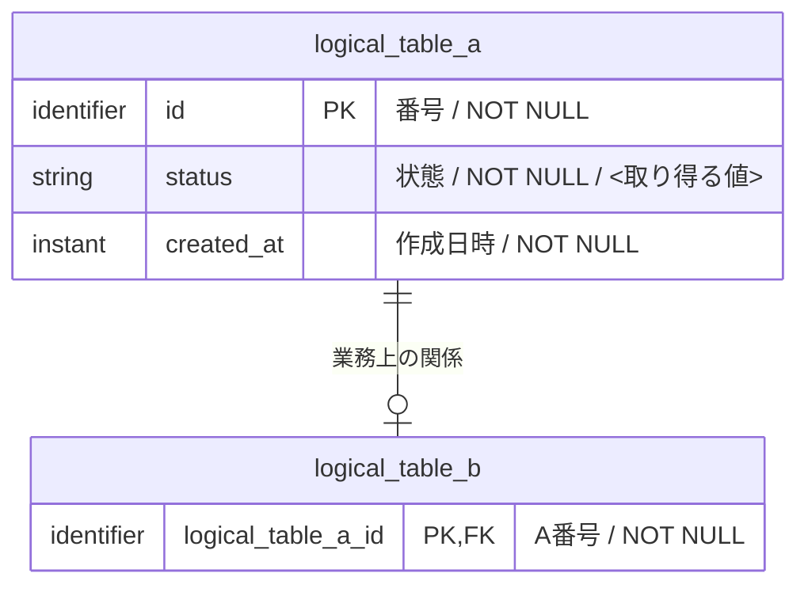

# RDB論理設計 — <題材>

<!-- 執筆指示: RDBを前提に、永続化に関係する業務シナリオから「何を論理テーブルへ記録するか」を決める。
     対象DBMSの製品・バージョンは決めず、index、分離レベル、DDLは書かない。
     最も重要な検査はBDDのデータシナリオで行う。各シナリオのBeforeとAfterに、全論理テーブルを同じ順序で全カラム見出し付きのMarkdown表として載せる。
     一部のテーブルを省くと、変更が無いのか検討していないのか判別できない。表の書式はBDD節のコメントに従う。 -->

> 型: RDB論理設計 ／ 読み手: <業務を知る人・RDBへデータを永続化する人> ／ 入力: <業務シナリオ>

<冒頭の言い切り。どの業務事実を、なぜ時間を越えて残すのか>

## 目的と範囲

<!-- 書く: 支える業務、永続化の目的、対象外、正本となる業務知識。
     書かない: RDB製品、対象DBMS固有の型、index、分離レベル、DDL、API、DTO、ORM、画面操作。 -->

- 支える業務: <業務名>
- 永続化の目的: <後から誰が何を判断・説明・訂正するためか>
- 対象外: <このモデルが記録しない業務事実>
- 業務知識の正本: <参照する資料>

## リソース系とイベント系

<!-- 書く: 全論理テーブル、リソース系／イベント系の区別、役割、時刻の意味。書かない: 分類できない汎用表や対象DBMS固有の実装。 -->

<!-- この一覧が全論理テーブルの正本になる。現在の姿を表すリソース系と、成立済みの
     業務イベントを変更不能な事実として積むイベント系を区別する。イベント共通の事実は
     基底イベントへ、種類固有の必須事実は詳細イベントへ置く。 -->

| 分類 | 論理テーブル | 役割 | 時刻 |
|---|---|---|---|
| リソース系 | <現在の姿を持つテーブル> | <現在の何を表すか> | `created_at`、更新されるなら`updated_at` |
| イベント系 | <基底または詳細イベント> | <一度起きた何を残すか> | 基底イベントの`occurred_at` |

## シナリオと記録の対応

<!-- 書く: 各BDDで全論理テーブルが追加・更新・削除・変更なしのどれになるか。書かない: SQLや物理カラム名。 -->

<!-- 各シナリオで、どの論理テーブルが追加・更新・削除・変更なしになるかを先に一覧化する。
     この表の列は、後述する全論理テーブルと過不足なく一致させる。 -->

| シナリオ | <論理テーブルA> | <論理テーブルB> | <論理テーブルC> |
|---|---|---|---|
| BDD-001 | 追加 | 変更なし | 削除 |

## 論理データモデル図

<!-- 書く: MermaidのerDiagramで論理テーブル間の関係、主要キー、多重度を示す。書かない: 全列、全制約、値域、classDiagram、対象DBMS固有の型やindex。 -->

<!-- 図は関係を把握する助けになる場合にMermaidのerDiagramで書く。
     各テーブルは関係を結ぶ主要キーだけを載せる。列定義、NULL制約、値域、業務制約は後述する表と本文を正本にする。
     論理型は対象DBMSを決めずに書けるidentifier・string・instant・integer・decimal・booleanから選ぶ。
     DBMS固有の型名は図にも定義にも書かない。 -->



## 論理テーブル定義

<!-- 書く: 全論理テーブルの役割、識別、列、候補キー、参照関係、業務制約。書かない: DBMS固有の実現方法。 -->

<!-- 全論理テーブルについて、全論理列、候補キー、参照関係、業務制約を書く。RDBの
     関係として正規化し、異なる意味や時間軸を反復列・多値列・一つの巨大表へ押し込まない。
     対象DBMS固有の型、index、分離レベルは書かない。
     任意の事実を空値で表さず、その事実が存在するときだけ行が存在する別テーブルを検討する。 -->

### <論理テーブル名>

<!-- 書く: 一つの論理テーブルが表す事実と全列の業務的意味。書かない: 複数テーブルの責務や物理設計。 -->

- 役割: <一つにまとめる事実>
- 識別: <同じ記録かどうかを業務上判断する条件>
- 対応するシナリオ: <BDD-001など>

| 論理列 | 業務上の意味 | 必須性 | 値を決める事実 |
|---|---|---|---|
| <論理列名> | <何を表すか> | <常に必要／行が存在するとき常に必要> | <何が決まれば一意に決まるか> |

#### 業務制約: <制約名>

- 守ること: <許してはいけない組合せや状態>
- 根拠となるシナリオ: <BDD-001など>

## ライフサイクルと時間軸

<!-- 書く: 各論理テーブルの生成、更新、追加、論理的終了、保持する時間軸。書かない: VACUUMや物理削除job。 -->

<!-- 現在値を更新するか、行を追加するか、現在有効な関係を削除するかを業務イベント単位で書く。
     業務上の取消と記録の物理削除を混同しない。 -->

| 論理テーブル | 生成のきっかけ | 変化のしかた | 終了・残存 | 時間軸の扱い |
|---|---|---|---|---|
| <論理テーブル名> | <業務イベント> | <更新／追加のみ／削除> | <いつまで残すか> | <現在値／出来事の積み上げなど> |

## 並行実行で必要な保証

<!-- 書く: 同じ事前状態から同時に進んだときの許される結果と禁止結果。書かない: 分離レベル、ロック、index。 -->

<!-- 同じ事前状態から複数シナリオが進むとき、許してはいけない業務結果を書く。
     分離レベル、ロック、indexは書かない。 -->

| 同時に進む操作 | 許される結果 | 許されない結果 | 対応シナリオ |
|---|---|---|---|
| <操作Aと操作B> | <片方だけ成立など> | <二つとも成立など> | <BDD-xxx> |

## 論理設計の完了条件

<!-- 書く: BDDと全論理構造を相互に追跡できる検査条件。書かない: 物理設計や実装の完了条件。 -->

- 全永続化シナリオがBDDシナリオとして存在する
- 全シナリオのBefore / Afterに全論理テーブルが同じ順序で記載されている
- Before / Afterの各論理テーブルが全カラムの見出しを持つMarkdown表であり、0件なら見出し行と区切り行だけでデータ行を持たない
- Before / Afterの各表の前後が空行1行で区切られている
- 論理データモデル図を置く場合、関係、主要キー、多重度が読め、列と制約の詳細は定義へ分離されている
- 記録すると決めた事実に置き場がある
- RDBの論理テーブル、候補キー、参照関係、業務制約として表現されている
- 全テーブル、列、制約の記録理由をシナリオから説明できる
- シナリオから追加・更新・削除される記録を追える
- 物理設計の関心が混ざっていない

## 未決

<!-- 書く: 未確認の業務用語、規則、保持条件、確認相手。書かない: 決まったことや物理実装の課題。 -->

<!-- 未確認の業務用語、規則、保持条件、確認相手を書く。無ければ「なし」と明記する。 -->

<未決事項／なし>

## BDD

<!-- 書く: 独立したCUDのGiven / And / When / And / Then / Andと全テーブルのBefore / After。書かない: Read、SQL、API、前シナリオからの暗黙の引継ぎ。 -->

<!-- この節を資料の末尾に置く。作成・更新・削除に関係する業務シナリオを、
     業務語のGiven / And / When / And / Then / Andで記載し、その直後にデータの
     Before / Afterを示す。正常成立だけでなく、取消、期限切れ、訂正、拒否、同時進行を含める。

     各シナリオは独立させる。前のシナリオの結果を引き継がず、必要なアクター、対象、
     事前状態、既存レコード、日時、成立条件をGivenとAndへすべて書く。
     各シナリオにGiven / When / Thenを必ず置き、WhenにはThenを発生させる業務行為または業務イベントを一つ明記する。条件マトリクスで全前提を対応付ける。

     必須:
     - Givenへ複数の前提を詰め込まず、Andで一つずつ分ける。
     - Thenには業務結果、次状態、追加・更新・削除する記録を書く。
     - 年月日は「YYYY年M月D日」と書き、ハイフン区切りへ省略しない。
     - 時間帯を書くときは、開始と終了を「YYYY年M月D日 HH:MMからHH:MMまで」の形で必ず併記する。
     - 状態遷移で時間帯を引き継ぐ場合は、遷移前後が同じ開始・終了であることをThenとAfterへ具体的に書く。
     - BeforeとAfterの双方へ「リソース系とイベント系」の全テーブルを同じ順序で出す。
     - 各テーブルは全カラムの見出しを持つMarkdown表にする。
     - 0件でも表を省略せず、見出し行と区切り行だけの表にする。データ行を置かない。「レコードなし」のような説明文で代替しない。
     - 各表の前後は空行1行で区切る。テーブル名の太字行が次の表との境界になる。
     - 変化しない表も省略せず、Beforeと同じ全行をAfterへ再掲する。「変更なし」などの説明文で代替しない。
     - 変わったセルを太字にする。
     - 拒否時は、全テーブルが変化しないことをAfterで示す。
     - 拒否時はThen直下に`NOTE: Rule:`、外部規則なら`Source:`（相対Markdownリンク）、`Reason:`を置く。クロージャ宣言や暗黙の共通前提は書かない。
     - 物理カラム名、物理型、SQL、API表現は書かない。 -->

### [BDD-001] <データ変化を確かめるシナリオ名>

<!-- 見出しは `### [BDD-<連番>] <データ変化>` で固定する。`Scenario` などの語を見出しへ入れない。 -->

<!-- 書く: 一つの業務的関心に必要な全前提、イベント、結果、全テーブルの変化。書かない: 別BDDの結果を前提にする表現。 -->

```gherkin
Given: <アクターが業務を行える>
  And: <対象リソースとその事前状態>
  And: <既存レコードと時刻>
  And: <成立に必要な条件>
When: <アクターが起こす業務イベント>
  And: <業務イベントに伴う判断材料>
Then: <成立または拒否される業務結果>
  And: <次状態>
  And: <追加・更新・削除する記録>
  NOTE: Rule: <抵触した規則>
    Reason: <拒否または失敗になる理由>
```

#### データの状態

**Before**

**<論理テーブルA>**

| <論理列A1> | <論理列A2> |
|---|---|

**<論理テーブルB>**

| <論理列> | <論理列> |
|---|---|
| <値> | <値> |

**<論理テーブルC>**

| <論理列C1> | <論理列C2> |
|---|---|
| <値> | <値> |

**After**

**<論理テーブルA>**

| <論理列> | <論理列> |
|---|---|
| **<追加・変更後の値>** | **<追加・変更後の値>** |

**<論理テーブルB>**

| <論理列> | <論理列> |
|---|---|
| <値> | **<変更後の値>** |

**<論理テーブルC>**

| <論理列C1> | <論理列C2> |
|---|---|
| <値> | <値> |
