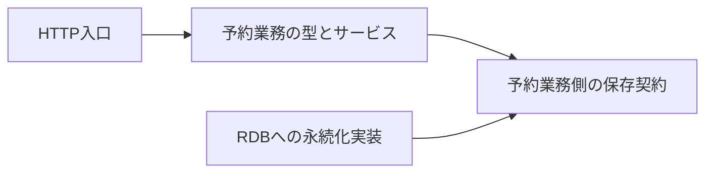

# RoomFlow予約作成経路のコード地図

> これは [`code-map.md`](../templates/code-map.md) の記載例である。リポジトリ、参照点、パスは架空であり、実在するコードの調査結果ではない。置き場から変更の入口を選ぶ粒度を示す。

> 型: コード地図（マクロ） ／ 読み手: RoomFlowの予約作成を変更する人 ／ 対象: 架空の`roomflow`リポジトリ

- **固定した参照点**: `example-v2.3.0`
- **扱う範囲**: 予約作成のHTTP入口から記録まで。通知と画面は扱わない。

RoomFlowは予約要求を受け取り、業務ルールを満たす場合だけ仮押さえ予約を記録する。入口、業務判断、永続化の3層に分かれる。

## ① 何をするシステムか

予約者から利用枠を受け取り、予約可能性を判断して仮押さえ予約または拒否理由を返す。

## ② 地図

| 置き場 | 責務 | 最初に開くなら |
|---|---|---|
| `src/http/` | requestを業務入力へ変換する | `create_reservation.ts` |
| `src/reservations/` | 予約可否と状態遷移を判断し、保存先に求める契約を定義する | `reservation_service.ts`、`create_tentative_hold.ts`、`reservation_repository.ts`（interface） |
| `src/persistence/` | 業務側の保存契約をRDBで実装する | `reservation_repository.ts`（実装） |
| `src/notifications/` | 予約の結果を知らせる。予約の成否は決めない | `confirmation.ts` |
| `tests/` | 業務シナリオを検証する | `tests/reservations/create_reservation.test.ts`、`tests/notifications/confirmation.test.ts` |

同名の`reservation_repository.ts`でも、業務側には「何を保存できるか」、永続化側には「どう保存するか」がある。生成されたAPI型とDB driver内部は、この地図の変更入口に含めない。

## ③ 層と依存の向き

図の矢印はコードが参照する相手を示し、実行順を示すものではない。保存の契約を予約業務側に置き、HTTP入口と永続化実装がそれぞれ業務側を参照する。

実行時には予約サービスから保存実装が呼ばれるが、予約サービスは契約を通して呼ぶ。`src/reservations/`から`src/http/`や具体的なDB driverを参照すると、この境界を越える。

## ④ 重要な入口

| 入口 | 何が始まるか | 実行順を追うなら |
|---|---|---|
| `createReservationHandler` | HTTPから仮押さえ予約を作る | [予約作成を実行順に読む](code-reading.example.md) |
| `ReservationService.create` | 業務ルールを判定する | [予約作成を実行順に読む](code-reading.example.md) |

HTTP bodyの項目を変えるなら`createReservationHandler`、予約を受け付ける条件を変えるなら`ReservationService.create`から読む。DBへ保存する列だけを変える場合は永続化実装を開き、業務側の保存契約も変わるかを確認する。

## ⑤ アーキテクチャ上の特徴

予約可否は`src/reservations/`に集約する。HTTPとRDBのコードへ同じ業務条件を書かない。依存方向を決めた理由は、この架空例では上記の境界以外に言及なしである。

## ⑥ 次に読むもの

- 処理順を追う: [予約作成を実行順に読む](code-reading.example.md)
- 競合エラーの変更を読む: [仮押さえ予約の競合を業務エラーへ変換する](pr-walkthrough.example.md)
- 通知を変更する入口から入る: [RoomFlowを理解して予約通知の変更に入る](onboarding.example.md)
