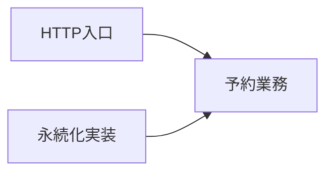

# RoomFlow予約作成経路のコード地図

> これは [`code-map.md`](../templates/code-map.md) の記載例である。実在しないリポジトリを題材に、置き場と依存方向だけを示す。

> 型: コード地図（マクロ） ／ 読み手: RoomFlowの予約作成を変更する人 ／ 対象: 架空の`roomflow`リポジトリ

- **固定した参照点**: `example-v2.3.0`
- **扱う範囲**: 予約作成のHTTP入口から記録まで。通知と画面は扱わない。

RoomFlowは予約要求を受け取り、業務ルールを満たす場合だけ仮押さえ予約を記録する。入口、業務判断、永続化の3層に分かれる。

## ① 何をするシステムか

予約担当者から顧客と利用枠を受け取り、予約可能性を判断して仮押さえ予約または拒否理由を返す。

## ② 地図

| 置き場 | 責務 | 最初に開くなら |
|---|---|---|
| `src/http/` | requestを業務入力へ変換する | `create_reservation.ts` |
| `src/reservations/` | 予約可否と状態遷移を判断する | `reservation_service.ts` |
| `src/persistence/` | 予約の事実をRDBへ記録する | `reservation_repository.ts` |
| `tests/reservations/` | 業務シナリオを検証する | `create_reservation.test.ts` |

## ③ 層と依存の向き

依存はHTTP入口から業務判断、業務判断から永続化の抽象へ向かう。

永続化実装が予約業務の契約へ依存し、予約業務は特定RDBを知らない。

## ④ 重要な入口

| 入口 | 何が始まるか | 実行順を追うなら |
|---|---|---|
| `createReservationHandler` | HTTPから仮押さえ予約を作る | [予約作成を実行順に読む](code-reading.example.md) |
| `ReservationService.create` | 業務ルールを判定する | [予約作成を実行順に読む](code-reading.example.md) |

## ⑤ アーキテクチャ上の特徴

予約可否は`src/reservations/`に集約する。HTTPとRDBのコードへ同じ業務条件を書かない。依存方向を決めた理由は、この架空例では上記の境界以外に言及なしである。

## ⑥ 次に読むもの

- 処理順を追う: [予約作成を実行順に読む](code-reading.example.md)
- 競合対策の変更を読む: [確定予約の競合をDB制約で防ぐ](pr-walkthrough.example.md)
