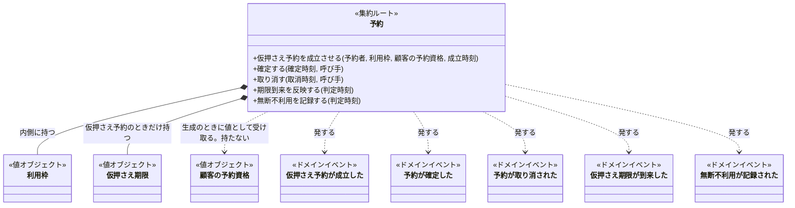
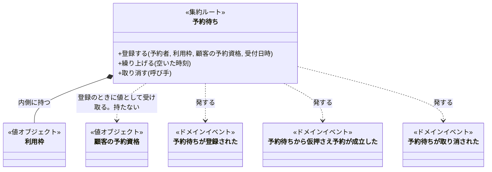
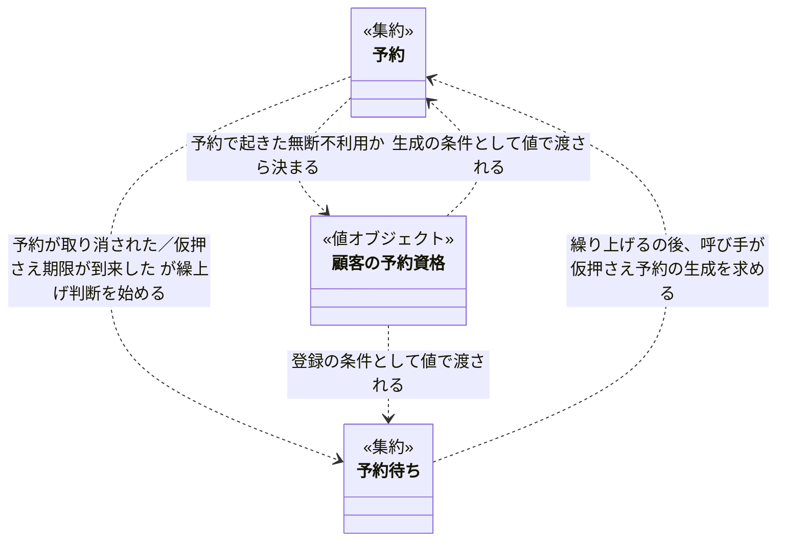

# ドメインモデル — 貸会議室の予約

> これは`domain-model`型の記載例である。**構成の正本ではなく、粒度と具体性の見本として読む。**
> RoomFlowは、組織内の共用会議室を予約する架空のサービスである。
> 型: ドメインモデル ／ 読み手: 予約業務を形にするエンジニア ／ 入力: [貸会議室予約の業務知識・コアドメイン](domain-rule.example.md)

**このモデルは、予約と予約待ちの2つを集約にし、顧客の予約資格は無断不利用の記録から導出される値として扱う。** 「同じ会議室の重なる利用枠へ有効な予約は一つ」という決まりは予約の内側では守れないので、予約の生成の条件として外へ出し、同時に起きたときの扱いは設計資料へ送る。この文脈に顧客のライフサイクルは無く、顧客は識別子としてしか現れない。

## 目的と範囲

- 業務知識の正本: [貸会議室予約の業務知識・コアドメイン](domain-rule.example.md)
- 扱う範囲: 予約（仮押さえ・確定・取消・期限切れ・無断不利用の記録）、予約待ち（登録・繰上げ・取消）、顧客の予約資格（記録からの導出）
- 対象外: 会議室そのものの管理（正本の概念に会議室の決まりが無く、予約と予約待ちから参照されるだけ）、顧客の登録・退会（顧客管理業務の事実で、この文脈は顧客を識別子としてしか扱わない）、無断不利用をどう検知するか（正本の未決）

## 要素一覧

| 要素 | 種別 | 正本の語 | 目的（一文） |
|---|---|---|---|
| 利用枠 | 値オブジェクト | 利用枠 | 会議室と時間帯の組を一つの値にし、重なりと隣接の判定を一か所に閉じる |
| 仮押さえ期限 | 値オブジェクト | 仮押さえ期限 | 確定できる期間の終わりを表し、到来したかの判定を持つ |
| 顧客の予約資格 | 値オブジェクト | 顧客の予約資格 | ある顧客の直近の無断不利用から、新しい申込みを受け付けてよいかを表す |
| 予約 | 集約ルート（エンティティ） | 予約 | 一人の予約者と一つの利用枠の約束を、状態に応じた操作だけで進め、無断不利用の事実を発する |
| 予約待ち | 集約ルート（エンティティ） | 予約待ち | 埋まっている利用枠への希望を受付順とともに持ち、繰上げか取消のどちらか一方で終える |
| 仮押さえ予約が成立した | ドメインイベント | 仮押さえ予約が成立した | 予約の生成が成立したことを知らせる |
| 予約が確定した | ドメインイベント | 予約が確定した | 確定が成立したことを知らせる |
| 予約が取り消された | ドメインイベント | 予約が取り消された | 取消が成立したことを知らせ、同じ利用枠の予約待ちの繰上げ判断を始める |
| 仮押さえ期限が到来した | ドメインイベント | 仮押さえ期限が到来した | 期限切れが成立したことを知らせ、繰上げから生まれた仮押さえなら次の繰上げ判断を始める |
| 無断不利用が記録された | ドメインイベント | 無断不利用が記録された | 確定予約が利用されなかった事実が記録されたことを知らせる |
| 予約待ちが登録された | ドメインイベント | 予約待ちが登録された | 登録が成立したことを知らせる |
| 予約待ちから仮押さえ予約が成立した | ドメインイベント | 予約待ちから仮押さえ予約が成立した | 繰上げが成立したことを知らせる |
| 予約待ちが取り消された | ドメインイベント | 予約待ちが取り消された | 予約待ちの取消が成立したことを知らせる |

ドメインイベントは、集約の操作が成立したことを知らせる通知であって、業務の事実の置き場ではない。事実は集約が持つ。

予約番号、予約待ち番号、予約者（顧客）、会議室は識別子の値オブジェクトである。同じ値なら同じものを指す以上の規則を持たず、どのBDDにも単独では現れないので、要素一覧には載せない。この文脈に顧客のエンティティは無い。顧客は予約・予約待ち・無断不利用の記録から識別子で指されるだけで、登録や退会のライフサイクルは顧客管理業務の側にある。

## モデル図

クラスのidは図の中だけの名前で、ラベルが正本の語である。メソッドは公開コマンドだけで、判定だけの操作（重なるか、到来したか、新しい申込みができるか）とゲッターは描かない。集約は2つなので、集約ごとに1枚と、集約どうしの関係を1枚描く。

### 集約: 予約

- 責務: 一人の予約者と一つの利用枠の約束を、仮押さえから確定・取消・期限切れまで、状態に応じた操作だけで進める。確定予約が利用されなかった事実（無断不利用）もここで発する
- 境界: 「予約は一人の予約者と一つの利用枠に属し、終端状態から戻らない」を1つの操作で一貫させる。予約待ちは予約より長く生きるので内側に置かない。顧客の予約資格は生成のときに値として受け取るだけで、持たない

### 集約: 予約待ち

- 責務: 確定予約で埋まっている利用枠への希望を、受付順が一意に決まる形で持ち、繰上げか取消のどちらか一方で終える
- 境界: 「繰上げか取消のどちらか一方でしか終わらない」を1つの操作で一貫させる。繰上げで生まれる予約は別の集約で、ここには持たない。顧客の予約資格は登録のときに値として受け取るだけ

### 集約どうしの関係

## 各要素の詳細

### 利用枠

#### 目的

「会議室、利用開始、利用終了」の組を一つの値にし、二つの予約が重なるかの判定をここに閉じる

#### 何でないか

予約ではない。誰が使うかを持たない。同じ会議室・同じ時間帯なら、どの予約が持っていても同じ利用枠である

#### 持つもの

会議室、利用開始、利用終了

#### 不変条件

利用開始は利用終了より前である。時間帯は半開区間で、利用終了と次の利用開始が同じ時刻なら重ならない

#### 生成の条件

会議室と、利用開始より後の利用終了が揃うこと。揃わない組は存在しない

#### 協働相手

予約と予約待ちが値として持つ。重なりの判定は予約の生成の条件から使われる

#### 操作: 重なるか

- 事前条件: 比較相手の利用枠がある
- 事後条件: 同じ会議室で時間帯が一部でも重なるとき真。隣接は偽
- 拒む理由: なし（判定だけで、拒まない）
- 発するイベント: なし

### 仮押さえ期限

#### 目的

仮押さえ予約を確定できる期間の終わりを一つの値にする

#### 何でないか

利用開始ではない。予約の状態でもない。到来したかどうかを判定するだけで、予約を期限切れにするのは予約の操作である

#### 持つもの

期限の時刻（仮押さえ成立から15分後）

#### 不変条件

仮押さえ成立時刻より後である

#### 生成の条件

仮押さえ予約の成立時刻が決まること

#### 協働相手

予約が値として持つ。確定と期限到来の事前条件から使われる

#### 操作: 到来したか

- 事前条件: 判定する時刻がある
- 事後条件: 判定する時刻が期限の時刻と同じか後なら真。同時刻は到来として扱う
- 拒む理由: なし（判定だけで、拒まない）
- 発するイベント: なし

### 顧客の予約資格

#### 目的

ある顧客について、新しい仮押さえ予約と予約待ちを受け付けてよいかを、その顧客の直近の無断不利用から決めた一つの値にする

#### 何でないか

顧客ではない。顧客のライフサイクルを持たない（この文脈に顧客のエンティティは無い）。無断不利用そのものでもない。無断不利用は確定予約で起きた事実で、予約が持つ。この値は、その顧客の予約で起きた無断不利用から決まる。顧客の識別子は「誰の資格か」を表すために持つが、それは値の一部であって同一性ではない。顧客・状態・停止開始時刻が同じなら同じ資格である

#### 持つもの

顧客（識別子）、状態（予約可能／仮押さえ停止中）、停止開始時刻（仮押さえ停止中のときだけ）

#### 不変条件

予約可能と仮押さえ停止中の両方にならない。仮押さえ停止中なら停止開始時刻を持ち、判定時刻は停止開始時刻から14日未満である

#### 生成の条件

顧客と、その顧客の予約で無断不利用がいつ起きたかと、判定時刻が揃うこと。判定時刻から30日前までに無断不利用が3回起きていて、3回目から14日が経っていなければ仮押さえ停止中（停止開始時刻は3回目が起きた時刻）、それ以外は予約可能。この決め方が生成の条件そのものである

#### 協働相手

予約の生成と予約待ちの登録が、値として受け取る。その顧客の予約で起きた無断不利用を集め、判定時刻とともに渡すのは、それらの生成を呼ぶ側である

#### 操作: 新しい申込みができるか

- 事前条件: なし
- 事後条件: 予約可能なら真、仮押さえ停止中なら偽
- 拒む理由: なし（判定だけで、拒まない）
- 発するイベント: なし

### 予約

#### 目的

一人の予約者と一つの利用枠の約束を、仮押さえから確定・取消・期限切れまで、状態に応じた操作だけで進める。確定予約が利用されなかった事実も、この約束の一部としてここで発する

#### 何でないか

予約待ちではない（予約待ちは利用枠を占有しない希望であり、予約は占有する約束である）。会議室の空き状況の一覧でもない。顧客の予約資格の持ち主でもない

#### 持つもの

予約番号、予約者、利用枠、状態、仮押さえ期限（仮押さえ予約のときだけ）、無断不利用が起きた時刻（起きたときだけ）

#### 不変条件

予約は一人の予約者と一つの利用枠に属し、生成後に変わらない。取消済み予約と期限切れ予約は元の状態へ戻らない。無断不利用は確定予約でだけ起き、同じ予約で2回は起きない

#### 生成の条件

受け取った顧客の予約資格の顧客が予約者と同じで、予約可能であること。同じ会議室の重なる利用枠に仮押さえ予約も確定予約も無いこと。後者は予約の内側では確かめられないので、生成を呼ぶ側が現在有効な予約を見て保証する（集約の境界を参照）

#### 協働相手

呼び手はその予約の予約者。生成の条件を確かめるために、呼び手が顧客の予約資格を導出して渡し、同じ会議室の現在有効な予約を参照する。発したイベントのうち、取消と期限到来は繰上げ判断が受ける

#### 操作: 仮押さえ予約を成立させる

- 事前条件: 上の生成の条件
- 事後条件: 仮押さえ予約が存在し、仮押さえ期限は成立時刻の15分後である
- 拒む理由: 重なる利用枠の仮押さえ／仮押さえ停止中顧客による新しい申込み
- 発するイベント: 仮押さえ予約が成立した

#### 操作: 確定する

- 事前条件: 仮押さえ予約であり、確定時刻に仮押さえ期限が到来していない。呼び手が予約者本人
- 事後条件: 確定予約になり、利用枠は変わらず、仮押さえ期限は役割を終える
- 拒む理由: 仮押さえ期限以降の確定／確定済み予約の再確定／他人の予約の確定
- 発するイベント: 予約が確定した

#### 操作: 取り消す

- 事前条件: 仮押さえ予約または確定予約であり、取消時刻が利用開始より前。呼び手が予約者本人
- 事後条件: 取消済み予約になり、利用枠を占有しない
- 拒む理由: 利用開始以降の予約取消／他人の予約または予約待ちの取消
- 発するイベント: 予約が取り消された

#### 操作: 期限到来を反映する

- 事前条件: 仮押さえ予約であり、仮押さえ期限が到来した
- 事後条件: 期限切れ予約になり、利用枠を占有しない
- 拒む理由: なし（到来していなければ何も変えない）
- 発するイベント: 仮押さえ期限が到来した

#### 操作: 無断不利用を記録する

- 事前条件: 確定予約であり、判定時刻が利用開始から15分を過ぎていて、事前の取消が無い
- 事後条件: この予約で無断不利用が起きた時刻が決まる（1回だけ）。予約の状態は変わらない
- 拒む理由: なし（条件を満たさなければ何も変えない）
- 発するイベント: 無断不利用が記録された

### 予約待ち

#### 目的

確定予約で埋まっている利用枠への希望を、受付順が一意に決まる形で持ち、繰上げか取消のどちらか一方で終える

#### 何でないか

予約ではない。利用枠を占有しない。繰り上げられたあとは予約待ちに用は無く、生まれた仮押さえ予約が主役になる

#### 持つもの

予約待ち番号、予約者、利用枠、受付日時、状態

#### 不変条件

繰上済み予約待ちと取消済み予約待ちのどちらか一方でしか終わらない。受付日時と予約待ち番号は生成後に変わらない

#### 生成の条件

受け取った顧客の予約資格の顧客が予約者と同じで、予約可能であること。同じ会議室・同じ利用枠に確定予約があること。繰上げ時の仮押さえを受け入れる意思が確認できていること

#### 協働相手

呼び手は予約者本人（登録・取消）と、予約が取り消されたときの繰上げ判断（繰上げ）。同じ利用枠の予約待ちの集合から先頭の一件を選ぶのは、この要素ではなく繰上げ判断の側である（捨てた割り当てを参照）

#### 操作: 登録する

- 事前条件: 上の生成の条件
- 事後条件: 予約待ち中として存在し、受付日時が決まる
- 拒む理由: 空いている利用枠への予約待ち／仮押さえ停止中顧客による新しい申込み
- 発するイベント: 予約待ちが登録された

#### 操作: 繰り上げる

- 事前条件: 予約待ち中である。同じ利用枠が空いた
- 事後条件: 繰上済み予約待ちになる。同じ予約者・同じ利用枠の仮押さえ予約の生成は、呼び手（繰上げ判断）が予約の集約に求める
- 拒む理由: なし（予約待ち中でなければ何も変えない）
- 発するイベント: 予約待ちから仮押さえ予約が成立した

#### 操作: 取り消す

- 事前条件: 予約待ち中である。呼び手が予約者本人
- 事後条件: 取消済み予約待ちになり、繰上げ対象から外れる
- 拒む理由: 他人の予約または予約待ちの取消
- 発するイベント: 予約待ちが取り消された

## 集約の境界

| 集約 | ルート | 内側の要素 | 守る不変条件 | 外への参照 |
|---|---|---|---|---|
| 予約 | 予約 | 利用枠、仮押さえ期限 | 予約は一人の予約者と一つの利用枠に属する。終端状態から戻らない | 予約者を識別子で。顧客の予約資格は生成のとき値で受け取り、他の予約は生成の条件でだけ参照する。どちらも持たない |
| 予約待ち | 予約待ち | 利用枠 | 繰上げか取消のどちらか一方で終わる | 予約者を識別子で。顧客の予約資格は登録のとき値で受け取る。繰上げで生まれる予約は内側に持たない |

顧客の予約資格は集約ではない。その顧客の予約で起きた無断不利用と判定時刻から決まる値で、同一性を持たず、どの集約の内側にも置かれない。

### 集約どうしの協働

| 集約 → 集約 | 手段 | 渡すもの | 一貫性 |
|---|---|---|---|
| 予約 → 予約待ち | ドメインイベント | 予約が取り消された／仮押さえ期限が到来した（利用枠を含む） | 結果整合。取消の成立後に繰上げ判断が始まり、同じ操作では一貫させない（正本「同時に起きたとき」: 取消の成立後に一件だけ） |
| 予約待ち → 予約 | 呼び手が両方を操作 | 繰り上げた予約待ちの予約者と利用枠 | 結果整合。繰上げ判断が「繰り上げる」の後に「仮押さえ予約を成立させる」を呼ぶ。片方だけ成立したときの扱いは未決 |
| 予約 → 顧客の予約資格 | 呼び手が両方を操作 | その顧客の予約で無断不利用がいつ起きたか | 同じ操作。生成・登録を呼ぶ側が、その時点の予約から資格を決める。イベントを経由しない |
| 顧客の予約資格 → 予約、予約待ち | 値として渡す | 導出した資格（顧客、予約可能／仮押さえ停止中） | 同じ操作。生成・登録の事前条件として渡し、集約は保持しない。資格の顧客と予約者が一致することを生成の条件で確かめるので、別の顧客の資格を渡す取り違えは生成で止まる |

集約をまたぐ不変条件は二つある。

| 不変条件 | 守る場所 | 守り方 |
|---|---|---|
| 同じ会議室の重なる利用枠へ、現在有効な予約は一つしか存在しない | 予約の生成の条件 | 生成を呼ぶ側が、同じ会議室の現在有効な予約と重ならないことを確かめてから生成する。二人が同時に呼んだときに一方だけを成立させる保証は、このモデルでは決めない（未決を参照） |
| 予約待ちの繰上げ順は、受付日時と予約待ち番号で一意に決まる | 繰上げ判断（予約が取り消されたイベントの受け手） | 同じ利用枠の予約待ち中を集め、受付日時、予約待ち番号の順で並べた先頭を選ぶ。1件の予約待ちはこの順序を持たない |

## 状態と型の分割

### 予約

| 状態 | できる操作 | できない操作 | 型を分けるか |
|---|---|---|---|
| 仮押さえ予約 | 確定する、取り消す、期限到来を反映する | 無断不利用を記録する | 分ける。仮押さえ予約だけが仮押さえ期限を持ち、確定できるため |
| 確定予約 | 取り消す、無断不利用を記録する | 確定する（確定済み予約の再確定）、期限到来を反映する | 分ける。仮押さえ期限を持たず、確定を呼べない型にする |
| 取消済み予約 | なし | 確定する、取り消す、期限到来を反映する、無断不利用を記録する | 分ける。終端状態で操作を一つも公開しない型にし、元の状態へ戻す経路を作らない |
| 期限切れ予約 | なし | 確定する、取り消す、期限到来を反映する、無断不利用を記録する | 分ける。取消済み予約と同じく終端だが、人の取消と区別して残す |

### 予約待ち

| 状態 | できる操作 | できない操作 | 型を分けるか |
|---|---|---|---|
| 予約待ち中 | 繰り上げる、取り消す | なし | 分ける。操作を持つのはこの状態だけ |
| 繰上済み予約待ち | なし | 繰り上げる、取り消す | 分けない。取消済み予約待ちと合わせて「終了した予約待ち」として一つの型にし、どちらで終わったかは値で持つ。終端どうしで呼べる操作に差が無いため |
| 取消済み予約待ち | なし | 繰り上げる、取り消す | 同上 |

### 顧客の予約資格

| 状態 | できる操作 | できない操作 | 型を分けるか |
|---|---|---|---|
| 予約可能 | 新しい申込みができるか（真） | なし | 分けない。値の違いで判定の答えが変わるだけで、状態を変える操作を持たない。正本の「予約可能顧客→仮押さえ停止中顧客→予約可能顧客」の移り変わりは、記録が増え時が経つにつれて導出される値が変わることであり、この値オブジェクト自身が遷移するのではない |
| 仮押さえ停止中 | 新しい申込みができるか（偽） | なし | 同上 |

## ドメインイベント

ドメインイベントは、集約の操作の事後条件が成り立ったときに発する通知である。この文脈で判断を始めないものも発する（別の文脈や通知が購読しうる）。イベントは事実の置き場ではなく、事実は集約が持つ。

| ドメインイベント | 発する要素・操作 | 始まる判断 | 判断する要素 |
|---|---|---|---|
| 仮押さえ予約が成立した | 予約・仮押さえ予約を成立させる | この文脈では無し | — |
| 予約が確定した | 予約・確定する | この文脈では無し | — |
| 予約が取り消された | 予約・取り消す | 取り消されたのが確定予約なら、同じ利用枠の予約待ち中から一件を繰り上げるか | 繰上げ判断（予約待ちの繰り上げるを呼び、続けて予約の生成を呼ぶ） |
| 仮押さえ期限が到来した | 予約・期限到来を反映する | 期限切れになった予約が繰上げから生まれたものなら、次の予約待ちを繰り上げるか | 繰上げ判断 |
| 無断不利用が記録された | 予約・無断不利用を記録する | この文脈では無し。顧客の予約資格は、イベントではなく予約が持つ記録から導出する | — |
| 予約待ちが登録された | 予約待ち・登録する | この文脈では無し | — |
| 予約待ちから仮押さえ予約が成立した | 予約待ち・繰り上げる | この文脈では無し | — |
| 予約待ちが取り消された | 予約待ち・取り消す | この文脈では無し | — |

仮押さえ停止期間が始まった、仮押さえ停止期間が終了した、顧客の利用登録が完了した、の3つは正本の業務イベントだが、この文脈の集約の操作が発するものではない。停止期間の開始と終了は顧客の予約資格の導出結果が変わったことの言い換えで、利用登録は顧客管理業務の事実である（捨てた割り当てを参照）。

## BDDとの対応

| BDD | 要素 | 操作 | 成立を決める不変条件・事前条件 |
|---|---|---|---|
| BDD-001 | 予約 | 仮押さえ予約を成立させる | 生成の条件（重なる有効な予約が無い、予約資格が予約可能） |
| BDD-002 | 予約 | 確定する | 仮押さえ期限が到来していない、予約者本人 |
| BDD-003 | 予約 | 取り消す | 利用開始前、予約者本人 |
| BDD-004 | 予約 | 仮押さえ予約を成立させる | 集約をまたぐ不変条件（一方だけ成立）。保証方法は未決 |
| BDD-005 | 予約 | 期限到来を反映する | 仮押さえ期限が到来した |
| BDD-006 | 予約待ち | 登録する | 生成の条件（確定予約がある、予約資格が予約可能、受入意思） |
| BDD-007 | 予約待ち | 繰り上げる | 予約が取り消されたイベントを受けた繰上げ判断が、受付順の先頭を選ぶ |
| BDD-008 | 予約待ち | 取り消す | 予約待ち中、予約者本人 |
| BDD-009 | 顧客の予約資格 | 新しい申込みができるか | 生成の条件（直近30日で3回目の記録から14日間は仮押さえ停止中）。記録は予約の無断不利用を記録するが発する |
| BDD-010 | 予約 | 仮押さえ予約を成立させる | 生成の条件（予約資格が仮押さえ停止中）を満たさない |
| BDD-011 | 顧客の予約資格 | 新しい申込みができるか | 生成の条件（3回目の記録から14日が経過したら予約可能） |
| BDD-012 | 予約 | 仮押さえ予約を成立させる | 生成の条件（停止期間終了後に導出した資格は予約可能） |
| BDD-013 | 利用枠 | 重なるか | 半開区間。隣接は重ならない |
| BDD-014 | 利用枠 | 重なるか | 一部でも重なれば真 |
| BDD-015 | 仮押さえ期限 | 到来したか | 同時刻は到来として扱う |
| BDD-016 | 予約 | 取り消す | 予約者本人でない |
| BDD-017 | 予約 | 取り消す | 利用開始と同時刻は利用開始前でない |
| BDD-018 | 予約待ち | 登録する | 確定予約が無い利用枠 |
| BDD-019 | 予約待ち | 繰り上げる | 繰上げ判断の並び順（受付日時、予約待ち番号） |
| BDD-020 | 予約 | 取り消す | 停止は新しい申込みだけに適用し、取消の事前条件に予約資格を含めない |
| BDD-021、BDD-022 | 予約待ち | 繰り上げる／取り消す | 予約待ち中でなければ何も変えない（先に成立した一方だけ） |
| BDD-023 | 予約 | 確定する | 確定予約は確定を呼べない |
| BDD-024 | 予約 | 取り消す | 仮押さえ予約でも利用開始前なら取り消せる |

- 対応しないBDD: なし
- 対応のない要素・操作: なし

## 捨てた割り当て

| 捨てた案 | 何を何にする案か | 採らなかった理由 |
|---|---|---|
| 顧客の予約資格を集約にする | 顧客ごとに無断不利用と状態を持つ集約ルートにし、無断不利用の追加と停止期間の終了をコマンドにする | 同一性は顧客にあり、資格はそこから導出される値である。集約にすると、顧客IDを持つ入れ物に導出値の名前を付けることになり、同一性と値を混同する。正本の状態の移り変わりは、記録が増え時が経つと導出結果が変わることで表せる |
| 顧客を集約にする | 顧客のエンティティが無断不利用を持ち、予約資格を状態として持つ | この文脈に顧客のライフサイクル（登録・退会）は無い。正本の「顧客の利用登録が完了した」は顧客管理業務の事実で、ここでは顧客は識別子（値）としてしか現れない。無断不利用は確定予約で起きた事実として予約が持てば足りる |
| 会議室を集約にする | 会議室が自分の予約の一覧を持ち、重なりの不変条件を内側で守る | 正本の概念に会議室の決まりが無く、要素にする根拠が正本に無い。重なりの判定は利用枠の操作で足り、有効な予約の一覧は予約の生成の条件として外に置く方が、正本の「同時に起きたとき」の扱いと一致する |
| 利用枠をエンティティにする | 会議室と時間帯の組に識別子を与え、占有状態を持たせる | 同じ会議室・同じ時間帯なら同じ利用枠であり、識別子で区別する理由が無い。占有しているかは予約の状態で表せる |
| 予約待ちを予約の内側に置く | 予約が自分の利用枠への予約待ちの列を持つ | 予約待ちは予約より長く生き、予約が取り消されたあとに繰り上がる。予約の終端とともに消える内側には置けない |
| 予約待ちの列を集約にする | 同じ利用枠の予約待ちを束ねた「予約待ち列」を要素にし、並び順を内側で守る | 「予約待ち列」は正本の語ではない。並び順は正本の「導出されること」の手順そのもので、繰上げ判断の側が持てば足りる。列が要素として必要になるのは、複数の利用枠にまたがる並び替えが出てきたときで、今はない |
| 繰上げをドメインサービスにする | 予約が取り消されたときの繰上げ判断を独立した要素にする | ドメインサービスは既定では使わない。繰上げ判断は「予約が取り消された」イベントの受け手として書けば、要素を足さずに済む |
| 停止期間の開始・終了と利用登録の完了をドメインイベントにする | 仮押さえ停止期間が始まった、仮押さえ停止期間が終了した、顧客の利用登録が完了した | この文脈の集約の操作が発するものではない。前2つは顧客の予約資格の導出結果の言い換えで、発する操作が無い。利用登録は顧客管理業務の事実で、ここでは顧客を識別子としてしか扱わない |
| 無断不利用をイベントから数える | 過去に発した「無断不利用が記録された」から顧客の予約資格を決める | イベントは通知であって事実の置き場ではない。無断不利用は確定予約で起きた事実なので予約が持ち、資格はその顧客の予約から決める |

## 未決

| 未決 | 影響する要素 | 何が分かれば確定するか |
|---|---|---|
| 二人が同じ空き利用枠を同時に仮押さえしたとき、一方だけを成立させる保証をどこで行うか | 予約（生成の条件） | 設計資料で排他の方式を決めること。モデルは「生成前に有効な予約と重ならないこと」までを決め、それ以上は持たない |
| 繰上げで「繰り上げる」だけ成立し、仮押さえ予約の生成が失敗したときの扱い | 予約待ち、予約 | 正本に無い場面。反証（formulate-domain）で「繰上げをやり直すか、予約待ちを戻すか」を確定すること |
| 無断不利用を記録する判定時刻を、誰がどの事実から得るか | 予約（無断不利用を記録する） | 正本の未決「入退室記録以外の事実をどこまで用いるか」が決まること |
| 会議室を一時的に利用不能とするとき、既存予約を誰がどの規則で扱うか | 予約 | 正本の未決が決まること。決まるまで予約に「利用不能」に関する操作を置かない |

## この資料に書かないもの

| 書かないこと | 検討先 |
|---|---|
| 永続化の単位、テーブル、リポジトリ、ドメインイベントを残すか | [貸会議室予約のRDB論理設計](rdb-logical-data-modeling.example.md) |
| 言語固有の型、クラスの書き方、不変の実現方法 | 各実装の規約 |
| 層構成、依存方向、パッケージ分割 | 設計の資料 |
| 同時仮押さえの排他方式、イベントの配送方式 | 設計の資料 |
| 画面、API、DTO、メッセージ形式 | 技術設計の資料 |
