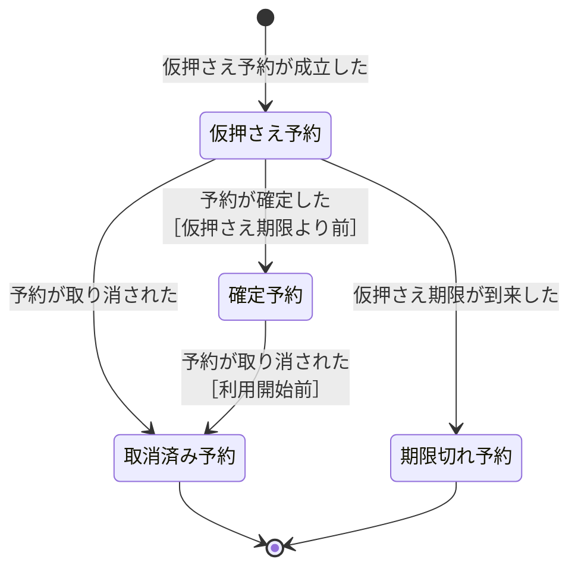
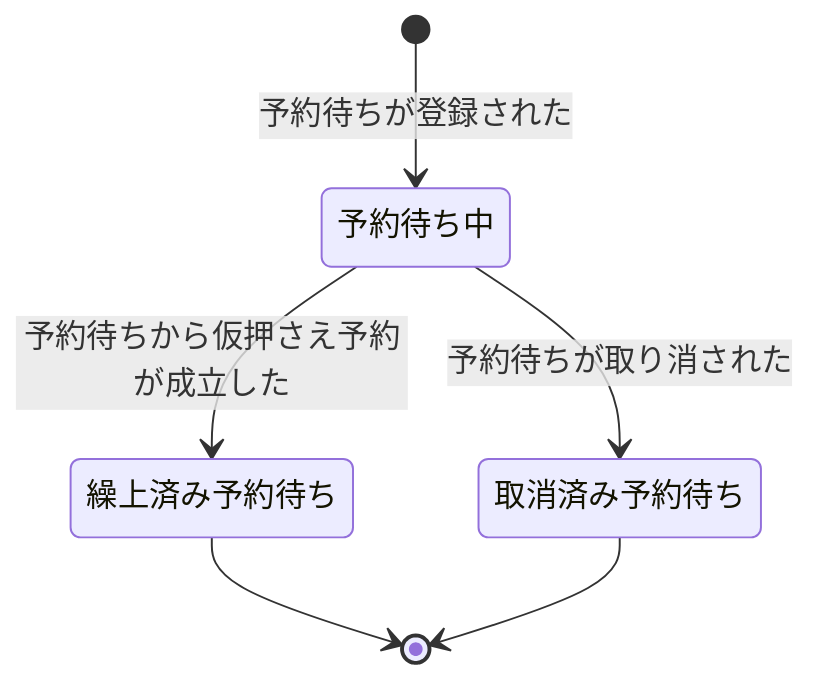
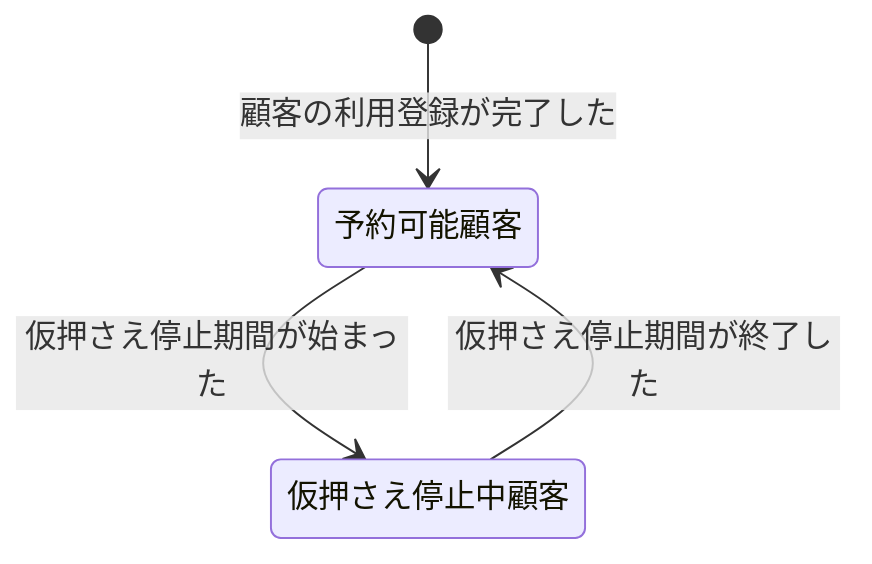

# 貸会議室予約の業務知識・コアドメイン

> これは [`domain-rule.md`](../templates/domain-rule.md) の記載例である。
> RoomFlowは、組織内の共用会議室を予約する架空のサービスである。
> 架空の題材だが、用語、境界、不変条件、状態、権限、競合、拒否理由を業務判断に使える粒度で記載している。

- **対象**: 会議室の仮押さえ、確定、取消、予約待ち、無断不利用による予約資格の制限
- **確定日**: 2026年9月1日
- **決めた人**: 予約業務責任者、会議室運用責任者

# 概要

**貸会議室予約は、予約者の利用希望を、重複しない一つの利用枠として会議室へ割り当てる業務である。** 予約者には検討のための短い仮押さえを認め、利用する意思が固まった予約を確定する。希望する利用枠が埋まっている場合は予約待ちを受け付け、空きが生じたときは受付順に利用の機会を渡す。

限られた会議室を公平に割り当て、確定した利用約束を守ることが、この業務の中心である。無断不利用を繰り返す予約者には一時的な制限を設けるが、すでに確定した予約まで失わせない。

# ユビキタス言語

この資料では、同じ意味に複数の名称を使わない。業務で起きる出来事は業務イベントとして過去形で記し、それ以外の業務上の概念と区別する。

## 業務用語

| 業務用語 | 意味 | 境界・判断に使う場面 |
|---|---|---|
| 利用枠 | 一つの会議室に対する利用開始から利用終了までの半開時間帯 | 二つの予約が重なるかを判断する。終了時刻と次の開始時刻が同じ場合は重ならない |
| 仮押さえ予約 | 予約者が利用意思を決めるまで、利用枠を15分間確保する予約 | 確定前の短期保留に限る |
| 確定予約 | 予約者が利用意思を示し、会議室を利用する約束が成立した予約 | 仮押さえ期限より前にだけ成立する |
| 取消済み予約 | 予約者が利用開始前に取り消した予約 | 期限の到来で終了した予約は含めない |
| 期限切れ予約 | 確定されないまま仮押さえ期限が到来した予約 | 人による取消とは区別する |
| 予約待ち | 使用中の利用枠に空きが生じたとき、受付順に仮押さえ予約を受け取る希望 | 同じ会議室と同じ利用枠を一単位として扱う |
| 予約待ち中 | 予約待ちを登録し、先行する確定予約の取消を待っている状態 | まだ予約は成立していない |
| 繰上済み予約待ち | 先行する確定予約の取消により、仮押さえ予約へ繰り上げられた予約待ち | 再び予約待ち中へは戻らない |
| 取消済み予約待ち | 予約者が取り消した予約待ち | 繰上げ前の予約待ちだけを取り消せる |
| 予約可能顧客 | 新しい仮押さえ予約と予約待ちを申し込める予約者 | 仮押さえ停止期間に入っていない予約者を指す |
| 仮押さえ停止中顧客 | 無断不利用が直近30日で3回に達し、新しい仮押さえ予約と予約待ちを14日間申し込めない予約者 | 既存の確定予約の利用と取消は妨げない |
| 無断不利用 | 確定予約の利用開始から15分を過ぎても利用が始まらず、事前の取消もなかった事実 | 顧客の予約資格を判断する回数へ数える |

## 業務イベント

| 業務イベント | 起きた事実 | 変わる判断・状態・責任 |
|---|---|---|
| 仮押さえ予約が成立した | 予約可能顧客が空いている利用枠を15分間確保した | 仮押さえ予約が生まれ、同じ利用枠には別の予約を成立させない |
| 予約が確定した | 予約者が仮押さえ期限より前に利用意思を示した | 仮押さえ予約は確定予約になり、仮押さえ期限は役割を終える |
| 予約が取り消された | 予約者が自分の予約を利用開始前に取り消した | 予約は取消済み予約になり、利用枠が空く |
| 仮押さえ期限が到来した | 仮押さえ予約の成立から15分が経過した | 未確定なら期限切れ予約になり、利用枠が空く |
| 予約待ちが登録された | 予約可能顧客が、確定予約で埋まっている利用枠へ予約待ちを申し込んだ | 予約待ち中になり、受付順が決まる |
| 予約待ちが取り消された | 予約者が自分の予約待ちを取り消した | 予約待ちは取消済み予約待ちになり、繰上げ対象から外れる |
| 予約待ちから仮押さえ予約が成立した | 確定予約の取消時に、受付順が最も早い予約待ちを繰り上げた | 予約待ちは繰上済み予約待ちになり、同じ予約者の仮押さえ予約が生まれる |
| 無断不利用が記録された | 確定予約の利用開始から15分を過ぎても利用が始まらず、事前の取消もなかった | 直近30日の無断不利用回数を再判定する |
| 仮押さえ停止期間が始まった | 無断不利用が直近30日で3回に達した | 予約者は仮押さえ停止中顧客になる |
| 仮押さえ停止期間が終了した | 仮押さえ停止の開始から14日が経過した | 予約者は予約可能顧客へ戻る |

# 概念

## 予約

予約は、誰が、どの会議室を、いつ利用するかを追跡する単位である。状態が変わっても、予約番号が同じなら同じ予約として扱う。

一つの予約は一つの連続した利用枠を持つ。仮押さえ予約と確定予約だけが利用枠を占有する。取消済み予約と期限切れ予約は経緯を説明する事実として残るが、利用枠を占有しない。

## 利用枠

利用枠は「会議室、利用開始、利用終了」の組で決まる。**同じ会議室の重なる利用枠は、同時に二つの仮押さえ予約または確定予約へ割り当てない。**

時間帯は半開区間として扱う。10:00から11:00の予約と11:00から12:00の予約は隣接しているが、重複していない。

## 予約待ち

予約待ちは予約ではない。確定予約で埋まっている利用枠に対して、空きが生じた場合に仮押さえ予約を受け取る希望である。

同じ利用枠に複数の予約待ちがある場合、受付日時が最も早い予約待ちを繰り上げる。受付日時も同じ場合は予約待ち番号が小さい方を先にする。予約待ちの登録時に、繰上げ時の仮押さえを受け入れる意思も確認する。

## 顧客の予約資格

顧客の予約資格は、新しい仮押さえ予約と予約待ちを申し込めるかを表す。顧客は予約可能顧客として始まり、無断不利用が直近30日で3回に達した場合に仮押さえ停止中顧客になる。

仮押さえ停止中顧客は、新しい仮押さえ予約と予約待ちを申し込めない。既存の確定予約を利用することと、自分の既存予約または予約待ちを取り消すことはできる。停止開始から14日が経過すると予約可能顧客へ戻る。

# 常に守られること

| # | 常に守られること | 破れたときに業務が困ること |
|---|---|---|
| 1 | 同じ会議室の重なる利用枠へ、現在有効な予約は一つしか存在しない | 二組が同じ会議室を利用する約束になってしまう |
| 2 | 予約は一人の予約者と一つの利用枠に属する | 誰が何を利用する約束なのか決められない |
| 3 | 自分の予約と予約待ちだけを取り消せる | 第三者が本人の意思なく利用希望を失わせてしまう |
| 4 | 取消済み予約と期限切れ予約は元の状態へ戻らない | 解放済みの利用枠へ古い予約が復活してしまう |
| 5 | 一つの予約待ちは、繰上げまたは取消のどちらか一方で終わる | 同じ希望から予約が二重に生まれる |
| 6 | 予約待ちの繰上げ順は、受付日時と予約待ち番号で一意に決まる | 人によって順番が変わり、公平性を説明できない |
| 7 | 一人の顧客は、同じ時点で予約可能顧客と仮押さえ停止中顧客の両方にならない | 同じ予約者について申込み可否の結論が分かれる |

# 状態と、その移り変わり

## 予約

| 状態 | 説明 | 終端か |
|---|---|:---:|
| 仮押さえ予約 | 利用枠を15分間確保している予約 | いいえ |
| 確定予約 | 会議室を利用する約束が成立している予約 | いいえ |
| 取消済み予約 | 予約者が利用開始前に取り消した予約 | はい |
| 期限切れ予約 | 確定されず仮押さえ期限で終了した予約 | はい |



## 予約待ち

| 状態 | 説明 | 終端か |
|---|---|:---:|
| 予約待ち中 | 先行する確定予約の取消を待っている予約待ち | いいえ |
| 繰上済み予約待ち | 仮押さえ予約へ繰り上げられた予約待ち | はい |
| 取消済み予約待ち | 予約者が取り消した予約待ち | はい |



## 顧客の予約資格

| 状態 | 説明 | 終端か |
|---|---|:---:|
| 予約可能顧客 | 新しい仮押さえ予約と予約待ちを申し込める顧客 | いいえ |
| 仮押さえ停止中顧客 | 新しい仮押さえ予約と予約待ちを14日間申し込めない顧客 | いいえ |



# 誰が行えるか

| 業務上の行い | 行える役割 | 行えない場合の業務上の理由 |
|---|---|---|
| 利用枠を仮押さえする | 予約可能顧客である予約者 | 仮押さえ停止中顧客は新しい利用枠を確保できない |
| 仮押さえ予約を確定する | その予約の予約者 | 第三者は本人の利用意思を示せない |
| 予約を取り消す | その予約の予約者 | 第三者は本人の利用約束を終了できない |
| 予約待ちを登録する | 予約可能顧客である予約者 | 仮押さえ停止中顧客は新しい利用希望を追加できない |
| 予約待ちを取り消す | その予約待ちの予約者 | 第三者は本人の利用希望を終了できない |
| 予約待ちの順序を変更する | 誰も行えない | 受付順を人が変えると公平性を説明できない |

# 業務ルール

## 仮押さえ予約と確定予約

仮押さえ予約は、予約者が予約可能顧客であり、同じ会議室の重なる利用枠に仮押さえ予約も確定予約もない場合に成立する。成立時から15分後を仮押さえ期限とする。

確定予約は仮押さえ期限より前に、予約者本人が利用意思を示した場合に成立する。仮押さえ予約の会議室・利用開始・利用終了をそのまま引き継ぎ、確定時に利用枠を変更しない。仮押さえ期限と同時の確定では、期限の到来を先に扱う。

予約者は、自分の仮押さえ予約または確定予約を利用開始前まで取り消せる。利用開始以降は予約を取り消さず、利用または無断不利用として扱う。

## 予約待ち

予約待ちは、同じ会議室と同じ利用枠に確定予約がある場合に登録できる。空いている利用枠へは予約待ちを登録せず、仮押さえ予約を申し込む。

確定予約が取り消されたとき、同じ利用枠の予約待ち中から受付順が最も早い一件を選び、15分間の仮押さえ予約を成立させる。仮押さえ予約が期限切れになった場合も、次の予約待ちを同じ方法で繰り上げる。

予約者は、繰り上げられる前なら自分の予約待ちを取り消せる。繰上げ後は予約待ちではなく、成立した仮押さえ予約を取り消す。

## 顧客の予約資格

無断不利用が記録された時点から30日前までを数え、3回に達した顧客を仮押さえ停止中顧客とする。停止期間は3回目の無断不利用が記録された時刻から14日間である。

停止は新しい仮押さえ予約と予約待ちだけに適用する。停止前からある確定予約の利用と取消は妨げない。

# 導出されること

予約待ちから繰り上げる一件は、次の手順で一意に決まる。

```
1. 空いた確定予約と同じ会議室・同じ利用枠の予約待ち中だけを集める
2. 受付日時の早い順に並べる
3. 受付日時が同じ場合は予約待ち番号の小さい順に並べる
4. 先頭の一件を繰り上げ、15分間の仮押さえ予約を成立させる
```

# 同時に起きたとき

| 同時に起きること | 成立させること | 守る理由 |
|---|---|---|
| 二人の予約者が同じ空き利用枠を仮押さえする | 先に成立した一件だけ | 同じ利用枠を二人へ割り当てない |
| 仮押さえ期限の到来と予約の確定 | 期限の到来だけ | 期限時刻は確定できる期間に含めない |
| 確定予約の取消と、同じ利用枠への新しい仮押さえ | 取消の成立後に一件だけ | 古い占有と新しい占有を重ねない |
| 予約待ちの繰上げと、その予約待ちの取消 | 先に成立した一方だけ | 同じ予約待ちを繰上済みと取消済みにしない |

# 拒むときの理由

| 拒むこと | 業務上の理由 |
|---|---|
| 重なる利用枠の仮押さえ | すでに別の仮押さえ予約または確定予約が利用枠を占有している |
| 仮押さえ期限以降の確定 | 仮押さえ予約はすでに期限切れである |
| 確定済み予約の再確定 | 利用意思はすでに示され、確定予約が成立している |
| 利用開始以降の予約取消 | 取消できるのは利用開始前までである。利用開始から15分を過ぎても利用が始まらず、事前の取消もなかった場合に無断不利用になる |
| 他人の予約または予約待ちの取消 | 予約者本人の利用意思を第三者が変えようとしている |
| 空いている利用枠への予約待ち | 待つ対象がなく、仮押さえ予約を申し込める |
| 仮押さえ停止中顧客による新しい申込み | 無断不利用が直近30日で3回に達し、14日間の停止中である |

# まだ決まっていないこと

- 会議室を一時的に利用不能とする場合、既存予約を誰がどの規則で扱うか
- 無断不利用の判断に、入退室記録以外の事実をどこまで用いるか

# BDD

各シナリオは、それより前のシナリオの結果に依存しない。

### Scenario BDD-001: 空いている利用枠を仮押さえする

```gherkin
Given: 予約可能顧客である予約者がいる
  And: 2026年9月18日 10:00から11:30までの大会議室に予約はない
When: その予約者が2026年9月18日 10:00から11:30までの大会議室を2026年9月1日 09:00に仮押さえする
Then: その予約者に2026年9月18日 10:00から11:30までの大会議室の仮押さえ予約が成立する
  And: 仮押さえ期限は2026年9月1日 09:15になる
  And: 2026年9月18日 10:00から11:30までの大会議室へ別の予約は成立しない
```

### Scenario BDD-002: 仮押さえ期限より前に予約を確定する

```gherkin
Given: ある予約者の仮押さえ予約がある
  And: 利用枠は2026年9月18日 10:00から11:30までの大会議室である
  And: 仮押さえ期限は2026年9月1日 09:15である
When: その予約者が2026年9月1日 09:14に予約を確定する
Then: その予約は確定予約になる
  And: 仮押さえ期限は役割を終える
  And: 確定予約の利用枠は2026年9月18日 10:00から11:30までの大会議室のままである
```

### Scenario BDD-003: 予約者が自分の確定予約を取り消す

```gherkin
Given: ある予約者の確定予約がある
  And: 利用枠は2026年9月18日 10:00から11:30までの大会議室である
  And: 現在時刻は2026年9月18日 09:30である
When: その予約者が自分の予約を取り消す
Then: その予約は取消済み予約になる
  And: 2026年9月18日 10:00から11:30までの大会議室は空く
```

### Scenario BDD-004: 同じ利用枠への同時仮押さえは一方だけ成立する

```gherkin
Given: 二人の予約者がどちらも予約可能顧客である
  And: 2026年9月18日 10:00から11:30までの大会議室に予約はない
When: 二人が2026年9月18日 10:00から11:30までの大会議室を同時に仮押さえする
Then: 先に成立した一方だけに仮押さえ予約がある
  And: もう一方の仮押さえ予約は成立しない
  And: 2026年9月18日 10:00から11:30までの大会議室の占有は一件だけである
```

### Scenario BDD-005: 仮押さえ期限が到来する

```gherkin
Given: ある予約者の仮押さえ予約がある
  And: 利用枠は2026年9月18日 10:00から11:30までの大会議室である
  And: 仮押さえ期限は2026年9月1日 09:15である
  And: 予約は確定されていない
When: 2026年9月1日 09:15に仮押さえ期限が到来する
Then: その予約は期限切れ予約になる
  And: 2026年9月18日 10:00から11:30までの大会議室は空く
```

### Scenario BDD-006: 確定予約のある利用枠へ予約待ちを登録する

```gherkin
Given: 予約可能顧客である予約者がいる
  And: 2026年9月18日 10:00から11:30までの大会議室には別の予約者の確定予約がある
When: その予約者が2026年9月18日 10:00から11:30までの大会議室へ2026年9月2日 10:00に予約待ちを申し込む
Then: その予約者の予約待ちが予約待ち中になる
  And: 受付日時は2026年9月2日 10:00になる
  And: その予約者の予約はまだ成立しない
```

### Scenario BDD-007: 確定予約の取消で最初の予約待ちを繰り上げる

```gherkin
Given: 2026年9月18日 10:00から11:30までの大会議室に確定予約がある
  And: 2026年9月18日 10:00から11:30までの大会議室に別の予約者の予約待ちがある
  And: その予約待ちは2026年9月18日 10:00から11:30までの大会議室で受付順が最も早い
When: 確定予約の予約者が自分の予約を2026年9月10日 12:00に取り消す
Then: 受付順が最も早い予約待ちは繰上済み予約待ちになる
  And: 予約待ちをしていた予約者に2026年9月18日 10:00から11:30までの大会議室の仮押さえ予約が成立する
  And: 仮押さえ期限は2026年9月10日 12:15になる
```

### Scenario BDD-008: 予約者が自分の予約待ちを取り消す

```gherkin
Given: ある予約者の予約待ちが予約待ち中である
  And: 対象は2026年9月18日 10:00から11:30までの大会議室である
When: その予約者が自分の予約待ちを取り消す
Then: その予約待ちは取消済み予約待ちになる
  And: その予約待ちは繰上げ対象にならない
```

### Scenario BDD-009: 3回目の無断不利用で仮押さえ停止期間が始まる

```gherkin
Given: ある予約者には直近30日で2回の無断不利用がある
  And: その予約者には2026年9月18日 10:00から11:30までの確定予約がある
  And: その予約者は利用開始前に予約を取り消していない
  And: 2026年9月18日 10:15を過ぎても利用が始まっていない
When: 3回目の無断不利用が2026年9月18日 10:16に記録される
Then: その予約者は仮押さえ停止中顧客になる
  And: 停止終了は2026年10月2日 10:16になる
  And: その予約者の既存の確定予約は維持される
```

### Scenario BDD-010: 仮押さえ停止中は新しい申込みが成立しない

```gherkin
Given: ある予約者は2026年10月2日 10:16まで仮押さえ停止中顧客である
  And: 2026年9月20日 10:00から11:00までの大会議室に予約はない
When: その予約者が2026年9月20日 10:00から11:00までの大会議室を2026年9月19日 09:00に仮押さえする
Then: 仮押さえ予約は成立しない
  And: 2026年9月20日 10:00から11:00までの大会議室は空いたままである
```

### Scenario BDD-011: 停止期間が終わると再び仮押さえできる

```gherkin
Given: ある予約者は2026年10月2日 10:16まで仮押さえ停止中顧客である
When: 2026年10月2日 10:16に仮押さえ停止期間が終了する
Then: その予約者は予約可能顧客である
  And: その予約者は新しい仮押さえ予約と予約待ちを申し込める
```

### Scenario BDD-012: 停止期間の終了後に空いている利用枠を仮押さえする

```gherkin
Given: ある予約者は2026年10月2日 10:16に予約可能顧客へ戻っている
  And: 2026年10月3日 10:00から11:00までの大会議室に予約はない
When: その予約者が2026年10月3日 10:00から11:00までの大会議室を2026年10月2日 10:17に仮押さえする
Then: その予約者に2026年10月3日 10:00から11:00までの大会議室の仮押さえ予約が成立する
  And: 仮押さえ期限は2026年10月2日 10:32になる
```

### Scenario BDD-013: 隣接する利用枠は重複せずに仮押さえできる

```gherkin
Given: 予約可能顧客である予約者がいる
  And: 大会議室には2026年9月18日 10:00から11:00までの確定予約がある
  And: 大会議室の2026年9月18日 11:00から12:00までの利用枠には予約がない
When: その予約者が2026年9月18日 11:00から12:00までの利用枠を仮押さえする
Then: その予約者に大会議室の2026年9月18日 11:00から12:00までの仮押さえ予約が成立する
  And: 大会議室の2026年9月18日 10:00から11:00までの確定予約も維持される
```

### Scenario BDD-014: 一部でも重なる利用枠は仮押さえできない

```gherkin
Given: 予約可能顧客である予約者がいる
  And: 大会議室には2026年9月18日 10:00から11:00までの確定予約がある
When: その予約者が2026年9月18日 10:30から11:30までの利用枠を仮押さえする
Then: その予約者の仮押さえ予約は成立しない
  And: 大会議室の2026年9月18日 10:00から11:00までの確定予約は維持される
```

### Scenario BDD-015: 仮押さえ期限と同時刻の確定は成立しない

```gherkin
Given: ある予約者の仮押さえ予約がある
  And: 利用枠は2026年9月18日 10:00から11:30までの大会議室である
  And: 仮押さえ期限は2026年9月1日 09:15である
When: その予約者が2026年9月1日 09:15に予約を確定する
Then: その予約は期限切れ予約になる
  And: 確定予約は成立しない
  And: 2026年9月18日 10:00から11:30までの大会議室は空く
```

### Scenario BDD-016: 第三者は確定予約を取り消せない

```gherkin
Given: ある予約者の確定予約がある
  And: 利用枠は2026年9月18日 10:00から11:30までの大会議室である
  And: 別の予約者がいる
  And: 現在時刻は2026年9月18日 09:30である
When: 別の予約者が確定予約を取り消す
Then: その確定予約は維持される
  And: 2026年9月18日 10:00から11:30までの大会議室の占有は続く
```

### Scenario BDD-017: 利用開始と同時刻には確定予約を取り消せない

```gherkin
Given: ある予約者の確定予約がある
  And: 利用枠は2026年9月18日 10:00から11:30までの大会議室である
When: その予約者が2026年9月18日 10:00に予約を取り消す
Then: その確定予約は維持される
  And: 2026年9月18日 10:00から11:30までの大会議室の占有は続く
```

### Scenario BDD-018: 空いている利用枠へ予約待ちは登録できない

```gherkin
Given: 予約可能顧客である予約者がいる
  And: 2026年9月18日 10:00から11:30までの大会議室に予約はない
When: その予約者が2026年9月18日 10:00から11:30までの大会議室へ予約待ちを申し込む
Then: その予約者の予約待ちは成立しない
  And: 2026年9月18日 10:00から11:30までの大会議室は空いたままである
  And: その予約者は2026年9月18日 10:00から11:30までの大会議室を仮押さえできる
```

### Scenario BDD-019: 同じ受付日時では予約待ち番号が小さい方を繰り上げる

```gherkin
Given: 2026年9月18日 10:00から11:30までの大会議室に確定予約がある
  And: 2026年9月18日 10:00から11:30までの大会議室に受付日時が2026年9月2日 10:00の予約待ちW-102とW-103がある
When: 確定予約の予約者が自分の予約を取り消す
Then: 予約待ちW-102は繰上済み予約待ちになる
  And: 予約待ちW-102の予約者に2026年9月18日 10:00から11:30までの大会議室の仮押さえ予約が成立する
  And: 予約待ちW-103は予約待ち中のままである
```

### Scenario BDD-020: 仮押さえ停止中でも既存の確定予約を取り消せる

```gherkin
Given: ある予約者は仮押さえ停止中顧客である
  And: その予約者には2026年9月18日 10:00から11:30までの大会議室の確定予約がある
  And: 現在時刻は2026年9月18日 09:30である
When: その予約者が自分の確定予約を取り消す
Then: その予約は取消済み予約になる
  And: 2026年9月18日 10:00から11:30までの大会議室は空く
  And: その予約者は仮押さえ停止中顧客のままである
```

### Scenario BDD-021: 同時の競合で予約待ちの取消が先に成立する

```gherkin
Given: ある予約者の予約待ちが予約待ち中である
  And: その予約待ちは空いた2026年9月18日 10:00から11:30までの大会議室で受付順が最も早い
When: 予約者による取消が繰上げより先に成立する
Then: その予約待ちは取消済み予約待ちになる
  And: その予約待ちから仮押さえ予約は成立しない
```

### Scenario BDD-022: 同時の競合で予約待ちの繰上げが先に成立する

```gherkin
Given: ある予約者の予約待ちが予約待ち中である
  And: その予約待ちは空いた2026年9月18日 10:00から11:30までの大会議室で受付順が最も早い
When: その予約待ちの繰上げが予約者による取消より先に成立する
Then: その予約待ちは繰上済み予約待ちになる
  And: その予約待ちの予約者に2026年9月18日 10:00から11:30までの大会議室の仮押さえ予約が一件だけ成立する
```

### Scenario BDD-023: 確定済み予約を再び確定しても状態は変わらない

```gherkin
Given: ある予約者の確定予約がある
  And: 利用枠は2026年9月18日 10:00から11:30までの大会議室である
When: その予約者が同じ予約を再び確定する
Then: その予約は同じ確定予約のままである
  And: 新しい確定予約は成立しない
  And: 2026年9月18日 10:00から11:30までの大会議室の占有は一件のままである
```

### Scenario BDD-024: 予約者が自分の仮押さえ予約を取り消す

```gherkin
Given: ある予約者の仮押さえ予約がある
  And: 利用枠は2026年9月18日 10:00から11:30までの大会議室である
  And: 現在時刻は2026年9月18日 09:30である
When: その予約者が自分の予約を取り消す
Then: その予約は取消済み予約になる
  And: 仮押さえ期限は役割を終える
  And: 2026年9月18日 10:00から11:30までの大会議室は空く
```
