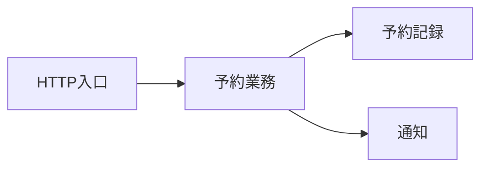

# オンボーディング

> これは [`onboarding.md`](../templates/onboarding.md) の記載例である。読み手はRoomFlow開発チームへ参加したエンジニアである。

## 全体像

変更は入口から業務判断を通り、記録へ流れる。依存は逆向きにしない。

## 用語と登場人物

| 語 | 意味 |
|---|---|
| 利用枠 | 一つの会議室に対する利用開始から利用終了までの半開時間帯 |
| 顧客 | RoomFlowと会議室利用の約束を結ぶ相手 |
| 予約担当者 | 顧客の依頼を受け、担当拠点の仮押さえ、確定、顧客都合の取消を行う役割 |
| 店舗責任者 | 会議室を提供できるか判断し、施設都合の取消に責任を持つ役割 |

## 環境を立ち上げる

1. `make doctor`を実行し、必須ツールがすべて`ok`になることを確認する。
2. `docker compose up -d`を実行し、`roomflow-api`が`healthy`になることを確認する。
3. `make test`を実行し、失敗が0件になることを確認する。

## 最初のタスク

「取消済み予約へ確認メールを送らない」テストを1件追加する。完了条件はテストが失敗を再現し、最小の修正後に通ることである。成果物は`tests/reservations/test_notifications.py`へ置く。

## 詰まったら

`#roomflow-dev`で担当メンターへ相談する。実行したcommand、失敗した時刻、エラー全文、変更差分を添える。

## 30日 / 90日で到達したい状態

- 30日: 予約作成・確定・取消の変更を、テスト付きで独力で完了できる
- 90日: 業務ルールの変更について、予約業務責任者と影響範囲を確認し設計レビューを進行できる
