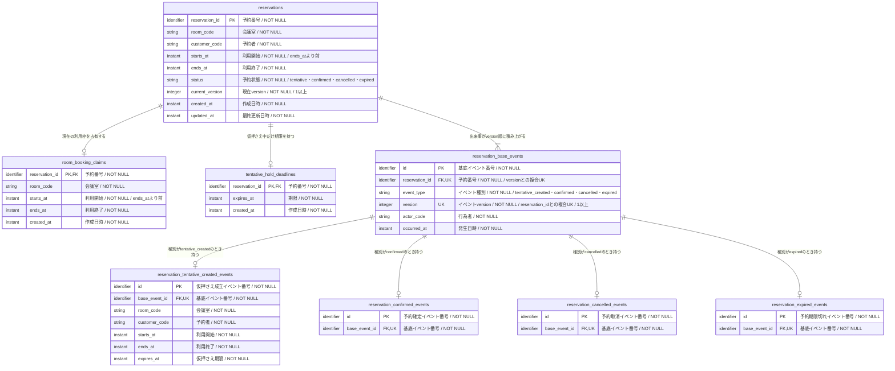

# RDB論理設計 — 貸会議室の予約

> これは`rdb-logical-data-modeling`型の記載例である。**構成の正本ではなく、粒度と具体性の見本として読む。**
> RoomFlowは、組織内の共用会議室を予約する架空のサービスである。
> 型: RDB論理設計 ／ 読み手: 予約業務責任者、RDBデータ設計者 ／ 入力: [貸会議室予約の業務知識・コアドメイン](domain-rule.example.md)

**この論理設計は、予約の現在の姿を持つリソース系テーブルと、予約に一度起きた事実を積むイベント系テーブルを分ける。** 予約の`current_version`と基底イベントの`version`を対応させ、現在の姿へどの出来事まで反映済みかを説明できるようにする。

## 目的と範囲

- 支える業務: 会議室の仮押さえ、確定、予約者本人による取消、期限切れ
- 永続化の目的: 現在の予約可否へ答えながら、成立済みの業務イベントを上書きせず説明できるようにする
- 対象外: 予約待ちと顧客の予約資格の記録（別の論理設計）、会議室設備の管理、通知の送達結果
- 業務知識の正本: [貸会議室予約の業務知識・コアドメイン](domain-rule.example.md)
- 対応する具体例: 業務知識のBDD-001（仮押さえ成立）、BDD-002（確定）、BDD-003（確定予約の取消）、BDD-004（同時仮押さえ）、BDD-005（期限到来）、BDD-013（隣接する利用枠）、BDD-014（重なる利用枠の拒否）、BDD-015（期限同時刻の確定）、BDD-016（第三者による取消の拒否）、BDD-024（仮押さえ予約の取消）。業務知識のBDD-006からBDD-012、BDD-017からBDD-023は、予約待ちと顧客の予約資格を扱うため、この論理設計の範囲外である

## リソース系とイベント系

| 分類 | テーブル | 役割 | 時刻 |
|---|---|---|---|
| リソース系 | `reservations` | 予約の現在の姿と、反映済みの最新versionを持つ | `created_at`、`updated_at` |
| リソース系 | `room_booking_claims` | 現在占有されている会議室と利用枠を持つ | `created_at` |
| リソース系 | `tentative_hold_deadlines` | 現在有効な仮押さえ期限を持つ | `created_at` |
| イベント系 | `reservation_base_events` | イベント共通の対象、種類、version、行為者、発生日時を積む | `occurred_at` |
| イベント系 | `reservation_tentative_created_events` | 仮押さえ成立時点の予約内容と期限を残す | 基底イベントの`occurred_at`を使う |
| イベント系 | `reservation_confirmed_events` | 予約が確定した事実を基底イベントへ結びつける | 基底イベントの`occurred_at`を使う |
| イベント系 | `reservation_cancelled_events` | 予約者が予約を取り消した事実を基底イベントへ結びつける | 基底イベントの`occurred_at`を使う |
| イベント系 | `reservation_expired_events` | 仮押さえ期限が到来した事実を基底イベントへ結びつける | 基底イベントの`occurred_at`を使う |

イベント系テーブルに`created_at`は持たせない。業務上の成立時刻は基底イベントの`occurred_at`で一度だけ表す。詳細イベントは、対応する基底イベントがどの種類の事実であり、種類固有の何を残すかを表す。

## シナリオと記録の対応

列は後述する全8テーブルと過不足なく一致させる。`tce`・`ce`・`cae`・`ee`は詳細イベントの略で、順に仮押さえ成立・確定・取消・期限切れを指す。

| シナリオ | `reservations` | `room_booking_claims` | `tentative_hold_deadlines` | `reservation_base_events` | `..._tentative_created_events`（tce） | `..._confirmed_events`（ce） | `..._cancelled_events`（cae） | `..._expired_events`（ee） |
|---|---|---|---|---|---|---|---|---|
| BDD-001 仮押さえ | 追加 | 追加 | 追加 | 追加（version 1） | 追加 | 変更なし | 変更なし | 変更なし |
| BDD-002 期限時刻の確定 | 更新 | 削除 | 削除 | 追加（version 2） | 変更なし | 変更なし | 変更なし | 追加 |
| BDD-003 確定 | 更新 | 変更なし | 削除 | 追加（version 2） | 変更なし | 追加 | 変更なし | 変更なし |
| BDD-004 取消 | 更新 | 削除 | 変更なし | 追加（version 3） | 変更なし | 変更なし | 追加 | 変更なし |
| BDD-005 同時仮押さえ | 追加（成立した一件だけ） | 追加（成立した一件だけ） | 追加（成立した一件だけ） | 追加（成立した予約のversion 1だけ） | 追加（成立した一件だけ） | 変更なし | 変更なし | 変更なし |
| BDD-006 仮押さえの取消 | 更新 | 削除 | 削除 | 追加（version 2） | 変更なし | 変更なし | 追加 | 変更なし |
| BDD-007 第三者による取消 | 変更なし | 変更なし | 変更なし | 変更なし | 変更なし | 変更なし | 変更なし | 変更なし |
| BDD-008 隣接する利用枠 | 追加 | 追加 | 追加 | 追加（新しい予約のversion 1） | 追加 | 変更なし | 変更なし | 変更なし |
| BDD-009 期限切れ | 更新 | 削除 | 削除 | 追加（version 2） | 変更なし | 変更なし | 変更なし | 追加 |
| BDD-010 重複する利用枠 | 変更なし | 変更なし | 変更なし | 変更なし | 変更なし | 変更なし | 変更なし | 変更なし |

## 論理データモデル図

図内は`論理型 英語カラム名 PK・FK等 "日本語名 / NULL制約 / 値域または説明"`の順で記載する。論理型は対象DBMSを決めずに書けるものだけを使い、`identifier`（識別子）、`string`（文字列）、`instant`（時点）、`integer`（整数）の4つに限る。DBMS固有の型へどう写すかは物理設計で決める。



## 論理テーブル定義

### `reservations`（予約）

予約番号が同じなら、状態が変わっても同じ予約である。`current_version`は現在の姿へ最後に反映した基底イベントの`version`と一致する。

- 役割: 一つの予約について、現在の姿と反映済みの最新versionを一行で表す
- 識別: 予約番号が同じなら同じ予約である
- 対応するシナリオ: BDD-001からBDD-010

論理型、NULL制約、値域、キーは論理データモデル図にある。ここでは業務上の意味と、その値が何で決まるかを書く。

| 論理列 | 業務上の意味 | 必須性 | 値を決める事実 |
|---|---|---|---|
| `reservation_id`（予約番号） | 予約を追跡する番号 | 常に必要 | 仮押さえ成立時に一意に採番する |
| `room_code`（会議室） | 予約対象の会議室 | 常に必要 | 仮押さえ申込みで指定された会議室 |
| `customer_code`（予約者） | 利用する予約者 | 常に必要 | 仮押さえを申し込んだ予約者 |
| `starts_at`（利用開始） | 利用枠の始点 | 常に必要 | 仮押さえ申込みで指定された利用開始 |
| `ends_at`（利用終了） | 利用枠の終点 | 常に必要 | 仮押さえ申込みで指定された利用終了 |
| `status`（予約状態） | 仮押さえ・確定・取消済み・期限切れのどれか | 常に必要 | 最後に成立した基底イベントの種別 |
| `current_version`（現在version） | 現在の姿へ最後に反映した基底イベントのversion | 常に必要 | 最後に成立した基底イベントのversion |
| `created_at`（作成日時） | 予約が成立した日時 | 常に必要 | 仮押さえ成立イベントの発生日時 |
| `updated_at`（最終更新日時） | 現在の姿へ最後に変わった日時 | 常に必要 | 最後に反映した基底イベントの発生日時 |

#### 業務制約: 予約期間は正の長さ

- 守ること: 利用開始は利用終了より前である
- 根拠となるシナリオ: BDD-001

#### 業務制約: 現在versionは最後のイベントversionと一致する

- 守ること: 予約の現在versionは、その予約で最後に成立した基底イベントのversionと一致する
- 根拠となるシナリオ: BDD-001からBDD-010

### `room_booking_claims`（予約枠占有）

仮押さえ予約または確定予約が現在占有している利用枠を表す。取消済み予約と期限切れ予約には存在しない。

- 役割: いま占有されている会議室と利用枠を一行で表す
- 識別: 予約番号が同じなら同じ占有である
- 対応するシナリオ: BDD-001からBDD-006、BDD-008からBDD-010

| 論理列 | 業務上の意味 | 必須性 | 値を決める事実 |
|---|---|---|---|
| `reservation_id`（予約番号） | 占有を持つ予約 | 行が存在するとき常に必要 | 占有を生んだ仮押さえ予約 |
| `room_code`（会議室） | 占有されている会議室 | 行が存在するとき常に必要 | 予約の会議室 |
| `starts_at`（利用開始） | 半開区間の始点 | 行が存在するとき常に必要 | 予約の利用開始 |
| `ends_at`（利用終了） | 半開区間の終点 | 行が存在するとき常に必要 | 予約の利用終了 |
| `created_at`（作成日時） | 占有が成立した日時 | 行が存在するとき常に必要 | 仮押さえ成立イベントの発生日時 |

同じ会議室の時間帯は、境界接触を除いて二つの占有に属さない。

#### 業務制約: 同じ会議室の占有は重ならない

- 守ること: 同じ会議室では、境界接触を除いて利用時間帯が重なる占有を二つ成立させない
- 根拠となるシナリオ: BDD-005、BDD-008、BDD-010

### `tentative_hold_deadlines`（仮押さえ期限）

- 役割: いま有効な仮押さえ期限を一行で表す
- 識別: 予約番号が同じなら同じ期限である
- 対応するシナリオ: BDD-001からBDD-004、BDD-006、BDD-008、BDD-009

| 論理列 | 業務上の意味 | 必須性 | 値を決める事実 |
|---|---|---|---|
| `reservation_id`（予約番号） | 期限が適用される仮押さえ予約 | 行が存在するとき常に必要 | 期限を生んだ仮押さえ予約 |
| `expires_at`（期限） | 確定しなければ占有を解放する時刻 | 行が存在するとき常に必要 | 仮押さえ成立イベントの発生日時から15分後 |
| `created_at`（作成日時） | 期限が成立した日時 | 行が存在するとき常に必要 | 仮押さえ成立イベントの発生日時 |

#### 業務制約: 仮押さえだけが期限を持つ

- 守ること: 仮押さえ予約だけが期限を持ち、確定・取消・期限切れの成立時には期限を残さない
- 根拠となるシナリオ: BDD-001からBDD-004、BDD-006、BDD-009

### `reservation_base_events`（予約基底イベント）

基底イベントは予約へ起きた出来事をversion順に積む。追加後は書き換えない。同じ予約の`version`は重複せず、1から欠番なく進む。

- 役割: 予約へ起きた出来事を一件ずつ、version順に積む
- 識別: 基底イベント番号が同じなら同じ出来事である。予約番号とversionの組でも一意に決まる
- 対応するシナリオ: BDD-001からBDD-006、BDD-008、BDD-009

| 論理列 | 業務上の意味 | 必須性 | 値を決める事実 |
|---|---|---|---|
| `id`（基底イベント番号） | 一つの出来事を追跡する番号 | 常に必要 | 出来事の成立時に一意に採番する |
| `reservation_id`（予約番号） | 出来事が属する予約 | 常に必要 | 出来事の対象になった予約 |
| `event_type`（イベント種別） | 仮押さえ成立・確定・取消・期限切れのどれか | 常に必要 | 成立した業務イベントの種類 |
| `version`（イベントversion） | 同じ予約で出来事が成立した順序 | 常に必要 | 同じ予約の直前のversionに1を足した値。最初は1 |
| `actor_code`（行為者） | 予約者または期限管理 | 常に必要 | 出来事を起こした主体 |
| `occurred_at`（発生日時） | 業務上、出来事が成立した日時 | 常に必要 | 業務イベントが成立した時刻 |

#### 業務制約: イベントversionは予約内で一意

- 守ること: 同じ予約に同じversionの基底イベントを二つ成立させない
- 根拠となるシナリオ: BDD-001からBDD-006、BDD-008、BDD-009

#### 業務制約: 基底イベントと詳細イベントは一対一

- 守ること: 一つの基底イベントは対応する詳細イベントを一つだけ持つ
- 根拠となるシナリオ: BDD-001からBDD-010

#### 業務制約: 基底イベントの種類と詳細の種類が一致する

- 守ること: 基底イベントのイベント種別と、存在する詳細イベントの種類を一致させる
- 根拠となるシナリオ: BDD-001からBDD-010

### 詳細イベント

一つの基底イベントは、`event_type`に対応する詳細イベントを一つだけ持つ。詳細イベントには`created_at`も`occurred_at`も持たせず、発生日時は基底イベントから読む。

| テーブル | 固有のカラム | 対応するイベント種別 | 残す事実 |
|---|---|---|---|
| `reservation_tentative_created_events` | `id`（PK）、`base_event_id`（FK・UK）、`room_code`、`customer_code`、`starts_at`、`ends_at`、`expires_at`（すべてNOT NULL） | `tentative_created` | 仮押さえ成立時点の予約内容と期限 |
| `reservation_confirmed_events` | `id`（PK）、`base_event_id`（FK・UK）（すべてNOT NULL） | `confirmed` | 予約者が利用意思を示して予約が確定した事実 |
| `reservation_cancelled_events` | `id`（PK）、`base_event_id`（FK・UK）（すべてNOT NULL） | `cancelled` | 予約者が自分の予約を取り消した事実 |
| `reservation_expired_events` | `id`（PK）、`base_event_id`（FK・UK）（すべてNOT NULL） | `expired` | 未確定のまま仮押さえ期限が到来した事実 |

## ライフサイクルと時間軸

| 論理テーブル | 生成のきっかけ | 変化のしかた | 終了・残存 | 時間軸の扱い |
|---|---|---|---|---|
| `reservations` | 仮押さえ成立 | 確定、取消、期限切れで状態・現在version・最終更新日時を更新 | 行は消さず終端状態を持つ | 現在の姿として保持 |
| `room_booking_claims` | 仮押さえ成立 | 更新しない | 取消または期限切れで削除 | 現在の占有だけ保持 |
| `tentative_hold_deadlines` | 仮押さえ成立 | 更新しない | 確定、取消、期限切れで削除 | 現在の期限だけ保持 |
| `reservation_base_events` | 各業務イベントの成立 | 更新しない | 終了しない | version順に保持 |
| 4つの詳細イベント | 対応する業務イベントの成立 | 更新しない | 終了しない | 基底イベントと同じ期間保持 |

## 並行実行で必要な保証

| 同時に進む操作 | 許される結果 | 許されない結果 | 対応シナリオ |
|---|---|---|---|
| 同じ利用枠への二つの仮押さえ | 一方の予約、占有、期限、version 1イベントだけが成立する | 二つの占有と二組のイベントが残る | BDD-005 |
| 確定と期限切れ | 一方だけが予約のversion 2になる | 同じ予約へversion 2が二つ積まれる | BDD-002、BDD-003 |
| 取消と別予約者の仮押さえ | 取消の成立後なら別予約者が占有を得る | 古い占有と新しい占有が重なる | BDD-004、BDD-008 |
| 予約者本人の取消と第三者による取消 | 予約者本人による取消だけが予約の次versionになる | 第三者の行為で状態やイベントが変わる | BDD-007 |

## 論理設計の完了条件

- リソース系3テーブルとイベント系5テーブルを区別した
- 予約の`current_version`と基底イベントの`version`を対応させた
- イベントの発生日時を`occurred_at`、リソースの成立日時を`created_at`で表した
- すべてのカラムをNOT NULLとし、イベント種別ごとの違いをNULLで隠していない
- BDD-001からBDD-010で作成、更新、削除、時間境界、権限、拒否、同時進行を確かめた

## 未決

- 基底イベントと詳細イベントの保持期間は、予約業務責任者と法務が決める
- 期限管理を行為者としてどの業務コードで表すか

## BDD

以下のBDDは互いに独立している。前のBDDの結果は引き継がず、8テーブルすべてをBeforeとAfterへ記載する。0件のテーブルも全カラムの見出しと区切り行に続けて、全セルへ`&nbsp;`を1つずつ置いた表示上空白のデータ行を1行だけ置き、各表の直後を`<br>`で1行空ける。変化しないテーブルも全行を再掲する。

### [BDD-001] 空き枠を仮押さえする

```gherkin
Given: 顧客C-4102は予約可能顧客である
  And: 会議室M-301の2026年9月18日 10:00から11:30までの利用枠には予約枠占有がない
  And: 現在日時は2026年9月1日 09:00である
When: C-4102が会議室M-301の2026年9月18日 10:00から11:30までを仮押さえする
Then: 予約R-20260901-0101が会議室M-301の2026年9月18日 10:00から11:30までの仮押さえ予約として成立する
  And: 予約の現在versionと基底イベントのversionは1で一致する
  And: 仮押さえ成立イベントに成立時点の予約内容が残る
```

#### データの状態

**Before**

**`reservations`**

| 予約番号 | 会議室 | 予約者 | 利用開始 | 利用終了 | 状態 | 現在version | 作成日時 | 最終更新日時 |
|---|---|---|---|---|---|---:|---|---|
| &nbsp; | &nbsp; | &nbsp; | &nbsp; | &nbsp; | &nbsp; | &nbsp; | &nbsp; | &nbsp; |

<br>

**`room_booking_claims`**

| 予約番号 | 会議室 | 利用開始 | 利用終了 | 作成日時 |
|---|---|---|---|---|
| &nbsp; | &nbsp; | &nbsp; | &nbsp; | &nbsp; |

<br>

**`tentative_hold_deadlines`**

| 予約番号 | 期限 | 作成日時 |
|---|---|---|
| &nbsp; | &nbsp; | &nbsp; |

<br>

**`reservation_base_events`**

| 基底イベント番号 | 予約番号 | 種別 | version | 行為者 | 発生日時 |
|---|---|---|---:|---|---|
| &nbsp; | &nbsp; | &nbsp; | &nbsp; | &nbsp; | &nbsp; |

<br>

**`reservation_tentative_created_events`**

| 詳細番号 | 基底イベント番号 | 会議室 | 予約者 | 利用開始 | 利用終了 | 期限 |
|---|---|---|---|---|---|---|
| &nbsp; | &nbsp; | &nbsp; | &nbsp; | &nbsp; | &nbsp; | &nbsp; |

<br>

**`reservation_confirmed_events`**

| 詳細番号 | 基底イベント番号 |
|---|---|
| &nbsp; | &nbsp; |

<br>

**`reservation_cancelled_events`**

| 詳細番号 | 基底イベント番号 |
|---|---|
| &nbsp; | &nbsp; |

<br>

**`reservation_expired_events`**

| 詳細番号 | 基底イベント番号 |
|---|---|
| &nbsp; | &nbsp; |

<br>

**After**

**`reservations`**

| 予約番号 | 会議室 | 予約者 | 利用開始 | 利用終了 | 状態 | 現在version | 作成日時 | 最終更新日時 |
|---|---|---|---|---|---|---:|---|---|
| **R-20260901-0101** | **M-301** | **C-4102** | **2026年9月18日 10:00** | **2026年9月18日 11:30** | **tentative** | **1** | **2026年9月1日 09:00** | **2026年9月1日 09:00** |

<br>

**`room_booking_claims`**

| 予約番号 | 会議室 | 利用開始 | 利用終了 | 作成日時 |
|---|---|---|---|---|
| **R-20260901-0101** | **M-301** | **2026年9月18日 10:00** | **2026年9月18日 11:30** | **2026年9月1日 09:00** |

<br>

**`tentative_hold_deadlines`**

| 予約番号 | 期限 | 作成日時 |
|---|---|---|
| **R-20260901-0101** | **2026年9月1日 09:15** | **2026年9月1日 09:00** |

<br>

**`reservation_base_events`**

| 基底イベント番号 | 予約番号 | 種別 | version | 行為者 | 発生日時 |
|---|---|---|---:|---|---|
| **BE-0101-01** | **R-20260901-0101** | **tentative_created** | **1** | **C-4102** | **2026年9月1日 09:00** |

<br>

**`reservation_tentative_created_events`**

| 詳細番号 | 基底イベント番号 | 会議室 | 予約者 | 利用開始 | 利用終了 | 期限 |
|---|---|---|---|---|---|---|
| **TE-0101-01** | **BE-0101-01** | **M-301** | **C-4102** | **2026年9月18日 10:00** | **2026年9月18日 11:30** | **2026年9月1日 09:15** |

<br>

**`reservation_confirmed_events`**

| 詳細番号 | 基底イベント番号 |
|---|---|
| &nbsp; | &nbsp; |

<br>

**`reservation_cancelled_events`**

| 詳細番号 | 基底イベント番号 |
|---|---|
| &nbsp; | &nbsp; |

<br>

**`reservation_expired_events`**

| 詳細番号 | 基底イベント番号 |
|---|---|
| &nbsp; | &nbsp; |

<br>

### [BDD-002] 仮押さえ期限と同時刻の確定を期限切れとして記録する

```gherkin
Given: 予約R-20260901-0101は現在version 1の仮押さえ予約である
  And: 利用枠は会議室M-301の2026年9月18日 10:00から11:30までである
  And: 仮押さえ期限は2026年9月1日 09:15である
  And: 予約を確定したイベントはない
When: 予約者C-4102が2026年9月1日 09:15に予約を確定する
Then: 予約は現在version 2の期限切れ予約になる
  And: 予約枠占有と仮押さえ期限は削除される
  And: 予約確定イベントではなく予約期限切れイベントが追加される
```

#### データの状態

**Before**

**`reservations`**

| 予約番号 | 会議室 | 予約者 | 利用開始 | 利用終了 | 状態 | 現在version | 作成日時 | 最終更新日時 |
|---|---|---|---|---|---|---:|---|---|
| R-20260901-0101 | M-301 | C-4102 | 2026年9月18日 10:00 | 2026年9月18日 11:30 | tentative | 1 | 2026年9月1日 09:00 | 2026年9月1日 09:00 |

<br>

**`room_booking_claims`**

| 予約番号 | 会議室 | 利用開始 | 利用終了 | 作成日時 |
|---|---|---|---|---|
| R-20260901-0101 | M-301 | 2026年9月18日 10:00 | 2026年9月18日 11:30 | 2026年9月1日 09:00 |

<br>

**`tentative_hold_deadlines`**

| 予約番号 | 期限 | 作成日時 |
|---|---|---|
| R-20260901-0101 | 2026年9月1日 09:15 | 2026年9月1日 09:00 |

<br>

**`reservation_base_events`**

| 基底イベント番号 | 予約番号 | 種別 | version | 行為者 | 発生日時 |
|---|---|---|---:|---|---|
| BE-0101-01 | R-20260901-0101 | tentative_created | 1 | C-4102 | 2026年9月1日 09:00 |

<br>

**`reservation_tentative_created_events`**

| 詳細番号 | 基底イベント番号 | 会議室 | 予約者 | 利用開始 | 利用終了 | 期限 |
|---|---|---|---|---|---|---|
| TE-0101-01 | BE-0101-01 | M-301 | C-4102 | 2026年9月18日 10:00 | 2026年9月18日 11:30 | 2026年9月1日 09:15 |

<br>

**`reservation_confirmed_events`**

| 詳細番号 | 基底イベント番号 |
|---|---|
| &nbsp; | &nbsp; |

<br>

**`reservation_cancelled_events`**

| 詳細番号 | 基底イベント番号 |
|---|---|
| &nbsp; | &nbsp; |

<br>

**`reservation_expired_events`**

| 詳細番号 | 基底イベント番号 |
|---|---|
| &nbsp; | &nbsp; |

<br>

**After**

**`reservations`**

| 予約番号 | 会議室 | 予約者 | 利用開始 | 利用終了 | 状態 | 現在version | 作成日時 | 最終更新日時 |
|---|---|---|---|---|---|---:|---|---|
| R-20260901-0101 | M-301 | C-4102 | 2026年9月18日 10:00 | 2026年9月18日 11:30 | **expired** | **2** | 2026年9月1日 09:00 | **2026年9月1日 09:15** |

<br>

**`room_booking_claims`**

| 予約番号 | 会議室 | 利用開始 | 利用終了 | 作成日時 |
|---|---|---|---|---|
| &nbsp; | &nbsp; | &nbsp; | &nbsp; | &nbsp; |

<br>

**`tentative_hold_deadlines`**

| 予約番号 | 期限 | 作成日時 |
|---|---|---|
| &nbsp; | &nbsp; | &nbsp; |

<br>

**`reservation_base_events`**

| 基底イベント番号 | 予約番号 | 種別 | version | 行為者 | 発生日時 |
|---|---|---|---:|---|---|
| BE-0101-01 | R-20260901-0101 | tentative_created | 1 | C-4102 | 2026年9月1日 09:00 |
| **BE-0101-02** | **R-20260901-0101** | **expired** | **2** | **期限管理** | **2026年9月1日 09:15** |

<br>

**`reservation_tentative_created_events`**

| 詳細番号 | 基底イベント番号 | 会議室 | 予約者 | 利用開始 | 利用終了 | 期限 |
|---|---|---|---|---|---|---|
| TE-0101-01 | BE-0101-01 | M-301 | C-4102 | 2026年9月18日 10:00 | 2026年9月18日 11:30 | 2026年9月1日 09:15 |

<br>

**`reservation_confirmed_events`**

| 詳細番号 | 基底イベント番号 |
|---|---|
| &nbsp; | &nbsp; |

<br>

**`reservation_cancelled_events`**

| 詳細番号 | 基底イベント番号 |
|---|---|
| &nbsp; | &nbsp; |

<br>

**`reservation_expired_events`**

| 詳細番号 | 基底イベント番号 |
|---|---|
| **EE-0101-02** | **BE-0101-02** |

<br>

### [BDD-003] 仮押さえ予約を確定する

```gherkin
Given: 予約R-20260901-0101は現在version 1の仮押さえ予約である
  And: 利用枠は会議室M-301の2026年9月18日 10:00から11:30までである
  And: version 1の仮押さえ成立イベントと仮押さえ期限がある
  And: 現在日時は期限前の2026年9月1日 09:05である
When: 予約者C-4102が予約を確定する
Then: 予約は現在version 2の確定予約になる
  And: 確定予約の利用枠は会議室M-301の2026年9月18日 10:00から11:30までのままである
  And: 仮押さえ期限は削除される
  And: version 2の基底イベントと予約確定イベントが追加される
```

#### データの状態

**Before**

**`reservations`**

| 予約番号 | 会議室 | 予約者 | 利用開始 | 利用終了 | 状態 | 現在version | 作成日時 | 最終更新日時 |
|---|---|---|---|---|---|---:|---|---|
| R-20260901-0101 | M-301 | C-4102 | 2026年9月18日 10:00 | 2026年9月18日 11:30 | tentative | 1 | 2026年9月1日 09:00 | 2026年9月1日 09:00 |

<br>

**`room_booking_claims`**

| 予約番号 | 会議室 | 利用開始 | 利用終了 | 作成日時 |
|---|---|---|---|---|
| R-20260901-0101 | M-301 | 2026年9月18日 10:00 | 2026年9月18日 11:30 | 2026年9月1日 09:00 |

<br>

**`tentative_hold_deadlines`**

| 予約番号 | 期限 | 作成日時 |
|---|---|---|
| R-20260901-0101 | 2026年9月1日 09:15 | 2026年9月1日 09:00 |

<br>

**`reservation_base_events`**

| 基底イベント番号 | 予約番号 | 種別 | version | 行為者 | 発生日時 |
|---|---|---|---:|---|---|
| BE-0101-01 | R-20260901-0101 | tentative_created | 1 | C-4102 | 2026年9月1日 09:00 |

<br>

**`reservation_tentative_created_events`**

| 詳細番号 | 基底イベント番号 | 会議室 | 予約者 | 利用開始 | 利用終了 | 期限 |
|---|---|---|---|---|---|---|
| TE-0101-01 | BE-0101-01 | M-301 | C-4102 | 2026年9月18日 10:00 | 2026年9月18日 11:30 | 2026年9月1日 09:15 |

<br>

**`reservation_confirmed_events`**

| 詳細番号 | 基底イベント番号 |
|---|---|
| &nbsp; | &nbsp; |

<br>

**`reservation_cancelled_events`**

| 詳細番号 | 基底イベント番号 |
|---|---|
| &nbsp; | &nbsp; |

<br>

**`reservation_expired_events`**

| 詳細番号 | 基底イベント番号 |
|---|---|
| &nbsp; | &nbsp; |

<br>

**After**

**`reservations`**

| 予約番号 | 会議室 | 予約者 | 利用開始 | 利用終了 | 状態 | 現在version | 作成日時 | 最終更新日時 |
|---|---|---|---|---|---|---:|---|---|
| R-20260901-0101 | M-301 | C-4102 | 2026年9月18日 10:00 | 2026年9月18日 11:30 | **confirmed** | **2** | 2026年9月1日 09:00 | **2026年9月1日 09:05** |

<br>

**`room_booking_claims`**

| 予約番号 | 会議室 | 利用開始 | 利用終了 | 作成日時 |
|---|---|---|---|---|
| R-20260901-0101 | M-301 | 2026年9月18日 10:00 | 2026年9月18日 11:30 | 2026年9月1日 09:00 |

<br>

**`tentative_hold_deadlines`**

| 予約番号 | 期限 | 作成日時 |
|---|---|---|
| &nbsp; | &nbsp; | &nbsp; |

<br>

**`reservation_base_events`**

| 基底イベント番号 | 予約番号 | 種別 | version | 行為者 | 発生日時 |
|---|---|---|---:|---|---|
| BE-0101-01 | R-20260901-0101 | tentative_created | 1 | C-4102 | 2026年9月1日 09:00 |
| **BE-0101-02** | **R-20260901-0101** | **confirmed** | **2** | **C-4102** | **2026年9月1日 09:05** |

<br>

**`reservation_tentative_created_events`**

| 詳細番号 | 基底イベント番号 | 会議室 | 予約者 | 利用開始 | 利用終了 | 期限 |
|---|---|---|---|---|---|---|
| TE-0101-01 | BE-0101-01 | M-301 | C-4102 | 2026年9月18日 10:00 | 2026年9月18日 11:30 | 2026年9月1日 09:15 |

<br>

**`reservation_confirmed_events`**

| 詳細番号 | 基底イベント番号 |
|---|---|
| **CE-0101-02** | **BE-0101-02** |

<br>

**`reservation_cancelled_events`**

| 詳細番号 | 基底イベント番号 |
|---|---|
| &nbsp; | &nbsp; |

<br>

**`reservation_expired_events`**

| 詳細番号 | 基底イベント番号 |
|---|---|
| &nbsp; | &nbsp; |

<br>

### [BDD-004] 確定予約を取り消す

```gherkin
Given: 予約R-20260901-0101は現在version 2の確定予約である
  And: 利用枠は会議室M-301の2026年9月18日 10:00から11:30までである
  And: version 1の仮押さえ成立イベントとversion 2の予約確定イベントがある
  And: 現在日時は利用開始前である
When: 予約者C-4102が自分の予約を取り消す
Then: 予約は現在version 3の取消済み予約になる
  And: 予約枠占有は削除される
  And: version 3の基底イベントと予約取消イベントが追加される
```

#### データの状態

**Before**

**`reservations`**

| 予約番号 | 会議室 | 予約者 | 利用開始 | 利用終了 | 状態 | 現在version | 作成日時 | 最終更新日時 |
|---|---|---|---|---|---|---:|---|---|
| R-20260901-0101 | M-301 | C-4102 | 2026年9月18日 10:00 | 2026年9月18日 11:30 | confirmed | 2 | 2026年9月1日 09:00 | 2026年9月1日 09:05 |

<br>

**`room_booking_claims`**

| 予約番号 | 会議室 | 利用開始 | 利用終了 | 作成日時 |
|---|---|---|---|---|
| R-20260901-0101 | M-301 | 2026年9月18日 10:00 | 2026年9月18日 11:30 | 2026年9月1日 09:00 |

<br>

**`tentative_hold_deadlines`**

| 予約番号 | 期限 | 作成日時 |
|---|---|---|
| &nbsp; | &nbsp; | &nbsp; |

<br>

**`reservation_base_events`**

| 基底イベント番号 | 予約番号 | 種別 | version | 行為者 | 発生日時 |
|---|---|---|---:|---|---|
| BE-0101-01 | R-20260901-0101 | tentative_created | 1 | C-4102 | 2026年9月1日 09:00 |
| BE-0101-02 | R-20260901-0101 | confirmed | 2 | C-4102 | 2026年9月1日 09:05 |

<br>

**`reservation_tentative_created_events`**

| 詳細番号 | 基底イベント番号 | 会議室 | 予約者 | 利用開始 | 利用終了 | 期限 |
|---|---|---|---|---|---|---|
| TE-0101-01 | BE-0101-01 | M-301 | C-4102 | 2026年9月18日 10:00 | 2026年9月18日 11:30 | 2026年9月1日 09:15 |

<br>

**`reservation_confirmed_events`**

| 詳細番号 | 基底イベント番号 |
|---|---|
| CE-0101-02 | BE-0101-02 |

<br>

**`reservation_cancelled_events`**

| 詳細番号 | 基底イベント番号 |
|---|---|
| &nbsp; | &nbsp; |

<br>

**`reservation_expired_events`**

| 詳細番号 | 基底イベント番号 |
|---|---|
| &nbsp; | &nbsp; |

<br>

**After**

**`reservations`**

| 予約番号 | 会議室 | 予約者 | 利用開始 | 利用終了 | 状態 | 現在version | 作成日時 | 最終更新日時 |
|---|---|---|---|---|---|---:|---|---|
| R-20260901-0101 | M-301 | C-4102 | 2026年9月18日 10:00 | 2026年9月18日 11:30 | **cancelled** | **3** | 2026年9月1日 09:00 | **2026年9月10日 14:20** |

<br>

**`room_booking_claims`**

| 予約番号 | 会議室 | 利用開始 | 利用終了 | 作成日時 |
|---|---|---|---|---|
| &nbsp; | &nbsp; | &nbsp; | &nbsp; | &nbsp; |

<br>

**`tentative_hold_deadlines`**

| 予約番号 | 期限 | 作成日時 |
|---|---|---|
| &nbsp; | &nbsp; | &nbsp; |

<br>

**`reservation_base_events`**

| 基底イベント番号 | 予約番号 | 種別 | version | 行為者 | 発生日時 |
|---|---|---|---:|---|---|
| BE-0101-01 | R-20260901-0101 | tentative_created | 1 | C-4102 | 2026年9月1日 09:00 |
| BE-0101-02 | R-20260901-0101 | confirmed | 2 | C-4102 | 2026年9月1日 09:05 |
| **BE-0101-03** | **R-20260901-0101** | **cancelled** | **3** | **C-4102** | **2026年9月10日 14:20** |

<br>

**`reservation_tentative_created_events`**

| 詳細番号 | 基底イベント番号 | 会議室 | 予約者 | 利用開始 | 利用終了 | 期限 |
|---|---|---|---|---|---|---|
| TE-0101-01 | BE-0101-01 | M-301 | C-4102 | 2026年9月18日 10:00 | 2026年9月18日 11:30 | 2026年9月1日 09:15 |

<br>

**`reservation_confirmed_events`**

| 詳細番号 | 基底イベント番号 |
|---|---|
| CE-0101-02 | BE-0101-02 |

<br>

**`reservation_cancelled_events`**

| 詳細番号 | 基底イベント番号 |
|---|---|
| **CAE-0101-03** | **BE-0101-03** |

<br>

**`reservation_expired_events`**

| 詳細番号 | 基底イベント番号 |
|---|---|
| &nbsp; | &nbsp; |

<br>

### [BDD-005] 同じ空き時間への同時仮押さえは一方だけ成立する

```gherkin
Given: 顧客C-4102と顧客C-5821は予約可能顧客である
  And: 会議室M-301の2026年9月18日 10:00から11:30までの利用枠には予約枠占有がない
When: 二人が会議室M-301の2026年9月18日 10:00から11:30までを同時に仮押さえする
Then: 先に成立した一方だけが現在version 1の仮押さえ予約になる
  And: 成立した予約のリソース系3行とイベント系2行だけが追加される
  And: もう一方に属する行は8テーブルのどこにも作られない
```

#### データの状態

**Before**

**`reservations`**

| 予約番号 | 会議室 | 予約者 | 利用開始 | 利用終了 | 状態 | 現在version | 作成日時 | 最終更新日時 |
|---|---|---|---|---|---|---:|---|---|
| &nbsp; | &nbsp; | &nbsp; | &nbsp; | &nbsp; | &nbsp; | &nbsp; | &nbsp; | &nbsp; |

<br>

**`room_booking_claims`**

| 予約番号 | 会議室 | 利用開始 | 利用終了 | 作成日時 |
|---|---|---|---|---|
| &nbsp; | &nbsp; | &nbsp; | &nbsp; | &nbsp; |

<br>

**`tentative_hold_deadlines`**

| 予約番号 | 期限 | 作成日時 |
|---|---|---|
| &nbsp; | &nbsp; | &nbsp; |

<br>

**`reservation_base_events`**

| 基底イベント番号 | 予約番号 | 種別 | version | 行為者 | 発生日時 |
|---|---|---|---:|---|---|
| &nbsp; | &nbsp; | &nbsp; | &nbsp; | &nbsp; | &nbsp; |

<br>

**`reservation_tentative_created_events`**

| 詳細番号 | 基底イベント番号 | 会議室 | 予約者 | 利用開始 | 利用終了 | 期限 |
|---|---|---|---|---|---|---|
| &nbsp; | &nbsp; | &nbsp; | &nbsp; | &nbsp; | &nbsp; | &nbsp; |

<br>

**`reservation_confirmed_events`**

| 詳細番号 | 基底イベント番号 |
|---|---|
| &nbsp; | &nbsp; |

<br>

**`reservation_cancelled_events`**

| 詳細番号 | 基底イベント番号 |
|---|---|
| &nbsp; | &nbsp; |

<br>

**`reservation_expired_events`**

| 詳細番号 | 基底イベント番号 |
|---|---|
| &nbsp; | &nbsp; |

<br>

After（C-4102の操作が先に成立した場合）:

**`reservations`**

| 予約番号 | 会議室 | 予約者 | 利用開始 | 利用終了 | 状態 | 現在version | 作成日時 | 最終更新日時 |
|---|---|---|---|---|---|---:|---|---|
| **R-20260901-0101** | **M-301** | **C-4102** | **2026年9月18日 10:00** | **2026年9月18日 11:30** | **tentative** | **1** | **2026年9月1日 09:00** | **2026年9月1日 09:00** |

<br>

**`room_booking_claims`**

| 予約番号 | 会議室 | 利用開始 | 利用終了 | 作成日時 |
|---|---|---|---|---|
| **R-20260901-0101** | **M-301** | **2026年9月18日 10:00** | **2026年9月18日 11:30** | **2026年9月1日 09:00** |

<br>

**`tentative_hold_deadlines`**

| 予約番号 | 期限 | 作成日時 |
|---|---|---|
| **R-20260901-0101** | **2026年9月1日 09:15** | **2026年9月1日 09:00** |

<br>

**`reservation_base_events`**

| 基底イベント番号 | 予約番号 | 種別 | version | 行為者 | 発生日時 |
|---|---|---|---:|---|---|
| **BE-0101-01** | **R-20260901-0101** | **tentative_created** | **1** | **C-4102** | **2026年9月1日 09:00** |

<br>

**`reservation_tentative_created_events`**

| 詳細番号 | 基底イベント番号 | 会議室 | 予約者 | 利用開始 | 利用終了 | 期限 |
|---|---|---|---|---|---|---|
| **TE-0101-01** | **BE-0101-01** | **M-301** | **C-4102** | **2026年9月18日 10:00** | **2026年9月18日 11:30** | **2026年9月1日 09:15** |

<br>

**`reservation_confirmed_events`**

| 詳細番号 | 基底イベント番号 |
|---|---|
| &nbsp; | &nbsp; |

<br>

**`reservation_cancelled_events`**

| 詳細番号 | 基底イベント番号 |
|---|---|
| &nbsp; | &nbsp; |

<br>

**`reservation_expired_events`**

| 詳細番号 | 基底イベント番号 |
|---|---|
| &nbsp; | &nbsp; |

<br>

C-5821に属する予約、占有、期限、基底イベント、詳細イベントは、8テーブルのどこにも存在しない。

### [BDD-006] 仮押さえ予約を取り消す

```gherkin
Given: 予約R-20260901-0101は現在version 1の仮押さえ予約である
  And: 利用枠は会議室M-301の2026年9月18日 10:00から11:30までである
  And: version 1の仮押さえ成立イベントと仮押さえ期限がある
  And: 現在日時は利用開始前の2026年9月1日 09:05である
When: 予約者C-4102が自分の予約を取り消す
Then: 予約は現在version 2の取消済み予約になる
  And: 予約枠占有と仮押さえ期限は削除される
  And: version 2の基底イベントと予約取消イベントが追加される
```

#### データの状態

**Before**

**`reservations`**

| 予約番号 | 会議室 | 予約者 | 利用開始 | 利用終了 | 状態 | 現在version | 作成日時 | 最終更新日時 |
|---|---|---|---|---|---|---:|---|---|
| R-20260901-0101 | M-301 | C-4102 | 2026年9月18日 10:00 | 2026年9月18日 11:30 | tentative | 1 | 2026年9月1日 09:00 | 2026年9月1日 09:00 |

<br>

**`room_booking_claims`**

| 予約番号 | 会議室 | 利用開始 | 利用終了 | 作成日時 |
|---|---|---|---|---|
| R-20260901-0101 | M-301 | 2026年9月18日 10:00 | 2026年9月18日 11:30 | 2026年9月1日 09:00 |

<br>

**`tentative_hold_deadlines`**

| 予約番号 | 期限 | 作成日時 |
|---|---|---|
| R-20260901-0101 | 2026年9月1日 09:15 | 2026年9月1日 09:00 |

<br>

**`reservation_base_events`**

| 基底イベント番号 | 予約番号 | 種別 | version | 行為者 | 発生日時 |
|---|---|---|---:|---|---|
| BE-0101-01 | R-20260901-0101 | tentative_created | 1 | C-4102 | 2026年9月1日 09:00 |

<br>

**`reservation_tentative_created_events`**

| 詳細番号 | 基底イベント番号 | 会議室 | 予約者 | 利用開始 | 利用終了 | 期限 |
|---|---|---|---|---|---|---|
| TE-0101-01 | BE-0101-01 | M-301 | C-4102 | 2026年9月18日 10:00 | 2026年9月18日 11:30 | 2026年9月1日 09:15 |

<br>

**`reservation_confirmed_events`**

| 詳細番号 | 基底イベント番号 |
|---|---|
| &nbsp; | &nbsp; |

<br>

**`reservation_cancelled_events`**

| 詳細番号 | 基底イベント番号 |
|---|---|
| &nbsp; | &nbsp; |

<br>

**`reservation_expired_events`**

| 詳細番号 | 基底イベント番号 |
|---|---|
| &nbsp; | &nbsp; |

<br>

**After**

**`reservations`**

| 予約番号 | 会議室 | 予約者 | 利用開始 | 利用終了 | 状態 | 現在version | 作成日時 | 最終更新日時 |
|---|---|---|---|---|---|---:|---|---|
| R-20260901-0101 | M-301 | C-4102 | 2026年9月18日 10:00 | 2026年9月18日 11:30 | **cancelled** | **2** | 2026年9月1日 09:00 | **2026年9月1日 09:05** |

<br>

**`room_booking_claims`**

| 予約番号 | 会議室 | 利用開始 | 利用終了 | 作成日時 |
|---|---|---|---|---|
| &nbsp; | &nbsp; | &nbsp; | &nbsp; | &nbsp; |

<br>

**`tentative_hold_deadlines`**

| 予約番号 | 期限 | 作成日時 |
|---|---|---|
| &nbsp; | &nbsp; | &nbsp; |

<br>

**`reservation_base_events`**

| 基底イベント番号 | 予約番号 | 種別 | version | 行為者 | 発生日時 |
|---|---|---|---:|---|---|
| BE-0101-01 | R-20260901-0101 | tentative_created | 1 | C-4102 | 2026年9月1日 09:00 |
| **BE-0101-02** | **R-20260901-0101** | **cancelled** | **2** | **C-4102** | **2026年9月1日 09:05** |

<br>

**`reservation_tentative_created_events`**

| 詳細番号 | 基底イベント番号 | 会議室 | 予約者 | 利用開始 | 利用終了 | 期限 |
|---|---|---|---|---|---|---|
| TE-0101-01 | BE-0101-01 | M-301 | C-4102 | 2026年9月18日 10:00 | 2026年9月18日 11:30 | 2026年9月1日 09:15 |

<br>

**`reservation_confirmed_events`**

| 詳細番号 | 基底イベント番号 |
|---|---|
| &nbsp; | &nbsp; |

<br>

**`reservation_cancelled_events`**

| 詳細番号 | 基底イベント番号 |
|---|---|
| **CAE-0101-02** | **BE-0101-02** |

<br>

**`reservation_expired_events`**

| 詳細番号 | 基底イベント番号 |
|---|---|
| &nbsp; | &nbsp; |

<br>

### [BDD-007] 第三者による確定予約の取消を拒む

```gherkin
Given: 顧客C-4102の確定予約R-20260901-0101がある
  And: 利用枠は会議室M-301の2026年9月18日 10:00から11:30までである
  And: 現在日時は利用開始前の2026年9月10日 14:20である
  And: 顧客C-5821はR-20260901-0101の予約者ではない
When: C-5821がR-20260901-0101を取り消す
Then: R-20260901-0101は現在version 2の確定予約のままである
  And: 予約枠占有と成立済みイベントは変わらない
  And: 予約取消イベントは追加されない
  NOTE: Rule: 自分の予約と予約待ちだけを取り消せる
    Source: [業務知識・コアドメイン](domain-rule.example.md)
    Reason: 取り消そうとしたC-5821がR-20260901-0101の予約者ではないため
```

#### データの状態

**Before**

**`reservations`**

| 予約番号 | 会議室 | 予約者 | 利用開始 | 利用終了 | 状態 | 現在version | 作成日時 | 最終更新日時 |
|---|---|---|---|---|---|---:|---|---|
| R-20260901-0101 | M-301 | C-4102 | 2026年9月18日 10:00 | 2026年9月18日 11:30 | confirmed | 2 | 2026年9月1日 09:00 | 2026年9月1日 09:05 |

<br>

**`room_booking_claims`**

| 予約番号 | 会議室 | 利用開始 | 利用終了 | 作成日時 |
|---|---|---|---|---|
| R-20260901-0101 | M-301 | 2026年9月18日 10:00 | 2026年9月18日 11:30 | 2026年9月1日 09:00 |

<br>

**`tentative_hold_deadlines`**

| 予約番号 | 期限 | 作成日時 |
|---|---|---|
| &nbsp; | &nbsp; | &nbsp; |

<br>

**`reservation_base_events`**

| 基底イベント番号 | 予約番号 | 種別 | version | 行為者 | 発生日時 |
|---|---|---|---:|---|---|
| BE-0101-01 | R-20260901-0101 | tentative_created | 1 | C-4102 | 2026年9月1日 09:00 |
| BE-0101-02 | R-20260901-0101 | confirmed | 2 | C-4102 | 2026年9月1日 09:05 |

<br>

**`reservation_tentative_created_events`**

| 詳細番号 | 基底イベント番号 | 会議室 | 予約者 | 利用開始 | 利用終了 | 期限 |
|---|---|---|---|---|---|---|
| TE-0101-01 | BE-0101-01 | M-301 | C-4102 | 2026年9月18日 10:00 | 2026年9月18日 11:30 | 2026年9月1日 09:15 |

<br>

**`reservation_confirmed_events`**

| 詳細番号 | 基底イベント番号 |
|---|---|
| CE-0101-02 | BE-0101-02 |

<br>

**`reservation_cancelled_events`**

| 詳細番号 | 基底イベント番号 |
|---|---|
| &nbsp; | &nbsp; |

<br>

**`reservation_expired_events`**

| 詳細番号 | 基底イベント番号 |
|---|---|
| &nbsp; | &nbsp; |

<br>

**After**

**`reservations`**

| 予約番号 | 会議室 | 予約者 | 利用開始 | 利用終了 | 状態 | 現在version | 作成日時 | 最終更新日時 |
|---|---|---|---|---|---|---:|---|---|
| R-20260901-0101 | M-301 | C-4102 | 2026年9月18日 10:00 | 2026年9月18日 11:30 | confirmed | 2 | 2026年9月1日 09:00 | 2026年9月1日 09:05 |

<br>

**`room_booking_claims`**

| 予約番号 | 会議室 | 利用開始 | 利用終了 | 作成日時 |
|---|---|---|---|---|
| R-20260901-0101 | M-301 | 2026年9月18日 10:00 | 2026年9月18日 11:30 | 2026年9月1日 09:00 |

<br>

**`tentative_hold_deadlines`**

| 予約番号 | 期限 | 作成日時 |
|---|---|---|
| &nbsp; | &nbsp; | &nbsp; |

<br>

**`reservation_base_events`**

| 基底イベント番号 | 予約番号 | 種別 | version | 行為者 | 発生日時 |
|---|---|---|---:|---|---|
| BE-0101-01 | R-20260901-0101 | tentative_created | 1 | C-4102 | 2026年9月1日 09:00 |
| BE-0101-02 | R-20260901-0101 | confirmed | 2 | C-4102 | 2026年9月1日 09:05 |

<br>

**`reservation_tentative_created_events`**

| 詳細番号 | 基底イベント番号 | 会議室 | 予約者 | 利用開始 | 利用終了 | 期限 |
|---|---|---|---|---|---|---|
| TE-0101-01 | BE-0101-01 | M-301 | C-4102 | 2026年9月18日 10:00 | 2026年9月18日 11:30 | 2026年9月1日 09:15 |

<br>

**`reservation_confirmed_events`**

| 詳細番号 | 基底イベント番号 |
|---|---|
| CE-0101-02 | BE-0101-02 |

<br>

**`reservation_cancelled_events`**

| 詳細番号 | 基底イベント番号 |
|---|---|
| &nbsp; | &nbsp; |

<br>

**`reservation_expired_events`**

| 詳細番号 | 基底イベント番号 |
|---|---|
| &nbsp; | &nbsp; |

<br>

### [BDD-008] 確定予約に隣接する利用枠を仮押さえする

```gherkin
Given: 顧客C-4102の確定予約R-20260901-0101がある
  And: 予約は会議室M-301の2026年9月18日 10:00から11:00までを占有している
  And: 顧客C-5821は予約可能顧客である
When: C-5821が同じ会議室の2026年9月18日 11:00から12:00までを仮押さえする
Then: 予約R-20260901-0201が会議室M-301の2026年9月18日 11:00から12:00までの仮押さえ予約として成立する
  And: 二つの予約枠占有は境界で接するだけで重ならない
  And: R-20260901-0201のversion 1イベントと仮押さえ期限が追加される
```

#### データの状態

**Before**

**`reservations`**

| 予約番号 | 会議室 | 予約者 | 利用開始 | 利用終了 | 状態 | 現在version | 作成日時 | 最終更新日時 |
|---|---|---|---|---|---|---:|---|---|
| R-20260901-0101 | M-301 | C-4102 | 2026年9月18日 10:00 | 2026年9月18日 11:00 | confirmed | 2 | 2026年9月1日 09:00 | 2026年9月1日 09:05 |

<br>

**`room_booking_claims`**

| 予約番号 | 会議室 | 利用開始 | 利用終了 | 作成日時 |
|---|---|---|---|---|
| R-20260901-0101 | M-301 | 2026年9月18日 10:00 | 2026年9月18日 11:00 | 2026年9月1日 09:00 |

<br>

**`tentative_hold_deadlines`**

| 予約番号 | 期限 | 作成日時 |
|---|---|---|
| &nbsp; | &nbsp; | &nbsp; |

<br>

**`reservation_base_events`**

| 基底イベント番号 | 予約番号 | 種別 | version | 行為者 | 発生日時 |
|---|---|---|---:|---|---|
| BE-0101-01 | R-20260901-0101 | tentative_created | 1 | C-4102 | 2026年9月1日 09:00 |
| BE-0101-02 | R-20260901-0101 | confirmed | 2 | C-4102 | 2026年9月1日 09:05 |

<br>

**`reservation_tentative_created_events`**

| 詳細番号 | 基底イベント番号 | 会議室 | 予約者 | 利用開始 | 利用終了 | 期限 |
|---|---|---|---|---|---|---|
| TE-0101-01 | BE-0101-01 | M-301 | C-4102 | 2026年9月18日 10:00 | 2026年9月18日 11:00 | 2026年9月1日 09:15 |

<br>

**`reservation_confirmed_events`**

| 詳細番号 | 基底イベント番号 |
|---|---|
| CE-0101-02 | BE-0101-02 |

<br>

**`reservation_cancelled_events`**

| 詳細番号 | 基底イベント番号 |
|---|---|
| &nbsp; | &nbsp; |

<br>

**`reservation_expired_events`**

| 詳細番号 | 基底イベント番号 |
|---|---|
| &nbsp; | &nbsp; |

<br>

**After**

**`reservations`**

| 予約番号 | 会議室 | 予約者 | 利用開始 | 利用終了 | 状態 | 現在version | 作成日時 | 最終更新日時 |
|---|---|---|---|---|---|---:|---|---|
| R-20260901-0101 | M-301 | C-4102 | 2026年9月18日 10:00 | 2026年9月18日 11:00 | confirmed | 2 | 2026年9月1日 09:00 | 2026年9月1日 09:05 |
| **R-20260901-0201** | **M-301** | **C-5821** | **2026年9月18日 11:00** | **2026年9月18日 12:00** | **tentative** | **1** | **2026年9月1日 09:10** | **2026年9月1日 09:10** |

<br>

**`room_booking_claims`**

| 予約番号 | 会議室 | 利用開始 | 利用終了 | 作成日時 |
|---|---|---|---|---|
| R-20260901-0101 | M-301 | 2026年9月18日 10:00 | 2026年9月18日 11:00 | 2026年9月1日 09:00 |
| **R-20260901-0201** | **M-301** | **2026年9月18日 11:00** | **2026年9月18日 12:00** | **2026年9月1日 09:10** |

<br>

**`tentative_hold_deadlines`**

| 予約番号 | 期限 | 作成日時 |
|---|---|---|
| **R-20260901-0201** | **2026年9月1日 09:25** | **2026年9月1日 09:10** |

<br>

**`reservation_base_events`**

| 基底イベント番号 | 予約番号 | 種別 | version | 行為者 | 発生日時 |
|---|---|---|---:|---|---|
| BE-0101-01 | R-20260901-0101 | tentative_created | 1 | C-4102 | 2026年9月1日 09:00 |
| BE-0101-02 | R-20260901-0101 | confirmed | 2 | C-4102 | 2026年9月1日 09:05 |
| **BE-0201-01** | **R-20260901-0201** | **tentative_created** | **1** | **C-5821** | **2026年9月1日 09:10** |

<br>

**`reservation_tentative_created_events`**

| 詳細番号 | 基底イベント番号 | 会議室 | 予約者 | 利用開始 | 利用終了 | 期限 |
|---|---|---|---|---|---|---|
| TE-0101-01 | BE-0101-01 | M-301 | C-4102 | 2026年9月18日 10:00 | 2026年9月18日 11:00 | 2026年9月1日 09:15 |
| **TE-0201-01** | **BE-0201-01** | **M-301** | **C-5821** | **2026年9月18日 11:00** | **2026年9月18日 12:00** | **2026年9月1日 09:25** |

<br>

**`reservation_confirmed_events`**

| 詳細番号 | 基底イベント番号 |
|---|---|
| CE-0101-02 | BE-0101-02 |

<br>

**`reservation_cancelled_events`**

| 詳細番号 | 基底イベント番号 |
|---|---|
| &nbsp; | &nbsp; |

<br>

**`reservation_expired_events`**

| 詳細番号 | 基底イベント番号 |
|---|---|
| &nbsp; | &nbsp; |

<br>

### [BDD-009] 未確定のまま仮押さえ期限が到来する

```gherkin
Given: 予約R-20260901-0101は現在version 1の仮押さえ予約である
  And: 利用枠は会議室M-301の2026年9月18日 10:00から11:30までである
  And: version 1の仮押さえ成立イベントと仮押さえ期限がある
  And: 予約を確定したイベントはない
When: 2026年9月1日 09:15に仮押さえ期限が到来する
Then: 予約は現在version 2の期限切れ予約になる
  And: 予約枠占有と仮押さえ期限は削除される
  And: version 2の基底イベントと予約期限切れイベントが追加される
```

#### データの状態

**Before**

**`reservations`**

| 予約番号 | 会議室 | 予約者 | 利用開始 | 利用終了 | 状態 | 現在version | 作成日時 | 最終更新日時 |
|---|---|---|---|---|---|---:|---|---|
| R-20260901-0101 | M-301 | C-4102 | 2026年9月18日 10:00 | 2026年9月18日 11:30 | tentative | 1 | 2026年9月1日 09:00 | 2026年9月1日 09:00 |

<br>

**`room_booking_claims`**

| 予約番号 | 会議室 | 利用開始 | 利用終了 | 作成日時 |
|---|---|---|---|---|
| R-20260901-0101 | M-301 | 2026年9月18日 10:00 | 2026年9月18日 11:30 | 2026年9月1日 09:00 |

<br>

**`tentative_hold_deadlines`**

| 予約番号 | 期限 | 作成日時 |
|---|---|---|
| R-20260901-0101 | 2026年9月1日 09:15 | 2026年9月1日 09:00 |

<br>

**`reservation_base_events`**

| 基底イベント番号 | 予約番号 | 種別 | version | 行為者 | 発生日時 |
|---|---|---|---:|---|---|
| BE-0101-01 | R-20260901-0101 | tentative_created | 1 | C-4102 | 2026年9月1日 09:00 |

<br>

**`reservation_tentative_created_events`**

| 詳細番号 | 基底イベント番号 | 会議室 | 予約者 | 利用開始 | 利用終了 | 期限 |
|---|---|---|---|---|---|---|
| TE-0101-01 | BE-0101-01 | M-301 | C-4102 | 2026年9月18日 10:00 | 2026年9月18日 11:30 | 2026年9月1日 09:15 |

<br>

**`reservation_confirmed_events`**

| 詳細番号 | 基底イベント番号 |
|---|---|
| &nbsp; | &nbsp; |

<br>

**`reservation_cancelled_events`**

| 詳細番号 | 基底イベント番号 |
|---|---|
| &nbsp; | &nbsp; |

<br>

**`reservation_expired_events`**

| 詳細番号 | 基底イベント番号 |
|---|---|
| &nbsp; | &nbsp; |

<br>

**After**

**`reservations`**

| 予約番号 | 会議室 | 予約者 | 利用開始 | 利用終了 | 状態 | 現在version | 作成日時 | 最終更新日時 |
|---|---|---|---|---|---|---:|---|---|
| R-20260901-0101 | M-301 | C-4102 | 2026年9月18日 10:00 | 2026年9月18日 11:30 | **expired** | **2** | 2026年9月1日 09:00 | **2026年9月1日 09:15** |

<br>

**`room_booking_claims`**

| 予約番号 | 会議室 | 利用開始 | 利用終了 | 作成日時 |
|---|---|---|---|---|
| &nbsp; | &nbsp; | &nbsp; | &nbsp; | &nbsp; |

<br>

**`tentative_hold_deadlines`**

| 予約番号 | 期限 | 作成日時 |
|---|---|---|
| &nbsp; | &nbsp; | &nbsp; |

<br>

**`reservation_base_events`**

| 基底イベント番号 | 予約番号 | 種別 | version | 行為者 | 発生日時 |
|---|---|---|---:|---|---|
| BE-0101-01 | R-20260901-0101 | tentative_created | 1 | C-4102 | 2026年9月1日 09:00 |
| **BE-0101-02** | **R-20260901-0101** | **expired** | **2** | **期限管理** | **2026年9月1日 09:15** |

<br>

**`reservation_tentative_created_events`**

| 詳細番号 | 基底イベント番号 | 会議室 | 予約者 | 利用開始 | 利用終了 | 期限 |
|---|---|---|---|---|---|---|
| TE-0101-01 | BE-0101-01 | M-301 | C-4102 | 2026年9月18日 10:00 | 2026年9月18日 11:30 | 2026年9月1日 09:15 |

<br>

**`reservation_confirmed_events`**

| 詳細番号 | 基底イベント番号 |
|---|---|
| &nbsp; | &nbsp; |

<br>

**`reservation_cancelled_events`**

| 詳細番号 | 基底イベント番号 |
|---|---|
| &nbsp; | &nbsp; |

<br>

**`reservation_expired_events`**

| 詳細番号 | 基底イベント番号 |
|---|---|
| **EE-0101-02** | **BE-0101-02** |

<br>

### [BDD-010] 確定予約と重なる利用枠の仮押さえを拒む

```gherkin
Given: 顧客C-4102の確定予約R-20260901-0101がある
  And: 予約は会議室M-301の2026年9月18日 10:00から11:00までを占有している
  And: 顧客C-5821は予約可能顧客である
When: C-5821が同じ会議室の2026年9月18日 10:30から11:30までを仮押さえする
Then: C-5821の仮押さえ予約は成立しない
  And: R-20260901-0101の現在の姿と成立済みイベントは変わらない
  And: C-5821に属する予約、占有、期限、イベントは追加されない
  NOTE: Rule: 同じ会議室の重なる利用枠へ、現在有効な予約は一つしか存在しない
    Source: [業務知識・コアドメイン](domain-rule.example.md)
    Reason: 10:30から11:00までが既存の確定予約の占有と重なり、二つ目の占有になるため
```

#### データの状態

**Before**

**`reservations`**

| 予約番号 | 会議室 | 予約者 | 利用開始 | 利用終了 | 状態 | 現在version | 作成日時 | 最終更新日時 |
|---|---|---|---|---|---|---:|---|---|
| R-20260901-0101 | M-301 | C-4102 | 2026年9月18日 10:00 | 2026年9月18日 11:00 | confirmed | 2 | 2026年9月1日 09:00 | 2026年9月1日 09:05 |

<br>

**`room_booking_claims`**

| 予約番号 | 会議室 | 利用開始 | 利用終了 | 作成日時 |
|---|---|---|---|---|
| R-20260901-0101 | M-301 | 2026年9月18日 10:00 | 2026年9月18日 11:00 | 2026年9月1日 09:00 |

<br>

**`tentative_hold_deadlines`**

| 予約番号 | 期限 | 作成日時 |
|---|---|---|
| &nbsp; | &nbsp; | &nbsp; |

<br>

**`reservation_base_events`**

| 基底イベント番号 | 予約番号 | 種別 | version | 行為者 | 発生日時 |
|---|---|---|---:|---|---|
| BE-0101-01 | R-20260901-0101 | tentative_created | 1 | C-4102 | 2026年9月1日 09:00 |
| BE-0101-02 | R-20260901-0101 | confirmed | 2 | C-4102 | 2026年9月1日 09:05 |

<br>

**`reservation_tentative_created_events`**

| 詳細番号 | 基底イベント番号 | 会議室 | 予約者 | 利用開始 | 利用終了 | 期限 |
|---|---|---|---|---|---|---|
| TE-0101-01 | BE-0101-01 | M-301 | C-4102 | 2026年9月18日 10:00 | 2026年9月18日 11:00 | 2026年9月1日 09:15 |

<br>

**`reservation_confirmed_events`**

| 詳細番号 | 基底イベント番号 |
|---|---|
| CE-0101-02 | BE-0101-02 |

<br>

**`reservation_cancelled_events`**

| 詳細番号 | 基底イベント番号 |
|---|---|
| &nbsp; | &nbsp; |

<br>

**`reservation_expired_events`**

| 詳細番号 | 基底イベント番号 |
|---|---|
| &nbsp; | &nbsp; |

<br>

**After**

**`reservations`**

| 予約番号 | 会議室 | 予約者 | 利用開始 | 利用終了 | 状態 | 現在version | 作成日時 | 最終更新日時 |
|---|---|---|---|---|---|---:|---|---|
| R-20260901-0101 | M-301 | C-4102 | 2026年9月18日 10:00 | 2026年9月18日 11:00 | confirmed | 2 | 2026年9月1日 09:00 | 2026年9月1日 09:05 |

<br>

**`room_booking_claims`**

| 予約番号 | 会議室 | 利用開始 | 利用終了 | 作成日時 |
|---|---|---|---|---|
| R-20260901-0101 | M-301 | 2026年9月18日 10:00 | 2026年9月18日 11:00 | 2026年9月1日 09:00 |

<br>

**`tentative_hold_deadlines`**

| 予約番号 | 期限 | 作成日時 |
|---|---|---|
| &nbsp; | &nbsp; | &nbsp; |

<br>

**`reservation_base_events`**

| 基底イベント番号 | 予約番号 | 種別 | version | 行為者 | 発生日時 |
|---|---|---|---:|---|---|
| BE-0101-01 | R-20260901-0101 | tentative_created | 1 | C-4102 | 2026年9月1日 09:00 |
| BE-0101-02 | R-20260901-0101 | confirmed | 2 | C-4102 | 2026年9月1日 09:05 |

<br>

**`reservation_tentative_created_events`**

| 詳細番号 | 基底イベント番号 | 会議室 | 予約者 | 利用開始 | 利用終了 | 期限 |
|---|---|---|---|---|---|---|
| TE-0101-01 | BE-0101-01 | M-301 | C-4102 | 2026年9月18日 10:00 | 2026年9月18日 11:00 | 2026年9月1日 09:15 |

<br>

**`reservation_confirmed_events`**

| 詳細番号 | 基底イベント番号 |
|---|---|
| CE-0101-02 | BE-0101-02 |

<br>

**`reservation_cancelled_events`**

| 詳細番号 | 基底イベント番号 |
|---|---|
| &nbsp; | &nbsp; |

<br>

**`reservation_expired_events`**

| 詳細番号 | 基底イベント番号 |
|---|---|
| &nbsp; | &nbsp; |

<br>

C-5821に属する予約、占有、期限、基底イベント、詳細イベントは、8テーブルのどこにも存在しない。
