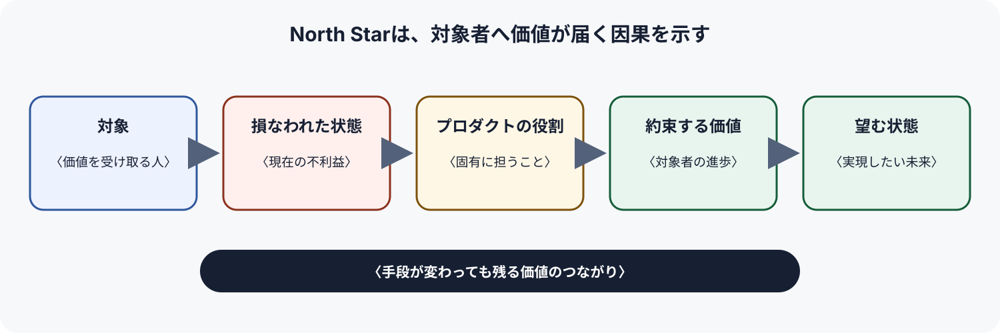
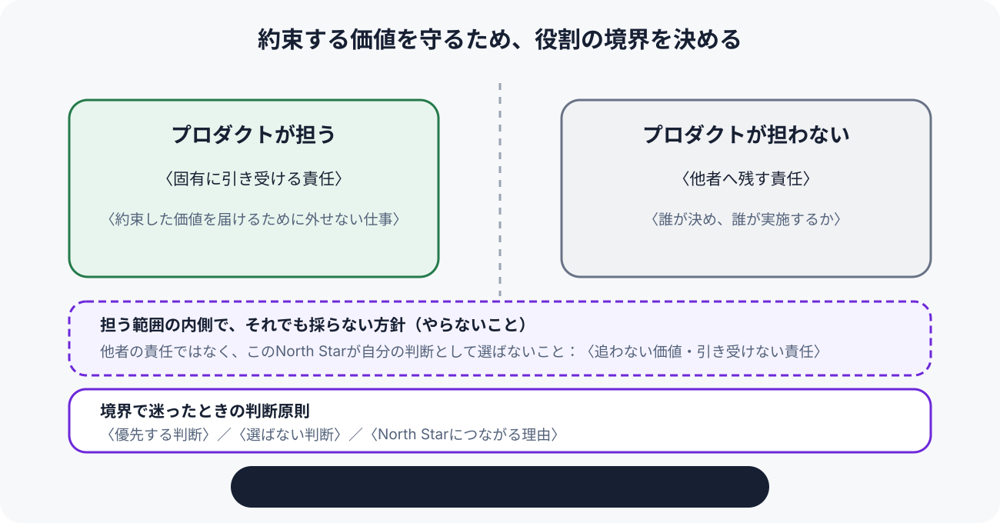

# Product North Star — <題材>

<!-- 執筆指示: 記載例を先に読む: [`../examples/north-star.example.md`](../examples/north-star.example.md)

     冒頭の一文で、いま損なわれている価値がどんな未来へ変わるかを言い切る。
     現状、課題、目指す状態、判断、根拠の流れは作るが、現在の障害に対する
     基本方針、資源配分、期限つき行動は書かない。節内はラベル付き箇条書きにせず、
     意味のある小見出しと本文で構成する。埋められない節も削らず、未確認である
     理由と確認方法を書く。 -->

> 型: Product North Star ／ 読み手: <長期のプロダクト判断を揃える人> ／ 観測時点: <YYYY-MM-DD>

**一言でいうと**: <誰の、どんな不利益や不自由を、どんな価値ある状態へ変えるのか>

## 対象

<!-- 書く: 価値を受け取る人、その人が置かれた場面。書かない: 市場全体を指す曖昧な「すべての人」。 -->

### 価値を受け取る人

<!-- 書く: 価値を直接受け取る人または組織。書かない: 関係者を区別しない広すぎる市場名。 -->

<誰のためのNorth Starか>

### その人が置かれた場面

<!-- 書く: 価値が損なわれる具体的な状況。書かない: 現在の機能や自社都合。 -->

<いつ、どんな状況で価値を必要とするか>

## 望む状態

<!-- 書く: プロダクトの実現手段が変わっても残る、対象者の行動・経験・関係の変化。書かない: 機能、売上目標、順位。 -->

### 現在損なわれている状態

<!-- 書く: 対象者が現在失っている自由、安心、判断可能性。書かない: 解決策を前提にした機能不足。 -->

<何ができず、どんな不利益が生じているか>

### 実現したい状態

<!-- 書く: 対象者の行動や経験が本質的にどう変わるか。書かない: システムの完成状態。 -->

<対象者にとって何が可能になるか>

<!-- この図は価値が届く論理を短時間で確かめるためのもの。本文に合わせて `north-star-value-flow.svg` の文言を置き換える。 -->

## 約束する価値

<!-- 書く: 対象者が得る価値と、価値が届いたと判断できる観測。書かない: 単一KPIを価値そのものとして扱うこと。 -->

### <もっとも重要な価値>

<!-- 書く: 対象者が得る進歩と観測できる変化。書かない: 機能名や抽象的な美辞麗句。 -->

<どんな価値が届き、何が変われば届いたと判断できるか>

### <両立させる価値>

<!-- 書く: 第一の価値だけを追うと損なわれる別の価値。書かない: 優先順位のない価値一覧。 -->

<何と何を両立させるのか>

## プロダクトの役割

<!-- 書く: その未来の実現に、このプロダクトだから担う部分。書かない: 社会全体や他者が担う仕事まで引き受けること。 -->

### このプロダクトが担うこと

<!-- 書く: 約束した価値を届けるための固有の役割。書かない: 実装方式や期限つき施策。 -->

<プロダクトが一貫して引き受ける責任>

### このプロダクトが担わないこと

<!-- 書く: 他者の責任として残す境界。書かない: 単に今期やらない施策。 -->

<社会、顧客、他事業者などが担う範囲>

<!-- この図は役割と判断の境界を短時間で確かめるためのもの。本文に合わせて `north-star-boundary.svg` の文言を置き換える。 -->

## 判断原則

<!-- 書く: 魅力的な二択で優先順位が分かれる原則。書かない: 何も捨てない標語。 -->

### <判断が必要になる二択>

<!-- 書く: どちらを優先し、何を選ばず、なぜNorth Starにつながるかを一続きで説明する。書かない: 優先・非選択・理由をラベル付き箇条書きに分解すること。 -->

<二つの魅力的な選択肢のうち、何を優先し、何を選ばず、なぜそう判断するのか>

### <別の判断が必要になる二択>

<!-- 書く: 別の迷いに対する一貫した選択。書かない: 常に正しいだけの一般論。 -->

<どちらを優先し、その選択が約束する価値をどう守るか>

## やらないこと

<!-- 書く: 魅力があっても、このNorth Starでは追わない対象・価値・責任。書かない: 一時的に後回しにする施策。 -->

### <追わない価値または引き受けない責任>

<!-- 書く: 境界と、その外側に置く理由。書かない: 理由のない禁止事項。 -->

<何をNorth Starの外へ置き、どこまでを境界とするか>

## 根拠と仮説

<!-- 書く: 現状と課題を支える事実、価値ある未来を支える仮説。事実には出典と観測時点、仮説には反証方法を付ける。書かない: 根拠のない断定。 -->

### 観測したこと

<!-- 書く: 出典と観測時点を示せる観測事実。書かない: 解釈や予測。 -->

<観測事実>（出典：<資料・発言・観測>、観測時点：<YYYY-MM-DD>）

### 現時点の見立て

<!-- 書く: 現時点で採用する説明または予測と反証方法。書かない: 確定した事実としての表現。 -->

<採用する説明または予測>。反証方法：<何をどう確かめるか>

## 見直し条件

<!-- 書く: どの事実・環境変化・価値判断が変わればNorth Starを再検討するか。書かない: 定例日だけの見直し。 -->

### <North Starを疑い直す変化>

<!-- 書く: 変化と確認方法。書かない: 期限が来たことだけを条件にすること。 -->

<どの変化が起きたら、何をどう確認して見直すか>

## 未決

<!-- 書く: North Starの解釈や境界を変え得る未確認事項、確認先、確認方法。書かない: 戦略や実装の詳細。 -->

### <判断を変え得る問い>

<!-- 書く: 問いと確認先・確認方法。書かない: North Starの境界を変えない実装上の疑問。 -->

<まだ答えがない問い>。確認先・方法：<誰に聞くか、何を観測するか>
