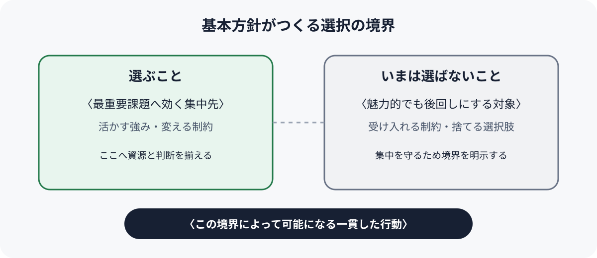
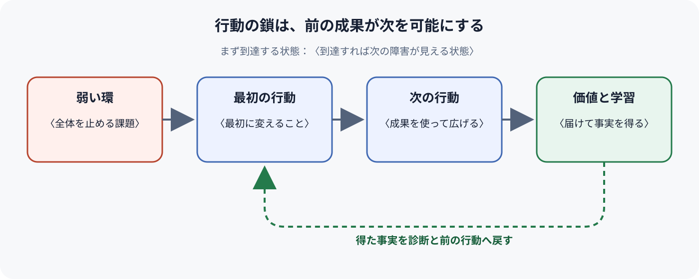

# Product Strategy — <題材>

<!-- 執筆指示: 記載例を先に読む: [`../examples/strategy.example.md`](../examples/strategy.example.md)

     診断、基本方針、一貫した行動の三つだけで戦略を説明する。最重要課題を
     選び、その課題への進み方を決め、互いにつながる少数の行動へ落とす。
     項目を埋めることより、前の判断から次の判断へ因果が読めることを優先する。 -->

> 型: Product Strategy ／ 読み手: <資源配分と行動を決める人> ／ 入力: <Product North Starと現在地> ／ 観測時点: <YYYY-MM-DD>

**一言でいうと**: <どの最重要課題に対し、何へ集中してNorth Starへ近づくか>

## 診断

<!-- 書く: North Starとの接続、現在起きている問題、前進を妨げる原因、もっとも弱い環、根拠と不確実性を一つの説明にする。書かない: 課題候補や調査結果の網羅的な一覧。 -->

<現在地からNorth Starまでを見渡し、なぜ一つの課題をいま選ぶのかを説明する>

### 観測したこと

<!-- 書く: 診断を支える観測事実と日本語の出典・観測時点。書かない: 推測を事実として断定した文。 -->

<事実>（出典：<資料・発言・観測>、観測時点：<YYYY-MM-DD>）

### 現時点の見立て

<!-- 書く: 現時点で採用する原因説明と反証方法。書かない: 確認不能な信念や施策案。 -->

<採用する説明>。反証方法：<何をどう確かめるか>

### まだ答えがない問い

<!-- 書く: 答えによって診断や方針が変わる問いと確認方法。書かない: 判断に影響しない疑問の一覧。 -->

<判断を変え得る問い>。確認先・方法：<誰に聞くか、何を観測するか>

## 基本方針

<!-- 書く: 診断した課題への全体的な進み方、集中すること、やらないこと、方針を変える条件。書かない: 抽象的な標語や施策の一覧。 -->

<活かせる強みと現実の制約を踏まえ、何を選び何を捨てるかを文章で示す>

### 集中すること

<!-- 書く: 最重要課題へ効く集中先と選ぶ理由。書かない: 重要そうな対象の網羅的な列挙。 -->

<資源を寄せる対象と、なぜそこへ集中するのか>

### やらないこと

<!-- 書く: 集中を守るためにいま選ばない対象と理由。書かない: 将来も永久に禁止するという断定。 -->

<魅力があっても資源を配らない対象と、その理由>

### 方針を見直す条件

<!-- 書く: 診断または方針を変える観測条件。書かない: 期限だけを理由にした定期見直し。 -->

<どの観測で診断または方針を変えるか>

<!-- この図は選択の境界を短時間で確かめるためのもの。本文に合わせて `strategy-choice.svg` の文言を置き換える。 -->

## 一貫した行動

<!-- 書く: 基本方針を実現する少数の行動を、前の行動が次を可能にする順で説明する。各行動は変えるものと成否の確かめ方が読めればよい。書かない: 責任・資源・順序などの記入欄を並べた作業分解。 -->

### 1. <最初に変えること>

<!-- 書く: 弱い環へ最初に働きかける行動、それによって次に可能になること、確かめ方。書かない: 単独では診断へ効かない作業。 -->

<何を変え、なぜ次の行動へつながるのか。どの状態になれば前進したと判断するか>

### 2. <次に可能になること>

<!-- 書く: 一つ前の成果を使って価値の到達範囲を広げる行動と確かめ方。書かない: 前の行動と無関係な要望。 -->

<何を変え、前の行動がなぜ必要なのか。どの状態になれば前進したと判断するか>

### 3. <価値を届けて学習を戻すこと>

<!-- 書く: 前二つの成果を利用者価値へつなぎ、得た事実を診断へ戻す行動。書かない: 遠い将来まで埋めたロードマップ。 -->

<何を変え、前の行動とどう補強し合うか。何を観測して次の診断へ戻すか>

<!-- この図は行動間の因果を短時間で確かめるためのもの。本文に合わせて `strategy-action-chain.svg` の文言を置き換える。 -->

### 行動のつながり

<!-- 書く: 前の成果が次を可能にし、学習が前段を強める因果。書かない: 矢印で結んだだけの作業順。 -->

<1が2を可能にし、2が3を可能にし、3の学習が1と2を強くする因果を一文で>

### まず到達する状態

<!-- 書く: 現在の能力で到達でき、達成後に次の障害が見える状態。書かない: 遠い最終目標の言い換え。 -->

<現在の能力で手が届き、到達すれば次の障害が見える状態>
