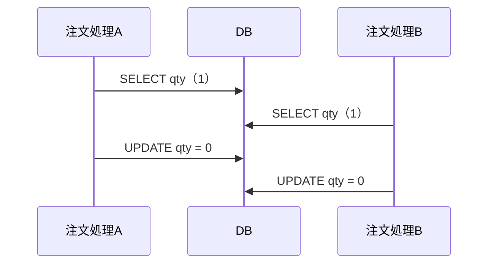

# Markdown で出す

## 強調

| | 書き方 |
|---|---|
| 要点 | `**太字**` |
| キーワード | `` `バッククォート` `` |

受け取った役だけを変換し、強調箇所を選び直さない。

## 図

**Mermaid を第一候補にする。** 受け取った図の型を Mermaid の記法へ写し、```` ```mermaid ```` の fenced code block として本文へ直接置く。図の直前に図の主張を1文置く。

| 受け取る図の型 | Mermaid |
|---|---|
| 構成図・地図、依存関係図・層図、包含図・境界図、ツリー | `flowchart`（`subgraph` で境界・層を作る） |
| 制御フロー、データフロー、画面遷移・ユーザーフロー | `flowchart` |
| シーケンス図 | `sequenceDiagram` |
| 状態遷移図 | `stateDiagram-v2` |
| ER・データモデル図 | `erDiagram` |
| タイムライン | `timeline` または `gantt` |
| 2軸マトリクス | `quadrantChart` |
| 棒・線グラフ | `xychart-beta` |
| before / after | 同じ配置の `flowchart` を2つ並べる |

````markdown
AとBの読みと書きが交互に並ぶと、両方が在庫1を見て両方が注文を作る。


````

**Mermaid で表現しきれない図は画像にする。** 外部の `.svg` または `.png` を作り、`` のように相対パスで参照する。画像にするのは次の場合だけである。

- 要素の位置・面積・距離そのものに意味があり、自動配置では主張が崩れる（配置固定の構成図、スイムレーン、環境帯）
- 凡例・Scope・注記を図と一体で読ませる資料品質の図
- 注釈付き画像、写真、スクリーンショット
- 散布図など、Mermaid のグラフ型では数値を正しく面積・位置へ写せないもの

**インライン SVG を書かない。** 多くの Markdown ビューアが描画しない。

**枚数に上限を設けない。** 図の工程が採った図はすべて写す。図を表や文章へ置き換えない。

Mermaid を書くときの注意。

- 表示文字列に `(` `)` `[` `]` `{` `}` `|` `"` を含めるときは `"..."` で囲む。
- ノード ID は英数字にし、表示文字列は日本語で書く。
- 1図に1つの問い。ノードが増えて読めないなら図を分ける。

## 段落

受け取った段落境界を空行へ写す。単なる改行へ縮退させない。

## 表

- 桁揃えのために空白を詰めない（読み手はレンダリング後を見る）。

## リンク

- パスは**その文書からの相対パス**にする。
- スペースや記号を含むパスは `<...>` で囲む。

## 写像後の機械検査

- [ ] 受け取った段落境界が空行になっている
- [ ] 図が ```` ```mermaid ```` ブロックか外部画像参照になっている（インライン SVG が無い）
- [ ] Mermaid ブロックが閉じていて、記法の種類（`flowchart` など）で始まっている
- [ ] 文書内 path が相対リンクになっている
