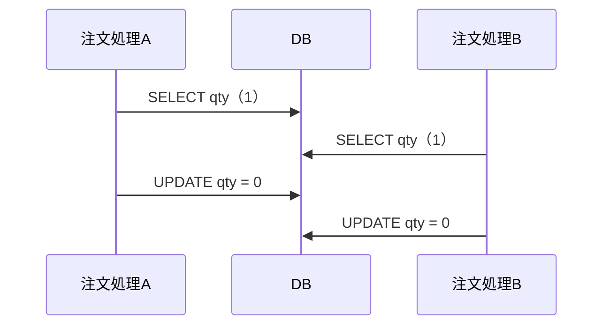

# Markdown で出す

**この文書が、意味上の役から Markdown の記法への対応表の正本である。** `writing-rules` が付与済みの役だけ、`visual-guidance` から受け取る図だけを写し、役の選択・個数・位置・図の採否と型は判断しない。

## 強調

本文中の役の印（`⟦要点: …⟧` / `⟦キーワード: …⟧`。記法の定義は write-doc の役の契約）を次へ写す。

| 印 | 書き方 |
|---|---|
| `⟦要点: …⟧` | `**太字**` |
| `⟦キーワード: …⟧` | `` `バッククォート` `` |

受け取った印だけを変換し、強調箇所を選び直さない。冒頭の要点や文書全体の主張は、見出しと段落として受け取るので、札や枠を付けて写さない。

## 図

図の主張・図の型・図の内容は `visual-guidance` から受け取る。画像にするかも図の工程が決めており、ここでは判断しない。

| 意味上の役 | Markdown |
|---|---|
| 図の主張 | 図の直前の1文 |
| 図の型 | Mermaid の記法の種類へ写す。型名そのものは表示しない |
| 図の内容 | ```` ```mermaid ```` ブロック。画像として受け取った図は外部画像を相対パスで参照 |

受け取った図の型を Mermaid の記法へ写し、```` ```mermaid ```` の fenced code block として本文へ直接置く。

| 受け取る図の型 | Mermaid |
|---|---|
| 構成図・地図、依存関係図・層図、包含図・境界図、ツリー | `flowchart`（`subgraph` で境界・層を作る） |
| 制御フロー、データフロー、画面遷移・ユーザーフロー | `flowchart` |
| シーケンス図 | `sequenceDiagram` |
| 状態遷移図 | `stateDiagram-v2` |
| ER・データモデル図 | `erDiagram` |
| タイムライン | `timeline` または `gantt` |
| 2軸マトリクス | `quadrantChart` |
| 比較図 | 同じ配置の `flowchart` を並べ、差分を色で示す |
| 棒・線グラフ | `xychart-beta` |
| 散布・積み上げ、注釈付き画像 | Mermaid に対応する記法が無い。画像として受け取る（下記） |
| before / after | 同じ配置の `flowchart` を2つ並べる |

````markdown
AとBの読みと書きが交互に並ぶと、両方が在庫1を見て両方が注文を作る。


````

**画像として受け取った図は、`<資料名>.assets/<図の名前>.svg`（または `.png`）に置き、`` と相対パスで参照する。** `<資料名>` は保存する Markdown の拡張子を除いた名前。`<図の名前>` は、型の固定図（content-types のカタログ「固定図を持つ型」）ならテンプレートのファイル名、それ以外は本文での登場順の `fig-NN` である。画像ファイルは、保存工程が返した path と同じ directory に write-doc が置く。SVG 内の色は属性で直接指定する。

**インライン SVG を書かない。** 多くの Markdown ビューアが描画しない。

図の工程が採った図はすべて写す。図を表や文章へ置き換えず、受け取った図中文言を変更しない。

Mermaid を書くときの注意。

- 表示文字列に `(` `)` `[` `]` `{` `}` `|` `"` を含めるときは `"..."` で囲む。
- ノード ID は英数字にし、表示文字列は日本語で書く。
- 1図に1つの問い。ノードが増えて読めないなら図を分ける。

## 段落

受け取った段落境界を空行へ写す。単なる改行へ縮退させない。

## 表

- 桁揃えのために空白を詰めない（読み手はレンダリング後を見る）。

## リンク

- パスは**その文書からの相対パス**にする。
- スペースや記号を含むパスは `<...>` で囲む。

## 写像後の確認

- [ ] 受け取った段落境界が空行になっている
- [ ] 役の印（`⟦…⟧`）が残っていない
- [ ] 図が ```` ```mermaid ```` ブロックか外部画像参照になっている（インライン SVG が無い）
- [ ] Mermaid ブロックが閉じていて、記法の種類（`flowchart` など）で始まっている
- [ ] 文書内 path が相対リンクになっている
