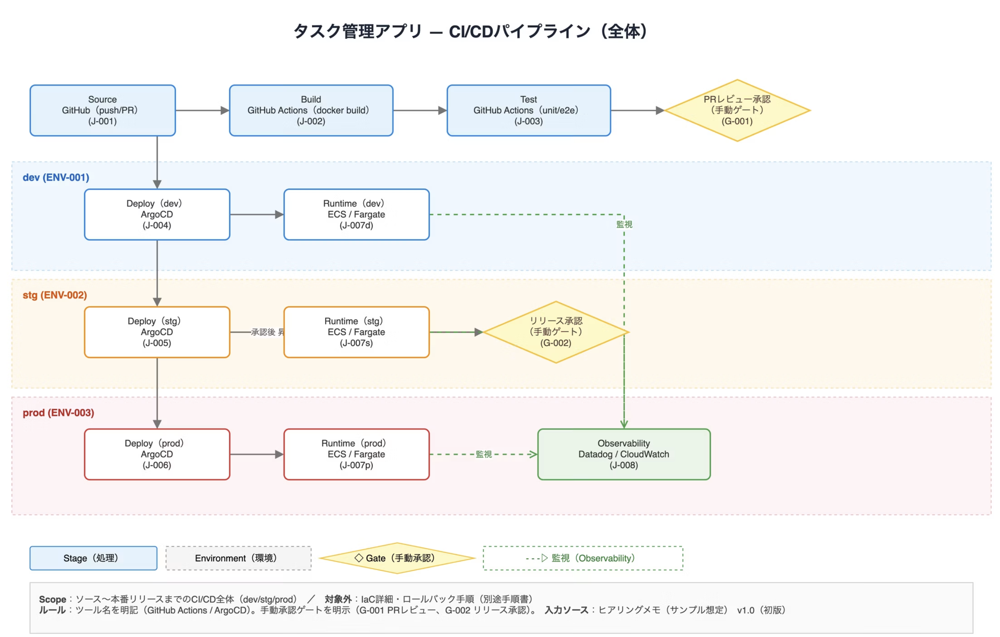
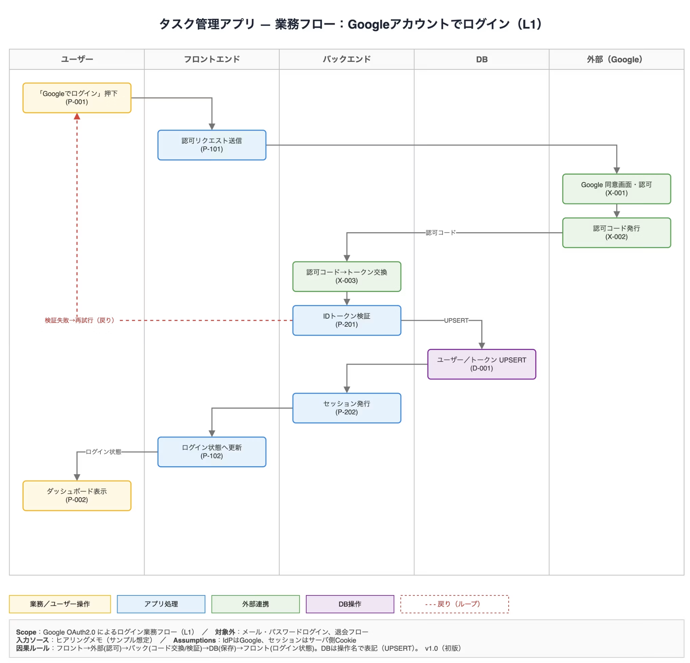
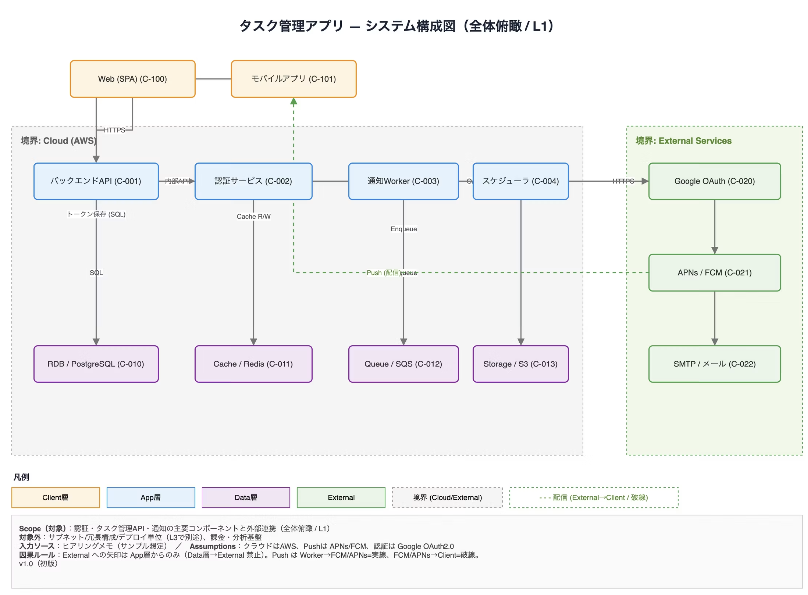

# 画像で作る技術図

同梱の参考画像は[drawio-diagram-skills](https://github.com/enomoso-pm/drawio-diagram-skills)の作例であり、[MIT License](../assets/LICENSE.drawio-diagram-skills)に従って配布する。内容の正本ではなく、余白、整列、境界、凡例の視覚的な参考として使う。

## 画像生成を選ぶ条件

次のうち2つ以上を満たす技術図は、コードネイティブな自動配置より、参考画像を使った画像生成を優先する。

- 境界、環境帯、スイムレーンなど、要素の位置そのものが意味を持つ
- 凡例、Scope、前提、対象外、版を図と一体で読ませる
- 線の経路や交差回避、ノードの整列が読みやすさを左右する
- 手動ゲート、戻りループ、監視経路など、線種と図形を同時に区別する
- 設計書、説明資料、レビュー資料として、初見で読める完成図が必要である

単純なノードとエッジ、差分管理する原稿、頻繁に内容を更新する図はコードネイティブな図を使う。数値の正確な比較は画像生成ではなくグラフを使う。

## 図種別と参考画像

### CI/CDパイプライン



- 16:9の横長。上段へSource、Build、Test、PR承認を左から右へ置く。
- dev / stg / prodを横長の環境帯として縦に積み、DeployとRuntimeを整列する。
- 手動承認はひし形、監視は緑の破線とし、下端へ凡例とScopeを置く。

### 業務フロー（スイムレーン）



- 主体ごとに等幅の縦レーンを作り、時間を上から下へ流す。
- 業務操作、アプリ処理、外部連携、DB操作を色と凡例で対応させる。
- 戻りは赤の破線に限定し、ラベルへ戻る理由を書く。DBは`UPSERT`など操作名で示す。

### システム構成図



- Client、Cloud、Externalの境界を分け、Appを上段、Dataを下段へ揃える。
- 線へ方向とプロトコルを付ける。外部サービスへの要求はApp層から出す。
- PushはWorkerから外部までを実線、外部からClientへの配信を破線にする。

画面遷移図、体制図、ER図、シーケンス図も、固定レイアウトや注記が重要なら最も近い参考画像の余白、整列、凡例、Scope欄だけを参照する。意味上の図形や線種は対象の図型に合わせ、参考画像から転用しない。

## 画像生成へ渡す仕様

提供画像は編集対象ではなく、**レイアウトと視覚階層の参考画像**として扱う。対象図に合う最小の1枚だけを渡す。生成前に要素・接続・表示文字列を確定し、次の順で指定する。

```text
Use case: productivity-visual
Asset type: engineering design-document diagram
Primary request: <図の主張と図種別>
Input images: Image 1: layout and visual-hierarchy reference, not an edit target
Style/medium: clean vector-like technical diagram, white background, crisp Japanese typography
Composition/framing: <横長または縦長、境界・レーン・読む方向>
Text (verbatim): <タイトル、全ノード、全エッジ、凡例、Scope、前提、対象外、版>
Constraints: factual content only; preserve every connection and arrow direction; no extra nodes; readable at document width; no watermark
Avoid: tiny text; crossing labels; decorative icons; gradients; 3D; unlabeled colors or dashed lines
```

表示文字列は引用符で囲み、珍しい識別子は1文字ずつ指定する。1枚がノード40、エッジ60を超えるなら生成せず、意味の境界で分割案を返す。

## 生成後の照合

1. タイトル、ID、ツール名、全ラベルが入力と一字一句一致する。
2. ノード数、エッジ数、矢印方向が設計と一致し、要素の追加・欠落がない。
3. Scope、前提、対象外、版、凡例があり、線種と色の意味が一意である。
4. 文字、線、矢印、境界が重ならず、資料幅で読める。
5. 一度に直す点を1つに絞って再生成し、重要な制約を毎回繰り返す。
