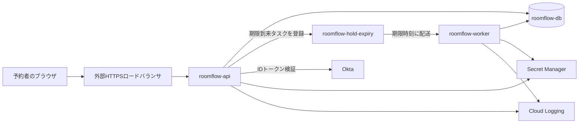

# システム構成 — RoomFlow 予約サービス

<!-- これは`architecture`型の記載例である。**構成の基準資料ではなく、粒度と具体性の見本として読む。**
     RoomFlowは組織内の共用会議室を予約する架空のサービスで、プロジェクトID・リージョン・値はすべて説明用である。実在の構成を確認したものではない。 -->

RoomFlowは、Cloud Run上のAPIとワーカーがCloud SQL（PostgreSQL）を共有して動く。利用者からの入口はロードバランサである。非同期に処理するのは仮押さえの期限切れだけで、Cloud Tasksを経由する。外へ出る通信は、組織のIDプロバイダ（Okta）へのものだけである。

## 目的と範囲

- 対象: RoomFlow 予約サービス（API、期限処理ワーカー、データベース、入口）。本番と検証の2環境
- 観測時点: 2026-08-28。Google Cloud コンソールと `infra/` のTerraform定義で照合した
- 含めない: 組織のIDプロバイダ（Okta）の内部、会議室の入退室記録システム（別チーム所管。[入退室連携の資料](how-to.example.md)へ）

## 全体構成

## 構成要素

利用者のWebリクエストを処理する `roomflow-api` と、期限切れのタスクを処理する `roomflow-worker` は、別々のコンテナとして Cloud Run 上で動く。二つを分けてあるのは、Webからのリクエストが急に増えたときにも、期限切れ処理の負荷で同期APIの応答が遅れないようにするためである。

| 要素 | 役割（一文） | 実行場所 | 技術・製品 | 所有者 |
|---|---|---|---|---|
| 外部HTTPSロードバランサ | 利用者からのHTTPSを受け、`roomflow-api`へ転送する | Google Cloud `roomflow-prod`、グローバル | Cloud Load Balancing、マネージド証明書 | 予約チーム |
| roomflow-api | 予約の作成・確定・取消・空き検索を受け付け、期限到来タスクを登録する | Cloud Run、`asia-northeast1` | Go 1.24、コンテナは`roomflow-api:<git sha>` | 予約チーム |
| roomflow-worker | 期限到来タスクを受け取り、未確定の仮押さえ予約を期限切れにする | Cloud Run、`asia-northeast1`、外部からは到達不可 | Go 1.24、コンテナは`roomflow-worker:<git sha>` | 予約チーム |
| roomflow-hold-expiry | 仮押さえ成立から15分後に配送するタスクの待ち行列 | Cloud Tasks、`asia-northeast1` | Cloud Tasks キュー | 予約チーム |
| roomflow-db | 予約・予約待ち・顧客の予約資格の現在の姿と、成立した業務イベントを保持する | Cloud SQL、`asia-northeast1`、プライベートIPのみ | PostgreSQL 16、`db-custom-2-8192` | 予約チーム |
| Secret Manager | DB接続文字列とOktaのクライアント秘密を保持する | Google Cloud `roomflow-prod` | Secret Manager | 予約チーム |
| Okta | 予約者の認証。IDトークンを発行する | 組織共通（所管外） | OIDC | 情報システム部 |
| Cloud Logging | アクセスログとアプリケーションログを保持する | Google Cloud `roomflow-prod`、`asia-northeast1` | Cloud Logging | 予約チーム |

### roomflow-api は利用者の要求を同期で受け、期限のタスクを登録する

予約者のブラウザから来る予約の作成・確定・取消を受け付け、Cloud SQL と直接やり取りする。Go 1.24 で書かれ、Cloud Run 上で動き、リクエストをまたぐ状態を内部に持たない。仮押さえが成立したときは、自分でタイマーを持たずに、失効のタスクを Cloud Tasks へ登録する。

### roomflow-worker は外から呼べない

外部から入ってくる通信を受け付けない、内部専用の Cloud Run サービスである。Cloud Tasks からタスクが push されると動き出し、確定していない仮押さえを安全に「期限切れ」の状態へ移す。

### roomflow-db

Cloud SQL 上の PostgreSQL 16 のインスタンスである。行ロックで同じ予約枠の重複を防ぎ、成立した業務イベントを記録する。プライベートIPだけで構成しているので、インターネットから直接は到達できない。

## 非同期なのは期限切れの経路だけ

APIからワーカーへの受け渡しには Cloud Tasks を使う。仮押さえから15分後に期限が来たことを非同期のタスクとして配送するので、データベースを定期的に見に行く処理（ポーリング）が要らない。その分、DBのCPU負荷とロックの競合を小さく抑えられる。

| 呼ぶ側 → 呼ばれる側 | 経路 | 認証 | 相手が応答しないとき |
|---|---|---|---|
| 予約者のブラウザ → 外部HTTPSロードバランサ | 同期HTTPS | OktaのIDトークン（Bearer） | 利用者に「接続できない」を表示する |
| 外部HTTPSロードバランサ → roomflow-api | 同期HTTP（内部） | ロードバランサのサービスアカウントからのみ受ける | 503を返す。再試行はブラウザ側 |
| roomflow-api → roomflow-db | 同期、Cloud SQL Auth Proxy経由のプライベートIP | IAMデータベース認証 | 要求を失敗させ、予約は作らない。部分的な書き込みを残さない |
| roomflow-api → roomflow-hold-expiry | タスク登録（非同期） | サービスアカウント `roomflow-api@` | 登録に失敗したら仮押さえ自体を失敗させる。期限の無い仮押さえを作らない |
| roomflow-hold-expiry → roomflow-worker | HTTP push、期限時刻に配送 | OIDCトークン（`roomflow-tasks@`） | 配送失敗は最大5回、指数バックオフで再試行する。5回失敗したタスクはキューに残り、日次の点検で拾う |
| roomflow-worker → roomflow-db | 同期、プライベートIP | IAMデータベース認証 | タスクを失敗扱いにし、Cloud Tasksの再試行に委ねる |
| roomflow-api → Okta | 同期HTTPS（トークン検証は公開鍵を1時間キャッシュ） | クライアントID・秘密 | キャッシュ内の公開鍵で検証を続ける。キャッシュ切れなら401 |

## データの置き場

| データ | 置き場 | 保持 | 復元の手段 |
|---|---|---|---|
| 予約・予約待ち・顧客の予約資格・業務イベント | roomflow-db（PostgreSQL） | 無期限。取消済み・期限切れも残す | 日次の自動バックアップ（7世代）とポイントインタイムリカバリ（7日） |
| 期限到来タスク | roomflow-hold-expiry（Cloud Tasks） | 配送完了まで。最長15分＋再試行 | 復元しない。DBの仮押さえ期限から再登録できる（[期限タスクを再登録する](how-to.example.md)） |
| 秘密情報 | Secret Manager | 版ごとに保持 | Secret Managerの版から戻す |
| アクセスログ・アプリケーションログ | Cloud Logging | 30日 | 復元しない |

論理データモデルは[貸会議室予約のRDB論理設計](rdb-logical-data-modeling.example.md)、業務の決まりは[貸会議室予約の業務知識・コアドメイン](domain-rule.example.md)が参照元である。この資料はそれらを繰り返さない。

## 環境

本番は `roomflow-prod` で、`https://roomflow.example.com` から到達する。検証は `roomflow-stg` で、`https://stg.roomflow.example.com` から組織内のIPに限って到達できる。検証が本番と違うのは、Cloud SQLが`db-custom-1-3840`であること、バックアップの世代が3であること、Oktaが検証テナントであることだけで、それ以外は同じである。

## 単一リージョンで動き、同時受付の上限は推定150〜200件/分

| 制約 | 値・条件 | 変えるときに影響する要素 |
|---|---|---|
| 同時受付 | 実測80件/分、推定上限150〜200件/分 | roomflow-api、roomflow-db |
| 仮押さえ期限の精度 | 期限時刻から配送まで最大60秒の遅れを許容する（Cloud Tasksの配送遅延を含む） | roomflow-hold-expiry、roomflow-worker |
| 可用性 | 単一リージョン。リージョン障害では停止する | すべて |
| セキュリティ境界 | roomflow-dbとroomflow-workerは外部から到達できない。外へ出る通信はOktaだけ | 外部HTTPSロードバランサ、roomflow-api |
| データの所在 | すべて`asia-northeast1` | roomflow-db、Cloud Logging |

同時受付の実測値は、2026年8月の1か月についてCloud Loggingを1分単位で集計した最大値である。推定上限は、1インスタンスあたり15〜20件/分の実測と最大10インスタンスから算出した。

## 未決

- 同時受付が150件/分を超えたときの振る舞い。影響する要素: roomflow-api、roomflow-db。負荷試験の結果で「推定」を実測に置き換えれば確定する
- リージョン障害時の目標復旧時間。影響する要素: すべて。運用責任者が判断する。決まるまでは「停止する」のままとする

## この資料に書かないもの

| 書かないこと | 検討先 |
|---|---|
| なぜCloud Tasksで期限処理をするか | [ADR](adr.example.md) |
| デプロイ・復旧・期限タスクの再登録の手順 | [ハウツーガイド](how-to.example.md) |
| テーブル定義・論理データモデル | [RDB論理設計](rdb-logical-data-modeling.example.md) |
| 業務の決まり | [業務知識・コアドメイン](domain-rule.example.md) |
