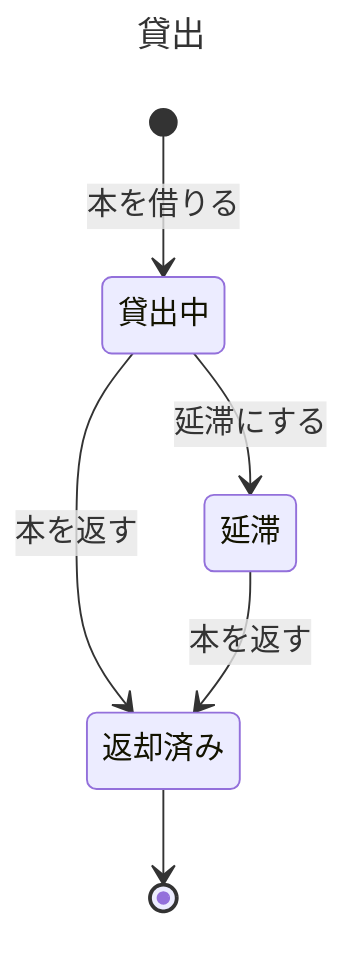

# 図書館の貸出の業務知識

図書館の窓口と利用者が、本を貸してよいか、いつまでに返すか、いつ延滞になるかを同じ言葉で判断するための業務知識である。貸出は利用者が本を借りたときに始まり、本が返されたときに終わる。

# 概要

図書館の貸出は、限られた蔵書を多くの利用者へ順に行き渡らせるために、一冊の本を一人の利用者へ期限付きで預ける業務である。利用者は本を借り、返却期限までに返す。一人が抱え込める冊数に上限を設け、返さないまま期限を過ぎた利用者には新しい本を貸さない。そうしなければ、本が一部の利用者の手元に留まり、ほかの利用者が借りられなくなるからである。

利用者の登録と利用者カードの発行は利用者登録の業務が、本の受け入れと除籍は蔵書管理の業務が担う。この業務は、登録済みの利用者と所蔵している本を所与として扱う。延滞を利用者へ知らせる手段は、この業務の決まりではない。

# ユビキタス言語

業務の言葉と英名の対応は次のとおりである。英名は業務の言葉を英語にした名前で、実装の名前はこれに従う。業務イベントは起きたことなので、英名も過去形にする。

| 業務の言葉 | 英名 | 種類 | 持ち主 |
|---|---|---|---|
| 利用者 | User | 業務用語 | この資料 |
| 利用者番号 | UserNumber | 業務用語 | この資料 |
| 本 | Book | 業務用語 | この資料 |
| 資料番号 | BookNumber | 業務用語 | この資料 |
| 貸出 | Loan | 業務用語 | この資料 |
| 貸出日時 | LentAt | 業務用語 | この資料 |
| 返却期限 | DueDate | 業務用語 | この資料 |
| 判定日時 | CheckedAt | 業務用語 | この資料 |
| 貸出上限 | LoanLimit | 業務用語 | この資料 |
| 貸出状況 | BorrowerStanding | 業務用語 | この資料 |
| 借りている冊数 | BorrowingCount | 業務用語 | この資料 |
| 本を借りた | LoanLent | 業務イベント | この資料 |
| 本を返した | LoanReturned | 業務イベント | この資料 |
| 延滞にした | LoanMarkedOverdue | 業務イベント | この資料 |
| 本を借りる | BorrowBook | コマンド | この資料 |
| 本を返す | ReturnBook | コマンド | この資料 |
| 延滞にする | MarkOverdue | コマンド | この資料 |
| 借りている本を確かめる | ListBorrowedBooks | クエリ | この資料 |
| 延滞にする貸出を探す | FindLoansToMarkOverdue | クエリ | この資料 |

## 業務用語

### 利用者

図書館に登録し、利用者カードを持つ人である。本を借りられるのは利用者だけである。

### 利用者番号

利用者カードに記された、利用者を一人に特定する番号である。この番号で、誰の貸出かが決まる。

### 本

図書館が所蔵する一冊の本である。同じ書名でも、一冊ごとに別の本として扱う。

### 資料番号

本の一冊ごとに付いた番号である。この番号で、どの一冊の貸出かが決まる。

### 貸出

一人の利用者が一冊の本を借りてから返すまでの約束である。まとめて借りても、冊数だけ貸出がある。

### 貸出日時

本を借りた日時である。返却期限は、この日時の日から数える。

### 返却期限

本を返す約束の日で、借りた日の14日後である。貸したときに決まり、この日を過ぎても返されなければ延滞になる。

### 判定日時

図書館が貸出を延滞にするかを判断する日時である。その日が返却期限の翌日以降なら延滞にする。

### 貸出上限

一人の利用者が同時に借りていられる冊数の上限で、5冊である。

### 貸出状況

一人の利用者がいま借りている冊数と、延滞している貸出があるかである。本を借りるときに、貸出上限と延滞を判断するために使う。

### 借りている冊数

一人の利用者の、貸出中と延滞の貸出の数である。

## 業務イベント

### 本を借りた

利用者が一冊の本を借りた。貸出中の貸出が生まれ、その本はほかの利用者へ貸せなくなる。

### 本を返した

貸出中か延滞の本が返された。貸出は返却済みになり、本はほかの利用者へ貸せるようになる。

### 延滞にした

返却期限を過ぎても本が返されていなかったので、図書館が貸出を延滞にした。その利用者は新しく借りられなくなる。

# 概念

## 貸出

貸出は、一人の利用者と一冊の本の間の、返却期限付きの約束である。借りたときに始まり、本が返されると終わる。返却期限は借りたときに決まり、貸出の間は変わらない。返却期限を過ぎても返されない貸出は延滞になるが、延滞になっても本を返せば約束は終わる。

## 貸出状況

貸出状況は、一人の利用者が今どれだけ借りていて、返していない延滞があるかという、その時点の事実である。一つの貸出の中には無く、利用者の貸出をすべて見て初めて分かる。本を借りられるかは、この貸出状況で決まる。

# 常に守られること

### 一冊の本は、同時に一つの貸出中か延滞の貸出にしか属さない

破れると、手元に無い本を貸したことになり、誰が持っているか分からなくなる。

### 一人の利用者の貸出中と延滞の貸出は、合わせて5冊を超えない

上限が無ければ、一部の利用者が本を抱え込み、ほかの利用者が借りられなくなる。

### 返却期限は借りた日の14日後で、貸出の間変わらない

期限が途中で変わると、利用者と図書館は、いつ延滞になるかを同じように判断できなくなる。

### 返却済みの貸出は変わらない

終わった約束が蒸し返されると、本の所在が分からなくなる。

### 誰がどの本をいつ借り、いつ返し、いつ延滞になったかを、後から説明できる

利用者が「期限内に返した」と言ったとき、窓口はその貸出に起きたことを順に示して答える。説明できなければ、延滞で貸出を止めた判断を利用者に示せない。

# 状態と、その移り変わり

## 貸出は返却で終わり、延滞からも返せる



返却済みは終わりの状態で、そこから移ることはない。

# 業務の行い

## コマンド

### 本を借りる

利用者本人だけが借りられる。借りた責任を負う人が分からなくならないようにするためである。

借りられるのは、延滞の貸出が一つも無く、借りている冊数が貸出上限の5冊未満で、その本がほかの貸出中か延滞の貸出に属していないときである。4冊借りていれば5冊目は借りられ、5冊借りていれば6冊目は借りられない。借りると貸出中の貸出が生まれ、「本を借りた」が起きる。貸出日時は借りた日時、返却期限はその日の14日後である。

#### 拒む理由: 他人の利用者カードで本を借りる

他人のカードで借りると、返さなかったときに責任を負うのがカードの持ち主になり、実際に借りた人に返すよう求められない。

#### 拒む理由: 延滞の貸出がある利用者が本を借りる

返していない延滞がある利用者に新しい本を貸すと、延滞したまま手元の本が増え続ける。

#### 拒む理由: 貸出上限に達している利用者が本を借りる

5冊を超えて貸すと、一人が本を抱え込み、ほかの利用者が借りられなくなる。

#### 拒む理由: 貸出中の本を借りる

手元に無い本は貸せない。

### 本を返す

本を持ってきた人なら誰でも返せる。本が戻れば約束は果たされるからである。

貸出中か延滞の貸出の本を返せる。延滞していても返却は受け付ける。返すと貸出は返却済みになり、「本を返した」が起きる。延滞の貸出を返し、ほかに延滞が無くなれば、その利用者はすぐに新しく借りられる。

#### 拒む理由: 返却済みの本を返す

返却済みの貸出は終わった約束で、変わらない。

### 延滞にする

図書館が行う。利用者が自分で延滞にすることはない。

判定日時の日が返却期限の翌日以降で、貸出がまだ貸出中なら、延滞にする。返却期限の当日はまだ延滞にしない。延滞にすると「延滞にした」が起きる。

#### 拒む理由: 返却期限を過ぎていない貸出を延滞にする

返却期限の当日までは約束の期間内である。その利用者を延滞として貸出停止にすると、約束を守っている人の利用を止めてしまう。

## クエリ

### 借りている本を確かめる

利用者本人だけが、自分の借りている本を確かめられる。他人の借りている本を知らせると、誰が何を読んでいるかが漏れる。

見せるのは、その利用者の貸出中と延滞の貸出のそれぞれについて、本の資料番号、返却期限、延滞かどうかである。返却済みの貸出は見せない。返却期限の近い順に並べ、同じ返却期限なら先に借りた本を先にする。期限の迫った本から返せるようにするためである。一冊の貸出だけが確かめられないときは、その一冊を除いた残りを見せる。貸出を一つも確かめられないときは、借りている本が無いとは見せず、確かめられなかったと伝える。

#### 拒む理由: 他人の借りている本を確かめる

誰が何を読んでいるかは、その本人のものである。

### 延滞にする貸出を探す

図書館が行う。

判定日時の日が返却期限の翌日以降で、まだ貸出中の貸出をすべて探す。延滞と返却済みの貸出は含めない。探した貸出を並べる順と一度に探す件数は、どの貸出を延滞にするかを変えないので、延滞にする処理の品質要求に置く。

# 導出されること

返却期限は、借りた日に14日を足した日である。借りている冊数は、その利用者の貸出中と延滞の貸出の数である。

# 同時に起きたとき

### 延滞にするのと本が返されるのが同じ貸出で重なる

先に起きた方が通る。返却が先なら延滞にしない。返却済みの貸出は変わらないからである。

### 同じ本を二人の利用者が借りる

先に受け付けた一人だけが借りられる。一冊の本は一つの貸出にしか属さないからである。

### 同じ利用者が5冊目と6冊目を同時に借りる

貸せるのは、先に受け付けた一冊だけである。貸出上限を超えて貸さないからである。

# まだ決まっていないこと

貸出の延長を認めるかは決まっていない。認めるなら返却期限が変わるので、「返却期限は借りた日の14日後で、貸出の間変わらない」を見直す。

# BDD

ここまでの決まりが、具体の場面でどう働くかを示す。**ここに上で書いていない決まりを持ち込まない。**

## 本を借りる

### [BDD-001] 延滞の無い利用者が本を借りると貸出中の貸出が生まれる

```gherkin
Given: 利用者番号 U-0001 の利用者は本を1冊も借りておらず、延滞の貸出も無い
  And: 資料番号 B-1001 の本はどの貸出にも属していない
When: 利用者 U-0001 が2026年10月1日 10:00に本 B-1001 を借りる
Then: 利用者 U-0001 と本 B-1001 の貸出が貸出中で生まれる
  And: 貸出日時は2026年10月1日 10:00、返却期限は2026年10月15日である
```

### [BDD-002] 4冊借りている利用者は5冊目を借りられる

```gherkin
Given: 利用者 U-0001 は貸出中の本を4冊借りており、延滞の貸出は無い
  And: 本 B-1005 はどの貸出にも属していない
When: 利用者 U-0001 が2026年10月1日に本 B-1005 を借りる
Then: 本 B-1005 の貸出が貸出中で生まれ、利用者 U-0001 の借りている冊数は5冊になる
```

### [BDD-003] 5冊借りている利用者は6冊目を借りられない

```gherkin
Given: 利用者 U-0001 は貸出中の本を5冊借りており、延滞の貸出は無い
  And: 本 B-1006 はどの貸出にも属していない
When: 利用者 U-0001 が2026年10月1日に本 B-1006 を借りる
Then: 貸出は生まれない
  NOTE: Rule: 貸出上限に達している利用者が本を借りる
    Reason: 一人の利用者の貸出中と延滞の貸出は5冊を超えない
```

### [BDD-004] 延滞の貸出がある利用者は本を借りられない

```gherkin
Given: 利用者 U-0002 は延滞の貸出を1冊持ち、借りている冊数は1冊である
  And: 本 B-1007 はどの貸出にも属していない
When: 利用者 U-0002 が2026年10月20日に本 B-1007 を借りる
Then: 貸出は生まれない
  NOTE: Rule: 延滞の貸出がある利用者が本を借りる
    Reason: 返していない延滞がある利用者には新しい本を貸さない
```

### [BDD-005] ほかの利用者に貸出中の本は借りられない

```gherkin
Given: 本 B-1001 は利用者 U-0001 に貸出中である
  And: 利用者 U-0003 は本を1冊も借りておらず、延滞の貸出も無い
When: 利用者 U-0003 が2026年10月2日に本 B-1001 を借りる
Then: 貸出は生まれない
  NOTE: Rule: 貸出中の本を借りる
    Reason: 一冊の本は同時に一つの貸出にしか属さない
```

### [BDD-006] 他人の利用者カードでは本を借りられない

```gherkin
Given: 利用者 U-0003 が利用者 U-0001 の利用者カードを差し出している
  And: 本 B-1008 はどの貸出にも属していない
When: 利用者 U-0003 が利用者 U-0001 として本 B-1008 を借りる
Then: 貸出は生まれない
  NOTE: Rule: 他人の利用者カードで本を借りる
    Reason: 借りた責任を負う人が分からなくなる
```

## 本を返す

### [BDD-007] 貸出中の本を返すと返却済みになる

```gherkin
Given: 本 B-1001 は利用者 U-0001 に貸出中で、返却期限は2026年10月15日である
When: 2026年10月10日に本 B-1001 が返される
Then: 貸出は返却済みになる
  And: 本 B-1001 はほかの利用者が借りられる
```

### [BDD-008] 延滞の本を返すと返却済みになり、すぐに借りられる

```gherkin
Given: 本 B-1002 は利用者 U-0002 の延滞の貸出で、利用者 U-0002 のほかの貸出に延滞は無い
When: 2026年10月20日に本 B-1002 が返される
Then: 貸出は返却済みになる
  And: 利用者 U-0002 は同じ日に新しく本を借りられる
```

### [BDD-009] 返却済みの貸出の本は返せない

```gherkin
Given: 本 B-1001 の利用者 U-0001 の貸出は返却済みである
When: 利用者 U-0001 の貸出として本 B-1001 が返される
Then: 貸出は返却済みのまま変わらない
  NOTE: Rule: 返却済みの本を返す
    Reason: 返却済みの貸出は変わらない
```

## 延滞にする

### [BDD-010] 返却期限の翌日に貸出中の貸出が延滞になる

```gherkin
Given: 本 B-1001 は利用者 U-0001 に貸出中で、返却期限は2026年10月15日である
When: 図書館が判定日時2026年10月16日 00:05に貸出を延滞にする
Then: 貸出は延滞になる
  And: 利用者 U-0001 は延滞の本を返すまで新しく借りられない
```

### [BDD-011] 返却期限の当日はまだ延滞にならない

```gherkin
Given: 本 B-1001 は利用者 U-0001 に貸出中で、返却期限は2026年10月15日である
When: 図書館が判定日時2026年10月15日 23:00に貸出を延滞にする
Then: 貸出は貸出中のまま変わらない
  NOTE: Rule: 返却期限を過ぎていない貸出を延滞にする
    Reason: 返却期限の当日までは約束の期間内である
```

## 同時に起きたとき

### [BDD-012] 延滞にするより先に返された貸出は延滞にならない

```gherkin
Given: 本 B-1001 は利用者 U-0001 に貸出中で、返却期限は2026年10月15日である
  And: 図書館が判定日時2026年10月16日 00:05に貸出を延滞にしようとしたのと同じときに、本 B-1001 が返された
When: 返却が先に受け付けられる
Then: 貸出は返却済みになる
  And: 延滞にする行いは通らず、貸出は延滞にならない
```

### [BDD-013] 同じ本を二人が同時に借りると一人だけが借りられる

```gherkin
Given: 本 B-1009 はどの貸出にも属していない
  And: 利用者 U-0001 と利用者 U-0003 はどちらも借りている冊数が0冊で、延滞の貸出も無い
When: 利用者 U-0001 と利用者 U-0003 が2026年10月1日に同時に本 B-1009 を借りる
Then: 先に受け付けた一人の貸出だけが貸出中で生まれる
  And: もう一人の貸出は生まれない
```

### [BDD-014] 4冊借りている利用者が二冊を同時に借りると一冊だけが借りられる

```gherkin
Given: 利用者 U-0001 は貸出中の本を4冊借りており、延滞の貸出は無い
  And: 本 B-1005 と本 B-1006 はどちらもどの貸出にも属していない
When: 利用者 U-0001 が2026年10月1日に本 B-1005 と本 B-1006 を同時に借りる
Then: 先に受け付けた一冊の貸出だけが貸出中で生まれ、借りている冊数は5冊になる
  And: もう一冊の貸出は生まれない
```

## 借りている本を確かめる

### [BDD-015] 借りている本は返却期限の近い順に、同じ期限なら借りた順に見える

```gherkin
Given: 利用者 U-0001 は、本 B-1001 を2026年10月1日 10:00に、本 B-1006 を同じ日の11:00に借り、どちらも返却期限は2026年10月15日である
  And: 利用者 U-0001 は、本 B-1002 を2026年10月6日に借り、返却期限は2026年10月20日である
  And: 利用者 U-0001 の本 B-1003 の貸出は延滞で、返却期限は2026年10月10日である
  And: 利用者 U-0001 の本 B-1004 の貸出は返却済みである
When: 利用者 U-0001 が2026年10月12日に借りている本を確かめる
Then: 本 B-1003（延滞）、本 B-1001、本 B-1006、本 B-1002 の順に、返却期限と一緒に見える
  And: 返却済みの本 B-1004 は見えない
```

### [BDD-016] 他人の借りている本は確かめられない

```gherkin
Given: 利用者 U-0001 は本 B-1001 を借りている
When: 利用者 U-0003 が利用者 U-0001 の借りている本を確かめる
Then: 何も見えない
  NOTE: Rule: 他人の借りている本を確かめる
    Reason: 誰が何を読んでいるかは、その本人のものである
```

## 延滞にする貸出を探す

### [BDD-017] 返却期限の翌日以降の貸出中の貸出だけが見つかる

```gherkin
Given: 返却期限が2026年10月15日の貸出中の貸出が1,000件ある
  And: 返却期限が2026年10月16日の貸出中の貸出、返却期限が2026年10月15日の返却済みの貸出、返却期限が2026年10月14日の延滞の貸出がある
When: 図書館が判定日時2026年10月16日 00:05に延滞にする貸出を探す
Then: 返却期限が2026年10月15日の貸出中の1,000件だけが見つかる
```
