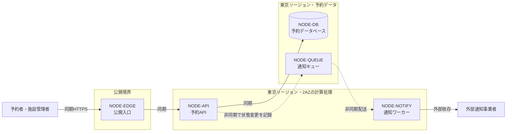

# クラウドアーキテクチャ — RoomFlow予約サービス

<!-- これは`cloud-architecture`型の記載例である。**構成の正本ではなく、粒度と具体性の見本として読む。** RoomFlowは組織内の共用会議室を予約する架空のサービスであり、AWSアカウント、構成、費用、日付はすべて説明用である。現在構成の観測記録ではない。 -->

**RoomFlowのプロバイダーはAWSで合意し、AWSの管理サービスを使った単一リージョン・複数AZ構成を第一候補とする。** 同じ利用枠への重複予約を防ぐデータベース整合性と、2人で運用できることを優先したためである。一方、年末の最大負荷とリージョン障害時の復旧目標が未決なので、AWS上の具体的な構成はTerraform実装へ渡せる最終決定ではない。将来構成を決める設計者と運用責任者は、`REQ-OQ-001`、`WL-OQ-001`、`QR-OQ-001`、`ARC-OQ-001`が残る間、比較と検証準備は進めるが、`ADR-001`を承認済みとして実装しない。

## 設計入力と制約

### 予約の正しさを構成の中心に置く

`REQ-001`から`REQ-003`は利用枠の公開、検索、予約、変更、取消を求め、`QR-004`は重複成立を0件にする。このため入口、予約API、予約データベースを一つの同期経路として扱い、書き込みの最終判断を同じデータベース境界へ集める。

### 検索と通知は異なる負荷特性を持つ

`WL-001`の検索ピークは120件/秒、`WL-004`の利用枠更新ピークは8イベント/秒である。`REQ-004`と`WL-003`は、一件の状態変更から予約者と施設管理者への二配送を生む。通知は予約の成立を止めないよう非同期経路に分けるが、`REQ-OQ-001`が未決なので外部通知製品は選ばない。

### 少人数運用と費用上限を優先する

`CON-001`は、運用担当2人、月額上限80万円、担当者がAWSの本番運用経験を持ち、プロバイダーにはAWSを採用するという`agreed_decision`である。独自に制御面を運用する構成より、障害対応と更新作業をクラウド側へ委ねられる管理サービスを優先する。`QR-002`の月99.9%以上は`hypothesis`であり、`WL-OQ-001`と`QR-OQ-001`が決まるまで最大容量と災害復旧費用は確定しない。

## 代替案比較

候補は、要求を満たせるか、2人で運用できるか、未決値が変わったときに見直せるかで比較する。人気や採用事例の多さだけでは選ばない。

| 選定対象 | 第一候補 | 比較した代替案 | 第一候補とする理由 | 引き受ける不利 | 状態 |
|---|---|---|---|---|---|
| プロバイダー | AWS | GCP | `CON-001`の既存運用経験を再利用できる | 単一プロバイダーへ依存する | `agreed_decision` |
| 計算処理 | ECS on Fargate | EKS、Lambda | 常駐APIを保ちつつ制御面の運用を減らせる | コンテナの更新と容量検証は残る | `hypothesis` |
| データベース | Aurora PostgreSQL互換 | RDS for PostgreSQL、DynamoDB | `QR-004`の整合性と複数AZを同じ境界で扱える | 費用とフェイルオーバー時間を検証する必要がある | `hypothesis` |
| メッセージング | SQS | EventBridge、Amazon MSK | `WL-003`の突発集中を一時的な滞留へ変え、運用対象を増やしにくい | 順序と重複配送を受け側で扱う | `hypothesis` |

## 採用構成

### NODE-EDGE: 公開入口

CloudFrontと`Application Load Balancer`で、予約者と施設管理者からのHTTPSを受ける。入口はグローバル、転送先は東京リージョンの2AZとする。`QR-001`と`QR-002`に基づく`hypothesis`である。

### NODE-API: 予約API

ECS on Fargateで、利用枠公開、検索、予約、変更、取消を受け付ける。東京リージョンの2AZへタスクを分散する。根拠は`REQ-001`、`REQ-002`、`REQ-003`、`WL-001`、`WL-002`、`WL-004`、`QR-001`、`QR-002`、`QR-004`、`QR-005`であり、状態は`hypothesis`である。

### NODE-DB: 予約データベース

Aurora PostgreSQL互換で、利用枠と成立予約を保持する。東京リージョンの2AZへまたがるクラスターとし、同じ利用枠の競合を一つの書き込み境界で判定する。根拠は`REQ-001`から`REQ-003`、`WL-002`、`QR-002`、`QR-004`、`QR-005`であり、状態は`hypothesis`である。

### NODE-QUEUEとNODE-NOTIFY: 通知経路

`NODE-QUEUE`はSQSで確定した状態変更を保持し、`NODE-NOTIFY`はECSワーカーで外部通知事業者へ配送する。予約APIが通知の完了を待たないための境界である。`QR-003`の60秒は、予約データベースで状態変更が確定してから受信記録が残るまでを測り、キュー投入前と配送中の遅れを含める。`REQ-004`、`WL-003`、`QR-003`を根拠とするが、通知製品は`REQ-OQ-001`が決まるまで`open_question`とする。

## ADR

### ADR-001: AWSの管理サービスを中心に単一リージョン・複数AZで構成する

プロバイダーは`CON-001`によりAWSで合意済みである。その前提で、単一リージョンと複数リージョン、管理サービスと自前運用を比較し、少人数運用、予約整合性、月額上限を優先して構成の第一候補を選ぶ。得られるのは管理対象の削減とAZ障害への耐性であり、失うのはリージョン障害への継続性である。

根拠は`REQ-001`から`REQ-004`、`WL-001`から`WL-004`、`QR-001`から`QR-005`、`CON-001`である。`QR-OQ-001`または`ARC-OQ-001`が単一リージョンでは満たせない値になったとき、複数リージョン構成を再検討する。現時点の状態は`hypothesis`である。

## インフラ構成図

図は公開境界、東京リージョン内の可用性単位、同期と非同期のデータフロー、外部通知事業者との信頼境界を示す。

## 障害・縮退経路

### FAIL-001: 通知経路が止まっても予約事実を失わない

`NODE-NOTIFY`または外部通知事業者が停止した場合、通知は遅延する。予約、変更、取消は継続し、`NODE-QUEUE`に未配送分を保持する。滞留件数と最古メッセージの経過時間で検知し、復旧後に再配送する。関連する品質要求は`QR-003`、設計判断は`ADR-001`である。

### FAIL-002: 予約データベース停止時は書き込みを受け付けない

`NODE-DB`が停止した場合、検索、予約、変更、取消を停止し、静的な障害案内だけを返す。古い空き状況で予約を成功させないためである。データベース監視で検知し、同じリージョン内で自動切替する。関連する品質要求は`QR-002`と`QR-004`、設計判断は`ADR-001`である。

## 要求トレーサビリティ

| 要求ID | 負荷ID | 品質要求ID | ADR ID | 図ノードID | 検証 |
|---|---|---|---|---|---|
| REQ-001 | WL-004 | QR-005 | ADR-001 | NODE-API、NODE-DB | 8イベント/秒で更新し、60秒以内の検索反映率を測る |
| REQ-002 | WL-001、WL-002 | QR-001、QR-002、QR-004 | ADR-001 | NODE-EDGE、NODE-API、NODE-DB | ピーク検索と同時予約を組み合わせて試験する |
| REQ-003 | WL-002 | QR-002、QR-004 | ADR-001 | NODE-API、NODE-DB | 変更と取消の途中で障害を注入し、予約事実を照合する |
| REQ-004 | WL-003 | QR-003 | ADR-001 | NODE-QUEUE、NODE-NOTIFY | 状態変更の確定から受信までを測り、通知の突発集中と外部依存停止を組み合わせて試験する |

## 仮説と未決

| ID | 根拠状態 | 内容 | 設計感度 | 検証計画 | 影響先 |
|---|---|---|---|---|---|
| ARC-HYP-001 | `hypothesis` | 単一リージョン・複数AZでQR-002を満たせる | 入口とデータベースの可用性単位 | 障害注入と月額費用を検証する | ADR-001、NODE-EDGE、NODE-DB |
| ARC-OQ-001 | `open_question` | リージョン障害時に何時間で復旧すべきか | バックアップ、災害復旧、リージョン数 | `QR-OQ-001`を事業責任者と合意する | ADR-001、NODE-DB |
| WL-OQ-001 | `open_question` | 年末繁忙期は平常月の何倍になるか | 最大タスク数、DB容量、費用 | 20施設の前年実績を取得する | ADR-001、NODE-API、NODE-DB |
| REQ-OQ-001 | `open_question` | 優先する通知経路は上流で未決のため継続する | 外部通知サービス | 事業責任者の決定を要求発見正本へ戻す | ADR-001、NODE-NOTIFY |

## この資料に書かないもの

要求、利用場面、業務ルール、論理データモデルはそれぞれの正本で扱う。アプリケーション内部のクラスやAPI契約、Terraformコード、監視と復旧の具体的な操作手順も、この資料の対象外である。
