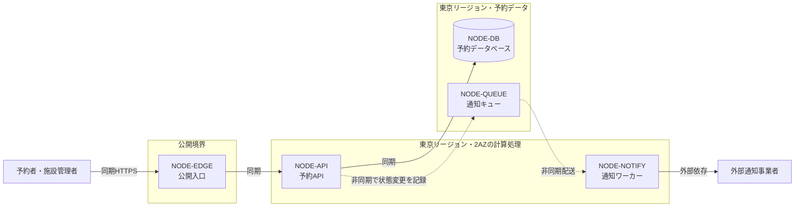

# クラウドアーキテクチャ — RoomFlow予約サービス

<!-- これは`cloud-architecture`型の記載例である。**構成の正本ではなく、粒度と具体性の見本として読む。** RoomFlowは組織内の共用会議室を予約する架空のサービスであり、AWSアカウント、構成、費用、日付はすべて説明用である。現在構成の観測記録ではない。 -->

**RoomFlowのプロバイダーはAWSで合意し、AWSの管理サービスを使った単一リージョン・複数AZ構成を第一候補とする。** 同じ利用枠への重複予約を防ぐデータベース整合性と、2人で運用できることを優先したためである。一方、年末の最大負荷とリージョン障害時の復旧目標が未決なので、AWS上の具体的な構成はTerraform実装へ渡せる最終決定ではない。将来構成を決める設計者と運用責任者は、`REQ-OQ-001`、`WL-OQ-001`、`QR-OQ-001`、`ARC-OQ-001`が残る間、比較と検証準備は進めるが、`ADR-001`を承認済みとして実装しない。

## 設計入力と制約

予約の正しさを構成の中心に置き、入口、予約API、予約データベースを一つの同期経路として扱う。検索と通知は負荷特性が違うので、通知は予約の成立を止めない非同期経路に分ける。少人数運用と費用上限を優先し、独自に制御面を運用する構成より管理サービスを選ぶ。

| 入力ID | 根拠状態 | 内容 | 設計への影響 |
|---|---|---|---|
| CON-001 | agreed_decision | 運用担当2人、月額上限80万円、担当者はAWSの本番運用経験を持ち、プロバイダーにはAWSを採用する | プロバイダー、計算処理、可観測性 |
| REQ-001 | agreed_decision | 施設管理者が利用枠を公開できる | 計算処理、データベース |
| REQ-002 | agreed_decision | 予約者が空いている利用枠を一件だけ確保できる | 計算処理、データベース |
| REQ-003 | agreed_decision | 予約者が成立済み予約を変更または取り消せる | 計算処理、データベース |
| REQ-004 | agreed_decision | 状態変更を予約者と施設管理者へ知らせる | メッセージング |
| WL-001 | hypothesis | 検索ピーク120件/秒（1分窓） | 計算処理、エッジ |
| WL-003 | hypothesis | 一件の状態変更が二配送へ増幅し、通知ピーク60配送/秒 | メッセージング |
| WL-004 | hypothesis | 利用枠更新ピーク8イベント/秒 | 計算処理、データベース |
| QR-002 | hypothesis | 予約系要求の月間成功率99.9%以上 | リージョン/AZ、バックアップ/DR |
| QR-004 | agreed_decision | 重複した成立予約を常に0件にする | データベース |
| REQ-OQ-001 | open_question | 優先する通知経路が未決 | メッセージング（外部通知製品を選ばない） |

## 代替案比較

候補は、要求を満たせるか、2人で運用できるか、未決値が変わったときに見直せるかで比較する。人気や採用事例の多さだけでは選ばない。

| 選定項目 | 採用候補 | 代替案 | 根拠ID | 利点 | 不利・リスク | 状態 |
|---|---|---|---|---|---|---|
| プロバイダー | AWS | GCP | CON-001 | 既存運用経験を再利用できる | 単一プロバイダーへ依存する | agreed_decision |
| リージョン/AZ | 東京リージョン・2AZ | 東京＋大阪の複数リージョン | QR-002、CON-001 | AZ障害に耐えつつ運用対象を増やさない | リージョン障害への継続性を持たない | hypothesis |
| 計算処理 | ECS on Fargate | EKS、Lambda | REQ-001、REQ-002、REQ-003、WL-001、CON-001 | 常駐APIを保ちつつ制御面の運用を減らせる | コンテナの更新と容量検証は残る | hypothesis |
| ネットワーク | VPC＋Application Load Balancer | API Gateway直結 | WL-001、QR-002 | 2AZへの振り分けと内部通信の閉域化を同じ構成で扱える | ALBの費用と設定が固定で残る | hypothesis |
| ストレージ | S3（静的資産とバックアップ置き場） | EFS | WL-001 | 静的資産の配信とデータベースのバックアップ先を分けずに済む | 予約データの正本には使わない | hypothesis |
| データベース | Aurora PostgreSQL互換 | RDS for PostgreSQL、DynamoDB | QR-004、REQ-002、WL-002 | 整合性と複数AZを同じ境界で扱える | 費用とフェイルオーバー時間を検証する必要がある | hypothesis |
| メッセージング | SQS | EventBridge、Amazon MSK | REQ-004、WL-003 | 突発集中を一時的な滞留へ変え、運用対象を増やしにくい | 順序と重複配送を受け側で扱う | hypothesis |
| ID管理 | 非該当 | Cognito | CON-001 | 該当なし | 利用者認証は組織のID基盤へ委ね、RoomFlowは認証基盤を持たない | not_applicable |
| エッジ | CloudFront | ALB直接公開 | WL-001、QR-001 | 静的資産の配信と入口の一元化 | 設定対象が一つ増える | hypothesis |
| 可観測性 | CloudWatch | Datadog | CON-001、QR-002 | 追加の契約と運用対象を増やさない | 高度な相関分析は自前で組む | hypothesis |
| バックアップ/DR | 未決 | 同一リージョン内スナップショット、大阪への複製 | QR-002、ARC-OQ-001 | 該当なし | リージョン障害時の復旧目標が決まるまで方式を選べない | open_question |
| デリバリー | GitHub ActionsからECSへのローリング更新 | CodePipeline | CON-001 | 既存のリポジトリ運用に合わせられる | 本番承認の手順は運用手順で決める | hypothesis |

## 採用構成

予約APIが通知の完了を待たないよう、`NODE-QUEUE`と`NODE-NOTIFY`を予約の同期経路から分ける。`QR-003`の60秒は、予約データベースで状態変更が確定してから受信記録が残るまでを測り、キュー投入前と配送中の遅れを含める。

| 図ノードID | 役割 | 採用サービス | リージョン/AZ・可用性単位 | 根拠ID | 状態 |
|---|---|---|---|---|---|
| NODE-EDGE | 公開入口。予約者と施設管理者からのHTTPSを受ける | CloudFront＋Application Load Balancer | 入口はグローバル、転送先は東京リージョンの2AZ | QR-001、QR-002 | hypothesis |
| NODE-API | 予約API。利用枠公開、検索、予約、変更、取消を受け付ける | ECS on Fargate | 東京リージョンの2AZへタスクを分散 | REQ-001、REQ-002、REQ-003、WL-001、WL-002、WL-004、QR-001、QR-002、QR-004、QR-005 | hypothesis |
| NODE-DB | 予約データベース。利用枠と成立予約を保持し、同じ利用枠の競合を一つの書き込み境界で判定する | Aurora PostgreSQL互換 | 東京リージョンの2AZへまたがるクラスター | REQ-001、REQ-002、REQ-003、WL-002、QR-002、QR-004、QR-005 | hypothesis |
| NODE-QUEUE | 確定した状態変更を保持する通知キュー | SQS | 東京リージョン（マネージド） | REQ-004、WL-003、QR-003 | hypothesis |
| NODE-NOTIFY | 通知ワーカー。外部通知事業者へ配送する | ECSワーカー（通知製品は未決） | 東京リージョンの2AZ | REQ-004、WL-003、QR-003、REQ-OQ-001 | open_question |

## ADR

| ADR ID | 判断 | 候補 | 根拠ID | 結果・トレードオフ | 再検討条件 | 状態 |
|---|---|---|---|---|---|---|
| ADR-001 | AWSの管理サービスを中心に単一リージョン・複数AZで構成する | 単一リージョンと複数リージョン、管理サービスと自前運用 | REQ-001、REQ-002、REQ-003、REQ-004、WL-001、WL-002、WL-003、WL-004、QR-001、QR-002、QR-003、QR-004、QR-005、CON-001 | 得るのは管理対象の削減とAZ障害への耐性。失うのはリージョン障害への継続性 | `QR-OQ-001`または`ARC-OQ-001`が単一リージョンでは満たせない値になったとき、複数リージョン構成を再検討する | hypothesis |

プロバイダーは`CON-001`によりAWSで合意済みである。その前提で、少人数運用、予約整合性、月額上限を優先して構成の第一候補を選んだ。

## インフラ構成図

図は公開境界、東京リージョン内の可用性単位、同期と非同期のデータフロー、外部通知事業者との信頼境界を示す。

## 障害・縮退経路

| 経路ID | 起点 | 影響 | 縮退 | 検知・復旧 | 関連ID |
|---|---|---|---|---|---|
| FAIL-001 | NODE-NOTIFY | 通知ワーカーまたは外部通知事業者が停止し、通知が遅延する | 予約、変更、取消は継続し、`NODE-QUEUE`に未配送分を保持する | 滞留件数と最古メッセージの経過時間で検知し、復旧後に再配送する | QR-003、ADR-001 |
| FAIL-002 | NODE-DB | 予約データベースが停止し、検索、予約、変更、取消が止まる | 静的な障害案内だけを返し、古い空き状況で予約を成功させない | データベース監視で検知し、同じリージョン内で自動切替する | QR-002、QR-004、ADR-001 |

## 要求トレーサビリティ

| 要求ID | 負荷ID | 品質要求ID | ADR ID | 図ノードID | 検証 |
|---|---|---|---|---|---|
| REQ-001 | WL-004 | QR-005 | ADR-001 | NODE-API、NODE-DB | 8イベント/秒で更新し、60秒以内の検索反映率を測る |
| REQ-002 | WL-001、WL-002 | QR-001、QR-002、QR-004 | ADR-001 | NODE-EDGE、NODE-API、NODE-DB | ピーク検索と同時予約を組み合わせて試験する |
| REQ-003 | WL-002 | QR-002、QR-004 | ADR-001 | NODE-API、NODE-DB | 変更と取消の途中で障害を注入し、予約事実を照合する |
| REQ-004 | WL-003 | QR-003 | ADR-001 | NODE-QUEUE、NODE-NOTIFY | 状態変更の確定から受信までを測り、通知の突発集中と外部依存停止を組み合わせて試験する |

## 仮説と未決

| ID | 根拠状態 | 内容 | 設計感度 | 検証計画 | 影響先 |
|---|---|---|---|---|---|
| ARC-HYP-001 | `hypothesis` | 単一リージョン・複数AZでQR-002を満たせる | 入口とデータベースの可用性単位 | 障害注入と月額費用を検証する | ADR-001、NODE-EDGE、NODE-DB |
| ARC-OQ-001 | `open_question` | リージョン障害時に何時間で復旧すべきか | バックアップ、災害復旧、リージョン数 | `QR-OQ-001`を事業責任者と合意する | ADR-001、NODE-DB |
| WL-OQ-001 | `open_question` | 年末繁忙期は平常月の何倍になるか | 最大タスク数、DB容量、費用 | 20施設の前年実績を取得する | ADR-001、NODE-API、NODE-DB |
| REQ-OQ-001 | `open_question` | 優先する通知経路は上流で未決のため継続する | 外部通知サービス | 事業責任者の決定を要求発見正本へ戻す | ADR-001、NODE-NOTIFY |

## この資料に書かないもの

要求、利用場面、業務ルール、論理データモデルはそれぞれの正本で扱う。アプリケーション内部のクラスやAPI契約、Terraformコード、監視と復旧の具体的な操作手順も、この資料の対象外である。
