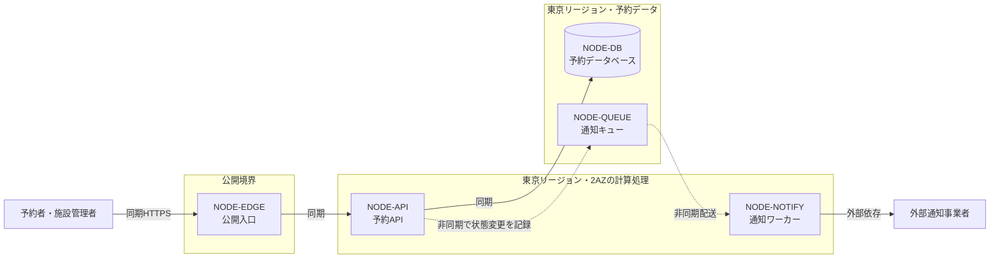

# クラウドアーキテクチャ — RoomFlow予約サービス

RoomFlowのプロバイダーはAWSで合意しており、AWSの管理サービスを使った単一リージョン・複数AZ構成を第一候補とする。同じ利用枠への重複予約を防ぐデータベース整合性と、2人で運用できることを優先したためである。ただし年末の最大負荷とリージョン障害時の復旧目標がまだ決まっていないので、この構成はTerraform実装へ渡せる最終決定ではない。将来構成を決める設計者と運用責任者は、`REQ-OQ-001`、`WL-OQ-001`、`QR-OQ-001`、`ARC-OQ-001`が残る間、比較と検証の準備は進めてよいが、`ADR-001`を承認済みとして実装しない。

## 予約の正しさを中心に置き、通知は同期経路から外す

構成の中心は、入口、予約API、予約データベースを通る一つの同期経路である。`QR-001`（重複した成立予約を常に0件にする）を守るには、同じ利用枠の競合を一つの書き込み境界で判定する必要があるからだ。検索は`WL-001`のピーク120件/秒を受けるが、通知は`WL-003`のとおり一件の状態変更が二配送に増えるので、負荷の形が違う。そこで通知は予約の成立を止めない非同期経路に分ける。

制約は`CON-001`にまとめた。運用担当は2人、月額上限は80万円で、担当者にはAWSの本番運用経験がある。独自に制御面を運用する構成より管理サービスを選ぶのは、この制約のためである。

## 候補は、2人で運用できるかと、未決が変わったときに見直せるかで比べた

計算処理にはECS on Fargateを選ぶ。EKSは制御面の運用が2人には重く、Lambdaは予約APIの常駐接続と相性が悪い。代わりに、コンテナの更新と容量の検証は自分たちで持つことになる。

データベースにはAurora PostgreSQL互換を選ぶ。整合性と複数AZを同じ境界で扱えるからである。RDS for PostgreSQLでも整合性は守れるが、AZ障害時の切替時間が長い。DynamoDBは利用枠の競合判定を条件付き書き込みで組み直す必要があり、`QR-001`の確かめ方が変わる。費用とフェイルオーバーの時間は検証が要る。

通知の受け渡しにはSQSを選ぶ。突発的な集中を一時的な滞留に変えられ、運用対象も増えにくい。EventBridgeやAmazon MSKと比べて、順序と重複配送を受け側で扱う手間は残る。

リージョンは東京の2AZにする。AZ障害には耐えるが、リージョン障害時には継続できない。東京と大阪の複数リージョンにするかどうかは、`QR-OQ-001`と`ARC-OQ-001`が決まるまで決めない。バックアップと災害復旧の方式も同じ理由で未決である。利用者の認証は組織のID基盤に委ねるので、RoomFlowは認証基盤を持たない。

## ADR

### ADR-001: AWSの管理サービスを中心に、単一リージョン・複数AZで構成する

単一リージョンと複数リージョン、管理サービスと自前運用を比べ、単一リージョン・複数AZと管理サービスを選んだ。得るのは管理対象の少なさとAZ障害への耐性で、失うのはリージョン障害時の継続性である。`QR-OQ-001`または`ARC-OQ-001`が、単一リージョンでは満たせない値に決まったら、複数リージョン構成を考え直す。利用者はまだ合意していないので、仮説のままにしている。

## 構成図

この図には、公開境界、東京リージョン内の可用性単位、同期と非同期の流れ、外部通知事業者との信頼境界を描いた。

## 通知が止まっても予約は続けるが、データベースが止まったら予約を受け付けない

通知ワーカーか外部通知事業者が止まると、通知が遅れる（`FAIL-001`）。予約、変更、取消は続け、未配送の分は`NODE-QUEUE`に残す。滞留件数と最古メッセージの経過時間で気付き、復旧後に配送し直す。

予約データベースが止まると、検索、予約、変更、取消が止まる（`FAIL-002`）。このときは静的な障害案内だけを返す。古い空き状況で予約を成功させるより、止めるほうを選んだ。同じリージョン内の自動切替で戻す。

## 追跡の表

| ID | 内容 | 根拠と状態 |
|---|---|---|
| CON-001 | 運用担当2人、月額上限80万円、プロバイダーはAWS | agreed_decision |
| NODE-EDGE | 公開入口（CloudFront＋Application Load Balancer） | QR-001、QR-OQ-001、hypothesis |
| NODE-API | 予約API（ECS on Fargate、2AZ） | REQ-001、REQ-002、REQ-003、WL-001、WL-004、QR-004、hypothesis |
| NODE-DB | 予約データベース（Aurora PostgreSQL互換、2AZ） | REQ-002、REQ-003、QR-001、QR-OQ-001、hypothesis |
| NODE-QUEUE | 通知キュー（SQS） | REQ-004、WL-003、QR-003、hypothesis |
| NODE-NOTIFY | 通知ワーカー（通知製品は未決） | REQ-004、WL-003、REQ-OQ-001、open_question |
| ADR-001 | 管理サービス中心の単一リージョン・複数AZ構成 | CON-001、REQ-002、WL-001、QR-001、QR-OQ-001、hypothesis |
| FAIL-001 | 通知の停止。予約は続ける | NODE-NOTIFY、NODE-QUEUE、QR-003、hypothesis |
| FAIL-002 | 予約データベースの停止。予約を受け付けない | NODE-DB、QR-001、hypothesis |
| ARC-HYP-001 | 単一リージョン・複数AZでQR-OQ-001を満たせる | ADR-001、NODE-DB、hypothesis |
| ARC-OQ-001 | リージョン障害時に何時間で復旧すべきか | ADR-001、NODE-DB、open_question |
| WL-OQ-001 | 年末繁忙期は平常月の何倍になるか | NODE-API、NODE-DB、open_question |
| REQ-OQ-001 | 優先する通知経路（上流から継続） | NODE-NOTIFY、open_question |
| QR-OQ-001 | 月間可用性の目標（上流から継続） | ADR-001、open_question |

## この資料に書かないもの

要求、利用場面、業務ルール、論理データモデルは、それぞれの正式な資料で扱う。アプリケーション内部のクラスやAPI契約、Terraformのコード、監視と復旧の具体的な操作手順も、この資料では扱わない。
