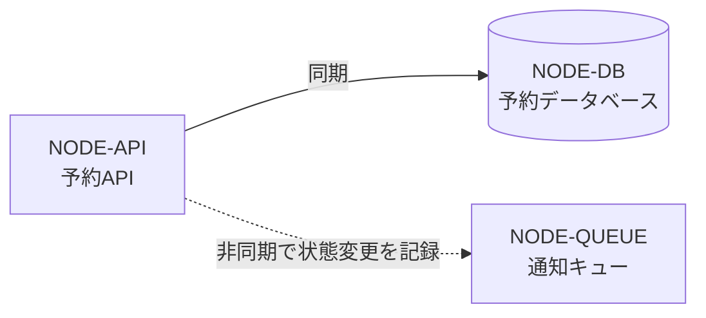

# クラウドアーキテクチャの見本（抜粋）

この見本は、クラウドアーキテクチャの資料で判断が分かれやすい箇所だけを、会議室の予約サービスの題材から抜き出したものである。題材の値や言い回しは写さず、どこで何を判断したかを見る。節の構成はテンプレートが持つ。

## 未決が残る構成は、仮説の ADR として渡す

リージョン障害時の復旧目標が決まっていないので、単一リージョン・複数AZの構成は仮説の ADR に留め、実装へ渡せる決定と書かなかった。復旧目標が合意されていれば、同じ比較でも ADR は合意になり、複数リージョンの要否もここで決まる。

> `ADR-001` は、`QR-OQ-001` または `ARC-OQ-001` が単一リージョンでは満たせない値に決まったら考え直す。利用者はまだ合意していないので、仮説のままにしている。

## 比べる領域は、要求と制約が答えを左右するものだけ

運用担当が2人という制約が計算処理とデータベースの選択を左右したので、そこだけを候補と比べた。制約の効かない領域は一覧を埋めるために比べない。運用の人数が多い題材なら、同じ領域でも制御面を自分で持つ案が残る。

> 計算処理にはECS on Fargateを選ぶ。EKSは制御面の運用が2人には重く、Lambdaは予約APIの常駐接続と相性が悪い。代わりに、コンテナの更新と容量の検証は自分たちで持つことになる。

## 障害時の振る舞いは、守る品質から決める

通知が止まっても予約は続け、予約データベースが止まったら予約を受け付けない。重複予約を残さないことが最優先の品質なので、古い空き状況で成功させるより止めるほうを選んだ。

## 構成図は、追跡の表と同じノードだけを描く

```mermaid
flowchart LR
  NODE_API["NODE-API<br/>予約API"] -->|同期| NODE_DB[("NODE-DB<br/>予約データベース")]
  NODE_API -.->|非同期で状態変更を記録| NODE_QUEUE["NODE-QUEUE<br/>通知キュー"]
```

| ID | 内容 | 根拠と状態 |
|---|---|---|
| NODE-API | 予約API（ECS on Fargate、2AZ） | REQ-002、WL-001、hypothesis |
| NODE-DB | 予約データベース（Aurora PostgreSQL互換、2AZ） | REQ-002、QR-001、hypothesis |
| NODE-QUEUE | 通知キュー（SQS） | REQ-004、WL-003、QR-003、hypothesis |
| FAIL-002 | 予約データベースの停止。予約を受け付けない | NODE-DB、QR-001、hypothesis |
| ARC-OQ-001 | リージョン障害時に何時間で復旧すべきか | ADR-001、NODE-DB、open_question |
