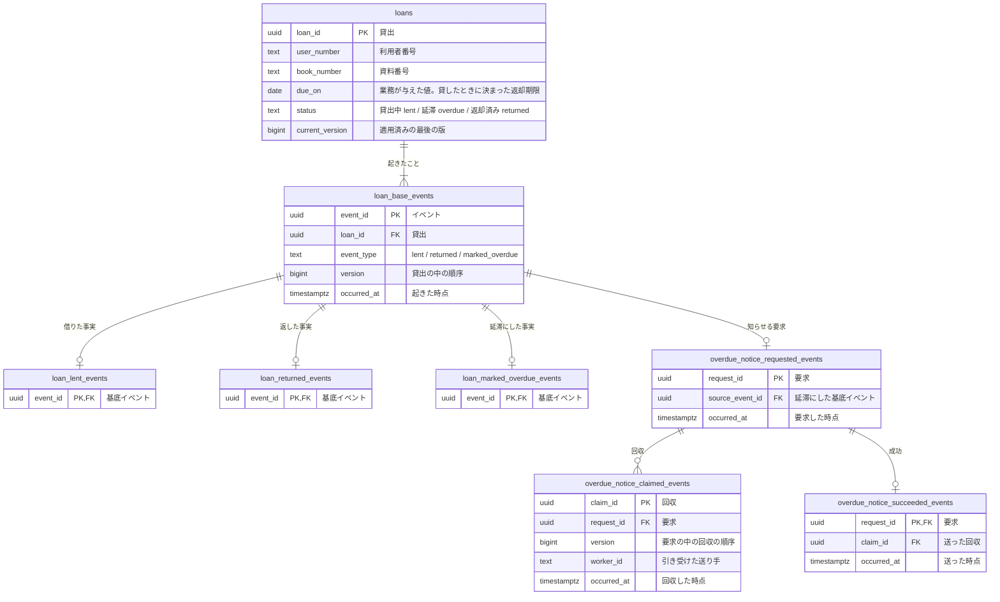

# 図書館の貸出のコマンドデータモデル

図書館の窓口と利用者が「誰が、どの一冊を、いつまでに返す約束か」と「いつ延滞になったか」を後から説明できるように、貸出に起きたことを積む。

延滞になった利用者へ知らせる処理は、延滞にする処理と同期で行うと、外部への通知の失敗に延滞の記録まで巻き込まれる。そこで、延滞にするのと同じ一回の変更で通知の要求だけを積み、別の送り手が後で回収して送る形（Outbox）にした。頼んだ通知が送り終わるまで要求を残し、要求、回収、成功を追加のみで積む。

## 貸出を一回ごとのリソースにし、起きたことを積む

| 系列 | 性質 | 論理テーブル | 保存表現 | 根拠 |
|---|---|---|---|---|
| リソース系 | 業務 | `loans` | 現在状態 | 業務知識「貸出」 |
| イベント系 | 業務 | `loan_base_events` | イベント列 | 業務知識「後から説明できる」 |
| イベント系 | 業務 | `loan_lent_events` | イベント列 | 業務イベント「本を借りた」 |
| イベント系 | 業務 | `loan_returned_events` | イベント列 | 業務イベント「本を返した」 |
| イベント系 | 業務 | `loan_marked_overdue_events` | イベント列 | 業務イベント「延滞にした」 |
| イベント系 | 技術 | `overdue_notice_requested_events` | イベント列 | 延滞を利用者へ知らせる要求 |
| イベント系 | 技術 | `overdue_notice_claimed_events` | イベント列 | 延滞を利用者へ知らせる要求 |
| イベント系 | 技術 | `overdue_notice_succeeded_events` | イベント列 | 延滞を利用者へ知らせる要求 |

貸出は、イミュータブルデータモデルを選んだ。貸出には「本を借りた」「本を返した」「延滞にした」の三つの業務イベントがあり、業務知識がその起きた順番を後から説明できることを求めているからである。`loans`のいまの状態と`current_version`はイベントから導けるが、楽観ロックと毎回の貸出での読み取りのために妥協として持つ。`status`の値は、業務知識の状態の英名（Lent、Overdue、Returned）を snake_case にしたものである。

リソースは一回の貸出にした。借りるたびに、返却期限というその回だけの約束が生まれ、返却期限が貸出の間変わらないことと、返却済みの貸出が変わらないことは、一つの貸出の行と版で判定できるからである。一冊の本の貸出は一つ、一人は5冊まで、という決まりは複数の行にまたがるので、競合する行の組として BDD-002 と BDD-003 で示す。同じ組み合わせで有効なものは一つ、という決まりだけを持つ関係なら、切り方は逆になる。社員に会議室の鍵を渡す、取り上げる、のような関係は、社員と会議室の組み合わせを一つのリソースにし、渡す・取り上げるを同じリソースの版を進める業務イベントにすれば、決まりが一つの行の中で閉じる。

借りている冊数と貸出状況は、利用者の貸出を数えて得る情報である。そのためテーブルにも列にもせず、本を借りるときに`loans`から数える。

延滞の通知には、追い続ける対象が無い。要求そのものが最初の出来事なので、基底イベントを置かず、出来事ごとの表だけにした。

## コマンドデータモデル図



## テーブル定義

### `loans`（貸出）

一行が、一冊の本を一人の利用者へ預けた約束一つを表し、その約束のいまの状態も持つ。返却期限は貸したときに業務が与えた値で、いまの決まりでは借りた日の14日後だが、計算で導かずにデータとして持つ。後で貸出期間の決まりが変わっても、すでに結んだ貸出の約束は変わらないからである。

#### 業務制約: 一冊の本の貸出中か延滞の貸出は一つ

`status`が`lent`か`overdue`の貸出は、同じ`book_number`について一つしか無い（BDD-003）。

#### 業務制約: 一人の貸出中と延滞の貸出は5冊まで

`status`が`lent`か`overdue`の貸出は、同じ`user_number`について5つを超えない（BDD-002）。

#### 業務制約: 現在の版は最後のイベントの版

`current_version`は、その貸出の`loan_base_events`の最大の`version`と等しい（BDD-005）。

### `loan_base_events`（貸出に起きたこと）

貸出に起きた業務イベントのうち、どの種類にも共通する事実を一行ずつ積む。`loan_id`と`version`の組は一意である。貸出日時は`lent`の行の`occurred_at`で、延滞にしたときの判定日時は`marked_overdue`の行の`occurred_at`で表す。

### `loan_lent_events`（本を借りた）

借りたことに固有の事実は無い。返却期限は生まれたときに決まる値なので`loans`に置いた。出来事の種類ごとに表を一つ置く形にそろえる。

### `loan_returned_events`（本を返した）

返却に固有の事実は無い。

### `loan_marked_overdue_events`（延滞にした）

延滞にも固有の事実は無い。判定日時は基底イベントの`occurred_at`で足りる。

### `overdue_notice_requested_events`（延滞の通知を頼んだ）

延滞になった貸出の利用者へ知らせる要求を、一件一行で積む。「延滞にした」と同じ一回の変更で記録する。知らせる相手は列に写さず、起因になった基底イベントから貸出を辿って読む。

### `overdue_notice_claimed_events`（延滞の通知を引き受けた）

送り手が要求を引き受けた事実を、回収のたびに一行積む。誰が引き受けたかを残すので、止まった要求の原因を送り手ごとに調べられる。引き受けた送り手が止まっても要求が残り続けないように、引き受けには期限（リース）を置く。最新の回収の`occurred_at`から10分を過ぎても成功が無ければ、要求は再び回収できる。10分は仮に置いた値である。回収の回数に上限は置かない。図書館は通知を諦めてよいと決めていないので、送り終えるまで要求を残す。

#### 業務制約: 同じ要求の同じ版の回収は一つ

`request_id`と`version`の組は一意である（BDD-009）。

### `overdue_notice_succeeded_events`（延滞の通知を送った）

送り終えた要求ごとに一行だけ積む。成功のある要求は、以後回収しない。

## 並行実行で必要な保証

同時に進むと結果が変わる組み合わせは四つあり、どれもBDDで行を示した。

4冊借りている利用者が二冊を同時に借りると、先に記録された一冊だけが成立する（BDD-002）。競合するのは一つの行ではなく、その利用者の`status`が`lent`か`overdue`の`loans`の行の集まりである。一冊の本を二人が同時に借りたときは、先に記録された一人だけが成立し、競合するのはその本の`lent`か`overdue`の`loans`の行である（BDD-003）。

延滞にするのと本を返すのが同じ貸出で重なったら、先に記録したほうだけが成立する。後のほうは、読んだ`current_version`がもう変わっているので成立しない（BDD-005）。競合するのは、その貸出の`loans`の行と、同じ`version`の`loan_base_events`の行である。

延滞の通知では、二つの送り手が同じ要求を同時に回収しうる。同じ`version`の回収は一つしか成立しない（BDD-009）。

## 業務知識のBDDとの対応

| 業務知識のBDD | この資料のBDD |
|---|---|
| BDD-001 | BDD-001 |
| BDD-002 | 対象外 |
| BDD-003 | 対象外 |
| BDD-004 | 対象外 |
| BDD-005 | BDD-003 |
| BDD-006 | 対象外 |
| BDD-007 | 対象外 |
| BDD-008 | 対象外 |
| BDD-009 | 対象外 |
| BDD-010 | BDD-004 |
| BDD-011 | 対象外 |
| BDD-012 | BDD-005 |
| BDD-013 | BDD-003 |
| BDD-014 | BDD-002 |
| BDD-015 | クエリデータモデル |
| BDD-016 | クエリデータモデル |
| BDD-017 | クエリデータモデル |
| BDD-018 | クエリデータモデル |
| BDD-019 | クエリデータモデル |

対象外にしたBDDは、すでにあるBDDと同じ行の変化になるか、記録に届かないかのどちらかである。4冊目から5冊目を借りる場面は、この資料のBDD-001と同じく、貸出と基底イベントと詳細イベントを一行ずつ足す。本を返す二つの場面は、延滞にするBDD-004と同じく、基底イベントと詳細イベントを一行ずつ足して貸出の状態と版を進める。貸出上限、延滞、返却済み、返却期限の前、のどれかで拒む四つの場面は、貸出の判断で拒まれて何も増えず、その形はBDD-002が示す。他人の利用者カードで借りる場面は、本人の確認で拒まれて記録に届かない。

## 未決

回収のリースを10分と仮に置いた。通知を送る相手の応答時間が分かれば確定する。

届かない宛先への通知を諦めてよいかは、図書館が決めていない。諦めると決め、諦めた後に誰が何をするかも決まったら、打ち切りの表を足す。

## 物理設計への申し送り

一人の貸出中と延滞の貸出を5冊までに保つ決まりは、利用者の`loans`の行の集まりで競合する（BDD-002）。一つの行の一意では守れないので、どの分離レベルと再試行で守るかを物理設計で決める。

延滞にする候補は、毎日`loans`の返却期限と状態で探す。貸出の累計が増えても探す速さが保てるように、返却期限と状態で絞る index を物理設計で決める。

## BDD

### [BDD-001] 本を借りると貸出と貸出の事実が生まれる

```gherkin
Given: 利用者 U-0001 は本を1冊も借りておらず、延滞の貸出も無い
  And: 本 B-1001 はどの貸出にも属していない
When: 利用者 U-0001 が2026年10月1日 10:00に本 B-1001 を借りる
Then: 貸出 L-001 が貸出中で生まれる
  And: 返却期限は2026年10月15日である
```

#### データの状態

**Before**

**`loans`**

| loan_id | user_number | book_number | due_on | status | current_version |
|---|---|---|---|---|---|
| （行なし） | | | | | |

**`loan_base_events`**

| event_id | loan_id | event_type | version | occurred_at |
|---|---|---|---|---|
| （行なし） | | | | |

**`loan_lent_events`**

| event_id |
|---|
| （行なし） |

**After**

**`loans`**

| loan_id | user_number | book_number | due_on | status | current_version |
|---|---|---|---|---|---|
| **L-001** | **U-0001** | **B-1001** | **2026年10月15日** | **lent** | **1** |

**`loan_base_events`**

| event_id | loan_id | event_type | version | occurred_at |
|---|---|---|---|---|
| **E-001** | **L-001** | **lent** | **1** | **2026年10月1日 10:00** |

**`loan_lent_events`**

| event_id |
|---|
| **E-001** |

### [BDD-002] 5冊目が先に記録された利用者の、同時に借りた6冊目は記録されない

```gherkin
Given: 利用者 U-0001 は貸出中の本を4冊借りており、延滞の貸出は無い
  And: 同時に借りた本 B-1005 の貸出 L-005 が、2026年10月1日 10:00に先に記録された
When: 4冊と数えて判断した本 B-1006 の貸出を記録する
Then: 本 B-1006 の貸出は記録されない
  NOTE: Rule: 貸出上限に達している利用者が本を借りる
    Reason: 一人の貸出中と延滞の貸出は5冊を超えない
```

#### データの状態

**Before**

**`loans`**

| loan_id | user_number | book_number | due_on | status | current_version |
|---|---|---|---|---|---|
| L-001 | U-0001 | B-1001 | 2026年10月10日 | lent | 1 |
| L-002 | U-0001 | B-1002 | 2026年10月10日 | lent | 1 |
| L-003 | U-0001 | B-1003 | 2026年10月12日 | lent | 1 |
| L-004 | U-0001 | B-1004 | 2026年10月12日 | lent | 1 |
| L-005 | U-0001 | B-1005 | 2026年10月15日 | lent | 1 |

**After**

**`loans`**

| loan_id | user_number | book_number | due_on | status | current_version |
|---|---|---|---|---|---|
| L-001 | U-0001 | B-1001 | 2026年10月10日 | lent | 1 |
| L-002 | U-0001 | B-1002 | 2026年10月10日 | lent | 1 |
| L-003 | U-0001 | B-1003 | 2026年10月12日 | lent | 1 |
| L-004 | U-0001 | B-1004 | 2026年10月12日 | lent | 1 |
| L-005 | U-0001 | B-1005 | 2026年10月15日 | lent | 1 |

### [BDD-003] 貸出中の本の貸出は、後から記録しようとしても増えない

```gherkin
Given: 本 B-1009 は、利用者 U-0001 の貸出 L-011 として2026年10月1日 10:00に貸出中で記録された
  And: 利用者 U-0003 の貸出は、本 B-1009 がどの貸出にも属していないと読んで判断された
When: 利用者 U-0003 の本 B-1009 の貸出を記録する
Then: 利用者 U-0003 の貸出は記録されない
  NOTE: Rule: 貸出中の本を借りる
    Reason: 一冊の本の貸出中か延滞の貸出は一つ
```

#### データの状態

**Before**

**`loans`**

| loan_id | user_number | book_number | due_on | status | current_version |
|---|---|---|---|---|---|
| L-011 | U-0001 | B-1009 | 2026年10月15日 | lent | 1 |

**After**

**`loans`**

| loan_id | user_number | book_number | due_on | status | current_version |
|---|---|---|---|---|---|
| L-011 | U-0001 | B-1009 | 2026年10月15日 | lent | 1 |

### [BDD-004] 返却期限の翌日に延滞になり、通知の要求が同じ変更で積まれる

```gherkin
Given: 貸出 L-001 は利用者 U-0001 の貸出中の貸出で、返却期限は2026年10月15日、版は1である
When: 図書館が判定日時2026年10月16日 00:05に貸出 L-001 を延滞にする
Then: 貸出 L-001 は延滞になり、版は2になる
  And: 利用者へ知らせる要求が同じ変更で積まれる
```

#### データの状態

**Before**

**`loans`**

| loan_id | user_number | book_number | due_on | status | current_version |
|---|---|---|---|---|---|
| L-001 | U-0001 | B-1001 | 2026年10月15日 | lent | 1 |

**`loan_base_events`**

| event_id | loan_id | event_type | version | occurred_at |
|---|---|---|---|---|
| E-001 | L-001 | lent | 1 | 2026年10月1日 10:00 |

**`loan_marked_overdue_events`**

| event_id |
|---|
| （行なし） |

**`overdue_notice_requested_events`**

| request_id | source_event_id | occurred_at |
|---|---|---|
| （行なし） | | |

**After**

**`loans`**

| loan_id | user_number | book_number | due_on | status | current_version |
|---|---|---|---|---|---|
| L-001 | U-0001 | B-1001 | 2026年10月15日 | **overdue** | **2** |

**`loan_base_events`**

| event_id | loan_id | event_type | version | occurred_at |
|---|---|---|---|---|
| E-001 | L-001 | lent | 1 | 2026年10月1日 10:00 |
| **E-002** | **L-001** | **marked_overdue** | **2** | **2026年10月16日 00:05** |

**`loan_marked_overdue_events`**

| event_id |
|---|
| **E-002** |

**`overdue_notice_requested_events`**

| request_id | source_event_id | occurred_at |
|---|---|---|
| **R-001** | **E-002** | **2026年10月16日 00:05** |

### [BDD-005] 返却が先に記録された貸出は、古い版で延滞にしても変わらない

```gherkin
Given: 図書館は、貸出 L-001 を版1の貸出中の貸出として読んだ
  And: その後、2026年10月15日 18:00の返却が先に記録され、版は2になった
When: 図書館が判定日時2026年10月16日 00:05に、読んだ版1の貸出 L-001 を延滞にしたことを記録する
Then: 延滞は記録されず、貸出 L-001 は返却済みのまま変わらない
```

#### データの状態

**Before**

**`loans`**

| loan_id | user_number | book_number | due_on | status | current_version |
|---|---|---|---|---|---|
| L-001 | U-0001 | B-1001 | 2026年10月15日 | returned | 2 |

**`loan_base_events`**

| event_id | loan_id | event_type | version | occurred_at |
|---|---|---|---|---|
| E-001 | L-001 | lent | 1 | 2026年10月1日 10:00 |
| E-003 | L-001 | returned | 2 | 2026年10月15日 18:00 |

**After**

**`loans`**

| loan_id | user_number | book_number | due_on | status | current_version |
|---|---|---|---|---|---|
| L-001 | U-0001 | B-1001 | 2026年10月15日 | returned | 2 |

**`loan_base_events`**

| event_id | loan_id | event_type | version | occurred_at |
|---|---|---|---|---|
| E-001 | L-001 | lent | 1 | 2026年10月1日 10:00 |
| E-003 | L-001 | returned | 2 | 2026年10月15日 18:00 |

### [BDD-006] 送り手が通知の要求を回収する

```gherkin
Given: 要求 R-001 には回収も成功も無い
When: 送り手 S-1 が2026年10月16日 00:06に要求 R-001 を回収する
Then: 版1の回収が積まれ、要求 R-001 は10分の間ほかの送り手に回収されない
```

#### データの状態

**Before**

**`overdue_notice_claimed_events`**

| claim_id | request_id | version | worker_id | occurred_at |
|---|---|---|---|---|
| （行なし） | | | | |

**After**

**`overdue_notice_claimed_events`**

| claim_id | request_id | version | worker_id | occurred_at |
|---|---|---|---|---|
| **C-001** | **R-001** | **1** | **S-1** | **2026年10月16日 00:06** |

### [BDD-007] 回収した送り手が送り終えると成功が積まれる

```gherkin
Given: 要求 R-001 は送り手 S-1 が2026年10月16日 00:06に版1で回収しており、成功は無い
When: 送り手 S-1 が2026年10月16日 00:07に要求 R-001 の通知を送り終える
Then: 成功が一件積まれ、要求 R-001 は以後回収されない
```

#### データの状態

**Before**

**`overdue_notice_claimed_events`**

| claim_id | request_id | version | worker_id | occurred_at |
|---|---|---|---|---|
| C-001 | R-001 | 1 | S-1 | 2026年10月16日 00:06 |

**`overdue_notice_succeeded_events`**

| request_id | claim_id | occurred_at |
|---|---|---|
| （行なし） | | |

**After**

**`overdue_notice_claimed_events`**

| claim_id | request_id | version | worker_id | occurred_at |
|---|---|---|---|---|
| C-001 | R-001 | 1 | S-1 | 2026年10月16日 00:06 |

**`overdue_notice_succeeded_events`**

| request_id | claim_id | occurred_at |
|---|---|---|
| **R-001** | **C-001** | **2026年10月16日 00:07** |

### [BDD-008] 二度リースが切れた要求も、別の送り手が再び回収する

```gherkin
Given: 要求 R-001 は、送り手 S-1 が2026年10月16日 00:06に版1で、送り手 S-2 が00:17に版2で回収したが、どちらも成功を積まずに止まった
When: 送り手 S-3 が2026年10月16日 00:28に要求 R-001 を回収する
Then: 版3の回収が積まれる
  And: 要求 R-001 は、送り終えるまで回収の候補に残る
```

#### データの状態

**Before**

**`overdue_notice_claimed_events`**

| claim_id | request_id | version | worker_id | occurred_at |
|---|---|---|---|---|
| C-001 | R-001 | 1 | S-1 | 2026年10月16日 00:06 |
| C-002 | R-001 | 2 | S-2 | 2026年10月16日 00:17 |

**`overdue_notice_succeeded_events`**

| request_id | claim_id | occurred_at |
|---|---|---|
| （行なし） | | |

**After**

**`overdue_notice_claimed_events`**

| claim_id | request_id | version | worker_id | occurred_at |
|---|---|---|---|---|
| C-001 | R-001 | 1 | S-1 | 2026年10月16日 00:06 |
| C-002 | R-001 | 2 | S-2 | 2026年10月16日 00:17 |
| **C-003** | **R-001** | **3** | **S-3** | **2026年10月16日 00:28** |

**`overdue_notice_succeeded_events`**

| request_id | claim_id | occurred_at |
|---|---|---|
| （行なし） | | |

### [BDD-009] 二つの送り手が同じ要求を回収すると、先に記録した一方だけが積まれる

```gherkin
Given: 要求 R-002 には回収が無かった
  And: 送り手 S-1 の版1の回収が、2026年10月16日 00:06に先に記録された
When: 同じ要求を版1として回収しようとした送り手 S-2 の回収を記録する
Then: 送り手 S-2 の回収は積まれず、送り手 S-2 は要求 R-002 を送らない
```

#### データの状態

**Before**

**`overdue_notice_claimed_events`**

| claim_id | request_id | version | worker_id | occurred_at |
|---|---|---|---|---|
| C-011 | R-002 | 1 | S-1 | 2026年10月16日 00:06 |

**After**

**`overdue_notice_claimed_events`**

| claim_id | request_id | version | worker_id | occurred_at |
|---|---|---|---|---|
| C-011 | R-002 | 1 | S-1 | 2026年10月16日 00:06 |
