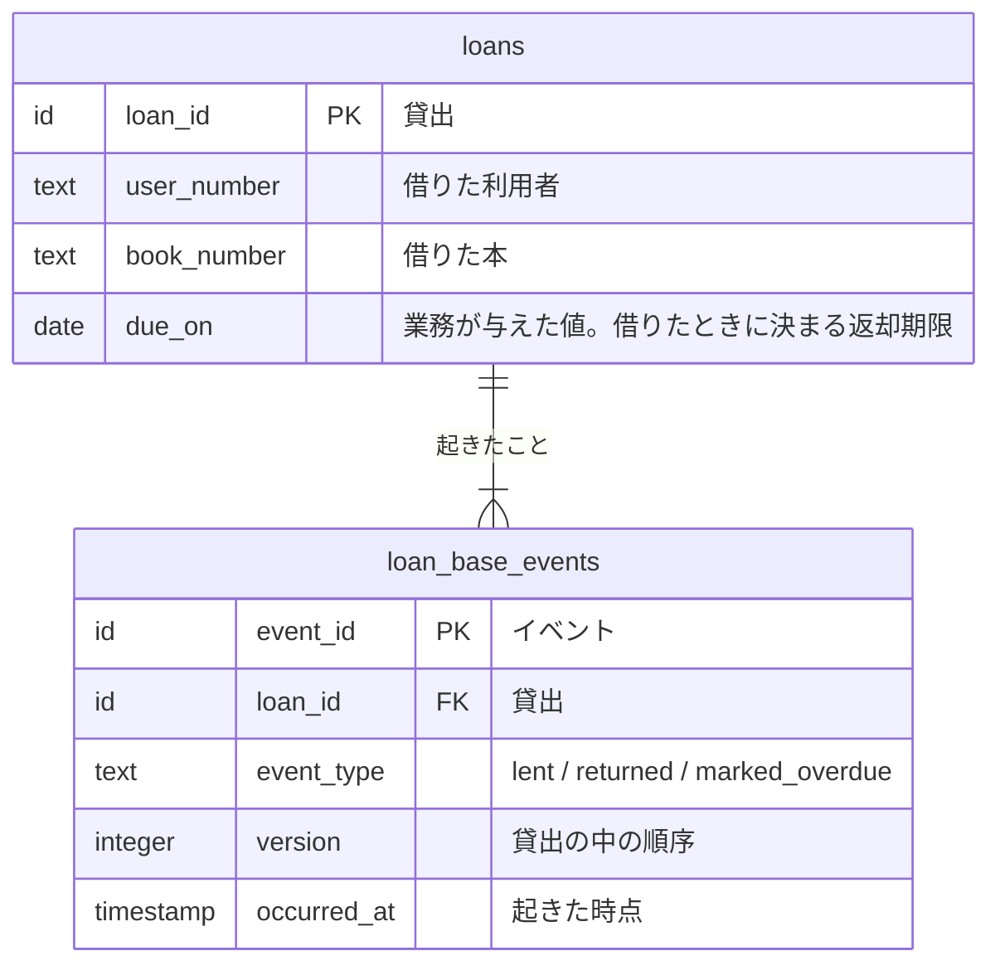

# コマンドデータモデルの見本（抜粋）

この見本は、業務知識を入力にするコマンドデータモデルで判断が分かれやすい箇所だけを、図書館の貸出を題材に抜き出したものである。技術処理だけを扱う資料では、必要なテーブルと要求から処理結果への対応を入力から決め、重複や完了を守る条件をBDDの行で示す。業務リソースや業務知識BDDの対応を、この見本から写さない。

## 型は、業務イベントの数と順番の要求で選び、根拠の文を一文で書いた

貸出には業務イベントが三つあり、業務知識がその起きた順番を後から説明できることを求めているので、イミュータブルデータモデルにした。利用者の連絡先のように「設定を更新する」としか言わない対象なら、今の状態だけを持つリソース中心になる。

| 系列 | 性質 | 論理テーブル | 保存表現 | 根拠 |
|---|---|---|---|---|
| リソース系 | 業務 | `loans` | 現在状態 | 業務知識「貸出」 |
| イベント系 | 業務 | `loan_base_events` | イベント列 | 業務知識「後から説明できる」 |

> 貸出は、イミュータブルデータモデルを選んだ。「本を借りた」「本を返した」「延滞にした」の三つの業務イベントがあり、業務知識の「誰がどの本をいつ借り、いつ返し、いつ延滞になったかを、後から説明できる」がその順番の記録を求めているからである。

## 守る決まりと競合する範囲を先に確かめた

借りるたびに返却期限というその回だけの約束が生まれるので、一回の貸出を一つのリソースにした。一冊の本の貸出は一つ、一人は5冊までという決まりは複数の貸出にまたがる。

> リソースは一回の貸出にした。返却期限はその回に与えられ、返却もその回の出来事として残る。一冊の本の貸出は一つ、一人は5冊までという制約は別の貸出との競合範囲と必要な保証を示し、判定方法は物理設計へ渡す。

## 出来事から導ける値と、事実を増やさない表は置かなかった

借りている冊数、いまの状態、最後の版は出来事から導けるため、論理テーブルの列にしない。返した出来事に種類固有の事実が無ければ、基底イベントの種類だけで表せるので、識別子だけの返却詳細表も置かない。制約や読み取りのために導出値を保存するかと、その整合の保ち方は物理設計が決める。


```mermaid
erDiagram
    loans {
        id loan_id PK "貸出"
        text user_number "借りた利用者"
        text book_number "借りた本"
        date due_on "業務が与えた値。借りたときに決まる返却期限"
    }
    loan_base_events {
        id event_id PK "イベント"
        id loan_id FK "貸出"
        text event_type "lent / returned / marked_overdue"
        integer version "貸出の中の順序"
        timestamp occurred_at "起きた時点"
    }
    loans ||--|{ loan_base_events : "起きたこと"
```

## BDD の Before と After は、変わる事実を具体の値で見せた

返却は行を消さず、版3の事実を一行足す。Before と After には、この When で読む・書くテーブルだけを置き、増えたセルを太字にした。

### [BDD-006] 延滞の貸出を返すと、返した事実が足され返却済みになる

```gherkin
Given: 貸出 L-001 には貸出と延滞の事実が順にあり、最後の版は2である
When: 利用者が2026年10月20日 11:00に本 B-1001 を返す
Then: 貸出 L-001 は返却済みになる
  And: 返した事実が版3として足される
```

**Before**

**`loans`**

| loan_id | user_number | book_number | due_on |
|---|---|---|---|
| L-001 | U-0001 | B-1001 | 2026年10月15日 |

**`loan_base_events`**

| event_id | loan_id | event_type | version | occurred_at |
|---|---|---|---|---|
| E-001 | L-001 | lent | 1 | 2026年10月1日 10:00 |
| E-002 | L-001 | marked_overdue | 2 | 2026年10月16日 00:05 |

**After**

**`loans`**

| loan_id | user_number | book_number | due_on |
|---|---|---|---|
| L-001 | U-0001 | B-1001 | 2026年10月15日 |

**`loan_base_events`**

| event_id | loan_id | event_type | version | occurred_at |
|---|---|---|---|---|
| E-001 | L-001 | lent | 1 | 2026年10月1日 10:00 |
| E-002 | L-001 | marked_overdue | 2 | 2026年10月16日 00:05 |
| **E-003** | **L-001** | **returned** | **3** | **2026年10月20日 11:00** |
