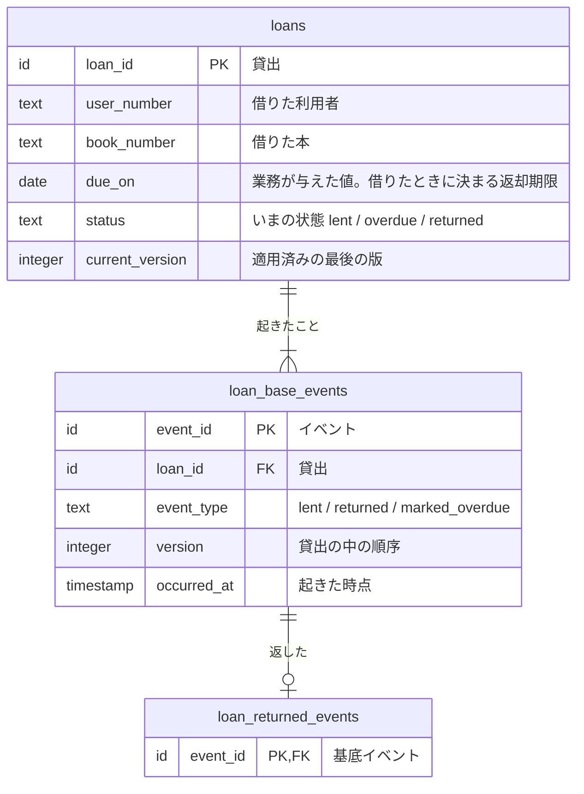

# コマンドデータモデルの見本（抜粋）

この見本は、コマンドデータモデルの資料で判断が分かれやすい箇所だけを、図書館の貸出を題材に抜き出したものである。題材の値や言い回しは写さず、どこで何を判断したかを見る。節の構成はテンプレートが持つ。

## 型は、業務イベントの数と順番の要求で選び、根拠の文を一文で書いた

貸出には業務イベントが三つあり、業務知識がその起きた順番を後から説明できることを求めているので、イミュータブルデータモデルにした。利用者の連絡先のように「設定を更新する」としか言わない対象なら、今の状態だけを持つリソース中心になり、`status` と `current_version` も置かない。

| 系列 | 性質 | 論理テーブル | 保存表現 | 根拠 |
|---|---|---|---|---|
| リソース系 | 業務 | `loans` | 現在状態 | 業務知識「貸出」 |
| イベント系 | 業務 | `loan_base_events` | イベント列 | 業務知識「後から説明できる」 |
| イベント系 | 業務 | `loan_returned_events` | イベント列 | 業務イベント「本を返した」 |

> 貸出は、イミュータブルデータモデルを選んだ。「本を借りた」「本を返した」「延滞にした」の三つの業務イベントがあり、業務知識の「誰がどの本をいつ借り、いつ返し、いつ延滞になったかを、後から説明できる」がその順番の記録を求めているからである。

## 保存の単位は、守る決まりが一つの行と版で判定できるところで切った

借りるたびに返却期限というその回だけの約束が生まれるので、一回の貸出を一つのリソースにした。社員に会議室の鍵を渡す・取り上げるのように「同じ組み合わせで有効なものは一つ」しか決まりが無い関係なら、切り方は逆になり、組み合わせを一つのリソースにして版を進める。

> リソースは一回の貸出にした。返却期限が貸出の間変わらないことと、返却済みの貸出が変わらないことは、一つの貸出の行と版で判定できるからである。一冊の本の貸出は一つ、一人は5冊まで、という決まりは複数の行にまたがるので、競合する行の組としてBDDで示す。

## 数えれば分かる情報は持たず、status と current_version だけを妥協として持った

借りている冊数は利用者の貸出を数えれば出るので、列にもテーブルにもしない。いまの状態と版もイベントから導けるが、楽観ロックと読み取りのために `loans` に持つ。`status` の値は、業務知識の状態の英名（Lent、Overdue、Returned）を snake_case にした `lent`、`overdue`、`returned` である。業務知識が状態を持たない対象なら、`status` はその対象を生んだ業務イベントの種類と同じ値、`current_version` は1になる。


```mermaid
erDiagram
    loans {
        id loan_id PK "貸出"
        text user_number "借りた利用者"
        text book_number "借りた本"
        date due_on "業務が与えた値。借りたときに決まる返却期限"
        text status "いまの状態 lent / overdue / returned"
        integer current_version "適用済みの最後の版"
    }
    loan_base_events {
        id event_id PK "イベント"
        id loan_id FK "貸出"
        text event_type "lent / returned / marked_overdue"
        integer version "貸出の中の順序"
        timestamp occurred_at "起きた時点"
    }
    loan_returned_events {
        id event_id PK, FK "基底イベント"
    }
    loans ||--|{ loan_base_events : "起きたこと"
    loan_base_events ||--o| loan_returned_events : "返した"
```

## BDD の Before と After は、変わる行と版を具体の値で見せた

返却は行を消さず、事実を一行足してリソースの状態と版を進める。Before と After には、この When で読む・書くテーブルだけを置き、変わったセルを太字にした。延滞からの返却を選んだのは、状態が二つ目の値から動く場面で、版の進み方が一番読み取りやすいからである。

### [BDD-006] 延滞の貸出を返すと、返した事実が足され返却済みになる

```gherkin
Given: 貸出 L-001 は延滞で、版は2である
When: 利用者が2026年10月20日 11:00に本 B-1001 を返す
Then: 貸出 L-001 は返却済みになる
  And: 返した事実が版3として足される
```

**Before**

**`loans`**

| loan_id | user_number | book_number | due_on | status | current_version |
|---|---|---|---|---|---|
| L-001 | U-0001 | B-1001 | 2026年10月15日 | overdue | 2 |

**`loan_base_events`**

| event_id | loan_id | event_type | version | occurred_at |
|---|---|---|---|---|
| E-001 | L-001 | lent | 1 | 2026年10月1日 10:00 |
| E-002 | L-001 | marked_overdue | 2 | 2026年10月16日 00:05 |

**`loan_returned_events`**

| event_id |
|---|
| （行なし） |

**After**

**`loans`**

| loan_id | user_number | book_number | due_on | status | current_version |
|---|---|---|---|---|---|
| L-001 | U-0001 | B-1001 | 2026年10月15日 | **returned** | **3** |

**`loan_base_events`**

| event_id | loan_id | event_type | version | occurred_at |
|---|---|---|---|---|
| E-001 | L-001 | lent | 1 | 2026年10月1日 10:00 |
| E-002 | L-001 | marked_overdue | 2 | 2026年10月16日 00:05 |
| **E-003** | **L-001** | **returned** | **3** | **2026年10月20日 11:00** |

**`loan_returned_events`**

| event_id |
|---|
| **E-003** |
