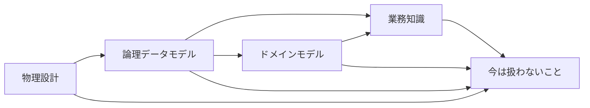

# 図書館の貸出の資料の地図

<!-- これは`document-map`型の記載例である。構成の基準資料ではなく、粒度と具体性の見本として読む。架空の題材「図書館の貸出」の、業務知識からテストまでの資料の関係を示している。 -->

図書館の貸出には、業務知識、ドメインモデル、論理データモデル、物理設計、今は扱わないことの記録、の五つの資料がある。決まりを変えるときは、必ず業務知識から直す。この地図は、五つの資料のどれが何を決めているかと、変更をどの順に伝えればよいかを示す。貸出の仕組みを直したい開発者は、ここで最初に開く資料を決められる。

## 下流の資料は上流の資料だけを参照する

図の矢印は、参照する資料から参照される資料へ向く。

業務知識は、利用者と図書館が同じ言葉で判断するための決まりを持つ。ドメインモデルと論理データモデルは、その決まりをそれぞれコードの形とテーブルの形へ写すので、業務知識を参照する。物理設計は、論理データモデルのテーブルを PostgreSQL へ写すので、論理データモデルだけを参照する。

逆向きの参照は無い。業務知識は、下流の資料がどう作られているかを知らなくても書ける。今は扱わないことの記録は、各資料の「未決」から参照されるだけで、ほかの資料を参照しない。

## 判断の持ち主

| 判断 | 決める資料 | 写す資料 |
|---|---|---|
| 返却期限と貸出上限 | 業務知識 | ドメインモデル、論理データモデル |
| 貸出という集約の境界 | ドメインモデル | 論理データモデル |
| 貸出のテーブルと、イベントの時刻の列 | 論理データモデル | 物理設計 |
| 分離レベルと、トランザクションの中でやり直す回数 | 物理設計 | なし |
| 延長と取り置きを今は扱わないこと | 今は扱わないことの記録 | なし |

返却期限は、業務知識が「借りた日の14日後」と決め、論理データモデルは貸したときの値を列として残す。論理データモデルの値は、貸したときに業務知識の決まりで決まった約束の写しである。そのため、決まりを変えるのは業務知識で、論理データモデルの列を直しても決まりは変わらない。

## 変更はどこから始めるか

### 返却期限や貸出上限を変える

決まりの持ち主は業務知識なので、業務知識から直す。

1. 業務知識の決まりと、その決まりを確かめる BDD を直す。
2. ドメインモデルの「守ること」と、拒む理由を直す。
3. 論理データモデルの業務制約と、BDD の Before と After を直す。
4. 物理設計の物理制約の表を直し、論理構造の指紋を取り直す。

### 貸出の検索を速くする

速さは業務の決まりを変えないので、物理設計だけを直す。

1. 物理設計の「代表的な読み取り」に、遅くなった読み取りを足す。
2. その読み取りを支える index を、index の表に足す。

### 延長を扱うと決めた

延長は今は扱わないことの記録にあるので、そこから業務知識へ移す。

1. 今は扱わないことの記録から、延長の項目を消す。
2. 業務知識に延長の決まりと BDD を足す。
3. 返却期限や貸出上限を変えるときと同じ順で、ドメインモデルから物理設計までを直す。
