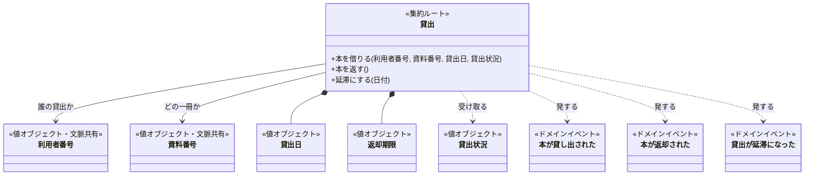
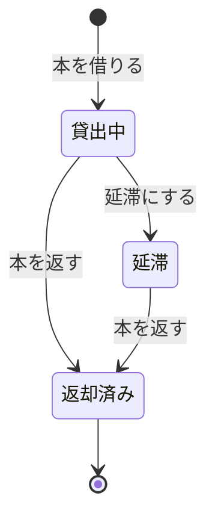

# 図書館の貸出のドメインモデル

<!-- これは`domain-model`型の記載例である。**構成の基準資料ではなく、図と文章の分担と分量の見本として読む。**
     架空の題材「図書館の貸出」の業務知識から作った。集約は一つで、状態は貸出中・延滞・返却済みである。 -->

集約は「貸出」一つである。一冊の本を一人の利用者へ預ける約束を、借りてから返すまで一つの貸出が持ち、状態によって受け付けるコマンドを変える。貸出上限と「延滞の貸出がある利用者には貸さない」は、利用者のすべての貸出にまたがる決まりで、一つの貸出の中では確かめられない。そこで本を借りるときに、呼び手がその時点の貸出状況を集めて渡し、貸出がそれを見て受け付けるか拒むかを決める。

## クラス図

## 貸出

貸出の境界は、一冊の本と一人の利用者の約束に引いた。状態と返却期限を一つのコマンドで一貫させるには、この一冊分があれば足りるからである。利用者のすべての貸出を一つの集約にまとめれば、貸出上限をその内側で守れる。しかしそうすると、一冊を返すだけのコマンドが利用者の全貸出を巻き込む。上限は、貸出状況という値として持ち込むことにした。

### 状態遷移

受け付けるコマンドは状態ごとに違う。返却済みは終端で、どのコマンドも受け付けない。

### 守ること

返却期限は貸出日の14日後に決まり、貸出の間は変わらない。誰の、どの一冊の貸出かも、生まれてから変わらない。

一つの貸出では守れない決まりが二つある。一つ目は、貸出上限と延滞中の貸出禁止である。これは本を借りる直前の貸出状況で判断する。ただし貸出状況は借りる瞬間の写しなので、同じ利用者が同時に借りたときに上限を超えないことは、貸出を記録する側が保存するときにもう一度確かめて守る。二つ目は、一冊の本が同時に一つの貸出にしか属さないことである。これも貸出を記録する側が守る（BDD-005、BDD-013）。

### 本を借りる

利用者番号、資料番号、貸出日、貸出状況を受け取り、貸出中の貸出を生む。返却期限は貸出日の14日後に決まり、「本が貸し出された」を発する。貸出状況に延滞の貸出があれば「延滞の貸出がある利用者が本を借りる」で、借りている冊数が5冊なら「貸出上限に達している利用者が本を借りる」で拒み、貸出は生まれない。「貸出中の本を借りる」は貸出を記録する側が、「他人の利用者カードで本を借りる」は呼び手が本人を確かめる段階で拒むので（BDD-006）、このコマンドには届かない。BDD-001、BDD-002、BDD-003、BDD-004 がこのコマンドで成立する。

### 本を返す

貸出中と延滞の貸出が受け付け、返却済みにして「本が返却された」を発する。延滞していても返せる。返却済みの貸出は「返却済みの本を返す」で拒む。誰が返しても受け付けるので、呼び手が本人かは確かめない。BDD-007、BDD-008、BDD-009 がこのコマンドで成立する。

### 延滞にする

日付を受け取り、貸出中の貸出だけが受け付ける。その日が返却期限の翌日以降なら延滞にし、「貸出が延滞になった」を発する。返却期限の当日以前なら「返却期限を過ぎていない貸出を延滞にする」で拒む。返却済みと延滞の貸出も延滞にしないが、そのときの拒む理由は業務知識に無いため、提案に回した。BDD-010、BDD-011、BDD-012 がこのコマンドで成立する。

### 取り違えやすいもの

貸出状況は貸出の一部ではない。本を借りる瞬間に受け取る写しで、貸出はそれを持ち続けない。延滞は貸出の状態であって、利用者の状態ではない。延滞の貸出を持つ利用者が借りられないのは、その利用者の貸出状況で判断する。

## 業務知識への提案

| 提案 | なぜ要るか | 導いた業務ルール・BDD | 業務知識のどの節へ足すか |
|---|---|---|---|
| 貸出番号 | 同じ利用者が同じ本を返してまた借りると、利用者番号と資料番号だけでは貸出を見分けられない | 概念「貸出」、BDD-007 | 業務用語 |
| 拒む理由「返却済みの貸出を延滞にする」「延滞の貸出を延滞にする」 | 延滞にするを貸出中以外が受けたときの業務上の理由が無い | 業務ルール「延滞にする」、BDD-012 | 拒むときの理由 |

## 未決

貸出の延長は業務知識で未決である。認めるなら、返却期限を変えるコマンドが貸出中の貸出に加わり、「返却期限は貸出の間変わらない」を見直す。

貸出上限と延滞の両方に当たる利用者が本を借りたとき、どちらの理由で拒むかは業務知識に無い。仮に延滞を先に見る。延滞の本を返せば借りられる、という次の行動を利用者へ示せるからである。
