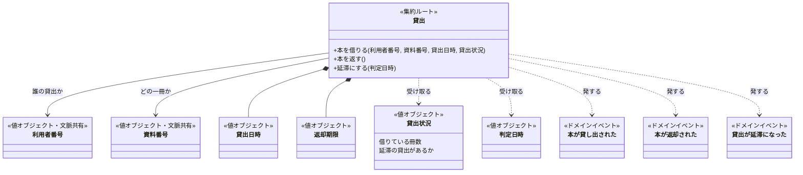
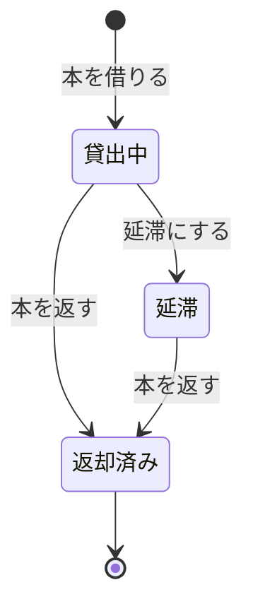

# 図書館の貸出のドメインモデル

<!-- これは`domain-model`型の記載例である。構成の基準資料ではなく、図と文章の分担と分量の見本として読む。
     架空の題材「図書館の貸出」の業務知識から作った。集約は一つで、状態は貸出中・延滞・返却済みである。 -->

集約は「貸出」一つである。一冊の本を一人の利用者へ預ける約束を、借りてから返すまで一つの貸出として扱う。

## クラス図

## 貸出の境界は一冊の本に引いた

貸出の境界は、一冊の本と一人の利用者の約束に引いた。状態と返却期限を食い違わせないためなら、一冊分で足りるからである。利用者の全貸出を一つの集約にすれば貸出上限を内側で守れるが、一冊を返すだけでもその利用者の全貸出を扱うことになる。そこで貸出上限と、延滞中は借りられない決まりは、本を借りるときに呼び手が渡す貸出状況で判断する。

### 状態遷移

### 守ること

返却期限は借りた日の14日後に決まり、貸出の間は変わらない。誰の、どの一冊の貸出かも変わらない。

同時に借りられたときの決まりは、貸出の中では守れない。貸出状況は借りる瞬間の写しで、同じときに生まれる別の貸出を知らないからである。同じ利用者が同時に借りても貸出上限を超えないことと、一冊の本が同時に一つの貸出にしか属さないことは、貸出を記録する側が保証する（BDD-005、BDD-013）。

### 本を借りる

「本が貸し出された」を発する。貸出状況に延滞の貸出があれば「延滞の貸出がある利用者が本を借りる」で、借りている冊数が貸出上限に達していれば「貸出上限に達している利用者が本を借りる」で拒む。「貸出中の本を借りる」は貸出を記録する側が、「他人の利用者カードで本を借りる」は呼び手が本人を確かめる段階で拒む（BDD-001〜006）。

### 本を返す

「本が返却された」を発する。返却済みの貸出は「返却済みの本を返す」で拒む。誰が返しても受け付ける（BDD-007〜009）。

### 延滞にする

判定日時の日が返却期限の翌日以降なら「貸出が延滞になった」を発する。返却期限の当日以前なら「返却期限を過ぎていない貸出を延滞にする」で拒む。延滞の貸出で受けたとき、返却済みの貸出で受けたときの拒む理由は、業務知識に無いので提案に回した（BDD-010〜012）。

### 取り違えやすいもの

延滞は貸出の状態であって、利用者の状態ではない。

## 業務知識への提案

### 貸出番号

同じ利用者が同じ本を返してまた借りると、利用者番号と資料番号だけでは貸出を見分けられない（概念「貸出」、BDD-007）。業務用語と、英名の対応表へ足す。英名は業務知識で決めてもらう。

### 拒む理由「返却済みの貸出を延滞にする」「延滞の貸出を延滞にする」

貸出中でない貸出を延滞にしようとしたとき、拒む業務上の理由が業務知識に無い（業務ルール「延滞にする」、BDD-012）。拒むときの理由へ足す。

## 未決

貸出の延長は業務知識で未決である。認めるなら、返却期限を変えるコマンドが貸出中の貸出に加わり、「返却期限は貸出の間変わらない」を見直す。

延滞の貸出があり、借りている冊数も貸出上限に達している利用者が本を借りたとき、どちらの理由で拒むかは業務知識に無い。仮に延滞を先に見る。延滞の本を返せば借りられる、という次の行動を利用者へ示せるからである。
