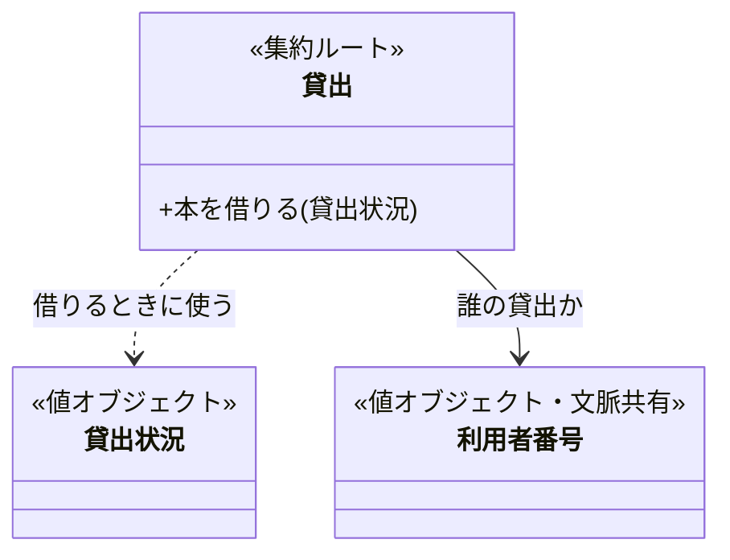

# 図書館の貸出のドメインモデル

一冊の貸出を一件として扱う案なら、返却期限と返却済みかどうかを一回の変更で揃えられる。一人の全貸出に及ぶ上限は、この境界の外にも保証が要る。

## 判断の関係

```mermaid
classDiagram
    class Loan["貸出"] {
        <<集約ルート>>
        +本を借りる(貸出状況)
    }
    class BorrowerStanding["貸出状況"] {
        <<値オブジェクト>>
    }
    class UserNumber["利用者番号"] {
        <<値オブジェクト・文脈共有>>
    }
    Loan ..> BorrowerStanding : 借りるときに使う
    Loan --> UserNumber : 誰の貸出か
```

## 一冊の貸出を境界にする案

返却期限と状態を食い違わせない範囲は、一冊の貸出で足りる。一人の全貸出を一件に含める案なら上限も同じ境界で判断できるが、一冊を返す変更にも全貸出が関わる。貸出状況を借りるときの判断材料として渡す案を示した。これはその瞬間の写しなので、二つの貸出が並行して生まれても上限を守る保証を、この貸出だけで済ませることはできない（BDD-005、BDD-013、BDD-014）。

## 未決

一人の貸出上限と一冊の本の重複貸出を、並行した行いでもどう一貫して守るかは、この境界の外の設計で決める。業務上の結果は確定しているが、保証の責務と方法をこの図だけで確定させない。
