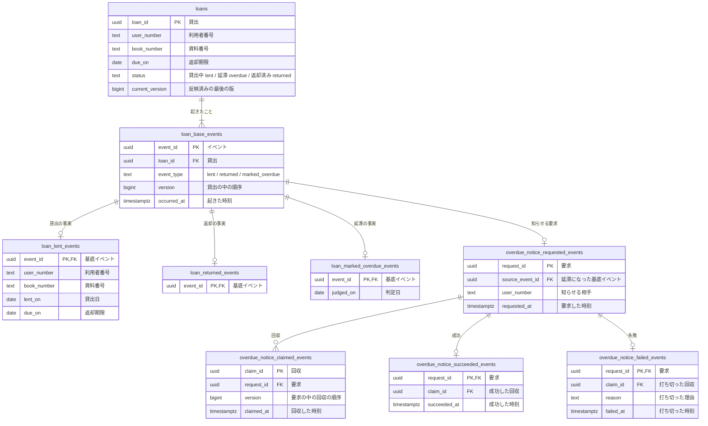

# 図書館の貸出の論理データモデル

<!-- これは`rdb-logical-data-modeling`型の記載例である。**構成の基準資料ではなく、分量と具体性の見本として読む。**
     架空の題材「図書館の貸出」の業務知識から作った。業務イベントは貸出、技術的な処理は延滞の通知である。 -->

図書館の窓口と利用者が「誰が、どの一冊を、いつまでに返す約束か」と「いつ延滞になったか」を後から説明できるように、貸出を現在の姿と起きたことに分けて残す。延滞になった利用者へ知らせる処理は、業務の決まりではないが、頼んだ通知が必ず一度は終わるように、要求から成功か失敗までを追加のみで残す。

## リソース系とイベント系

| 系列 | 性質 | 論理テーブル | 正式な定義 | 時刻 | 変化 | 根拠 |
|---|---|---|---|---|---|---|
| リソース系 | 業務 | `loans` | 現在状態 | `due_on`（返却期限） | 更新あり | 業務知識「貸出」 |
| イベント系 | 業務 | `loan_base_events` | イベント列 | `occurred_at` | 追加のみ | 業務知識「業務イベント」 |
| イベント系 | 業務 | `loan_lent_events` | イベント列 | なし（基底イベントの`occurred_at`） | 追加のみ | 業務イベント「本が貸し出された」 |
| イベント系 | 業務 | `loan_returned_events` | イベント列 | なし（基底イベントの`occurred_at`） | 追加のみ | 業務イベント「本が返却された」 |
| イベント系 | 業務 | `loan_marked_overdue_events` | イベント列 | なし（基底イベントの`occurred_at`） | 追加のみ | 業務イベント「貸出が延滞になった」 |
| イベント系 | 技術 | `overdue_notice_requested_events` | イベント列 | `requested_at` | 追加のみ | 延滞を利用者へ知らせる要求 |
| イベント系 | 技術 | `overdue_notice_claimed_events` | イベント列 | `claimed_at` | 追加のみ | 同上 |
| イベント系 | 技術 | `overdue_notice_succeeded_events` | イベント列 | `succeeded_at` | 追加のみ | 同上 |
| イベント系 | 技術 | `overdue_notice_failed_events` | イベント列 | `failed_at` | 追加のみ | 同上 |

貸出はイベント列を選んだ。貸出、返却、延滞という名前のある出来事が順に起き、「延滞になった後に返した」のような経過を後から説明する必要があるからである。貸出中の本と借りている冊数は毎回の貸出で読むので、現在の姿を`loans`に持つ。`loans`は基底イベントから作り直せる投影でもある。

## 論理データモデル図



## 論理テーブル定義

### `loans`（貸出）

一冊の本を一人の利用者へ預けている約束の、いまの姿である。`loan_id`が同じなら同じ貸出である。

| 論理列 | 型 | 必須性 | 業務上の意味 |
|---|---|---|---|
| `loan_id` | uuid | 常に必要 | 貸出を見分ける識別子 |
| `user_number` | text | 常に必要 | 借りた利用者の利用者番号 |
| `book_number` | text | 常に必要 | 借りた本の資料番号 |
| `due_on` | date | 常に必要 | 返却期限。貸出日の14日後で、貸出の間変わらない |
| `status` | text | 常に必要 | 貸出中`lent`、延滞`overdue`、返却済み`returned` |
| `current_version` | bigint | 常に必要 | 最後に反映した基底イベントの`version` |

#### 業務制約: 一冊の本の貸出中か延滞の貸出は一つ

`book_number`が同じで`status`が`lent`か`overdue`の行は、一つしか無い（BDD-003、BDD-011）。

#### 業務制約: 一人の貸出中と延滞の貸出は5冊まで

`user_number`が同じで`status`が`lent`か`overdue`の行は、5行を超えない（BDD-002）。複数の行にまたがる件数なので、並行実行で必要な保証に書いた。

#### 業務制約: 現在の版は最後のイベントの版

`current_version`は、その貸出の`loan_base_events`の最大の`version`と等しい。

### `loan_base_events`（貸出に起きたこと）

貸出に起きた業務イベントに共通する事実である。`loan_id`と`version`の組は一意である。

| 論理列 | 型 | 必須性 | 業務上の意味 |
|---|---|---|---|
| `event_id` | uuid | 常に必要 | イベントの識別子 |
| `loan_id` | uuid | 常に必要 | 起きた貸出 |
| `event_type` | text | 常に必要 | `lent`、`returned`、`marked_overdue` |
| `version` | bigint | 常に必要 | 貸出の中の順序。1から1ずつ増える |
| `occurred_at` | timestamptz | 常に必要 | 出来事が起きた時刻 |

### `loan_lent_events`（本が貸し出された）

貸出が生まれたときの事実である。

| 論理列 | 型 | 必須性 | 業務上の意味 |
|---|---|---|---|
| `event_id` | uuid | 常に必要 | 基底イベント |
| `user_number` | text | 常に必要 | 借りた利用者 |
| `book_number` | text | 常に必要 | 借りた本 |
| `lent_on` | date | 常に必要 | 貸出日 |
| `due_on` | date | 常に必要 | 返却期限 |

### `loan_returned_events`（本が返却された）

返却に固有の事実は無い。種類ごとの表として置く。

| 論理列 | 型 | 必須性 | 業務上の意味 |
|---|---|---|---|
| `event_id` | uuid | 常に必要 | 基底イベント |

### `loan_marked_overdue_events`（貸出が延滞になった）

| 論理列 | 型 | 必須性 | 業務上の意味 |
|---|---|---|---|
| `event_id` | uuid | 常に必要 | 基底イベント |
| `judged_on` | date | 常に必要 | 延滞と判断した判定日。返却期限の翌日以降 |

### `overdue_notice_requested_events`（延滞の通知を頼んだ）

延滞になった貸出の利用者へ知らせる要求である。「貸出が延滞になった」と同じ一つの変更で記録する。一つの基底イベントに要求は一つである。

| 論理列 | 型 | 必須性 | 業務上の意味 |
|---|---|---|---|
| `request_id` | uuid | 常に必要 | 要求 |
| `source_event_id` | uuid | 常に必要 | 延滞になった基底イベント |
| `user_number` | text | 常に必要 | 知らせる相手 |
| `requested_at` | timestamptz | 常に必要 | 要求した時刻 |

### `overdue_notice_claimed_events`（延滞の通知を引き受けた）

送る側が要求を引き受けた事実である。回収から10分（リース。仮説）を過ぎても成功も失敗も無ければ、要求は再び回収できる。`request_id`と`version`の組は一意である。

| 論理列 | 型 | 必須性 | 業務上の意味 |
|---|---|---|---|
| `claim_id` | uuid | 常に必要 | 回収 |
| `request_id` | uuid | 常に必要 | 要求 |
| `version` | bigint | 常に必要 | 要求の中の回収の順序 |
| `claimed_at` | timestamptz | 常に必要 | 回収した時刻 |

### `overdue_notice_succeeded_events`（延滞の通知を送った）

| 論理列 | 型 | 必須性 | 業務上の意味 |
|---|---|---|---|
| `request_id` | uuid | 常に必要 | 要求。要求ごとに一件 |
| `claim_id` | uuid | 常に必要 | 送った回収 |
| `succeeded_at` | timestamptz | 常に必要 | 送った時刻 |

### `overdue_notice_failed_events`（延滞の通知を打ち切った）

再試行しても結果が変わらないと分かった要求と、回収の回数が上限に達した要求を、候補から外す事実である。一時的な失敗は記録しない。

| 論理列 | 型 | 必須性 | 業務上の意味 |
|---|---|---|---|
| `request_id` | uuid | 常に必要 | 要求。要求ごとに一件 |
| `claim_id` | uuid | 常に必要 | 打ち切った回収 |
| `reason` | text | 常に必要 | 打ち切った理由。どの失敗で打ち切るかは実装のエラーの分類が決める |
| `failed_at` | timestamptz | 常に必要 | 打ち切った時刻 |

#### 業務制約: 成功と失敗はどちらか一つ

同じ`request_id`が`overdue_notice_succeeded_events`と`overdue_notice_failed_events`の両方に現れない。

## 並行実行で必要な保証

同じ利用者が二冊を同時に借りるとき、借りている冊数が4冊なら、成立するのは一冊だけである。二冊とも成立して6冊になることを許さない。競合するのは、その利用者の`status`が`lent`か`overdue`の`loans`の行の集まりである。一行の版では守れないので、どう守るかは物理設計が決める。

同じ本を二人が同時に借りるとき、成立するのは一人だけである。競合するのは、その本の`lent`か`overdue`の`loans`の行である（BDD-011）。

延滞にするのと本を返すのが同じ貸出で重なったとき、先に反映した方だけが成立する。後の方は、読んだ`current_version`が変わっているので成立しない（BDD-006）。

同じ要求を二つの送り手が同時に回収するとき、同じ`version`の回収は一つしか成立しない（BDD-009）。

## 業務知識のシナリオとの対応

| 業務知識のBDD | この資料のBDD | 対象外の理由 |
|---|---|---|
| BDD-001 | BDD-001 | |
| BDD-002 | | 4冊目までの貸出は BDD-001 と同じ記録になる |
| BDD-003 | BDD-002 | |
| BDD-004 | | 延滞の有無は貸出状況で判断し、拒否は記録を変えない。BDD-002 と同じ形 |
| BDD-005 | BDD-003 | |
| BDD-006 | | 本人の確認で拒まれ、記録に届かない |
| BDD-007 | | 返却の記録は BDD-004 と同じ形 |
| BDD-008 | BDD-004 | |
| BDD-009 | | 返却済みは状態で拒まれ、記録を変えない |
| BDD-010 | BDD-005 | |
| BDD-011 | | 延滞にする前に拒まれ、記録を変えない |
| BDD-012 | BDD-006 | |
| BDD-013 | BDD-011 | |

## 未決

貸出を見分ける`loan_id`は、業務知識に語が無い。ドメインモデルが「貸出番号」を業務知識へ提案している。

回収のリースを10分、打ち切るまでの回収の回数を5回と仮に置いた。通知を送る相手の応答時間が分かれば確定する。

## BDD

### [BDD-001] 本を借りると貸出と貸出の事実が生まれる

```gherkin
Given: 利用者 U-0001 は本を1冊も借りておらず、延滞の貸出も無い
  And: 本 B-1001 はどの貸出にも属していない
When: 利用者 U-0001 が2026年10月1日 10:00に本 B-1001 を借りる
Then: 貸出 L-001 が貸出中で生まれる
  And: 返却期限は2026年10月15日である
```

#### データの状態

**Before**

**`loans`**

| loan_id | user_number | book_number | due_on | status | current_version |
|---|---|---|---|---|---|

**`loan_base_events`**

| event_id | loan_id | event_type | version | occurred_at |
|---|---|---|---|---|

**`loan_lent_events`**

| event_id | user_number | book_number | lent_on | due_on |
|---|---|---|---|---|

**After**

**`loans`**

| loan_id | user_number | book_number | due_on | status | current_version |
|---|---|---|---|---|---|
| **L-001** | **U-0001** | **B-1001** | **2026年10月15日** | **lent** | **1** |

**`loan_base_events`**

| event_id | loan_id | event_type | version | occurred_at |
|---|---|---|---|---|
| **E-001** | **L-001** | **lent** | **1** | **2026年10月1日 10:00** |

**`loan_lent_events`**

| event_id | user_number | book_number | lent_on | due_on |
|---|---|---|---|---|
| **E-001** | **U-0001** | **B-1001** | **2026年10月1日** | **2026年10月15日** |

### [BDD-002] 5冊借りている利用者の6冊目は記録されない

```gherkin
Given: 利用者 U-0001 は貸出中の本を5冊借りており、延滞の貸出は無い
When: 利用者 U-0001 が2026年10月1日 10:00に本 B-1006 を借りる
Then: 貸出は生まれない
  NOTE: Rule: 貸出上限に達している利用者が本を借りる
    Reason: 一人の貸出中と延滞の貸出は5冊を超えない
```

#### データの状態

**Before**

**`loans`**

| loan_id | user_number | book_number | due_on | status | current_version |
|---|---|---|---|---|---|
| L-001 | U-0001 | B-1001 | 2026年10月10日 | lent | 1 |
| L-002 | U-0001 | B-1002 | 2026年10月10日 | lent | 1 |
| L-003 | U-0001 | B-1003 | 2026年10月12日 | lent | 1 |
| L-004 | U-0001 | B-1004 | 2026年10月12日 | lent | 1 |
| L-005 | U-0001 | B-1005 | 2026年10月14日 | lent | 1 |

**After**

**`loans`**

| loan_id | user_number | book_number | due_on | status | current_version |
|---|---|---|---|---|---|
| L-001 | U-0001 | B-1001 | 2026年10月10日 | lent | 1 |
| L-002 | U-0001 | B-1002 | 2026年10月10日 | lent | 1 |
| L-003 | U-0001 | B-1003 | 2026年10月12日 | lent | 1 |
| L-004 | U-0001 | B-1004 | 2026年10月12日 | lent | 1 |
| L-005 | U-0001 | B-1005 | 2026年10月14日 | lent | 1 |

### [BDD-003] ほかの利用者に貸出中の本は記録されない

```gherkin
Given: 本 B-1001 は利用者 U-0001 に貸出中である
When: 利用者 U-0003 が2026年10月2日 11:00に本 B-1001 を借りる
Then: 貸出は生まれない
  NOTE: Rule: 貸出中の本を借りる
    Reason: 一冊の本の貸出中か延滞の貸出は一つ
```

#### データの状態

**Before**

**`loans`**

| loan_id | user_number | book_number | due_on | status | current_version |
|---|---|---|---|---|---|
| L-001 | U-0001 | B-1001 | 2026年10月15日 | lent | 1 |

**After**

**`loans`**

| loan_id | user_number | book_number | due_on | status | current_version |
|---|---|---|---|---|---|
| L-001 | U-0001 | B-1001 | 2026年10月15日 | lent | 1 |

### [BDD-004] 延滞の本を返すと返却済みになり、返却の事実が積まれる

```gherkin
Given: 貸出 L-002 は利用者 U-0002 の延滞の貸出で、版は2である
When: 2026年10月20日 15:00に本 B-1002 が返される
Then: 貸出 L-002 は返却済みになり、版は3になる
```

#### データの状態

**Before**

**`loans`**

| loan_id | user_number | book_number | due_on | status | current_version |
|---|---|---|---|---|---|
| L-002 | U-0002 | B-1002 | 2026年10月15日 | overdue | 2 |

**`loan_base_events`**

| event_id | loan_id | event_type | version | occurred_at |
|---|---|---|---|---|
| E-011 | L-002 | lent | 1 | 2026年10月1日 09:00 |
| E-012 | L-002 | marked_overdue | 2 | 2026年10月16日 00:05 |

**`loan_returned_events`**

| event_id |
|---|

**After**

**`loans`**

| loan_id | user_number | book_number | due_on | status | current_version |
|---|---|---|---|---|---|
| L-002 | U-0002 | B-1002 | 2026年10月15日 | **returned** | **3** |

**`loan_base_events`**

| event_id | loan_id | event_type | version | occurred_at |
|---|---|---|---|---|
| E-011 | L-002 | lent | 1 | 2026年10月1日 09:00 |
| E-012 | L-002 | marked_overdue | 2 | 2026年10月16日 00:05 |
| **E-013** | **L-002** | **returned** | **3** | **2026年10月20日 15:00** |

**`loan_returned_events`**

| event_id |
|---|
| **E-013** |

### [BDD-005] 返却期限の翌日に延滞になり、通知の要求が同時に積まれる

```gherkin
Given: 貸出 L-001 は利用者 U-0001 の貸出中の貸出で、返却期限は2026年10月15日、版は1である
When: 図書館が判定日2026年10月16日に、00:05に貸出 L-001 を延滞にする
Then: 貸出 L-001 は延滞になり、版は2になる
  And: 利用者 U-0001 へ知らせる要求が同じ変更で積まれる
```

#### データの状態

**Before**

**`loans`**

| loan_id | user_number | book_number | due_on | status | current_version |
|---|---|---|---|---|---|
| L-001 | U-0001 | B-1001 | 2026年10月15日 | lent | 1 |

**`loan_base_events`**

| event_id | loan_id | event_type | version | occurred_at |
|---|---|---|---|---|
| E-001 | L-001 | lent | 1 | 2026年10月1日 10:00 |

**`loan_marked_overdue_events`**

| event_id | judged_on |
|---|---|

**`overdue_notice_requested_events`**

| request_id | source_event_id | user_number | requested_at |
|---|---|---|---|

**After**

**`loans`**

| loan_id | user_number | book_number | due_on | status | current_version |
|---|---|---|---|---|---|
| L-001 | U-0001 | B-1001 | 2026年10月15日 | **overdue** | **2** |

**`loan_base_events`**

| event_id | loan_id | event_type | version | occurred_at |
|---|---|---|---|---|
| E-001 | L-001 | lent | 1 | 2026年10月1日 10:00 |
| **E-002** | **L-001** | **marked_overdue** | **2** | **2026年10月16日 00:05** |

**`loan_marked_overdue_events`**

| event_id | judged_on |
|---|---|
| **E-002** | **2026年10月16日** |

**`overdue_notice_requested_events`**

| request_id | source_event_id | user_number | requested_at |
|---|---|---|---|
| **R-001** | **E-002** | **U-0001** | **2026年10月16日 00:05** |

### [BDD-006] 返却が先に反映された貸出は延滞にならない

```gherkin
Given: 貸出 L-001 は版1の貸出中の貸出として読まれた
  And: その後、2026年10月15日 18:00の返却が先に反映され、版は2になった
When: 図書館が判定日2026年10月16日に、読んだ版1の貸出 L-001 を延滞にする
Then: 延滞は成立せず、貸出 L-001 は返却済みのまま変わらない
  NOTE: Rule: 返却済みの貸出は変わらない
    Reason: 読んだ版と現在の版が違う
```

#### データの状態

**Before**

**`loans`**

| loan_id | user_number | book_number | due_on | status | current_version |
|---|---|---|---|---|---|
| L-001 | U-0001 | B-1001 | 2026年10月15日 | returned | 2 |

**`loan_base_events`**

| event_id | loan_id | event_type | version | occurred_at |
|---|---|---|---|---|
| E-001 | L-001 | lent | 1 | 2026年10月1日 10:00 |
| E-003 | L-001 | returned | 2 | 2026年10月15日 18:00 |

**After**

**`loans`**

| loan_id | user_number | book_number | due_on | status | current_version |
|---|---|---|---|---|---|
| L-001 | U-0001 | B-1001 | 2026年10月15日 | returned | 2 |

**`loan_base_events`**

| event_id | loan_id | event_type | version | occurred_at |
|---|---|---|---|---|
| E-001 | L-001 | lent | 1 | 2026年10月1日 10:00 |
| E-003 | L-001 | returned | 2 | 2026年10月15日 18:00 |

### [BDD-007] 通知の要求を回収して送ると成功が積まれる

```gherkin
Given: 要求 R-001 には回収も成功も失敗も無い
When: 送り手が2026年10月16日 00:06に要求 R-001 を回収し、00:06に送り終える
Then: 回収と成功が一件ずつ積まれ、要求 R-001 は以後回収されない
```

#### データの状態

**Before**

**`overdue_notice_claimed_events`**

| claim_id | request_id | version | claimed_at |
|---|---|---|---|

**`overdue_notice_succeeded_events`**

| request_id | claim_id | succeeded_at |
|---|---|---|

**After**

**`overdue_notice_claimed_events`**

| claim_id | request_id | version | claimed_at |
|---|---|---|---|
| **C-001** | **R-001** | **1** | **2026年10月16日 00:06** |

**`overdue_notice_succeeded_events`**

| request_id | claim_id | succeeded_at |
|---|---|---|
| **R-001** | **C-001** | **2026年10月16日 00:06** |

### [BDD-008] リースが切れた要求は再び回収される

```gherkin
Given: 要求 R-001 は2026年10月16日 00:06に回収 C-001 で回収され、成功も失敗も無い
  And: 送り手は相手の応答を待つ間に止まった
When: 別の送り手が2026年10月16日 00:17に回収できる要求を探す
Then: リースの10分を過ぎているので、要求 R-001 が版2で回収される
```

#### データの状態

**Before**

**`overdue_notice_claimed_events`**

| claim_id | request_id | version | claimed_at |
|---|---|---|---|
| C-001 | R-001 | 1 | 2026年10月16日 00:06 |

**After**

**`overdue_notice_claimed_events`**

| claim_id | request_id | version | claimed_at |
|---|---|---|---|
| C-001 | R-001 | 1 | 2026年10月16日 00:06 |
| **C-002** | **R-001** | **2** | **2026年10月16日 00:17** |

### [BDD-009] 同じ要求を二つの送り手が同時に回収すると一方だけが回収する

```gherkin
Given: 要求 R-002 には回収も成功も失敗も無い
When: 二つの送り手が2026年10月16日 00:06に同時に要求 R-002 を版1で回収する
Then: 回収は一件だけ積まれる
```

#### データの状態

**Before**

**`overdue_notice_claimed_events`**

| claim_id | request_id | version | claimed_at |
|---|---|---|---|

**After**

**`overdue_notice_claimed_events`**

| claim_id | request_id | version | claimed_at |
|---|---|---|---|
| **C-011** | **R-002** | **1** | **2026年10月16日 00:06** |

### [BDD-010] 送り先の無い要求は失敗として打ち切られ、以後回収されない

```gherkin
Given: 要求 R-003 の利用者 U-0009 には連絡先が登録されていない
  And: 要求 R-003 は2026年10月16日 00:06に回収 C-021 で回収された
When: 送り手が送り先を得られないと分かる
Then: 失敗が積まれ、要求 R-003 は以後回収されない
```

#### データの状態

**Before**

**`overdue_notice_claimed_events`**

| claim_id | request_id | version | claimed_at |
|---|---|---|---|
| C-021 | R-003 | 1 | 2026年10月16日 00:06 |

**`overdue_notice_failed_events`**

| request_id | claim_id | reason | failed_at |
|---|---|---|---|

**After**

**`overdue_notice_claimed_events`**

| claim_id | request_id | version | claimed_at |
|---|---|---|---|
| C-021 | R-003 | 1 | 2026年10月16日 00:06 |

**`overdue_notice_failed_events`**

| request_id | claim_id | reason | failed_at |
|---|---|---|---|
| **R-003** | **C-021** | **no_destination** | **2026年10月16日 00:06** |

### [BDD-011] 同じ本を二人が同時に借りると一人の貸出だけが記録される

```gherkin
Given: 本 B-1009 はどの貸出にも属していない
When: 利用者 U-0001 と利用者 U-0003 が2026年10月1日 10:00に同時に本 B-1009 を借りる
Then: 先に反映した利用者 U-0001 の貸出だけが記録される
  And: 利用者 U-0003 は「貸出中の本を借りる」で拒まれる
```

#### データの状態

**Before**

**`loans`**

| loan_id | user_number | book_number | due_on | status | current_version |
|---|---|---|---|---|---|

**After**

**`loans`**

| loan_id | user_number | book_number | due_on | status | current_version |
|---|---|---|---|---|---|
| **L-021** | **U-0001** | **B-1009** | **2026年10月15日** | **lent** | **1** |
