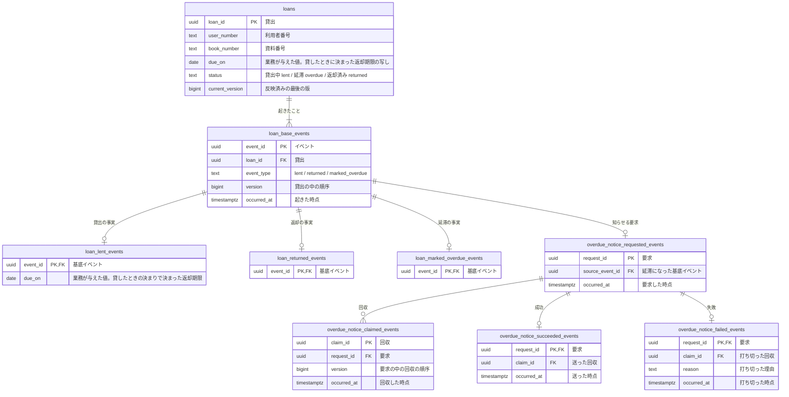

# 図書館の貸出の論理データモデル

図書館の窓口と利用者が「誰が、どの一冊を、いつまでに返す約束か」と「いつ延滞になったか」を後から説明できるように、貸出に起きたことを積む。

延滞になった利用者へ知らせる処理は、延滞にする処理と同期で行うと、外部への通知の失敗に延滞の記録まで巻き込まれる。そこで、延滞にするのと同じ一回の変更で通知の要求だけを積み、別の送り手が後で回収して送る形（Outbox）にした。頼んだ通知が必ず一度は終わるように、要求から成功か失敗までを追加のみで残す。

## 貸出だけを現在状態で持ち、ほかは起きたことを積む

| 系列 | 性質 | 論理テーブル | 保存表現 | 時刻 | 変化 | 根拠 |
|---|---|---|---|---|---|---|
| リソース系 | 業務 | `loans` | 現在状態 | なし | 更新あり | 業務知識「貸出」 |
| イベント系 | 業務 | `loan_base_events` | イベント列 | `occurred_at` | 追加のみ | 業務知識「業務イベント」 |
| イベント系 | 業務 | `loan_lent_events` | イベント列 | なし | 追加のみ | 業務イベント「本が貸し出された」 |
| イベント系 | 業務 | `loan_returned_events` | イベント列 | なし | 追加のみ | 業務イベント「本が返却された」 |
| イベント系 | 業務 | `loan_marked_overdue_events` | イベント列 | なし | 追加のみ | 業務イベント「貸出が延滞になった」 |
| イベント系 | 技術 | `overdue_notice_requested_events` | イベント列 | `occurred_at` | 追加のみ | 延滞を利用者へ知らせる要求 |
| イベント系 | 技術 | `overdue_notice_claimed_events` | イベント列 | `occurred_at` | 追加のみ | 同上 |
| イベント系 | 技術 | `overdue_notice_succeeded_events` | イベント列 | `occurred_at` | 追加のみ | 同上 |
| イベント系 | 技術 | `overdue_notice_failed_events` | イベント列 | `occurred_at` | 追加のみ | 同上 |

貸出はイベント列を選んだ。貸出、返却、延滞という名前のある出来事が順に起き、「延滞になった後に返した」のような経過を後から説明する必要があるからである。`loans`のいまの状態と`current_version`はイベントから導けるが、楽観ロックと毎回の貸出での読み取りのために妥協として持つ。

借りている冊数と貸出状況は、利用者の貸出を集計して得る情報である。そのためテーブルにも列にもせず、本を借りるときに`loans`から数える。

延滞の通知には、追い続ける対象が無い。要求そのものが最初の出来事なので、基底イベントを置かず、出来事ごとの表だけにした。

## 論理データモデル図



## 論理テーブル定義

### `loans`（貸出）

一行が、一冊の本を一人の利用者へ預けた約束一つを表し、その約束のいまの状態も持つ。返却期限は`loan_lent_events`の値の写しである。延滞にする候補を毎日返却期限で探すので、ここにも置く。

#### 業務制約: 一冊の本の貸出中か延滞の貸出は一つ

`status`が`lent`か`overdue`の貸出は、同じ`book_number`について一つしか無い。

#### 業務制約: 一人の貸出中と延滞の貸出は5冊まで

`status`が`lent`か`overdue`の貸出は、同じ`user_number`について5つを超えない（BDD-002）。

#### 業務制約: 現在の版は最後のイベントの版

`current_version`は、その貸出の`loan_base_events`の最大の`version`と等しい（BDD-004）。

### `loan_base_events`（貸出に起きたこと）

貸出に起きた業務イベントのうち、どの種類にも共通する事実を一行ずつ積む。`loan_id`と`version`の組は一意である。貸出日時は`lent`の行の`occurred_at`で、延滞にしたときの判定日時は`marked_overdue`の行の`occurred_at`で表す。

### `loan_lent_events`（本が貸し出された）

貸したときに業務が与えた返却期限を残す。返却期限はいまの決まりでは借りた日の14日後だが、計算で導かずにデータとして持つ。後で貸出期間の決まりが変わっても、すでに結んだ貸出の約束は変わらないからである。

### `loan_returned_events`（本が返却された）

返却に固有の事実は無いが、出来事の種類ごとに表を一つ置く形にそろえる。

### `loan_marked_overdue_events`（貸出が延滞になった）

延滞にも固有の事実は無い。判定日時は基底イベントの`occurred_at`で足りる。

### `overdue_notice_requested_events`（延滞の通知を頼んだ）

延滞になった貸出の利用者へ知らせる要求を、一件一行で積む。「貸出が延滞になった」と同じ一回の変更で記録する。知らせる相手は列に写さず、起因になった基底イベントから貸出を辿って読む。

### `overdue_notice_claimed_events`（延滞の通知を引き受けた）

送り手が要求を引き受けた事実を、回収のたびに一行積む。引き受けた送り手が止まっても要求が残り続けないように、引き受けには期限（リース）を置く。最新の回収の`occurred_at`から10分を過ぎても成功も失敗も無ければ、要求は再び回収できる。10分は仮に置いた値である。`request_id`と`version`の組は一意である。

### `overdue_notice_succeeded_events`（延滞の通知を送った）

送り終えた要求ごとに一行だけ積む。

### `overdue_notice_failed_events`（延滞の通知を打ち切った）

再試行しても結果が変わらないと分かった要求と、回収の回数が上限に達した要求を、この表に一行積んで候補から外す。上限の5回は仮に置いた値である。一つの要求につき一行だけ積む。

#### 業務制約: 成功と失敗はどちらか一つ

同じ`request_id`が成功と失敗の両方に現れない。

## 並行実行で必要な保証

同時に進むと結果が変わる組み合わせは四つある。

一つ目は、4冊借りている利用者が二冊を同時に借りる場合である。成立するのは一冊だけで、二冊とも成立して6冊になることは許さない。競合するのは一つの行ではなく、その利用者の`status`が`lent`か`overdue`の`loans`の行の集まりである。

一冊の本を二人が同時に借りたときは、一人だけが成立する。競合するのは、その本の`lent`か`overdue`の`loans`の行である。

延滞にするのと本を返すのが同じ貸出で重なったら、先に記録したほうだけが成立する。後のほうは、読んだ`current_version`がもう変わっているので成立しない（BDD-004）。

延滞の通知では、二つの送り手が同じ要求を同時に回収しうる。同じ`version`の回収は一つしか成立しない。

## 業務知識のシナリオとの対応

| 業務知識のBDD | この資料のBDD | 対象外の理由 |
|---|---|---|
| BDD-001 | BDD-001 | |
| BDD-002 | | 4冊目までの貸出は BDD-001 と同じ記録になる |
| BDD-003 | BDD-002 | |
| BDD-004 | | 延滞の有無で拒むのは BDD-002 と同じ形で、記録を変えない |
| BDD-005 | | 貸出中の本で拒むのは BDD-002 と同じ形で、記録を変えない |
| BDD-006 | | 本人の確認で拒まれ、記録に届かない |
| BDD-007 | | 返却は、延滞の BDD-003 と同じく基底イベントと詳細イベントを一行ずつ足し、貸出の状態と版を進める |
| BDD-008 | | BDD-007 と同じ記録になる |
| BDD-009 | | 返却済みは状態で拒まれ、記録を変えない |
| BDD-010 | BDD-003 | |
| BDD-011 | | 延滞にする前に拒まれ、記録を変えない |
| BDD-012 | BDD-004 | |
| BDD-013 | | 同時に借りたときの保証は「並行実行で必要な保証」に書いた |

## 未決

貸出を見分ける`loan_id`に当たる語は、業務知識に無い。ドメインモデルが「貸出番号」という語を業務知識へ提案している。

回収のリースを10分、打ち切るまでの回収の回数を5回と仮に置いた。通知を送る相手の応答時間が分かれば確定する。

## BDD

### [BDD-001] 本を借りると貸出と貸出の事実が生まれる

```gherkin
Given: 利用者 U-0001 は本を1冊も借りておらず、延滞の貸出も無い
  And: 本 B-1001 はどの貸出にも属していない
When: 利用者 U-0001 が2026年10月1日 10:00に本 B-1001 を借りる
Then: 貸出 L-001 が貸出中で生まれる
  And: 返却期限は2026年10月15日である
```

#### データの状態

**Before**

**`loans`**

| loan_id | user_number | book_number | due_on | status | current_version |
|---|---|---|---|---|---|
| （行なし） | | | | | |

**`loan_base_events`**

| event_id | loan_id | event_type | version | occurred_at |
|---|---|---|---|---|
| （行なし） | | | | |

**`loan_lent_events`**

| event_id | due_on |
|---|---|
| （行なし） | |

**After**

**`loans`**

| loan_id | user_number | book_number | due_on | status | current_version |
|---|---|---|---|---|---|
| **L-001** | **U-0001** | **B-1001** | **2026年10月15日** | **lent** | **1** |

**`loan_base_events`**

| event_id | loan_id | event_type | version | occurred_at |
|---|---|---|---|---|
| **E-001** | **L-001** | **lent** | **1** | **2026年10月1日 10:00** |

**`loan_lent_events`**

| event_id | due_on |
|---|---|
| **E-001** | **2026年10月15日** |

### [BDD-002] 5冊借りている利用者の6冊目は記録されない

```gherkin
Given: 利用者 U-0001 は貸出中の本を5冊借りており、延滞の貸出は無い
When: 利用者 U-0001 が2026年10月1日 10:00に本 B-1006 を借りる
Then: 貸出は生まれない
  NOTE: Rule: 貸出上限に達している利用者が本を借りる
    Reason: 一人の貸出中と延滞の貸出は5冊を超えない
```

#### データの状態

**Before**

**`loans`**

| loan_id | user_number | book_number | due_on | status | current_version |
|---|---|---|---|---|---|
| L-001 | U-0001 | B-1001 | 2026年10月10日 | lent | 1 |
| L-002 | U-0001 | B-1002 | 2026年10月10日 | lent | 1 |
| L-003 | U-0001 | B-1003 | 2026年10月12日 | lent | 1 |
| L-004 | U-0001 | B-1004 | 2026年10月12日 | lent | 1 |
| L-005 | U-0001 | B-1005 | 2026年10月14日 | lent | 1 |

**After**

**`loans`**

| loan_id | user_number | book_number | due_on | status | current_version |
|---|---|---|---|---|---|
| L-001 | U-0001 | B-1001 | 2026年10月10日 | lent | 1 |
| L-002 | U-0001 | B-1002 | 2026年10月10日 | lent | 1 |
| L-003 | U-0001 | B-1003 | 2026年10月12日 | lent | 1 |
| L-004 | U-0001 | B-1004 | 2026年10月12日 | lent | 1 |
| L-005 | U-0001 | B-1005 | 2026年10月14日 | lent | 1 |

### [BDD-003] 返却期限の翌日に延滞になり、通知の要求が同時に積まれる

```gherkin
Given: 貸出 L-001 は利用者 U-0001 の貸出中の貸出で、返却期限は2026年10月15日、版は1である
When: 図書館が判定日時2026年10月16日 00:05に貸出 L-001 を延滞にする
Then: 貸出 L-001 は延滞になり、版は2になる
  And: 利用者へ知らせる要求が同じ変更で積まれる
```

#### データの状態

**Before**

**`loans`**

| loan_id | user_number | book_number | due_on | status | current_version |
|---|---|---|---|---|---|
| L-001 | U-0001 | B-1001 | 2026年10月15日 | lent | 1 |

**`loan_base_events`**

| event_id | loan_id | event_type | version | occurred_at |
|---|---|---|---|---|
| E-001 | L-001 | lent | 1 | 2026年10月1日 10:00 |

**`loan_marked_overdue_events`**

| event_id |
|---|
| （行なし） |

**`overdue_notice_requested_events`**

| request_id | source_event_id | occurred_at |
|---|---|---|
| （行なし） | | |

**After**

**`loans`**

| loan_id | user_number | book_number | due_on | status | current_version |
|---|---|---|---|---|---|
| L-001 | U-0001 | B-1001 | 2026年10月15日 | **overdue** | **2** |

**`loan_base_events`**

| event_id | loan_id | event_type | version | occurred_at |
|---|---|---|---|---|
| E-001 | L-001 | lent | 1 | 2026年10月1日 10:00 |
| **E-002** | **L-001** | **marked_overdue** | **2** | **2026年10月16日 00:05** |

**`loan_marked_overdue_events`**

| event_id |
|---|
| **E-002** |

**`overdue_notice_requested_events`**

| request_id | source_event_id | occurred_at |
|---|---|---|
| **R-001** | **E-002** | **2026年10月16日 00:05** |

### [BDD-004] 返却が先に記録された貸出は延滞にならない

```gherkin
Given: 貸出 L-001 は版1の貸出中の貸出として読まれた
  And: その後、2026年10月15日 18:00の返却が先に記録され、版は2になった
When: 図書館が判定日時2026年10月16日 00:05に、読んだ版1の貸出 L-001 を延滞にする
Then: 延滞は記録されず、貸出 L-001 は返却済みのまま変わらない
  NOTE: Rule: 返却済みの貸出は変わらない
    Reason: 読んだ版と現在の版が違う
```

#### データの状態

**Before**

**`loans`**

| loan_id | user_number | book_number | due_on | status | current_version |
|---|---|---|---|---|---|
| L-001 | U-0001 | B-1001 | 2026年10月15日 | returned | 2 |

**`loan_base_events`**

| event_id | loan_id | event_type | version | occurred_at |
|---|---|---|---|---|
| E-001 | L-001 | lent | 1 | 2026年10月1日 10:00 |
| E-003 | L-001 | returned | 2 | 2026年10月15日 18:00 |

**After**

**`loans`**

| loan_id | user_number | book_number | due_on | status | current_version |
|---|---|---|---|---|---|
| L-001 | U-0001 | B-1001 | 2026年10月15日 | returned | 2 |

**`loan_base_events`**

| event_id | loan_id | event_type | version | occurred_at |
|---|---|---|---|---|
| E-001 | L-001 | lent | 1 | 2026年10月1日 10:00 |
| E-003 | L-001 | returned | 2 | 2026年10月15日 18:00 |

### [BDD-005] 通知の要求を回収して送ると成功が積まれる

```gherkin
Given: 要求 R-001 には回収も成功も失敗も無い
When: 送り手が2026年10月16日 00:06に要求 R-001 を回収し、同じ分に送り終える
Then: 回収と成功が一件ずつ積まれ、要求 R-001 は以後回収されない
```

#### データの状態

**Before**

**`overdue_notice_claimed_events`**

| claim_id | request_id | version | occurred_at |
|---|---|---|---|
| （行なし） | | | |

**`overdue_notice_succeeded_events`**

| request_id | claim_id | occurred_at |
|---|---|---|
| （行なし） | | |

**After**

**`overdue_notice_claimed_events`**

| claim_id | request_id | version | occurred_at |
|---|---|---|---|
| **C-001** | **R-001** | **1** | **2026年10月16日 00:06** |

**`overdue_notice_succeeded_events`**

| request_id | claim_id | occurred_at |
|---|---|---|
| **R-001** | **C-001** | **2026年10月16日 00:06** |

