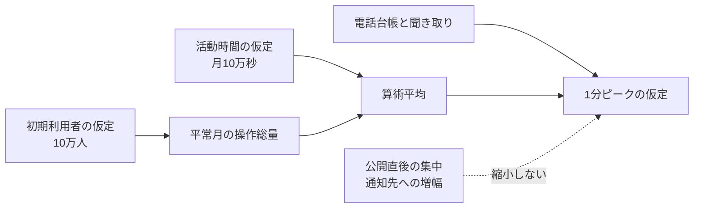

# RoomFlow予約サービスの利用規模と負荷モデル

<!-- これは`workload-model`型の記載例である。RoomFlowは組織内の共用会議室を予約する架空のサービスであり、利用量、分布、日付はすべて説明用である。 -->

RoomFlowの初期本番は利用者10万人を対象とし、検索120件/秒、予約・変更・取消20件/秒を1分ピークの設計入力とする。容量を左右するのは月間総量だけではない。人気枠の公開直後に同じ利用枠へ予約が集中することと、一件の状態変更が予約者と施設管理者の二つの通知へ増えることを、縮小しない負荷特性として扱う。

## 結論

平常月は検索150万件、予約・変更・取消30万件、利用枠の公開・更新5万件と仮定する。算術平均はそれぞれ15件/秒、3件/秒、0.5件/秒だが、容量判断には1分ピークの120件/秒、20件/秒、8件/秒を使う。

検索量と予約量は試験導入前の推定である。年末繁忙期の倍率が未決なので、このモデルは平常月の初期設計と負荷試験には使えるが、年間最大容量の確定根拠には使わない。

## 採用値ができるまで

月間の活動時間は25営業日×4,000秒=10万秒と仮定した。検索件数は類似サービスの公開情報、予約件数は電話台帳、利用枠更新は施設管理者への聞き取りから外挿している。いずれもRoomFlowの実測値ではない。

## 今回採用する利用量

### 一月当たりの操作回数

- 検索: 150万件/月
- 予約・変更・取消: 30万件/月
- 利用枠の公開・更新: 5万件/月
- 通知: 状態変更30万件×2人=60万配送/月

通知は予約者と施設管理者の双方へ知らせるという合意から二配送とした。通知経路は未決であり、この件数から製品や方式は決めない。

### 平均とピーク

| 操作・イベント | 月間総量 | 算術平均 | 1分ピーク | 根拠状態 |
|---|---:|---:|---:|---|
| 利用枠の検索 | 150万件 | 15件/秒 | 120件/秒 | 仮説 |
| 予約・変更・取消 | 30万件 | 3件/秒 | 20件/秒 | 電話台帳からの推定 |
| 状態変更の通知 | 60万配送 | 6配送/秒 | 60配送/秒 | 通知先数は合意、率は仮説 |
| 利用枠の公開・更新 | 5万件 | 0.5件/秒 | 8件/秒 | 仮説 |

ピーク値は常時処理する量ではない。公開直後や始業前に短時間だけ集中する入力として扱う。

## 分布の偏りと処理の増幅

金曜18時台に検索の25%が集中し、都市部20施設が検索の60%を占めると仮定する。人気会議室では、枠の公開直後3分間に予約要求が平均の7倍へ増え、同じ利用枠IDへ集中する。

一件の状態変更は二配送へ増幅する。一括変更では同じ施設に関する通知が平均の10倍で2分間続くと仮定する。利用者数を縮小しても、同じ枠への競合と一操作あたりの通知先数は同じ比率で縮小しない。

## データ量・保持・増加

予約一件を4KB、利用枠一件を3KB、通知記録一件を2KBとして容量の下限を見積もる。行や索引のオーバーヘッド、複製、バックアップはこの値に含めない。

| データ | 増加 | 通常利用から外す条件 | 物理消去 |
|---|---:|---|---|
| 予約 | 新規24万件/月 | 利用日の翌月末 | 7年を仮説とし、法務確認で決める |
| 利用枠と変更履歴 | 5万件/月 | 利用日の翌月末 | 7年を仮説とする |
| 通知記録 | 60万件/月 | 90日 | 90日を初期値とする |
| 検索ログ | 150万件/月 | 30日 | 30日を初期値とする |

通常利用から見えなくなる時点と、物理的に消去する時点は別に扱う。

## 設計へ渡す境界

| 対象 | 初期の設計入力 | 超えたときに見直す判断 | 検証方法 |
|---|---|---|---|
| 検索 | 120件/秒を10分間 | 読み取り容量と検索範囲 | 試験導入5施設で4週間計測 |
| 予約系 | 20件/秒。同一枠へ同時要求が集中 | 競合制御と書き込み容量 | 同時要求試験 |
| 通知 | 60配送/秒 | 滞留容量と非同期化 | 配送記録と最古滞留時間の集計 |

## 計算と仮定

- 検索平均: 150万件÷10万秒=15件/秒。確度は中。利用者数と一人当たり検索回数が推定である
- 予約系平均: 30万件÷10万秒=3件/秒。確度は中。電話台帳からの外挿である
- 通知平均: 30万状態変更×2配送÷10万秒=6配送/秒。通知先数の確度は高いが、状態変更件数は推定である
- 利用枠更新平均: 5万件÷10万秒=0.5件/秒。確度は低い。施設管理者への聞き取りだけを根拠にしている

実測ピークが仮説の半分未満または二倍超になった場合は、初期設計の容量と流量制御を見直す。

## まだ決まっていないこと

- 年末繁忙期が平常月の何倍になるか。20施設の前年実績を取得して決める
- 通知経路。事業責任者の決定後に、配送量の母集団と失敗時の再送条件を見直す
- 予約事実の物理保持年限。法務確認の結果を容量計算へ戻す

## 追跡情報

本文を読むためにIDを追う必要はない。後続資料から設計入力を参照するときだけ使う。

| ID | 設計入力 | 根拠と状態 | 影響する要求・判断 |
|---|---|---|---|
| DIN-001 | 月間活動時間10万秒 | 営業日からの推定、hypothesis | 全操作の平均率 |
| WL-001 | 検索120件/秒 | 類似サービスからの推定、hypothesis | REQ-002、読み取り容量 |
| WL-002 | 予約系20件/秒と同一枠への集中 | 電話台帳からの推定、hypothesis | REQ-002、DRV-001、競合制御 |
| WL-003 | 通知60配送/秒 | 通知先数はagreed_decision、率はhypothesis | REQ-004、非同期化 |
| WL-004 | 利用枠の公開・更新8件/秒 | 仮説、hypothesis | REQ-001、検索への反映 |
| WL-OQ-001 | 年末繁忙期の倍率 | open_question | 最大容量、可用性、費用 |
