# <対象業務>の業務知識

<!-- 執筆指示: 仕組みを全部やめても残る業務の行いと決まりを、業務の言葉と、この資料で名前を一つに決めた語（ユビキタス言語）だけで書く。
     読み手は、業務を知る人と作り手である。どちらも決まりを先に読み、BDDで具体の場面を確かめる。
     書き始める前に、この業務が何のために何をする業務かを一文で決める。これがこの資料の主メッセージで、「概要」の最初の一文になる。
     一文で決められないなら、業務の目的の素材が足りないので、書き進めずに依頼元へ返す。
     一つの決まりは一か所にだけ書き、なぜその決まりがあり、破られると誰が何に困るのかを業務の言葉で書く。
     反映の遅れ、キャッシュ、一回に返す件数、画面、API、保存の仕方のような実装の関心は書かない。
     冒頭は段落で始め、誰が何のために読み、この業務がどこから始まりどこで終わるかを言い切る。 -->

<!-- 検査が読む目印: ほかの package の検査がこの型の資料から読むのは、ここに書いた目印だけである。見出しの文言は読まないので、見出しには節の結論を入れてよい。
     ユビキタス言語は、見出し行が `| 業務の言葉 | 英名 | 種類 | 持ち主 |` の表に1語1行で置く。種類は `業務用語`、`業務イベント`、`概念`、`コマンド`、`クエリ` のどれか一つで、一つの語は一行だけに置く。業務用語でもある概念は `業務用語` として置く。
     持ち主は、その語を決めた資料がこの資料なら `この資料`、ほかの業務知識の資料が決めた語なら、その資料への相対 Markdown リンクにする。ほかの資料が決めた語は、持ち主の行と同じ言葉、英名、種類で置く。
     状態を持つものごとに、状態遷移図を1行目が `---` の Mermaid ブロックで描く。ブロックの先頭は `---`、`title: <状態を持つもの>`、`---` の三行で、その次の行が `stateDiagram-v2` である。遷移の行は `<状態> --> <状態>: <業務の行い>` にし、生成は `[*]` から始め、終端は `--> [*]` で閉じる。状態の名前は、図に書いた状態名だけを使う。
     拒む理由は、業務の行いの `###` の下に `#### 拒む理由: <名前>` の見出しで一つずつ置く。
     BDD は `### [BDD-<3桁以上の数字>] <業務結果>` の見出しで一件ずつ置く。拒否の BDD の `NOTE: Rule: <名前>` は、この資料の拒む理由の名前のどれかと一致させる。 -->

<冒頭の言い切り>

# 概要

<!-- 書く: 最初の一文に、執筆指示で決めた主メッセージを置く。続けて、誰が何をなぜ行う業務か、この業務が守りたい価値を、因果がつながる段落で書く。
     段落を分けて、この業務が担わないことと、それを担う隣の業務を書く。 -->

<業務の目的と中核の価値。この業務が担わないこと>

# ユビキタス言語

<!-- 業務を知る人と作り手が、本文、図、BDDで使う名前を一つに決める節である。同じ意味の語を二つ残さない。
     書く: 節の冒頭に、業務の言葉と英名の対応表を置く。業務用語、業務イベント、概念、業務の行い（コマンドとクエリ）のすべてに英名を付け、行ごとに種類と持ち主を書く。
     業務の言葉ごとに英名を一つ置く。業務イベントの英名は過去形にする。実装とドメインモデルはこの表の英名を使う。
     語と英名を決めるのは、その語が指すものを作ったり変えたりする業務の資料一本だけである。ほかの業務の語は、持ち主の資料の行を写し、下の節で定義し直さない。
     状態名と業務イベントの名前は、その状態にある人、その行いをした人が会話で使う言葉を素材から取る。業務イベントは「本を借りた」のように、行った人の「〜した」の形にする。
     素材に言葉が無ければ仮に置き、まだ決まっていないことに書く。「〜済み」のような、説明のために作った語を置かない。 -->

| 業務の言葉 | 英名 | 種類 | 持ち主 |
|---|---|---|---|
| <業務用語> | <英名> | 業務用語 | この資料 |
| <業務イベント> | <過去形の英名> | 業務イベント | この資料 |
| <ほかの業務が決めた語> | <持ち主と同じ英名> | 業務用語 | [<持ち主の資料>](<相対パス>) |
| <業務の行い> | <英名> | コマンド | この資料 |
| <業務の行い> | <英名> | クエリ | この資料 |

## 業務用語

<!-- 書く: この資料が持ち主の、業務で扱う物、人の役割、値のそれぞれについて ### を立てる。
     その下の一段落に、意味と、似た語とどこが違うか、どの判断に使うかを書く。状態の名前は状態の節に書く。 -->

### <業務用語>

<意味。似た語との境界。判断に使う場面>

## 業務イベント

<!-- 書く: この資料が持ち主の、すでに起きて業務上の判断、状態、責任のどれかを変えた事実ごとに ### を立てる。その下の一段落に、何が起き、何が変わるかを書く。 -->

### <業務イベント>

<何が起き、何が変わるか>

# 概念

<!-- 書く: 業務上のまとまりごとに ## を立て、それが業務で何を表すかと、それにかかわる決まりを文章で書く。 -->

## <概念名>

<その概念が業務上何を表すか。それに紐づく決まり>

# 常に守られること

<!-- 書く: いつでも破ってはならない決まりごとに ### を立て、見出しには決まりそのものを言い切りで書く。その下の一段落に、破れたときに誰が何に困るかを書く。
     素材が「後から説明できること」を求めていれば、誰が何を説明するためかと一緒に、ここに決まりとして書く。
     決まりが続くときは、段落をどれも「破れると」で始めず、書き出しを変える。
     書かない: 特定の状態や行いでだけ成り立つ条件（それは業務の行いに書く）。 -->

### <常に守られること>

<破れたときに誰が何に困るか>

# 状態と、その移り変わり

<!-- 書く: 状態があるものごとに ## を立て、状態遷移図を一つ置く。矢印のラベルは業務の行いの名前にする。期限が来たときや別の出来事で移る場合も、その移り変わりを起こす行いの名前にする。
     図の下には、図から読めない終端の意味や、移れない理由だけを書く。状態が無い業務なら、見出しの下に「状態を持たない」と一文で書く。 -->

## <状態を持つもの>

```mermaid
---
title: <状態を持つもの>
---
stateDiagram-v2
    [*] --> <状態A>: <業務の行い>
    <状態A> --> <状態B>: <業務の行い>
    <状態B> --> [*]
```



# 業務の行い

<!-- 書く: 業務を変える行いは ## コマンド の下に、業務を変えずに知る行いは ## クエリ の下に、行いごとに ### を立てる。一つの行いの決まりは、この ### の下にだけ書く。
     最初の段落に、誰が行えるかと、ほかの人が行うと誰が何に困るかを書く。
     コマンドでは、続く段落に、成り立つ条件と境界値、成り立つと起きる業務イベントを書く。
     クエリでは、続く段落に、何を表示するか（表示対象の条件）と、どの順で並べるかを書く。
     表示対象と並び順を変えない値（一回に返す件数、探すための一覧の既定の並び）は書かず、「<値>は<置き場>に置いた」と一行だけ残す。置き場は API の契約か品質要求である。
     拒む理由は #### の見出しを一つずつ立て、その下の一段落に業務上の理由を書く。
     コマンドを持たず、隣の業務の事実を読むだけの業務なら、## コマンド の下に「なし」と一文で書く。 -->

## コマンド

### <業務の行い>

<誰が行えるかとその理由>

<成り立つ条件と境界値。起こす業務イベント>

#### 拒む理由: <拒む理由の名前>

<この条件で拒む業務上の理由>

## クエリ

### <業務の行い>

<誰が行えるかとその理由>

<表示対象の条件と並び順。業務知識に置かない値の置き場>

# 導出されること

<!-- 書く: 条件から一つに決まるもの（計算、選び方）と、その決まり方を文章で書く。無ければ見出しごと置かない。 -->

<導出されることと、その決まり方>

# 同時に起きたとき

<!-- 書く: 同時に起きることごとに ### を立て、業務上どちらが通るかと、その理由を一段落で書く。どの項目にも BDD を一件置き、勝った側の結果と、負けた側に何が起きないかを示す。
     同時に起きても困らない業務なら、見出しの下に「なし」と一文で書く。 -->

### <同時に起きること>

<どちらが通るか。その理由>

# まだ決まっていないこと

<!-- 書く: まだ決まっていない論点、仮に置いた語や値、何が分かれば決まるか。決まっていないことを、決まったことのように書かない。無ければ「なし」と一文で書く。 -->

なし

# BDD

<!-- 書く: 上で決めた決まりが具体の場面でどう働くかを、Given / When / Then の独立した場面で示す。上の節に無い新しい決まりを持ち込まない。
     Givenに判断に要る事前状態を、Whenに行いか出来事を一つ、Thenに結果と次の状態を書く。
     拒否の場面では、Thenの直下に NOTE: Rule: と Reason: を置く。Rule には、業務の行いに書いた拒む理由の名前を書く。
     年月日は「YYYY年M月D日」、時間帯は「YYYY年M月D日 HH:MMからHH:MMまで」と書く。
     場面を要約する表は置かない。見出しが要約になる。 -->

## <グループ（業務の行いに対応させる）>

### [BDD-001] <業務結果で書いた見出し>

```gherkin
Given: <行える人と対象が特定された事前状態>
  And: <判断に必要な別の事前状態>
When: <業務の行いか出来事>
Then: <成立または拒否される結果>
  And: <次の状態、変わる権利・責任>
  NOTE: Rule: <拒む理由の名前>
    Reason: <この条件で拒まれる理由>
```
