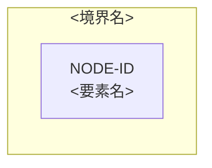

# クラウドアーキテクチャ — <対象>

<!-- 執筆指示: 要求・負荷・品質・制約を根拠に将来構成を比較・選定する。現在構成の説明はarchitecture型へ分ける。
     冒頭は本文段落で始め、誰が何のために読み、どこから始まり、何が観測できたら完了かを文章で運ぶ。型・対象・日付・確認者の一覧や引用blockを冒頭に置かない。 -->

<!-- 機械検査が読む記法（system-designの検査scriptはこの記法だけを構文解析する。ここに1度だけ書く）:
     - H2見出しはこのtemplateの名前と順序を固定する。追加・改名・並べ替えをしない。冒頭はH2より前の本文段落。節の中の本文段落は自由に書ける。
     - IDは `<接頭辞>-<3桁以上の数字>`。仮説は `ARC-HYP-<数字>`、未決は `ARC-OQ-<数字>`（資料接頭辞は要求発見=REQ、負荷=WL、品質=QR、構成=ARC。上流の未決を継続する行は上流のIDをそのまま使う）。図ノードは `NODE-<英大文字・数字>`。
     - 根拠状態の語は `fact` / `agreed_decision` / `hypothesis` / `open_question` の機械値をそのまま書く（backtick可）。
     - 表は見出し行の列名と順序をtemplateどおりにする。1セルに複数IDを書くときは `、` で区切る。該当なしは列の指示語（なし / 未決 / 未作成 / 非該当）を書き、空欄にしない。
     - `### <ID>: <一文>` の小見出しで要素を定義し、その本文の項目は `<ラベル>: ` で行を始める。`## 代替案比較` は プロバイダー / リージョン/AZ / 計算処理 / ネットワーク / ストレージ / データベース / メッセージング / ID管理 / エッジ / 可観測性 / バックアップ/DR / デリバリー の12項目を各1行、状態は agreed_decision / hypothesis / open_question / not_applicable（open_question の行は採用候補を 未決、not_applicable の行は採用候補を 非該当 にし不利・リスクに理由を書く）。プロバイダー行の採用候補は AWS または GCP で、根拠IDに利用者が入力した `CON-` を含める。ADR IDは `ADR-`、経路IDは `FAIL-`（起点は `NODE-`）。`## インフラ構成図` は mermaid ブロック1つで flowchart から始め、`## 採用構成` の全 `NODE-` を表示名に含める。全 `ADR-` と全 `NODE-` は `## 要求トレーサビリティ` のどこかの行に現れる。 -->

<冒頭の言い切り。どのプロバイダーとどの構成を第一候補にし、誰がどの判断へ渡すか。未決が残るなら実装へ渡せる最終決定ではないことを示す>

## 設計入力と制約

<!-- 書く: REQ/WL/QR/制約ID、根拠状態、利用者が入力したプロバイダーとその根拠制約（CON-）。書かない: 入力要求・論理設計の作り直し。 -->

| 入力ID | 根拠状態 | 内容 | 設計への影響 |
|---|---|---|---|
| <REQ/WL/QR/CON-ID> | fact / agreed_decision / hypothesis / open_question | <一文> | <選定項目> |

## 代替案比較

<!-- 書く: プロバイダー、リージョン/AZ、計算処理、ネットワーク、ストレージ、データベース、メッセージング、ID管理、エッジ、可観測性、バックアップ/DR、デリバリーの候補とトレードオフ。書かない: 人気だけを理由にした選定。 -->

| 選定項目 | 採用候補 | 代替案 | 根拠ID | 利点 | 不利・リスク | 状態 |
|---|---|---|---|---|---|---|
| <12項目のどれか> | <候補、または 未決 / 非該当> | <代替> | <REQ/WL/QR/CON-ID> | <利点> | <不利。非該当の理由> | agreed_decision / hypothesis / open_question / not_applicable |

## 採用構成

<!-- 書く: 主要サービス選定、役割、可用性単位、根拠ID。書かない: アプリケーション内部設計やTerraform。 -->

| 図ノードID | 役割 | 採用サービス | リージョン/AZ・可用性単位 | 根拠ID | 状態 |
|---|---|---|---|---|---|
| <NODE-ID> | <役割> | <サービス> | <配置> | <要求・負荷・品質・ADR ID> | agreed_decision / hypothesis / open_question |

## ADR

<!-- 書く: ADR-ID、判断、候補、根拠、結果、再検討条件。書かない: 時系列の作業記録。 -->

| ADR ID | 判断 | 候補 | 根拠ID | 結果・トレードオフ | 再検討条件 | 状態 |
|---|---|---|---|---|---|---|
| <ADR-ID> | <選ぶこと> | <比較候補> | <要求・負荷・品質ID> | <得ること・失うこと> | <条件> | agreed_decision / hypothesis |

## インフラ構成図

<!-- 書く: 編集可能なMermaidで判断に重要な境界、信頼領域、主要データフロー、外部依存をノードID付きで描く。
     可用性単位は配置判断に影響する場合だけ示す。書かない: 全サービス、全属性、詳細な理由、本文の完全な複製。 -->

## 障害・縮退経路

<!-- 書く: 障害および縮退経路、検知、影響、復旧、関連QR/図ノード。書かない: 詳細な運用手順。 -->

| 経路ID | 起点 | 影響 | 縮退 | 検知・復旧 | 関連ID |
|---|---|---|---|---|---|
| <FAIL-ID> | <NODE-ID> | <何が止まるか> | <残す機能> | <検知と復旧方針> | <品質要求・ADR ID> |

## 要求トレーサビリティ

<!-- 書く: REQ/WL/QRからADRと図ノードへの対応。書かない: 根拠のないサービス名。 -->

| 要求ID | 負荷ID | 品質要求ID | ADR ID | 図ノードID | 検証 |
|---|---|---|---|---|---|
| <要求ID> | <負荷ID> | <品質要求ID> | <ADR ID> | <図ノードID> | <どう確かめるか> |

## 仮説と未決

<!-- 書く: hypothesis/open_question、設計感度、検証計画、blocked_by。書かない: 採用済みへの昇格。 -->

| ID | 根拠状態 | 内容 | 設計感度 | 検証計画 | 影響先 |
|---|---|---|---|---|---|
| <ARC-HYP-ID / ARC-OQ-ID> | hypothesis / open_question | <内容> | <変わる選定> | <確認方法> | <ADR・図ノードID> |

## この資料に書かないもの

<!-- 書く: 要求、Journey、Domain、論理データモデル、アプリケーション内部設計、Terraformの検討先。書かない: それらの内容。 -->

| 書かないこと | 検討先 |
|---|---|
| <別責務> | <対応する正本> |
