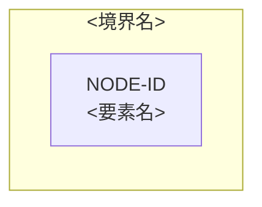

# クラウドアーキテクチャ — <対象>

<!-- 執筆指示:
     この型は、要求、利用負荷、品質、制約を根拠に、これから作るクラウド構成の候補を比べて選び、将来構成を決める人へ渡す。いま動いている構成の説明は architecture 型で書く。
     書く前に、主メッセージを一文で決める。「プロバイダーは合意済みのものを使い、管理サービス中心の単一リージョン構成を第一候補にするが、復旧目標が未決なので実装へはまだ渡さない」のように、第一候補の構成と、それを最終決定にできない理由を一文に入れる。
     冒頭はH2より前の本文段落で始め、誰が何のために読み、何が決まっていて、何が決まれば実装へ渡せるかを文章で書く。型、対象、日付、確認者の一覧や引用ブロックを冒頭に置かない。
     見出しは機械検査が名前と順序で読むので、結論を見出しに入れられない。そのかわり、表の前後の段落の最初の文にその節の結論を書く。表は検査が読むので、行が少なくても残す。表のセルには値か短い語を置き、なぜその候補を選んだかは表の後の本文で書く。 -->

<!-- 機械検査が読む記法（system-design の検査スクリプトは、この記法だけを構文解析する。記法はここに一度だけ書く）:
     - H2見出しは、このテンプレートの名前と順序のまま使う。足さず、改名せず、並べ替えない。冒頭はH2より前の本文段落にする。各節の中の本文段落は自由に書ける。
     - IDは `<接頭辞>-<3桁以上の数字>` の形にする。仮説は `ARC-HYP-<数字>`、未決は `ARC-OQ-<数字>` とする（資料ごとの接頭辞は、要求発見が REQ、負荷が WL、品質が QR、構成が ARC）。上流の未決を引き継ぐ行は、上流のIDをそのまま使う。図のノードは `NODE-<英大文字・数字>` とする。
     - 根拠状態は `fact` / `agreed_decision` / `hypothesis` / `open_question` の機械値をそのまま書く（backtick で囲んでもよい）。
     - 表は、見出し行の列名と順序をテンプレートのとおりにする。一つのセルに複数のIDを書くときは `、` で区切る。該当が無いときは空欄にせず、列ごとの指示語（なし / 未決 / 未作成 / 非該当）を書く。
     - `### <ID>: <一文>` の小見出しで要素を定義するときは、その本文の項目を `<ラベル>: ` で始まる行で書く。
     - `## 代替案比較` には、プロバイダー / リージョン/AZ / 計算処理 / ネットワーク / ストレージ / データベース / メッセージング / ID管理 / エッジ / 可観測性 / バックアップ/DR / デリバリー の12項目を一行ずつ置く。状態は agreed_decision / hypothesis / open_question / not_applicable のどれかにする。open_question の行は採用候補を 未決 に、not_applicable の行は採用候補を 非該当 にし、不利・リスクにその理由を書く。
     - プロバイダー行の採用候補は AWS か GCP にし、根拠IDに利用者が入力した `CON-` を含める。ADRのIDは `ADR-`、障害・縮退の経路のIDは `FAIL-` とし、経路の起点には `NODE-` を書く。
     - `## インフラ構成図` には mermaid ブロックを一つだけ置き、flowchart から始め、`## 採用構成` のすべての `NODE-` を表示名に含める。
     - すべての `ADR-` とすべての `NODE-` が、`## 要求トレーサビリティ` のどこかの行に現れるようにする。 -->

<冒頭の段落。どのプロバイダーとどの構成を第一候補にし、誰がどの判断へ渡すかを言い切る。未決が残るなら、実装へ渡せる最終決定ではないことと、何が決まれば渡せるかを書く>

## 設計入力と制約

<!-- 構成を左右する要求、負荷、品質、制約のIDと根拠状態、利用者が入力したプロバイダーとその根拠になる制約（CON-）を書く。表の前の段落で、どの入力を構成の中心に置いたかを先に言う。
     入力の要求や論理設計を、ここで作り直さない。 -->

| 入力ID | 根拠状態 | 内容 | 設計への影響 |
|---|---|---|---|
| <REQ/WL/QR/CON-ID> | fact / agreed_decision / hypothesis / open_question | <一文> | <選定項目> |

## 代替案比較

<!-- 12の選定項目ごとに、採用候補、代替案、利点、不利とリスクを並べる。表の前の段落で、何を物差しにして比べたかを書く。人気や採用事例の多さだけを理由に選ばない。 -->

| 選定項目 | 採用候補 | 代替案 | 根拠ID | 利点 | 不利・リスク | 状態 |
|---|---|---|---|---|---|---|
| <12項目のどれか> | <候補、または 未決 / 非該当> | <代替> | <REQ/WL/QR/CON-ID> | <利点> | <不利。非該当の理由> | agreed_decision / hypothesis / open_question / not_applicable |

## 採用構成

<!-- 主なサービスの選定、それぞれの役割、可用性の単位、根拠IDを書く。構成全体の形を決めた理由は、表の前の段落で書く。
     アプリケーション内部の設計や Terraform のコードは書かない。 -->

| 図ノードID | 役割 | 採用サービス | リージョン/AZ・可用性単位 | 根拠ID | 状態 |
|---|---|---|---|---|---|
| <NODE-ID> | <役割> | <サービス> | <配置> | <要求・負荷・品質・ADR ID> | agreed_decision / hypothesis / open_question |

## ADR

<!-- 構成を決めた判断ごとに、選んだこと、比べた候補、根拠、得るものと失うもの、見直す条件を書く。判断が一つでも、表は検査が読むので残す。判断の前提になった合意は、表の後の本文で書く。
     作業の経過を時系列で書かない。 -->

| ADR ID | 判断 | 候補 | 根拠ID | 結果・トレードオフ | 再検討条件 | 状態 |
|---|---|---|---|---|---|---|
| <ADR-ID> | <選ぶこと> | <比較候補> | <要求・負荷・品質ID> | <得ること・失うこと> | <条件> | agreed_decision / hypothesis |

## インフラ構成図

<!-- 判断に効く境界、信頼の境界、主なデータの流れ、外部への依存を、ノードID付きの編集できる Mermaid で描く。図の前の一文で、図が何を示すかを言う。
     可用性の単位は、配置の判断に効くときだけ描く。すべてのサービス、すべての属性、詳しい理由、本文の丸写しは描かない。 -->

## 障害・縮退経路

<!-- どこが止まると何が止まり、何を残して縮退し、どう気付いてどう戻すかを、関係する品質要求と図のノードに結び付けて書く。詳しい運用手順は書かない。 -->

| 経路ID | 起点 | 影響 | 縮退 | 検知・復旧 | 関連ID |
|---|---|---|---|---|---|
| <FAIL-ID> | <NODE-ID> | <何が止まるか> | <残す機能> | <検知と復旧方針> | <品質要求・ADR ID> |

## 要求トレーサビリティ

<!-- 要求、負荷、品質のIDから、ADRと図のノードへの対応と、それをどう確かめるかを書く。根拠の無いサービス名は書かない。 -->

| 要求ID | 負荷ID | 品質要求ID | ADR ID | 図ノードID | 検証 |
|---|---|---|---|---|---|
| <要求ID> | <負荷ID> | <品質要求ID> | <ADR ID> | <図ノードID> | <どう確かめるか> |

## 仮説と未決

<!-- 仮説と未決ごとに、それが変わるとどの選定が変わるか、どう確かめるか、どのADRとノードに効くかを書く。上流から引き継いだ未決も、ここに並べる。
     仮説を、確かめないまま採用済みへ上げない。 -->

| ID | 根拠状態 | 内容 | 設計感度 | 検証計画 | 影響先 |
|---|---|---|---|---|---|
| <ARC-HYP-ID / ARC-OQ-ID> | hypothesis / open_question | <内容> | <変わる選定> | <確認方法> | <ADR・図ノードID> |

## この資料に書かないもの

<!-- 要求、Journey、ドメイン、論理データモデル、アプリケーション内部の設計、Terraform のように、ほかの資料が扱うものと、その検討先を段落で書く。それぞれの中身はここに書かない。 -->

<この資料で扱わないことと、それを扱う資料>
