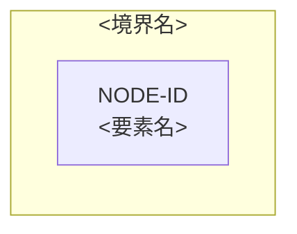

# クラウドアーキテクチャ — <対象>

<!-- 執筆指示:
     この型は、要求、利用負荷、品質、制約を根拠に、これから作るクラウド構成の候補を比べて選び、将来構成を決める人へ渡す。いま動いている構成の説明は architecture 型で書く。
     書く前に、主メッセージを一文で決める。「プロバイダーは合意済みのものを使い、管理サービス中心の単一リージョン構成を第一候補にするが、復旧目標が未決なので実装へはまだ渡さない」のように、第一候補の構成と、それを最終決定にできない理由を一文に入れる。
     以下の見出しは論点の案内であり、名前も順序もそのまま写さない。
     ID、根拠の状態、追跡の表、構成図のブロックは、write-doc の公開契約「検査が読む目印」の cloud-architecture に従う。 -->

<冒頭の段落。どのプロバイダーとどの構成を第一候補にし、誰がどの判断へ渡すかを言い切る。未決が残るなら、実装へ渡せる最終決定ではないことと、何が決まれば渡せるかを書く>

## <構成の中心に置いた要求と制約>

<!-- 構成を左右する要求、負荷、品質、制約を、上流のIDを添えて書く。利用者が指定したプロバイダーの根拠になる制約（CON-）もここで述べる。
     入力の要求や論理設計を、ここで作り直さない。 -->

<どの入力を構成の中心に置き、なぜそうしたか>

## <候補を比べた物差しと、選んだもの>

<!-- 構成を左右する領域（計算処理、データベース、メッセージング、リージョン/AZ など）ごとに、採用候補、比べた代替案、根拠、得るものと失うものを書く。全部の領域を同じ形で埋めない。
     決め切れない選定は候補を決めずに、決める問い（ARC-OQ-）へ結ぶ。対象の境界の外にある領域は、外にある理由を一文で書く。人気や採用事例の多さだけを理由に選ばない。 -->

<領域ごとの比較と選んだ理由>

## <ADR>

<!-- 構成を決めた判断ごとに ### ADR-<番号>: <決めたこと> の小見出しを立て、比べた候補、根拠、得るものと失うもの、考え直す条件、利用者が合意したかを本文で書く。
     作業の経過を時系列で書かない。 -->

### ADR-<番号>: <決めたこと>

<比べた候補、根拠、得るものと失うもの、考え直す条件、合意の状態>

## <構成図>

<!-- 判断に効く境界、信頼の境界、主なデータの流れ、外部への依存を、ノードID付きの編集できる Mermaid で描く。図の前の一文で、図が何を示すかを言う。
     可用性の単位は、配置の判断に効くときだけ描く。すべてのサービス、すべての属性、詳しい理由、本文の丸写しは描かない。 -->

## <障害時に何を残し、何を止めるか>

<!-- どこが止まると何が止まり、何を残して縮退し、どう気付いてどう戻すかを、障害の経路（FAIL-）ごとに、関係する品質要求と図のノードに結び付けて書く。詳しい運用手順は書かない。 -->

<障害の経路ごとの影響、縮退、検知と復旧>

## <後続の資料がIDで指すもの>

<!-- 制約、図のノード、ADR、障害の経路、仮説と未決を、追跡の表に1行ずつ置く。図のノードとADRは根拠にした要求・負荷・品質・制約のIDを、障害の経路は起点のノードを引く。
     仮説を、確かめないまま採用済みへ上げない。上流から引き継いだ未決も、上流のIDのまま置く。本文はこの表を見なくても読めるように書く。 -->

<追跡の表>

## この資料に書かないもの

<!-- 要求、Journey、ドメイン、論理データモデル、アプリケーション内部の設計、Terraform のように、ほかの資料が扱うものと、その検討先を段落で書く。それぞれの中身はここに書かない。 -->

<この資料で扱わないことと、それを扱う資料>
