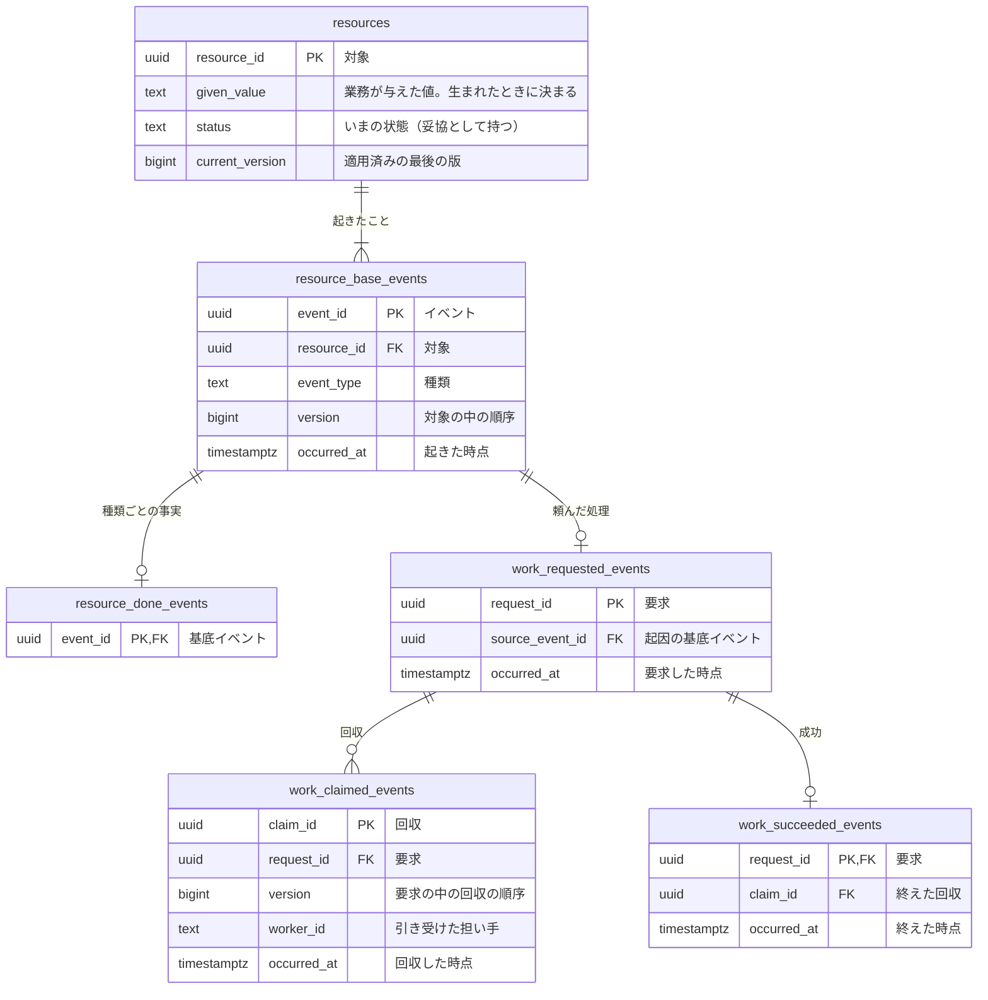

# <題材>のコマンドデータモデル

<!-- 執筆指示: この資料では、業務知識のコマンドが作成、更新、削除するデータを、テーブルの形と具体的な行で議論し、何を時間を越えて残すか、起きたことをどこに積むかを決める。読み取りはクエリデータモデルが扱う。
     冒頭の段落は、誰が何を後から説明するために、どの事実を残すかの一文から始める。
     議論の主役はBDDの Before と After で、各BDDには、そのWhenで読む・書くテーブルと、変わらないことを確かめるテーブルだけを具体的な行で置く。
     イベント列を選んだ対象は、リソース（<対象の複数形>）、基底イベント（<対象>_base_events）、詳細イベント（<対象>_<過去分詞>_events）の三つの表で書く。
     業務のリソースには、生まれたときに業務が与えた値と、status と current_version を置く。状態が一つしか無くても外さない。業務知識が状態を持たない対象では、status はその対象を生んだ業務イベントの基底イベントの種類と同じ値、current_version は 1 にし、状態名を作らない。
     後から導けず、失うと業務が続かない技術のデータ（決済事業者が返した取引の識別子など）は、系列を `リソース系`、性質を `技術` にしたテーブルで書き、根拠の欄は要件の品質要求を指してよい。status と current_version は業務のリソースにだけ置く。基底イベントには適用した後の版 version を置き、イベントの表の時刻は occurred_at の一本にする。
     リソースの単位は、一緒に守る決まりを一つの行と版で判定できるように切り、そう切った理由を書く。
     同期で行わない技術的な処理（Outbox）は、要求、回収、成功の三つのイベントの表で書く。止まった要求は、リースが切れたら同じ要求を再び回収する。
     打ち切り（諦めた事実）の表は、頼んだ側の業務か要件が諦めてよいと決め、諦めた後の扱いも決まっているときだけ置く。
     一つの要求が多数の単位に分かれて進むなら、単位を決めた事実を `<処理>_<単位>_planned_events` に、単位ごとの完了を `<処理>_<単位>_completed_events` に追加のみで積み、要求全体の成功はすべての単位が終わった後にだけ積む。完了を残す段は、完了を失うと再開の起点を決められない段か、やり直すと結果が変わる段だけにする。やり直しても結果が同じで、続きの位置が速さのためだけにある段は、物理設計へ申し送る。
     その時点の値で決め、後から同じ値を導けない技術上の判断（受け付けたときに選んだメールの送信事業者など）は、技術処理の要求の列に置き、業務のテーブルには置かない。
     型はPostgreSQLの型で書く。保存先の製品名、キューへの発行、キャッシュの作り直し、止まった要求を探すための予定表、索引、分離レベル、再試行、DDLは書かない。 -->

<!-- 検査が読む目印: ほかの package の検査がこの型の資料から読むのは、ここに書いた目印だけである。見出しの文言は読まないので、見出しには節の結論を入れてよい。
     この資料が定義するテーブルを、見出し行が `| 系列 | 性質 | 論理テーブル | 保存表現 | 根拠 |` の表（分類の表）に1テーブル1行で置く。テーブル名は backtick で囲む。性質は `業務` か `技術` のどちらかにする。
     ほかのコマンドデータモデルが定義するテーブルを読むときは、見出し行が `| 参照するテーブル | 読む列 | 持ち主の資料 |` の表（参照の表）に1テーブル1行で置く。テーブル名は backtick で囲み、読む列は backtick で囲んだ列名を `、` で区切り、持ち主の資料はそのテーブルを定義したコマンドデータモデルへの相対 Markdown リンクにする。参照するテーブルは分類の表に載せず、定義の見出しも置かない。参照が無ければ表ごと置かない。
     すべてのテーブルと列は、1行目が `erDiagram` の Mermaid ブロックに描き、属性は `<型> <名前> [PK|FK|UK] "<意味>"` の行にする。参照するテーブルは読む列だけを描く。業務の基底イベントとそのリソースは、`<リソース> ||--|{ <対象>_base_events : "<意味>"` の関係の行で結ぶ。
     技術処理は `<処理>_requested_events`、`<処理>_claimed_events`、`<処理>_succeeded_events` の三つを置き、回収の表には version と、引き受けた担い手の列を置く。単位の完了の表 `<処理>_<単位>_completed_events` を置くなら、同じ接頭辞の `<処理>_<単位>_planned_events` も置く。
     持ち主の資料がまだ無いテーブルは、参照の表の読む列の欄に `未定` と書き、図にも BDD の行にも載せない。持ち主の資料ができたら、同じ入口で深めて外す。
     テーブルごとの定義は、`### ` の直後に backtick で囲んだテーブル名を置いた見出しで始める。名前の後ろは自由に書いてよい。業務制約は `#### 業務制約: <制約名>` の行で書く。業務制約の名前は物理設計へそのまま写されるので、後から変えない。
     業務知識のBDDとの対応は、見出し行が `| 業務知識のBDD | この資料のBDD |` の表に、業務知識のすべてのBDDを1行ずつ置く。この資料のBDDの欄は、`BDD-<番号>` を `、` で区切ったもの、`クエリデータモデル`、`対象外` のどれかにする。
     BDD は `### [BDD-<3桁以上の数字>] <データの変化>` の見出しで一件ずつ置く。 -->

<!-- 分類の表の根拠の欄には、業務知識の節の名前か要求の出どころを短く書く。変化と時刻は系列と名前から決まるので書かない（イベント系は追加のみで、基底イベントと技術処理のイベントだけが occurred_at を持つ）。
     業務が与えた日付や時点は、意味を「業務が与えた値」で始める。 -->

<冒頭の言い切り。誰が何を後から説明するために、どの事実を残すか。同期で行わない処理があれば、その理由も>

## リソース系とイベント系

<!-- 書く: この資料が定義する全テーブルの分類を表にし、表の下に、保存表現をそう選んだ理由と、リソースの単位をそう切った理由を文章で書く。導ける情報を持たないと決めたなら、その情報をどこから得るかも書く。
     技術処理に基底イベントを置かないなら、その理由も一文で書く。 -->

| 系列 | 性質 | 論理テーブル | 保存表現 | 根拠 |
|---|---|---|---|---|
| リソース系 | 業務 | `<対象の複数形>` | 現在状態 | <業務知識の節> |
| イベント系 | 業務 | `<対象>_base_events` | イベント列 | <業務知識の節> |
| イベント系 | 業務 | `<対象>_<過去分詞>_events` | イベント列 | <業務知識の節> |
| イベント系 | 技術 | `<処理>_requested_events` | イベント列 | <要求の出どころ> |
| イベント系 | 技術 | `<処理>_claimed_events` | イベント列 | <要求の出どころ> |
| イベント系 | 技術 | `<処理>_succeeded_events` | イベント列 | <要求の出どころ> |

<保存表現とリソースの単位を選んだ理由>

## ほかの資料が持つテーブル

<!-- 書く: ほかの業務の資料が定義するテーブルを、このコマンドが読むときだけ置く。そのテーブルの形は持ち主が決めるので、ここでは読む列だけを挙げ、定義し直さない。 -->

| 参照するテーブル | 読む列 | 持ち主の資料 |
|---|---|---|
| `<テーブル>` | `<列>`、`<列>` | [<持ち主の資料>](<相対パス>) |

## コマンドデータモデル図

<!-- 書く: erDiagram で、全テーブル、全列、型、キー、関係、多重度を描く。列の一覧はここにだけ書く。参照は、詳細イベントが基底イベントを、基底イベントがリソースを、技術処理のイベントが要求を指す向きにする。 -->



## テーブル定義

<!-- 書く: テーブルごとに、一つの行が何を表すかを一段落で書く。図の一言では足りない列の意味だけを文章で足す。業務が与えた値がどう決まり、なぜ後から変わらないのかは、ここで書く。業務制約もここに置く。
     書かない: 図と同じ列の一覧、索引、DDL。 -->

### `<テーブル名>`（<日本語名>）

<このテーブルの一行が表す事実と、図の一言では足りない列の意味>

#### 業務制約: <制約名>

<許してはいけない組合せや状態と、根拠になるBDD>

## 並行実行で必要な保証

<!-- 書く: 同時に進むと結果が変わる操作の組ごとに、それを示すBDDと、競合する行の組を書く。業務知識の「同時に起きたとき」と、古い版に基づく書き込みは、どれもBDDにしてからここで束ねる。BDDの無い保証をここに書かない。
     書かない: 分離レベル、ロック、再試行、索引。どれも物理設計が決める。同時に進んでも結果が変わらないなら、この見出しを置かない。 -->

<同時に進む操作、示すBDD、競合する行>

## 業務知識のBDDとの対応

<!-- 書く: 業務知識のすべてのBDDを一行ずつ置く。セルには番号か短い語だけを書き、対象外にした理由は表の後の本文にまとめる。
     クエリのBDDは `クエリデータモデル` と書く。 -->

| 業務知識のBDD | この資料のBDD |
|---|---|
| BDD-001 | BDD-001 |

<対象外にしたBDDと、その理由>

## 未決

<!-- 書く: 確かめていない規則や保持条件、仮に置いた値と、それを誰に確かめるか。一件ずつ段落で書く。無ければ「なし」と一文で書く。 -->

<未決／なし>

## 物理設計への申し送り

<!-- 書く: 物理設計の担当が読むべき論点を一件ずつ段落で書く。要件に書かれた保存の形とこの資料の差、運び方と速さの方式の候補、index や分離レベルだけを変える論点がこれに当たる。報告は会話が終われば消えるので、ここに残す。
     無ければ「なし」と一文で書く。 -->

<申し送る論点／なし>

## BDD

<!-- この節は資料の末尾に置く。業務知識の掲載順で業務由来のBDDを先に、技術的な処理のBDDを後に置く。
     各BDDは単独で読めるようにし、必要な事前状態、既存の行、日時をすべてGivenとAndに書く。Whenは一つにし、二つの出来事が続くならBDDを分ける。年月日は「YYYY年M月D日」、時刻は「HH:MM」で書く。
     Before と After には、そのWhenで読む・書くテーブルと、変わらないことを確かめるテーブルだけを、同じ順序で置く。関係しないテーブルは載せない。
     件数やいまの状態のように導ける情報は、それを導く元の事実の行を置いて示す。
     載せたテーブルは、下流のテストがそのまま写すので、行の数に関わらず全カラムの見出しを持つ表にする。参照するテーブルは読む列だけにする。0件なら見出しだけの表にせず、先頭の列に「（行なし）」と書き残りの列を空けた行を一つ置く。変わったセルは太字にする。
     同時に起きる場面は、先に記録された側を Given に置き、後から記録しようとする側を When に置いて、何も増えないことを After で示す。
     拒否のThenの直下に NOTE: Rule: と Reason: を置く。SQL、DDL、APIの表現は書かない。 -->

### [BDD-001] <データの変化>

```gherkin
Given: <対象と事前状態>
  And: <既存の行と時刻>
When: <業務の行いか技術的な処理の出来事>
Then: <成立または拒否される結果>
  And: <追加される行>
```

#### データの状態

**Before**

**`<テーブルA>`**

| <列> | <列> |
|---|---|
| <値> | <値> |

**`<テーブルB>`**

| <列> | <列> |
|---|---|
| （行なし） | |

**After**

**`<テーブルA>`**

| <列> | <列> |
|---|---|
| <値> | <値> |
| **<追加された値>** | **<追加された値>** |

**`<テーブルB>`**

| <列> | <列> |
|---|---|
| **<追加された値>** | **<追加された値>** |
