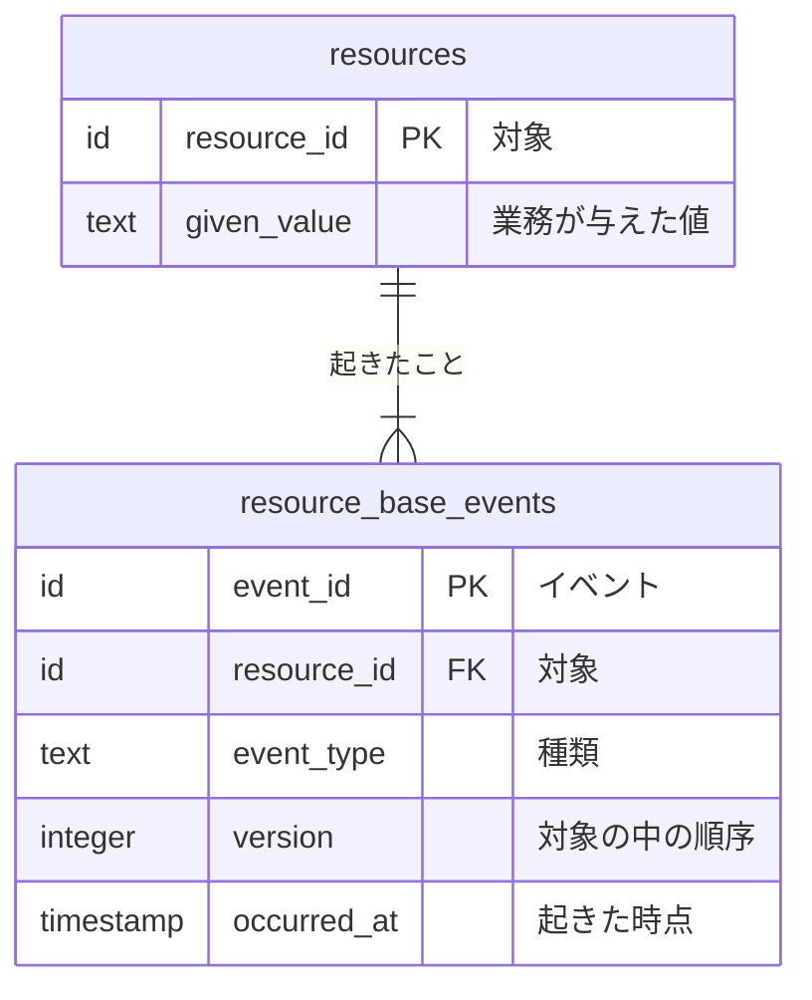

# <題材>のコマンドデータモデル

<!-- 執筆指示: この資料は、コマンドや技術処理が作成、更新、削除するデータを、テーブルの形と具体的な行で議論する。何を残し、どの型と単位で持つかは、この資料を作る入口が決める。
     冒頭の段落は、誰が何を判断するために、どの事実を残すかの一文から始める。議論の主役はBDDの Before と After である。 -->

<!-- 検査が読む目印: ほかの package の検査がこの型の資料から読むのは、ここに書いた目印だけである。見出しの文言は読まないので、見出しには節の結論を入れてよい。
     この資料が定義するテーブルを、見出し行が `| 系列 | 性質 | 論理テーブル | 保存表現 | 根拠 |` の表（分類の表）に1テーブル1行で置く。テーブル名は backtick で囲む。性質は `業務` か `技術` のどちらかにする。
     ほかのコマンドデータモデルが定義するテーブルを読むときは、見出し行が `| 参照するテーブル | 読む列 | 持ち主の資料 |` の表（参照の表）に1テーブル1行で置く。テーブル名は backtick で囲み、読む列は backtick で囲んだ列名を `、` で区切り、持ち主の資料はそのテーブルを定義したコマンドデータモデルへの相対 Markdown リンクにする。参照するテーブルは分類の表に載せず、定義の見出しも置かない。参照が無ければ表ごと置かない。
     定義したすべてのテーブルと列は、1行目が `erDiagram` の Mermaid ブロックに描き、属性は `<型> <名前> [PK|FK|UK] "<意味>"` の行にする。参照するテーブルは読む列だけを描く。業務の基底イベントとそのリソースを置く場合は、`<リソース> ||--|{ <対象>_base_events : "<意味>"` の関係の行で結ぶ。
     持ち主の資料がまだ置かれていない参照は、持ち主として予定した置き場への相対 Markdown リンクを置く。持ち主が決める列名は推測せず、分からない欄を `未定` と書く。テーブル名も分からないときは、その欄も `未定` と書く。そのテーブルは図にも BDD の行にも載せない。持ち主の予定自体が決まらなければ、この資料で補わず、資料を作る入口へ未決として返す。
     持ち主が作業の範囲の外にあり、資料が置かれないときは、参照の表の持ち主の資料の欄に `範囲の外: [<持ち主の資料の名前>](<パスかURL>)` と書く。その行はほかの資料と照合されない。
     テーブルごとの定義は、`### ` の直後に backtick で囲んだテーブル名を置いた見出しで始める。名前の後ろは自由に書いてよい。業務制約は `#### 業務制約: <制約名>` の行で書く。業務制約の名前は物理設計へそのまま写されるので、後から変えない。技術処理の重複や完了を守る条件は、根拠となる要求とともにテーブル定義とBDDで示す。
     業務知識を入力とする資料では、見出し行が `| 業務知識のBDD | この資料のBDD |` の表に、業務知識のBDDを1行ずつ置く。この資料のBDDの欄は、`BDD-<番号>` を `、` で区切ったもの、`クエリデータモデル`、`対象外` のどれかにする。技術処理だけを扱う資料では、入力の要求と処理結果の対応を、読み手が追うために必要な形で示す。
     BDD は `### [BDD-<3桁以上の数字>] <データの変化>` の見出しで一件ずつ置く。 -->

<!-- 分類の表の根拠の欄には、業務知識の節の名前か要求の出どころを短く書く。以下の業務リソースとイベントは業務入力の場合の記入例であり、テーブルの性質を「業務」とした場合にだけ使う。種類固有の事実が無ければ詳細イベント表は足さない。技術処理単独なら、入力から残す理由が分かる事実だけを性質「技術」として定義し、要求と処理結果の対応を示す。 -->

<冒頭の言い切り。誰が何を判断するために、どの事実を残すか。同期で行わない処理があれば、その理由も>

## リソース系とイベント系

<!-- 書く: この資料が定義する全テーブルの分類を表にし、表の下に、型と保存の単位をそう選んだ理由を文章で書く。 -->

| 系列 | 性質 | 論理テーブル | 保存表現 | 根拠 |
|---|---|---|---|---|
| リソース系 | 業務 | `<対象の複数形>` | 現在状態 | <業務知識の節> |
| イベント系 | 業務 | `<対象>_base_events` | イベント列 | <業務知識の節> |

<対象ごとに、選んだ型とその根拠の文。保存の単位をそう切った理由>

## ほかの資料が持つテーブル

<!-- 書く: ほかの資料が定義するテーブルを、このコマンドや処理が読むときだけ置く。そのテーブルの形は持ち主が決めるので、ここでは読む列だけを挙げ、定義し直さない。 -->

| 参照するテーブル | 読む列 | 持ち主の資料 |
|---|---|---|
| `<テーブル>` | `<列>`、`<列>` | [<持ち主の資料>](<相対パス>) |

## コマンドデータモデル図

<!-- 書く: erDiagram で、全テーブル、全列、型、キー、関係、多重度を描く。列の一覧はここにだけ書く。 -->


```mermaid
erDiagram
    resources {
        id resource_id PK "対象"
        text given_value "業務が与えた値"
    }
    resource_base_events {
        id event_id PK "イベント"
        id resource_id FK "対象"
        text event_type "種類"
        integer version "対象の中の順序"
        timestamp occurred_at "起きた時点"
    }
    resources ||--|{ resource_base_events : "起きたこと"
```

## テーブル定義

<!-- 書く: テーブルごとに、一つの行が何を表すかを一段落で書き、図の一言では足りない列の意味だけを足す。業務制約があればその見出しで置く。技術処理を守る条件は、求められる結果と失敗時に残る事実が分かる文章で書く。図と同じ列の一覧は書かない。 -->

### `<テーブル名>`（<日本語名>）

<このテーブルの一行が表す事実と、図の一言では足りない列の意味>

#### 業務制約: <制約名。業務制約がある場合だけ置く>

<許してはいけない組合せや状態と、根拠になるBDD>

## 並行実行で必要な保証

<!-- 書く: 同時に進むと結果が変わる操作の組ごとに、それを示すBDD、競合する事実の範囲、守る結果を書く。同時に進んでも結果が変わらないなら、この見出しを置かない。 -->

<同時に進む操作、示すBDD、競合する事実の範囲、守る結果>

## 業務知識のBDDとの対応

<!-- 書く: 業務知識を入力とするときに置き、すべてのBDDを一行ずつ示す。セルには番号か短い語だけを書き、対象外にした理由は表の後の本文にまとめる。技術処理単独なら、この節は入力の要求と処理結果の対応に置き換える。
     クエリのBDDは `クエリデータモデル` と書く。 -->

| 業務知識のBDD | この資料のBDD |
|---|---|
| BDD-001 | BDD-001 |

<対象外にしたBDDと、その理由>

## 未決

<!-- 書く: 確かめていない規則や保持条件、仮に置いた値と、それを誰に確かめるか。一件ずつ段落で書く。無ければ「なし」と一文で書く。 -->

<未決／なし>

## 物理設計への申し送り

<!-- 書く: 物理設計の担当が読むべき論点を一件ずつ段落で書く。無ければ「なし」と一文で書く。 -->

<申し送る論点／なし>

## BDD

<!-- この節は資料の末尾に置く。業務知識と技術処理の両方を扱うときは、業務知識の掲載順で業務由来のBDDを先に、技術的な処理のBDDを後に置く。
     各BDDは単独で読めるようにし、Whenは一つにする。年月日は「YYYY年M月D日」、時刻は「HH:MM」で書く。
     Before と After には同じテーブルを同じ順序で置く。載せたテーブルは、下流のテストがそのまま写すので、全カラムの見出しを持つ表にする（参照するテーブルは読む列だけ）。0件なら先頭の列に「（行なし）」と書き残りの列を空けた行を一つ置く。変わったセルは太字にする。
     拒否のThenの直下に NOTE: Rule: と Reason: を置く。 -->

### [BDD-001] <データの変化>

```gherkin
Given: <対象と事前状態>
  And: <既存の行と時刻>
When: <業務の行いか技術的な処理の出来事>
Then: <成立または拒否される結果>
  And: <追加される行>
```

#### データの状態

**Before**

**`<テーブルA>`**

| <列> | <列> |
|---|---|
| <値> | <値> |

**`<テーブルB>`**

| <列> | <列> |
|---|---|
| （行なし） | |

**After**

**`<テーブルA>`**

| <列> | <列> |
|---|---|
| <値> | <値> |
| **<追加された値>** | **<追加された値>** |

**`<テーブルB>`**

| <列> | <列> |
|---|---|
| **<追加された値>** | **<追加された値>** |
