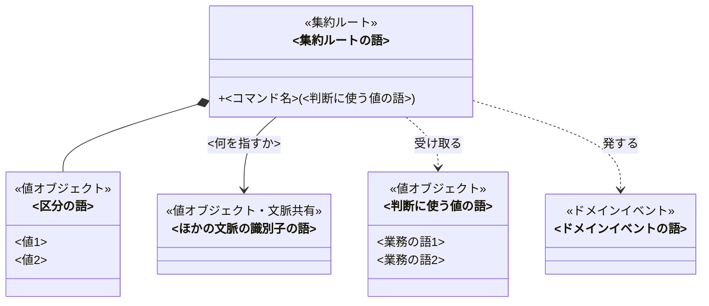

# <題材>のドメインモデル

<!-- 執筆指示: この資料は、業務を形にするエンジニアが図を囲んで「どこに境界を引き、どのコマンドが何を拒むか」を議論するために使う。
     主役はクラス図と状態遷移図である。文章は図で表せないことだけに使い、一つの論点は一か所にだけ書く。
     節ごとに書くことは各節のコメントが決める。書くことが無い見出しは置かない。
     図のラベル、状態名、コマンド名、拒む理由は、業務知識のユビキタス言語の語をそのまま使う。業務知識に無い語が要るなら、図に使わず「業務知識への提案」に書く。
     実装の言語、型の分け方、永続化、層構成、画面、APIは書かない。 -->

<!-- 書く: 冒頭の段落。集約がいくつで、何を中心に置いたかだけを言い切る。
     一つのコマンドで守る決まりがほとんど無い文脈なら、そう言い切り、資料はクラス図と未決だけで終える。
     書かない: 集約の境界の理由（集約の節に書く）。 -->

<冒頭の言い切り>

## クラス図

<!-- 書く: この文脈のすべての要素と関係を1枚に描く。集約が多く1枚で読めないときだけ、集約ごとに分けて、集約どうしの参照だけの図を1枚足す。
     記法は下の図のコメントのとおり。検査scriptはこの記法を構文解析する。 -->

## <集約ルートの語>

<!-- 状態を持つ集約には必ず置く。状態を持たない集約は、境界の理由か守ることがあるときだけ置く。業務の決まりが薄い集約はクラス図に描くだけにする。
     書く: 節の冒頭の段落に、境界をここに引いた理由と、広げなかった案。一つの集約では確かめられない決まり（上限、重複、順序）を、どの値で持ち込むかもここに一度だけ書く。 -->

<境界の理由>

### 状態遷移

```mermaid
stateDiagram-v2
    [*] --> <最初の状態>: <生成のコマンド>
    <最初の状態> --> <次の状態>: <コマンド>
    <次の状態> --> [*]
```

<!-- 状態を持つ集約だけ。状態名は業務知識の状態、矢印のラベルはこの集約のコマンドだけにする。生成は [*] から、終端は [*] へ。
     図から読めることは文章にしない。図の下には、図から読めない終端の意味があるときだけ書く。 -->

### 守ること

<!-- 書く: この集約の内側で、どのコマンドを経ても成り立つ不変条件。同時に起きたときに破れうる決まりを、誰が保証するか。書くのは守り手であって、守る手段（保存時の確認、分離レベル）ではない。
     書かない: 境界の理由（節の冒頭に書いた）、業務知識の「常に守られること」の丸写し。 -->

<不変条件と、同時に起きたときの守り手>

### <コマンド名>

<!-- 図で読めない条件か、拒む理由を持つコマンドにだけ置く。
     書く: 図で読めない成立の条件、発するイベント、拒む理由（業務知識の「拒むときの理由」の語を「」で）。
     状態遷移図でこのコマンドの矢印が出ていない状態があるなら、その状態ごとに「この状態からは、この業務上の理由で拒む」を一文で書く（例: 返却済みの貸出は「返却済みの本を返す」で拒む）。
     業務知識にその理由が無ければ推測で補わず、「業務知識への提案」に回す。
     成立するBDDの番号は段落の末尾に括弧で添える。番号と範囲（BDD-001〜004）の書き方は、業務知識のBDD番号の規則に従う。
     書かない: 受け取るもの（クラス図の引数で読める）、どの状態で受け付け何になるか（状態遷移図で読める）、手順、実装の分岐。 -->

<図で読めない条件、発するイベント、拒む理由（BDD-001〜004）>

### 取り違えやすいもの

<!-- 取り違えが起きる語があるときだけ。その語がこの集約で何でないかを書く。 -->

<語と、何でないか>

## 業務知識への提案

<!-- 業務知識に無いが、モデルを決めるのに要ると分かった語や決まりがあるときだけ、この節を置く。
     提案ごとに ### 見出しを立て、その下の一段落に、なぜ要るか、導いた業務ルールやBDD、業務知識のどの節へ足すかを書く。
     見出しの語は図に使わない。業務知識の反証へ渡す提案である。 -->

### <提案する語や決まり>

<なぜ要るか、根拠、足す節>

## 未決

<!-- 書く: 業務知識の未決のうちモデルに及ぶものと、モデル固有の未決。仮に置いた割り当て、その根拠、採らなかった案、何が分かれば確定するか。
     0件なら「なし」と書く。 -->

<論点、仮に置いた割り当て、何が分かれば確定するか>
