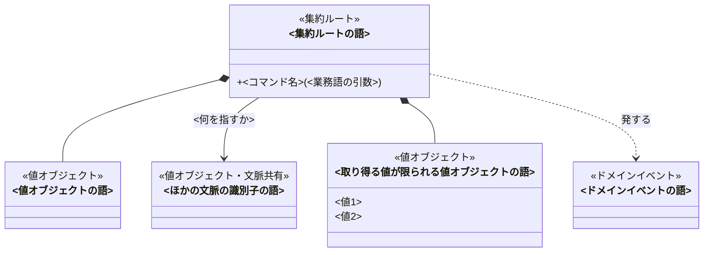

# <題材>のドメインモデル

<!-- 執筆指示: この資料は、業務を形にするエンジニアが図を囲んで「どこに境界を引き、どの状態で何を受け付け、何を拒むか」を議論するために使う。
     主役は図である。クラス図で集約・エンティティ・値オブジェクト・ドメインイベントとその関係を、状態遷移図で状態とコマンドを示す。
     文章は、図だけでは表せないことに絞る。それは三つある。境界をそこに引いた理由と、その内側で守ること（不変条件）。
     コマンドが何を受け取り、どの状態で成立し、何を拒むか（事前条件・結果・拒む理由）。取り違えやすい語が何でないか。
     図を読めば分かることを文章で繰り返さない。すべての要素に同じ項目を埋めない。書くことが無い見出しは置かない。
     語は業務知識のユビキタス言語だけを使う。業務知識に無い語が要ると分かったら、要素にせず「業務知識への提案」に書く。
     実装の言語・型の書き方・永続化・層構成・画面・APIは書かない。
     冒頭は本文段落で始め、集約がいくつで、何を中心に置き、一つの集約では守れない決まりを誰がどう守るかを言い切る。 -->

<!-- 図の記法（domain-modelingの検査scriptはこの記法を構文解析する。ここに1度だけ書く）:
     - クラス図は Mermaid classDiagram。`class <ASCIIのid>["<業務知識の語>"]` と書き、ラベルは業務知識の語をそのまま使う。
     - 各クラスの先頭行に種別を `<<集約ルート>>` `<<エンティティ>>` `<<値オブジェクト>>` `<<ドメインイベント>>` のどれか一つで書く。
       複数の文脈で使う値（ほかの文脈の識別子など）は `<<値オブジェクト・文脈共有>>` のように「・文脈共有」を添える。
     - 集約ルートとエンティティには、コマンドだけを `+<コマンド名>(<業務語の引数>)` で書く。コマンド名は業務知識の「コマンドとクエリ」でコマンドとした行いの名前にする。
       判定だけの操作、フィールド、ゲッターは書かない。
     - 取り得る値が限られる値オブジェクトは、その値を1行に1つ書く（例: 一般資料、禁帯出資料）。値オブジェクトとドメインイベントにはコマンドを書かない。
     - 集約の内側に持つものは `*--`、ほかの集約や文脈を識別子で指すものは `-->` にラベル、コマンドで受け取るだけで持たない値は `..>` にラベル「受け取る」、発するイベントは `..>` にラベル「発する」で描く。
     - 状態遷移図は Mermaid stateDiagram-v2。状態名は業務知識の状態の名前、矢印のラベルはコマンド名だけにする。生成は `[*] --> <最初の状態>`、終端は `<状態> --> [*]`。
     - 状態を持つ集約ごとに `## <集約ルートの語>` を置き、その中に状態遷移図を置く。クラス図に書いたコマンドごとに、その集約の中へ `### <コマンド名>` を置く。
     - 本文で引くBDD番号は業務知識にあるものだけにする。 -->

<冒頭の言い切り。集約はいくつで、何を中心に置いたか。一つの集約では確かめられない決まりを、誰が何を渡して守るか。>

## クラス図

<!-- 書く: この文脈のすべての要素と関係を1枚に。集約が多く1枚で読めないときだけ、集約ごとに分けて集約どうしの参照だけの図を1枚足す。
     書かない: 判定だけの操作、フィールド、型名、実装のクラス。 -->

## <集約ルートの語>

<!-- 書く: この集約が何を一つの操作で一貫させるために、境界をここに引いたか。境界の外に置いたもの（ほかの集約、集合への規則）と、その理由。
     書かない: クラス図の関係をなぞる説明。 -->

<境界の理由を本文で>

### 状態遷移

```mermaid
stateDiagram-v2
    [*] --> <最初の状態>: <生成のコマンド>
    <最初の状態> --> <次の状態>: <コマンド>
    <次の状態> --> [*]
```

<!-- 書く: 状態を持つ集約だけ。状態とコマンドの対応を図で示し、図の下には図から読めない終端の意味や、状態ごとに型を分ける理由だけを書く。 -->

### 守ること

<!-- 書く: この集約の内側で、どのコマンドを経ても成り立つ不変条件を文章で。一つの集約では守れない決まり（集合への規則、ほかの集約にまたがる決まり）は、
     誰が何を渡して守るか、または集約の外の誰が守るかを書く。
     書かない: 業務知識の「常に守られること」の丸写し。この集約に関係しない決まり。 -->

<不変条件と、集約の外で守る決まりの守り手>

### <コマンド名>

<!-- 書く: クラス図に書いたコマンドごとに一つ。何を受け取り、どの状態で成立し、成立すると何になり何を発するか。
     成立しないときの拒む理由を業務知識の「拒むときの理由」の語で「」に入れて書く。拒む理由は実装で一つずつの失敗として扱われる。
     最後に、このコマンドで成立するBDDの番号を1文で添える。
     書かない: 状態遷移図で読める遷移の言い直し、手順、実装の分岐。 -->

<受け取るもの、成立する状態と条件、結果と発するイベント、拒む理由を本文で>

### 取り違えやすいもの

<!-- 書く: 取り違えやすい語が、この集約で何でないか。取り違えが起きない題材では、この見出しを置かない。 -->

<語と、何でないか>

## 業務知識への提案

<!-- 書く: 業務知識に無いが、モデルを決めるのに要ると分かった語や決まり（概念、拒む理由など）ごとに、何を足すか、なぜ要るか、導いた業務ルールやBDD、業務知識のどの節へ足すか。
     この節の語は図に使わない。業務知識の反証へ渡す提案である。提案が無ければ、この見出しを置かない。 -->

| 提案 | なぜ要るか | 導いた業務ルール・BDD | 業務知識のどの節へ足すか |
|---|---|---|---|

## 未決

<!-- 書く: 業務知識の未決のうちモデルに及ぶものと、モデル固有の未決。仮に置いた割り当て、その根拠、採らなかった案、何が分かれば確定するか。
     0件なら「なし」と書く。 -->

<論点、仮に置いた割り当て、何が分かれば確定するか>
