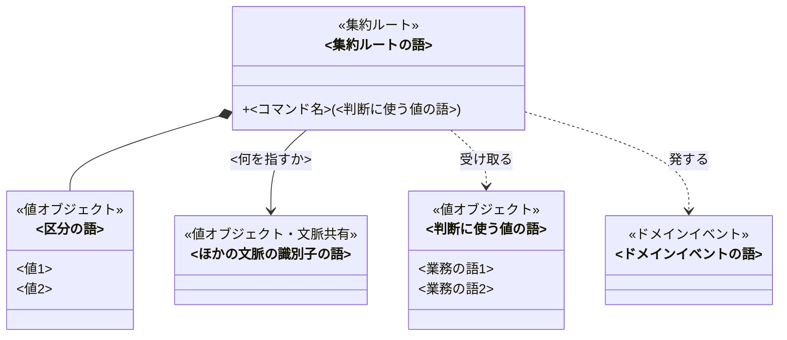

# <題材>のドメインモデル

<!-- 執筆指示: 業務を形にするエンジニアは、この資料の図を囲んで「どこに境界を引き、どのコマンドが何を拒むか」を議論する。
     だから主役はクラス図と状態遷移図で、文章は図で表せないことにだけ使う。一つの論点は一か所にだけ書く。
     書き始める前に、集約をいくつにし、何を中心に置いたかを一文で決める。これがこの資料の主メッセージで、冒頭の段落になる。
     一文で決められないなら、図を描く材料がまだ足りない。
     見出しの語は検査スクリプトが読むので、見出しに結論を足さない。結論は各節の冒頭の一文に置く。
     図のラベル、状態名、コマンド名、拒む理由には、業務知識のユビキタス言語（業務知識が定めた業務の語）をそのまま使う。
     業務知識に無い語が要るときは、図に使わず「業務知識への提案」に書く。
     英名は業務知識の「ユビキタス言語」の対応表が持つ。クラスの識別子（class の直後の英字）にはその英名を使う。
     業務知識に英名が無い概念には、推測で英名を作らない。「業務知識への提案」に、その概念と英名が要る理由を書く。
     実装の言語、型の分け方、永続化、層構成、画面、APIは書かない。書くことが無い見出しは置かない。 -->

<!-- 書く: 冒頭の段落。集約がいくつで、何を中心に置いたかだけを言い切る。
     一つのコマンドで守る決まりがほとんど無い文脈なら、そう言い切って、資料はクラス図と未決だけで終える。
     書かない: 境界をそこに引いた理由。集約の節の冒頭に書く。 -->

<冒頭の言い切り>

## クラス図

<!-- 書く: この文脈のすべての要素と関係を1枚に描く。集約が多くて1枚では読めないときだけ、集約ごとに図を分け、集約どうしの参照だけを描いた図を1枚足す。
     検査スクリプトはこの記法を構文解析するので、書き方は下の図の中のコメントに従う。 -->

## <集約ルートの語>

<!-- 状態がある集約には必ずこの節を置く。状態が無い集約は、境界の理由か守ることがあるときだけ置き、業務の決まりが薄ければクラス図に描くだけにする。
     書く: 節の冒頭の段落に、境界をここに引いた理由と、そこまで広げなかった案を、因果がつながる地の文で書く。
     上限、重複、順序のように一つの集約の中では確かめられない決まりがあれば、それをどの値で持ち込むかも、ここに一度だけ書く。 -->

<境界の理由>

### 状態遷移

```mermaid
stateDiagram-v2
    [*] --> <最初の状態>: <生成のコマンド>
    <最初の状態> --> <次の状態>: <コマンド>
    <次の状態> --> [*]
```

<!-- 状態がある集約だけに置く。状態名は業務知識の状態に、矢印のラベルはこの集約のコマンドにそろえる。生成は [*] から始め、終端は [*] へ向ける。
     図から読めることは文章にしない。図の下に書くのは、終端の意味が図から読めないときだけ。 -->

### 守ること

<!-- 書く: どのコマンドを経ても、この集約の内側で成り立つ決まり（不変条件）。同時に起きると破れうる決まりがあれば、誰がそれを保証するか。
     書くのは守り手であって、守る手段（保存するときの確認、分離レベル）ではない。
     書かない: 境界の理由（節の冒頭に書いた）。業務知識の「常に守られること」をそのまま写した文。 -->

<不変条件と、同時に起きたときの守り手>

### <コマンド名>

<!-- 図だけでは読めない条件があるか、拒む理由があるコマンドにだけ置く。
     書く: 図だけでは読めない成立の条件、発するイベント、拒む理由。拒む理由は、業務知識の業務の行いに書かれた名前を「」で囲んで書く。
     状態遷移図でこのコマンドの矢印が出ていない状態があれば、その状態ごとに、どの業務上の理由で拒むかを一文で書く（例: 返却済みの貸出は「返却済みの本を返す」で拒む）。
     業務知識にその理由が無ければ推測で補わず、「業務知識への提案」に回す。
     この段落で成り立つBDDの番号は、段落の末尾に括弧で添える。番号と範囲（BDD-001〜004）は、業務知識のBDD番号の規則どおりに書く。
     書かない: 受け取るもの（クラス図の引数で読める）、どの状態で受け付けて何になるか（状態遷移図で読める）、手順、実装の分岐。
     コマンドの節が続くときは、どれも同じ書き出しにならないように入り方を変える。 -->

<図で読めない条件、発するイベント、拒む理由（BDD-001〜004）>

### 取り違えやすいもの

<!-- 取り違えが起きる語があるときだけ置く。その語がこの集約では何でないかを書く。 -->

<語と、何でないか>

## 業務知識への提案

<!-- モデルを決めるのに要ると分かったが業務知識に無い語や決まりがあるときだけ、この節を置く。この節は、業務知識を反証する人へ渡す提案である。
     提案ごとに ### 見出しを立て、見出しには提案する語をそのまま書く。検査スクリプトが、この語を図に使っていないかを確かめる。
     見出しの下の一段落に、なぜ要るか、どの業務ルールやBDDから導いたか、業務知識のどの節へ足すかを書く。 -->

### <提案する語や決まり>

<なぜ要るか、根拠、足す節>

## 未決

<!-- 書く: 業務知識の未決のうちモデルに及ぶものと、モデルを作る中で出た未決。
     仮に置いた割り当てがあれば、仮だと分かる語で書き、その根拠、採らなかった案、何が分かれば確定するかを添える。
     未決が無ければ「なし」と書く。 -->

<論点、仮に置いた割り当て、何が分かれば確定するか>
