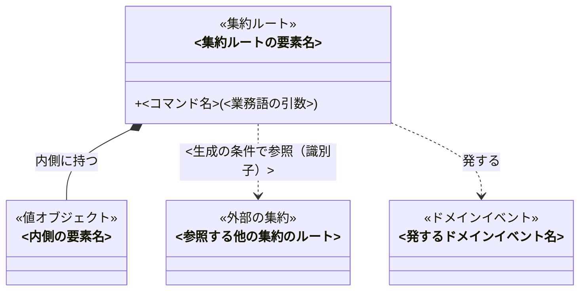
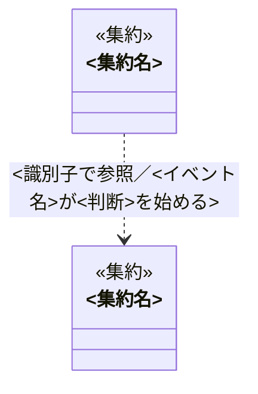

# ドメインモデル — <題材>

<!-- 執筆指示: 業務知識・コアドメインの正本に現れる業務概念を、値オブジェクト・エンティティ・集約・ドメインイベントへ割り当て、
     各要素の目的・何でないか・不変条件・操作の契約（事前条件・事後条件・拒む理由）を、言語非依存で書く。実装コードではない。
     不変条件は3つ。
     1. 正本に無い語を要素にしない。要素の名前は正本のユビキタス言語にある語だけを使う。必要に思えたら「正本へ提案する概念」へ、名前・なぜ要るか・導いた業務ルール・BDD・足す先の節を書き、正本の反証へ渡す。
     2. 各要素に、目的・何でないか・不変条件・操作の契約を必ず書く。「なし」も省略しない。空欄は不存在なのか見落としなのかを区別できない。
     　 モデル図には公開コマンド（状態を変える操作と生成）だけを描く。フィールドとゲッターは描かない。合意したいのは振る舞いであって、データの持ち方ではない。
     3. 実装へ踏み込まない。言語の型、クラスの書き方、永続化、層構成、画面、APIは「この資料に書かないもの」へ行き先だけを示す。
     　 データの持ち方の語（記録の列、履歴、レコード、テーブル、カラム、保存、DB）で業務の事実を書かない。事実は「起きた」「持つ」「いつ起きたか」で書く。ドメインはDBの上位にあり、DBを前提にしない。
     正本との対応: 業務用語→要素一覧の候補（値で区別→値オブジェクト、同一性で区別→エンティティ）、業務イベント→ドメインイベント（集約の操作が発するもの全部）、
     概念→集約の境界、常に守られること→不変条件、状態と移り変わり→状態と型の分割、誰が行えるか→操作の呼び手（要素にしない）、
     業務ルール・導出→事前条件・事後条件、拒むときの理由→拒む理由、BDD→BDDとの対応、まだ決まっていないこと→未決。
     判定:
     - 属性が同じでも別物として追うなら（識別子がある）エンティティ。値が同じなら同じものなら値オブジェクト。
     - 識別子を持つだけでは集約にならない。その文脈でライフサイクル（生成から終端まで）を扱わないものは、識別子の値オブジェクトとして参照するだけにする。
       他の事実から導出される状態（記録の列と時刻から決まる資格など）は、状態を持つ集約ではなく導出される値オブジェクトにする。
     - 形が同じ2つの語は、目的や使われる場面が違えば別の要素。属性の並びが同じことは理由にならない。
     - 集約の境界は、1つの操作で一貫させたい不変条件が届く範囲。それより広げない。
     - 集合への規則（並び順・合計・重複）は、1件の要素ではなく集合を表す要素か操作の呼び手が持つ。
     - 状態によって呼べる操作が違うなら型を分け、違わないなら分けない。
     - 「確認」と「変更」を別の操作にしない。判断は事前条件、変更は事後条件として1つの操作に書く。
     - 既定は不変。状態を持つのは集約だけで、その理由を書く。
     冒頭は本文段落で始め、誰が何のために読み、どこから始まり、何が観測できたら完了かを文章で運ぶ。型・対象・日付・確認者の一覧や引用blockを冒頭に置かない。 -->

<冒頭の言い切り。このモデルが何を中心に置き、何を守るために要素を分けたか>

## 目的と範囲

<!-- 書く: 元にした正本、扱うコアの範囲、対象外にした概念とその理由。
     書かない: 実装言語、永続化、層構成、画面、API。 -->

- 業務知識の正本: <参照する資料>
- 扱う範囲: <コアとして扱う概念>
- 対象外: <このモデルに含めない概念と、その理由>

## 要素一覧

<!-- 書く: 全要素の名前、種別、正本のどの語に対応するか、一文の目的。
     書かない: 正本に無い語の要素、実装上の補助的な型。 -->

<!-- 種別は 値オブジェクト／エンティティ／集約ルート／ドメインイベント のいずれか。
     ドメインサービスは既定では使わない。使うなら「捨てた割り当て」に、要素へ置けなかった理由を書く。 -->

| 要素 | 種別 | 正本の語 | 目的（一文） |
|---|---|---|---|
| <要素名> | <種別> | <正本の語> | <何を成し遂げるためにあるか> |

## モデル図

<!-- 書く: 集約の境界が文章だけでは把握しにくい場合に、小見出しと小さなclassDiagramを置く。小見出しの直下に、その集約の責務と境界で守る不変条件を書く。
     図には判断に必要な集約ルート・内側の要素・主要なドメインイベントを描く。集約をまたぐ参照先は<<外部の集約>>として描く。
     メソッドは関係の理解に必要な公開コマンドだけ。集約どうしの関係は、一枚の図で境界が明瞭になる場合に別図で示す。
     書かない: フィールド、ゲッター、判定だけの操作、型名、実装のクラス、複数の集約を1枚に混ぜた図。 -->

<!-- クラスのidはMermaidの識別子制約のためASCIIで書き、ラベル（["…"]）に正本の語をそのまま書く。idは図の中だけの名前で、実装の名前ではない。
     メソッド名は各要素の詳細の操作名と同じにし、引数は業務語で書く。集約の内側は *--、集約をまたぐ参照は ..> にラベル（識別子か値か）、発するイベントは ..> に「発する」。 -->

### 集約: <集約名>

- 責務: <この集約が何を成し遂げるか（一文）>
- 境界: <この内側で1つの操作として一貫させる不変条件。これが境界をここに引く理由>

### 集約どうしの関係

<!-- 書く: 集約が2つ以上あるときだけ。集約を1クラスずつ描き、識別子による参照と、イベントが始める判断を矢印にする。
     書かない: 集約の内側の要素、コマンド。集約が1つなら、この小見出しごと置かない。 -->

## 各要素の詳細

<!-- 書く: 全要素について、目的・何でないか・持つもの・不変条件・生成の条件・協働相手と、操作ごとの契約。
     書かない: 型名、クラス構文、getter/setter、永続化、シリアライズ形式。 -->

<!-- 判断に必要な要素ごとに###を置く。該当する項目だけを####で示し、空欄を埋めるための「なし」は列挙しない。表に詰め込まない。
     操作は「#### 操作: <操作名>」を操作ごとに置き、判断（事前条件）と変更（事後条件）を1つの操作として書く。
     事前条件を満たさないときの結果は「拒む理由」に、正本の「拒むときの理由」の語で書く。
     モデル図に描くのはコマンド（状態を変える操作と生成）だけだが、ここには判定だけの操作も書く。 -->

### <要素名>

<!-- 書く: 1つの要素の目的、何でないか、持つもの、不変条件、生成の条件、協働相手、操作。
     書かない: 他の要素の決まり、実装の書き方。 -->

#### 目的

<何を成し遂げるためにあるか>

#### 何でないか

<隣接する概念との境界。取り違えやすい語と、何が違うか>

#### 持つもの

<業務語で書いた属性。型名ではなく概念>

#### 不変条件

<生成後、どの操作を経ても常に成り立つこと>

#### 生成の条件

<何が揃えば存在できるか。揃わなければ存在しない>

#### 協働相手

<呼び手（判断権者）と、参照する要素>

#### 操作: <操作名>

- 事前条件: <呼ぶ前に成り立っていること>
- 事後条件: <呼んだ後に成り立っていること>
- 拒む理由: <事前条件を満たさないときの業務上の理由。無ければ「なし」>
- 発するイベント: <発するドメインイベント。無ければ「なし」>

## 集約の境界

<!-- 書く: どの要素がどの集約の内側にあるか、集約をまたぐ参照が識別子か値か、
     複数要素にまたがる不変条件をどの集約が守るか。
     書かない: リポジトリ、トランザクション、永続化の単位。 -->

<!-- 集約は「1つの操作で一貫させたい不変条件が届く範囲」で引く。
     複数の集約にまたがる不変条件は、どこで守るかを明記し、守れないなら未決へ書く。 -->

| 集約 | ルート | 内側の要素 | 守る不変条件 | 外への参照 |
|---|---|---|---|---|
| <集約名> | <ルート要素> | <内側の要素> | <この境界で一貫させる不変条件> | <参照する他の集約と、識別子か値か> |

### 集約どうしの協働

<!-- 書く: 集約が2つ以上あるときの、集約の組ごとの協働の手段（識別子で参照／値として渡す／ドメインイベント／呼び手が両方を操作）、渡すもの、
     一貫性（同じ操作で一貫させるか、結果整合か）。集約が1つなら「なし」と書く。
     書かない: 配送方式、トランザクション、リポジトリ。 -->

<!-- 「保持する」は集約の内側に置くことであり、集約どうしの協働ではない。別の集約を保持したくなったら境界が違う。 -->

| 集約 → 集約 | 手段 | 渡すもの | 一貫性 |
|---|---|---|---|
| <集約A> → <集約B> | <識別子で参照／値として渡す／ドメインイベント／呼び手が両方を操作> | <識別子・値・イベント名> | <同じ操作／結果整合と、片方だけ成立したときの扱い> |

## 状態と型の分割

<!-- 書く: 状態を持つ要素について、各状態で可能な操作と不可能な操作、型を分けたか分けなかったかとその理由。
     書かない: 状態の保存方法、状態機械の実装。 -->

<!-- 「どの状態で何ができ、何ができないか」が読める表にする。
     状態によって呼べる操作が違うなら型を分け、違わないなら分けない。どちらも理由を書く。 -->

### <状態を持つ要素>

<!-- 書く: その要素の各状態で可能・不可能な操作と、型の分割の判断。書かない: 他の要素の状態。 -->

| 状態 | できる操作 | できない操作 | 型を分けるか |
|---|---|---|---|
| <状態> | <操作> | <操作> | <分ける／分けない と理由> |

## ドメインイベント

<!-- 書く: 各ドメインイベントを発する要素と操作、そのイベントが始める判断（この文脈で無ければ「この文脈では無し」）。
     書かない: メッセージ形式、配送方式、購読の仕組み、永続化するかどうか。 -->

<!-- ドメインイベントは、集約の操作の事後条件が成り立ったときに発する通知である。正本の業務イベントのうち、
     この文脈の集約の操作が発するものをすべて載せる。集約の操作が発さないもの（別の文脈の事実、導出結果の言い換え）は載せず、
     「捨てた割り当て」に理由を書く。イベントは事実の置き場ではない。事実は集約が持つ。 -->

| ドメインイベント | 発する要素・操作 | 始まる判断 | 判断する要素 |
|---|---|---|---|
| <イベント名> | <要素の操作> | <何を判断するか> | <要素名> |

## BDDとの対応

<!-- 書く: 正本の各BDDが、どの要素のどの操作と不変条件で成立するか。対応しないBDDと、対応のない要素・操作。
     書かない: テストコード、テストの実行方法。 -->

<!-- 対応しないBDDがあれば要素が足りない。対応のない要素・操作があれば要素が余っている。
     どちらも「なし」と書けるまで、要素一覧へ戻る。 -->

| BDD | 要素 | 操作 | 成立を決める不変条件・事前条件 |
|---|---|---|---|
| <BDD-001> | <要素名> | <操作名> | <不変条件または事前条件> |

- 対応しないBDD: <BDD番号と、足りない要素の候補。無ければ「なし」>
- 対応のない要素・操作: <要素名・操作名。無ければ「なし」>

## 捨てた割り当て

<!-- 書く: 候補にして採らなかった割り当てと、採らなかった理由。
     書かない: 検討していない案、実装の選択肢。 -->

<!-- 正本に無い語を要素にしたくなった案、形が同じ語を1つにまとめる案、
     ドメインサービスにする案は、ここへ理由付きで残す。 -->

| 捨てた案 | 何を何にする案か | 採らなかった理由 |
|---|---|---|
| <案> | <割り当て> | <理由> |

## 正本へ提案する概念

<!-- 書く: モデリング中に見つかった、正本に無い概念ごとに、名前、なぜ要るか、どの業務ルール・BDDから導いたか、正本のどの節へ足すべきか。
     この節の語は要素一覧に入れない。正本を直接書き換えず、正本の反証（formulate-domain）へ渡す提案として残す。0件なら「なし」と明記する。
     書かない: 要素にした語、採らなかった割り当て（捨てた割り当てへ）、実装の都合で欲しい型。 -->

<!-- 「足す先」は正本の節名（業務用語／業務イベント／概念／常に守られること／状態と、その移り変わり／誰が行えるか／業務ルール／拒むときの理由／まだ決まっていないこと／BDD）で書く。 -->

| 概念 | なぜ要るか | 導いた業務ルール・BDD | 正本のどの節へ足すか |
|---|---|---|---|
| <正本に無い語> | <この語が無いとモデルのどこが決まらないか> | <業務ルールの節名、BDD番号、正本の未決> | <正本の節名> |

## 未決

<!-- 書く: 正本の未決のうちモデルに影響するものと、モデル固有の未決。何が分かれば確定するか。
     書かない: 決まったことの言い換え、実装の論点。 -->

<!-- 未決が残る要素は候補のままにし、確定した要素と同じ書き方で見せない。0件なら「なし」と明記する。 -->

| 未決 | 影響する要素 | 何が分かれば確定するか |
|---|---|---|
| <論点> | <要素名> | <確認先または試すこと> |

## この資料に書かないもの

<!-- 書く: 技術事項と、その検討先。書かない: 書かない理由の長い説明。 -->

| 書かないこと | 検討先 |
|---|---|
| 永続化の単位、テーブル、リポジトリ | <データモデルの資料> |
| 言語固有の型、クラスの書き方、不変の実現方法 | <各実装の規約> |
| 層構成、依存方向、パッケージ分割 | <設計の資料> |
| 画面、API、DTO、メッセージ形式 | <技術設計の資料> |
