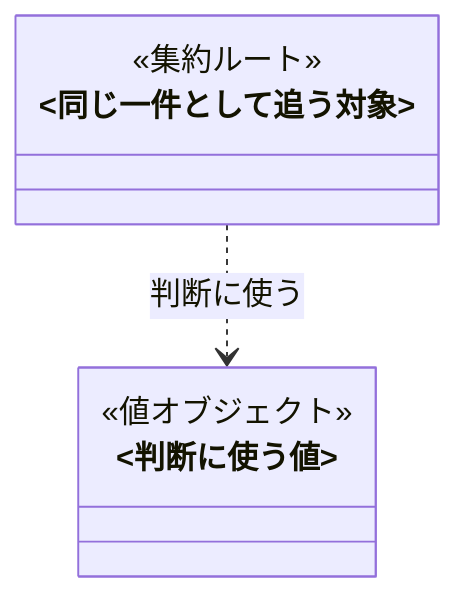

# <題材>のドメインモデル

<!-- 執筆指示: 読み手は、この図を囲んでBDDの結果をどの単位が担うか議論する。完成した実装の型一覧ではない。冒頭は、どの責務の割り当てを提案するかを一文で言う。図と文章には、業務知識だけでは一意に決まらない境界、判断材料、重要な値の関係を置く。業務知識の全BDDや全用語を写さない。図で読めない理由と代案だけを文章にする。実装言語、属性、コンストラクタ、版、保存形式、層、画面、APIは書かない。必要のない節は置かない。 -->

<!-- 検査が読む目印: Mermaid の classDiagram を少なくとも一つ置く。クラスは `class <英字の識別子>["<ラベル>"]`、関係は宣言したクラスどうしに書く。要素の種別を付けるときは `<<集約ルート>>`、`<<エンティティ>>`、`<<値オブジェクト>>`、`<<ドメインイベント>>`、`<<ドメインサービス>>` を使い、文脈をまたぐ値には `・文脈共有` を添えてよい。必要なら stateDiagram-v2 を使い、矢印は `<状態> --> <状態>: <行い>` の形にする。本文でBDDを引くときは `BDD-001` の形で書く。検査は図の構文と参照の存在だけを見る。仮名の根拠、境界の妥当性、状態や操作の網羅は人が意味を評価する。 -->

<議論する責務の割り当てを一文で示す>

## 判断の関係

<!-- 必要な概念だけを描く。業務知識の語を使い、設計上の仮名が要れば「仮」と分かるラベルにする。種別、関係、論点になる行いだけでよい。操作の全引数を図へ並べない。下の例は状態変更の業務であり、読み取りだけなら集約ルートではなく判断の担い手と値を描く。 -->

```mermaid
classDiagram
    class A["<同じ一件として追う対象>"] {
        <<集約ルート>>
    }
    class B["<判断に使う値>"] {
        <<値オブジェクト>>
    }
    A ..> B : 判断に使う
```

## <境界または判断の割り当てを述べる見出し>

<!-- 何を一回で守り、何が一件の外に残るかを、採用案と理由で述べる。業務知識の結果を繰り返さず、設計で変わる点を示す。根拠となるBDDを引く。 -->

<採用案、その理由、集約外の保証または外から受ける事実>

<!-- 状態で受け付ける行いが変わり、境界や責務の議論に必要なときだけ「状態の節目」を追加する。stateDiagram-v2 の矢印は `<状態> --> <別の状態>: <行い>` と書く。すべての組合せや拒否理由を網羅しない。 -->

## 読み取りの判断

<!-- 候補選択、順位、計算がこの業務のコアなら、必要な入力と結果、判断の持ち主を示す。単なる取得と表示なら置かない。 -->

<判断の関係と、図から読めない規則>

## 業務知識への提案

<!-- 業務の新しい語や決まりが必要になったときだけ置く。設計上の仮名は正本の語にせず、候補と理由を示す。 -->

<提案と根拠>

## 未決

<!-- 答えで境界や責務が変わる論点だけ置く。候補ごとの影響と、誰の何の答えで確定するかを書く。一部が未決でも、確定した関係は本文に残す。 -->

<論点、代案、影響、確かめる相手>
