# <対象業務>の業務知識・コアドメイン

<!-- 執筆指示: 作りを全部やめても残る業務の決まりを、業務の言葉と、この資料で名前を一つに決めた語（ユビキタス言語）だけで書く。
     読み手は、業務を知る人と作り手である。どちらも決まりを先に読み、BDDで具体の場面を確かめる。
     書き始める前に、この業務が何のために何をする業務かを一文で決める。これがこの資料の主メッセージで、「概要」の最初の一文になる。
     一文で決められないなら、業務の目的の素材が足りないので、書き進めずに依頼元へ返す。
     一つの決まりは一か所にだけ書く。
     # の見出しの名前はほかの資料と検査スクリプトが読むので変えない。節の結論は、### の見出しか段落の最初の一文に置く。
     画面の作り、操作の手順、保存の形、仕組みどうしのやりとり、どの仕組みが確かめるか（認証、認可）は書かない。
     なぜその決まりがあり、破られると誰が何に困るのかは、業務の言葉で丁寧に書く。
     冒頭は段落で始め、誰が何のために読み、この業務がどこから始まりどこで終わるかを言い切る。 -->

<!-- 機械検査が読む記法（bdd-discovery-and-formulation と domain-modeling の検査スクリプトはこの記法を構文解析する。ここに1度だけ書く）:
     業務用語と業務イベントは、それぞれの節の下に ### <語> で一つずつ置く。見出しの語がユビキタス言語の正式な名前になる。
     業務の行いは「業務の行い」の節の下の ## コマンド と ## クエリ に、### <行いの名前> で一つずつ置く。
     状態を持つものは「状態と、その移り変わり」の節の下に ## <状態を持つもの> を置き、その中に stateDiagram-v2 を一つ置く。状態名がその状態の正式な名前になる。
     BDDの見出しは ### [BDD-<3桁以上の連番>] <業務結果> で固定する。 -->

<冒頭の言い切り>

# 概要

<!-- 書く: 最初の一文に、執筆指示で決めた主メッセージを置く。続けて、誰が何をなぜ行う業務か、この業務が守りたい価値を、因果がつながる段落で書く。
     段落を分けて、この業務が担わないことと、それを担う隣の業務を書く。 -->

<業務の目的と中核の価値。この業務が担わないこと>

# ユビキタス言語

<!-- 業務を知る人と作り手が、本文、図、BDDで使う名前を一つに決める節である。同じ意味の語を二つ残さない。
     採らなかった別名や、技術用語との対応は書かない。
     書く: 節の冒頭に、業務の言葉と英名の対応表を置く。業務用語、業務イベント、業務の行い（コマンドとクエリ）のすべてに英名を付け、行ごとに種類を書く。
     名前は業務の言葉から付ける。データの形や技術の仕組みから付けた名前（組、関係、データ、記録のような語）を使うのは、技術の言葉でしか表せないものに限る。
     括弧の中の語は判断の例であって、禁止の一覧ではない。業務イベントは起きたことなので、英名も過去形にする（例: LoanLent）。
     実装の名前はこの英名に従う。ドメインモデルもここから英名を引くので、英名はこの表にだけ置く。 -->

| 業務の言葉 | 英名 | 種類 |
|---|---|---|
| <業務用語> | <英名> | 業務用語 |
| <業務イベント> | <過去形の英名> | 業務イベント |
| <業務の行い> | <英名> | コマンド |
| <業務の行い> | <英名> | クエリ |

## 業務用語

<!-- 書く: 業務で扱う物、人の役割、値のそれぞれについて、この資料で使うと決めた名前ごとに ### を立てる。
     その下の一段落に、意味と、似た語とどこが違うか、どの判断に使うかを書く。
     書かない: API、画面項目、保存の形、同義語の一覧。状態の名前（状態の節に書く）。 -->

### <業務用語>

<意味。似た語との境界。判断に使う場面>

## 業務イベント

<!-- 書く: すでに起きて、業務上の判断、状態、責任のどれかを変えた事実ごとに ### を立て、過去形で名付ける。その下の一段落に、何が起き、何が変わるかを書く。
     書かない: 命令や要求の形の名前、画面の操作、仕組みの中だけで使う通知。 -->

### <業務イベント>

<何が起き、何が変わるか>

# 概念

<!-- 書く: 業務上のまとまりごとに ## を立て、それが業務で何を表すかと、それにかかわる決まりを文章で書く。
     書かない: まとまりの代表、境界、属性の一覧のような、作り手が設計で使う語。 -->

## <概念名>

<その概念が業務上何を表すか。それに紐づく決まり>

# 常に守られること

<!-- 書く: いつでも破ってはならない決まりごとに ### を立て、見出しには決まりそのものを言い切りで書く。その下の一段落に、破れたときに誰が何に困るかを書く。
     決まりが続くときは、段落をどれも「破れると」で始めず、書き出しを変える。
     書かない: 特定の状態や操作でだけ成り立つ条件（それは業務の行いに書く）。 -->

### <常に守られること>

<破れたときに誰が何に困るか>

# 状態と、その移り変わり

<!-- 書く: 状態があるものごとに ## を立て、状態遷移図を一つ置く。矢印のラベルは業務の行いの名前にする。期限が来たときや別の出来事で移る場合も、その移り変わりを起こす行いの名前にする。
     図の下には、図から読めない終端の意味や、移れない理由だけを書く。状態が無い業務なら「状態を持たない」と書く。
     状態名は「貸出中」のように、何の状態かが名前だけで分かる形にする。 -->

## <状態を持つもの>

```mermaid
stateDiagram-v2
    [*] --> <状態A>: <業務の行い>
    <状態A> --> <状態B>: <業務の行い>
    <状態B> --> [*]
```



# 業務の行い

<!-- 書く: 業務を変える行いは ## コマンド の下に、業務を変えずに知る行いは ## クエリ の下に、行いごとに ### を立てる。
     一つの行いの決まりは、この ### の下にだけ書く。最初の段落に、誰が行えるかと、ほかの人が行うと誰が何に困るかを書く。
     続く段落に、成り立つ条件と境界値、成り立つと起きる業務イベント、拒むときの業務上の理由を書く。拒む理由には名前を付けて「」で囲む。
     期限が来たときや別の出来事で起きる行いにも、業務上それを判断する者を書く。「図書館」のように判断する者の名前で書き、業務の名前にしない。
     始める行いと終える行い（開始と解除など）のように対になる行いは、片方だけを載せない。扱わないなら扱わないと書く。
     書かない: どの仕組みが確かめるか、画面の手順、判定の実現方法。 -->

## コマンド

### <業務の行い>

<誰が行えるかとその理由。成り立つ条件と境界値。起こす業務イベント。拒む理由「…」>

## クエリ

### <業務の行い>

<誰が行えるかとその理由。何を知れるか>

# 導出されること

<!-- 書く: 条件から一つに決まるもの（計算、選び方）と、その決まり方を文章で書く。無ければ「なし」と書く。 -->

<導出されることと、その決まり方>

# 同時に起きたとき

<!-- 書く: 同時に起きることごとに ### を立て、業務上どちらが通るかと、その理由を一段落で書く。同時に起きても困らない業務なら「なし」と書く。
     書かない: 片方だけを通す仕組みの作り方。 -->

### <同時に起きること>

<どちらが通るか。その理由>

# まだ決まっていないこと

<!-- 書く: まだ決まっていない論点と、何が分かれば決まるか。決まっていないことを、決まったことのように書かない。無ければ「なし」と書く。 -->

なし

# BDD

<!-- 書く: 上で決めた決まりが具体の場面でどう働くかを、Given / When / Then の独立した場面で示す。上の節に無い新しい決まりを持ち込まない。
     一つの場面では、業務の関心を一つだけ扱う。Givenに判断に要る事前状態をすべて書き、Whenに行いか出来事を一つ書き、Thenに結果と次の状態を書く。
     境界値、拒否、誰が行えるか、同時に起きたとき、状態の移り変わりは、それぞれ別の場面にする。
     拒否の場面では、確かめる条件を一つだけ外し、Thenの直下に NOTE: Rule: と Reason: を置く。Rule には、業務の行いに書いた拒む理由の名前を書く。
     年月日は「YYYY年M月D日」、時間帯は「YYYY年M月D日 HH:MMからHH:MMまで」と書く。
     番号の一意な範囲、ほかの資料からの指し方、範囲の書き方は、業務知識のBDD番号の規則に従う。
     場面を要約する表は置かない。見出しが要約になる。 -->

## <グループ（業務の行いに対応させる）>

### [BDD-001] <業務結果で書いた見出し>

```gherkin
Given: <行える人と対象が特定された事前状態>
  And: <判断に必要な別の事前状態>
When: <業務の行いか出来事>
Then: <成立または拒否される結果>
  And: <次の状態、変わる権利・責任>
  NOTE: Rule: <拒む理由の名前>
    Reason: <この条件で拒まれる理由>
```
