# <対象業務>の業務知識・コアドメイン

<!-- 執筆指示: 作りを全部やめても残る業務の決まりを、業務の言葉とユビキタス言語だけで書く。
     読み手は、業務を知る人と作り手である。どちらも、決まりを先に読み、BDDで具体の場面を確かめる。
     見出しで構造を作り、文章で決まりとその理由を書く。表と「-」の箇条書きに頼らない。一つの決まりは一か所にだけ書く。
     画面の作り、操作の手順、保存の形、仕組みどうしのやりとり、どの仕組みが確かめるか（認証、認可）は書かない。
     なぜその決まりがあり、破られると誰が何に困るのかは、業務の言葉で丁寧に書く。
     冒頭は本文段落で始め、誰が何のために読み、この業務がどこから始まりどこで終わるかを言い切る。 -->

<!-- 機械検査が読む記法（bdd-discovery-and-formulation と domain-modeling の検査scriptはこの記法を構文解析する。ここに1度だけ書く）:
     業務用語と業務イベントは、それぞれの節の下に ### <語> で一つずつ置く。見出しの語がユビキタス言語の正式な名前になる。
     業務の行いは「業務の行い」の節の下の ## コマンド と ## クエリ に、### <行いの名前> で一つずつ置く。
     状態を持つものは「状態と、その移り変わり」の節の下に ## <状態を持つもの> を置き、その中に stateDiagram-v2 を一つ置く。状態名がその状態の正式な名前になる。
     BDDの見出しは ### [BDD-<3桁以上の連番>] <業務結果> で固定する。 -->

<冒頭の言い切り>

# 概要

<!-- 書く: 誰が何をなぜ行う業務か。業務の目的と中核の価値。この業務が担わないことと、それを担う隣の業務。 -->

<業務の目的と中核の価値。この業務が担わないこと>

# ユビキタス言語

<!-- 同じ意味の語を複数残さない。業務を知る人と作り手が、本文・図・BDDで使う名前を一つにする。
     採用しなかった別名や技術用語の対応は書かない。 -->

## 業務用語

<!-- 書く: 業務上の対象・役割・値の採用語ごとに ### を立て、その下の一段落に、意味と、似た語との境界、判断に使う場面を書く。
     書かない: API、画面項目、保存の形、同義語の一覧。状態の名前（状態の節に書く）。 -->

### <業務用語>

<意味。似た語との境界。判断に使う場面>

## 業務イベント

<!-- 書く: すでに起き、業務上の判断・状態・責任を変えた事実ごとに ### を立て、過去形で名付ける。その下の一段落に、何が起き、何が変わるかを書く。
     書かない: 命令や要求の形の名前、画面の操作、仕組みの中だけで使う通知。 -->

### <業務イベント>

<何が起き、何が変わるか>

# 概念

<!-- 書く: 業務上のまとまりごとに ## を立て、それが何を表すかと、それに紐づく決まりを文章で書く。
     書かない: まとまりの代表・境界・属性の一覧といった作り手の語彙。 -->

## <概念名>

<その概念が業務上何を表すか。それに紐づく決まり>

# 常に守られること

<!-- 書く: いつでも破ってはならない決まりごとに ### を立て、その下に、破れたときに誰が何に困るかを一段落で書く。
     書かない: 特定の状態や操作でだけ成り立つ条件（それは業務の行いに書く）。 -->

### <常に守られること>

<破れたときに誰が何に困るか>

# 状態と、その移り変わり

<!-- 書く: 状態を持つものごとに ## を立て、状態遷移図を一つ置く。矢印のラベルは業務の行いの名前にする。期限の到来や別の出来事で移る場合も、それを起こす行いの名前にする。
     図の下には、図から読めない終端の意味や、移れない理由だけを書く。状態を持たない業務は「状態を持たない」と書く。
     状態名は「貸出中」のように、何の状態かを名前だけで判別できる形にする。 -->

## <状態を持つもの>

```mermaid
stateDiagram-v2
    [*] --> <状態A>: <業務の行い>
    <状態A> --> <状態B>: <業務の行い>
    <状態B> --> [*]
```



# 業務の行い

<!-- 書く: 業務を変える行いは ## コマンド の下に、業務を変えずに知る行いは ## クエリ の下に、行いごとに ### を立てる。
     その下の文章に、次をこの一か所にまとめて書く。誰が行えるかと、それ以外の人が行うと誰が何に困るか。成り立つ条件と境界値。
     成り立つと何が起きるか（起こす業務イベント）。拒むときの業務上の理由を「」で括った名前で。
     期限の到来や別の出来事で起きる行いも、業務上判断する者を書く（「図書館」のように判断する者の名前で。業務の名前にしない）。
     ライフサイクルの対（開始と解除など）は片方だけを載せず、扱わないなら扱わないと書く。
     書かない: どの仕組みが確かめるか、画面の手順、判定の実現方法。 -->

## コマンド

### <業務の行い>

<誰が行えるかとその理由。成り立つ条件と境界値。起こす業務イベント。拒む理由「…」>

## クエリ

### <業務の行い>

<誰が行えるかとその理由。何を知れるか>

# 導出されること

<!-- 書く: 条件から一意に決まるもの（計算、選び方）を文章で。無ければ「なし」と書く。 -->

<導出されることと、その決まり方>

# 同時に起きたとき

<!-- 書く: 同時に起きることごとに ### を立て、業務上どちらが通るかと、その理由を一段落で書く。関係しなければ「なし」と書く。
     書かない: 排他の実現方式。 -->

### <同時に起きること>

<どちらが通るか。その理由>

# まだ決まっていないこと

<!-- 書く: 未確定の論点と、何が分かれば決まるか。0件なら「なし」と書く。 -->

なし

# BDD

<!-- 書く: 上で確定した決まりを、独立したGiven / When / Thenの場面として具体化する。上の節に無い新しい決まりを持ち込まない。
     一つの場面は一つの業務の関心だけを扱う。Givenに判断に必要な事前状態をすべて書き、Whenに行いか出来事を一つ書き、Thenに結果と次の状態を書く。
     境界値、拒否、誰が行えるか、同時に起きたとき、状態の移り変わりを別の場面に分ける。
     拒否の場面は検証する一条件だけを外し、Thenの直下に NOTE: Rule: と Reason: を置く。Rule には業務の行いに書いた拒む理由の名前を書く。
     年月日は「YYYY年M月D日」、時間帯は「YYYY年M月D日 HH:MMからHH:MMまで」と書く。
     番号はこの資料の中で一意にし、更新で振り直さない。ほかの資料やテストからは、リポジトリ相対の資料pathと#と番号の組で指す。
     場面を要約する表は置かない。見出しが要約である。 -->

## <グループ（業務の行いに対応させる）>

### [BDD-001] <業務結果で書いた見出し>

```gherkin
Given: <行える人と対象が特定された事前状態>
  And: <判断に必要な別の事前状態>
When: <業務の行いか出来事>
Then: <成立または拒否される結果>
  And: <次の状態、変わる権利・責任>
  NOTE: Rule: <拒む理由の名前>
    Reason: <この条件で拒まれる理由>
```
