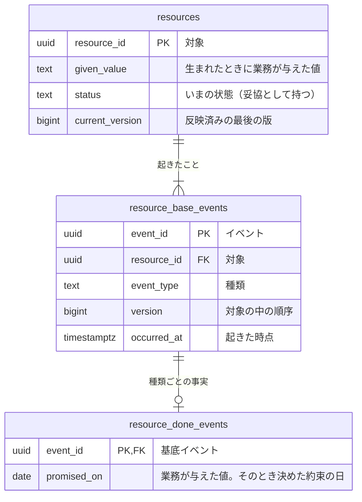

# <題材>の論理データモデル

<!-- 執筆指示: この資料では、テーブルの形を具体的な行で議論し、何を時間を越えて残すか、起きたことをどこに積むかを決める。
     冒頭の段落は、誰が何を後から説明するために、どの事実を残すかの一文から始める。
     議論の主役はBDDの Before と After で、各BDDには、そのWhenで読む・書くテーブルと、変わらないことを確かめるテーブルだけを具体的な行で置く。
     イベント列を選んだ対象は、リソース（<対象の複数形>）、基底イベント（<対象>_base_events）、詳細イベント（<対象>_<過去分詞>_events）の三つの表で書く。
     リソースには status と current_version を、基底イベントには適用した後の版 version を置き、イベントの表の時刻は occurred_at の一本にする。
     Outbox で分けた処理は、要求・回収・成功・失敗の四つのイベントの表で書く。
     型はPostgreSQLの型で書く。製品の版、索引、分離レベル、再試行、DDLは書かない。書くことが無い見出しは置かない。 -->

<!-- 検査が読む目印: ほかの package の検査がこの型の資料から読むのは、ここに書いた目印だけである。見出しの文言は読まないので、見出しには節の結論を入れてよい。
     すべての論理テーブルを、見出し行が `| 系列 | 性質 | 論理テーブル | 保存表現 | 時刻 | 変化 | 根拠 |` の表（分類の表）に1テーブル1行で置く。テーブル名は backtick で囲む。
     すべてのテーブルと列は、1行目が `erDiagram` の Mermaid ブロックに描き、属性は `<型> <名前> [PK|FK|UK] "<意味>"` の行にする。
     テーブルごとの定義は、`### ` の直後に backtick で囲んだテーブル名を置いた見出しで始める。名前の後ろは自由に書いてよい。業務制約は `#### 業務制約: <制約名>` の行で書く。 -->

<!-- 時刻の欄は、基底イベントと技術処理のイベントなら `occurred_at` だけを書き、それ以外は「なし」と書く。根拠の欄は空にせず、「-」や「なし」にもしない。
     業務が与えた日付や時点は、意味を「業務が与えた値」で始める。状態の列は status、リソースの版は current_version、基底イベントの版は version と名付ける。
     業務制約の名前は物理設計へそのまま写されるので、後から変えない。 -->

<冒頭の言い切り。誰が何を後から説明するために、どの事実を残すか。同期で行わない処理があれば、その理由も>

## リソース系とイベント系

<!-- 書く: 全論理テーブルの分類を表にし、表の下に、保存表現をそう選んだ理由を文章で書く。導ける情報を持たないと決めたなら、その情報をどこから得るかも書く。
     技術処理に基底イベントを置かないなら、その理由も一文で書く。 -->

| 系列 | 性質 | 論理テーブル | 保存表現 | 時刻 | 変化 | 根拠 |
|---|---|---|---|---|---|---|
| リソース系 | 業務 | `<対象の複数形>` | 現在状態 | なし | 更新あり | <業務知識の節> |
| イベント系 | 業務 | `<対象>_base_events` | イベント列 | `occurred_at` | 追加のみ | <業務知識の節> |
| イベント系 | 業務 | `<対象>_<過去分詞>_events` | イベント列 | なし | 追加のみ | <業務知識の節> |
| イベント系 | 技術 | `<処理>_requested_events` | イベント列 | `occurred_at` | 追加のみ | <要求の出どころ> |

<保存表現を選んだ理由>

## 論理データモデル図

<!-- 書く: erDiagram で、全テーブル、全列、型、キー、関係、多重度を描く。列の一覧はここにだけ書く。参照は、詳細イベントが基底イベントを、基底イベントがリソースを指す向きにする。 -->



## 論理テーブル定義

<!-- 書く: テーブルごとに、一つの行が何を表すかを一段落で書く。図の一言では足りない列の意味だけを文章で足す。業務が与えた値がどう決まり、なぜ後から変わらないのかは、ここで書く。業務制約もここに置く。
     書かない: 図と同じ列の一覧、索引、DDL。 -->

### `<論理テーブル名>`（<日本語名>）

<このテーブルの一行が表す事実と、図の一言では足りない列の意味>

#### 業務制約: <制約名>

<許してはいけない組合せや状態と、根拠になるBDD>

## 並行実行で必要な保証

<!-- 書く: 同じ事前状態から二つの操作が同時に進んだとき、許される結果と許されない結果、競合する行の組。
     書かない: 分離レベル、ロック、再試行、索引。どれも物理設計が決める。同時に進んでも結果が変わらないなら、この見出しを置かない。 -->

<同時に進む操作と、許されない結果、競合する行>

## 業務知識のシナリオとの対応

<!-- 書く: 業務知識の全BDDについて、対応するこの資料のBDDか、永続化が関わらないので対象外とした理由。
     行の数に関わらず表にする。後から業務知識の全シナリオを行で追うからである。 -->

| 業務知識のBDD | この資料のBDD | 対象外の理由 |
|---|---|---|
| <BDD-001> | <BDD-001> | |

## 未決

<!-- 書く: 確かめていない規則や保持条件、仮に置いた値と、それを誰に確かめるか。一件ずつ段落で書く。無ければ「なし」と書く。 -->

<未決／なし>

## BDD

<!-- この節は資料の末尾に置く。業務知識の掲載順で業務由来のBDDを先に、技術的な処理のBDDを後に置く。番号は業務知識のBDD番号の決まりに従う。
     各BDDは単独で読めるようにし、必要な事前状態、既存の行、日時をすべてGivenとAndに書く。Whenは一つにする。年月日は「YYYY年M月D日」、時刻は「HH:MM」で書く。
     Before と After には、そのWhenで読む・書くテーブルと、変わらないことを確かめるテーブルだけを、同じ順序で置く。関係しないテーブルは載せない。
     件数やいまの状態のように導ける情報は、それを導く元の事実の行を置いて示す。
     載せたテーブルは、下流のテストがそのまま写すので、行の数に関わらず全カラムの見出しを持つ表にする。0件なら見出しだけの表にせず、先頭の列に「（行なし）」と書き残りの列を空けた行を一つ置く。変わったセルは太字にする。
     拒否のThenの直下に NOTE: Rule: と Reason: を置く。SQL、DDL、APIの表現は書かない。 -->

### [BDD-001] <データの変化>

```gherkin
Given: <対象と事前状態>
  And: <既存の行と時刻>
When: <業務の行いか技術的な処理の出来事>
Then: <成立または拒否される結果>
  And: <追加される行>
```

#### データの状態

**Before**

**`<テーブルA>`**

| <列> | <列> |
|---|---|
| <値> | <値> |

**`<テーブルB>`**

| <列> | <列> |
|---|---|
| （行なし） | |

**After**

**`<テーブルA>`**

| <列> | <列> |
|---|---|
| <値> | <値> |
| **<追加された値>** | **<追加された値>** |

**`<テーブルB>`**

| <列> | <列> |
|---|---|
| **<追加された値>** | **<追加された値>** |
