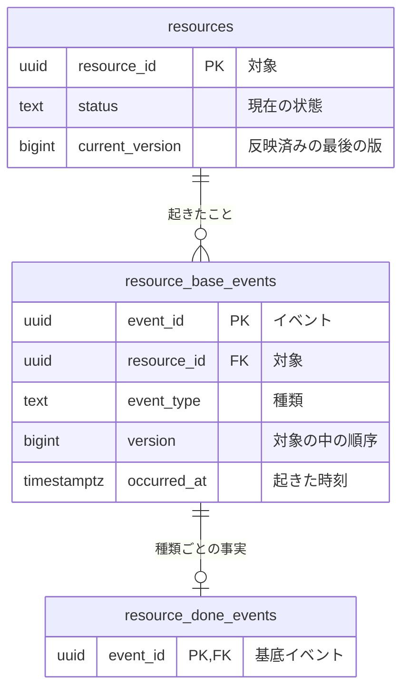

# <題材>の論理データモデル

<!-- 執筆指示: この資料は、テーブルの形を具体的な行で議論するために使う。何を時間を越えて残すか、どこに現在を置き、どこに起きたことを積むかを決める。
     議論の主役はBDDの Before と After である。各BDDに、そのWhenで読む・書くテーブルと、変わらないことを確かめるテーブルだけを、具体的な行で置く。
     イベント列を選んだ対象は、リソース（<対象の複数形>）、基底イベント（<対象>_base_events）、詳細イベント（<対象>_<過去分詞>_events）の型で書く。
     イベントのテーブルの時刻の列は、その出来事が起きた時刻の一本だけにする。業務イベントは基底イベントの occurred_at、技術イベントは出来事の過去分詞の _at である。
     技術的な処理（要求の回収と送信、再試行、調停）は、要求・回収・成功・失敗の四つのイベントのテーブルで書く。
     型はPostgreSQLの型で書くが、製品の版、索引、分離レベル、再試行、DDLは書かない。それは物理設計が決める。
     見出しで構造を作り、文章で理由を書く。表は属性の一覧（分類、列）とBDDの行にだけ使う。書くことが無い見出しは置かない。 -->

<!-- 機械検査が読む記法（bdd-discovery-and-formulation と rdb-design の検査scriptはこの記法を構文解析する。ここに1度だけ書く）:
     「リソース系とイベント系」の節の7列の表が全論理テーブルの分類である。1行に1テーブルをバッククォートで書く。
     「論理テーブル定義」の節で、各テーブルを ### `<英語名>`（<日本語名>） で始め、直下の表の1列目にバッククォートの列名を書く。
     業務制約は #### 業務制約: <制約名> で書き、その名前は物理設計へそのまま写される。 -->

<冒頭の言い切り。誰が何を判断・説明するために、どの事実を残すか>

## リソース系とイベント系

<!-- 書く: 全論理テーブルの分類。系列はリソース系かイベント系、性質は業務・技術・派生、正式な定義は現在状態・有効期間履歴・イベント列・派生のどれか。
     時刻の列にはイベントのテーブルの時刻の列名を一つだけ書き、リソースと詳細イベントは「なし」か業務が読む時刻の列名を書く。
     表の下に、保存表現をそう選んだ理由を文章で書く。 -->

| 系列 | 性質 | 論理テーブル | 正式な定義 | 時刻 | 変化 | 根拠 |
|---|---|---|---|---|---|---|
| リソース系 | 業務 | `<対象の複数形>` | 現在状態 | なし | 更新あり | <業務知識の節> |
| イベント系 | 業務 | `<対象>_base_events` | イベント列 | `occurred_at` | 追加のみ | <業務知識の節> |
| イベント系 | 業務 | `<対象>_<過去分詞>_events` | イベント列 | なし（基底イベントの`occurred_at`） | 追加のみ | <業務知識の節> |
| イベント系 | 技術 | `<処理>_requested_events` | イベント列 | `requested_at` | 追加のみ | <要求の出どころ> |

<保存表現の選択理由>

## 論理データモデル図

<!-- 書く: Mermaid の erDiagram で、全論理テーブル、全列、型、キー、関係、多重度。参照はリソース ← 基底イベント ← 詳細イベントの向き。
     書かない: 索引、値域の詳細、業務制約の本文。 -->



## 論理テーブル定義

<!-- 書く: テーブルごとに、何を一つにまとめるかを一段落で書き、列の表と業務制約を置く。
     書かない: 索引、DDL、物理的な実現方法。任意の事実を空値で表さず、その事実があるときだけ行がある別テーブルを検討する。 -->

### `<論理テーブル名>`（<日本語名>）

<このテーブルが一つにまとめる事実と、同じ行かどうかを決める業務上の条件>

| 論理列 | 型 | 必須性 | 業務上の意味 |
|---|---|---|---|
| `<論理列名>` | <PostgreSQLの型> | <常に必要／行があるとき常に必要> | <何を表すか> |

#### 業務制約: <制約名>

<許してはいけない組合せや状態と、根拠になるBDD>

## 並行実行で必要な保証

<!-- 書く: 同じ事前状態から同時に進んだときに、許される結果と許されない結果。どの行の組が競合するか。
     書かない: 分離レベル、ロック、再試行、索引（物理設計が決める）。関係しなければ見出しを置かない。 -->

<同時に進む操作、許されない結果、競合する行>

## 業務知識のシナリオとの対応

<!-- 書く: 業務知識の全BDDについて、対応するこの資料のBDDか、永続化が関与しないため対象外とした理由。 -->

| 業務知識のBDD | この資料のBDD | 対象外の理由 |
|---|---|---|
| <BDD-001> | <BDD-001> | |

## 未決

<!-- 書く: 未確認の規則、保持条件、仮に置いた設計と確認相手。0件なら「なし」と書く。 -->

<未決／なし>

## BDD

<!-- この節を資料の末尾に置く。業務知識の掲載順で業務由来のBDDを先に、技術的な処理のBDDを後に置く。
     各BDDは独立させ、必要な事前状態、既存の行、日時をGivenとAndにすべて書く。Whenは一つ。
     年月日は「YYYY年M月D日」、時刻は「HH:MM」で書く。
     Before と After には、そのWhenで読む・書くテーブルと、変わらないことを確かめるテーブルだけを、同じ順序で置く。関係しないテーブルは載せない。
     載せたテーブルは全カラムの見出しを持つ表にし、0件なら見出し行と区切り行だけにする。変わったセルは太字にする。
     拒否では、変わらないことを確かめるテーブルを Before と同じ行で After に置く。
     拒否のThen直下に NOTE: Rule: と Reason: を置く。SQL、DDL、API表現は書かない。 -->

### [BDD-001] <データの変化>

<!-- 見出しは `### [BDD-<3桁以上の連番>] <データの変化>` で固定する。番号はこの資料の中で一意にする。 -->

```gherkin
Given: <対象と事前状態>
  And: <既存の行と時刻>
When: <業務イベントか技術的な処理の出来事>
Then: <成立または拒否される結果>
  And: <追加・更新される行>
```

#### データの状態

**Before**

**`<テーブルA>`**

| <列> | <列> |
|---|---|
| <値> | <値> |

**After**

**`<テーブルA>`**

| <列> | <列> |
|---|---|
| <値> | **<変わった値>** |
